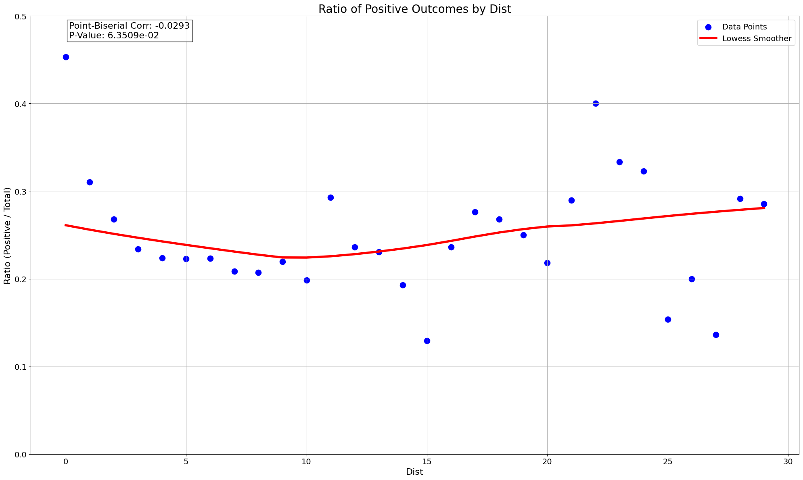
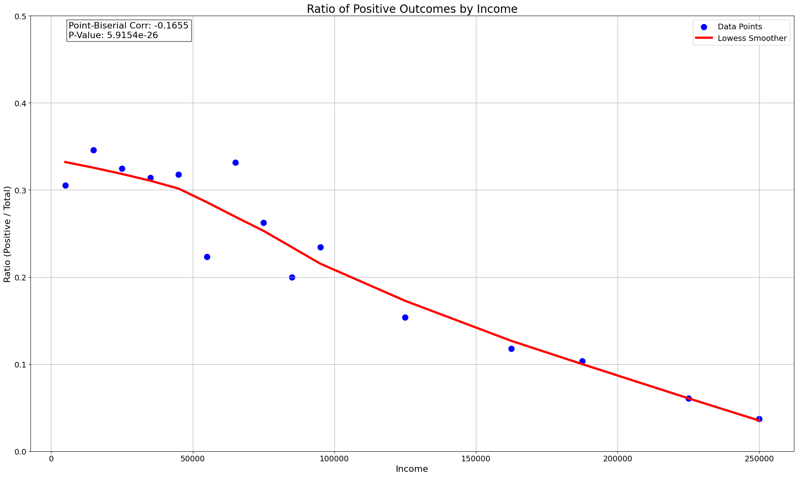
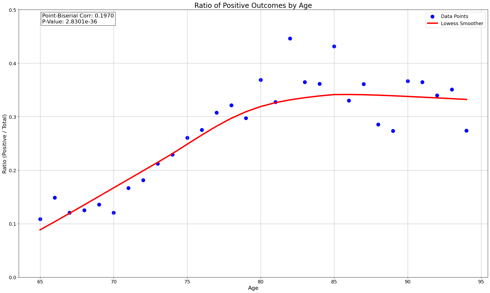
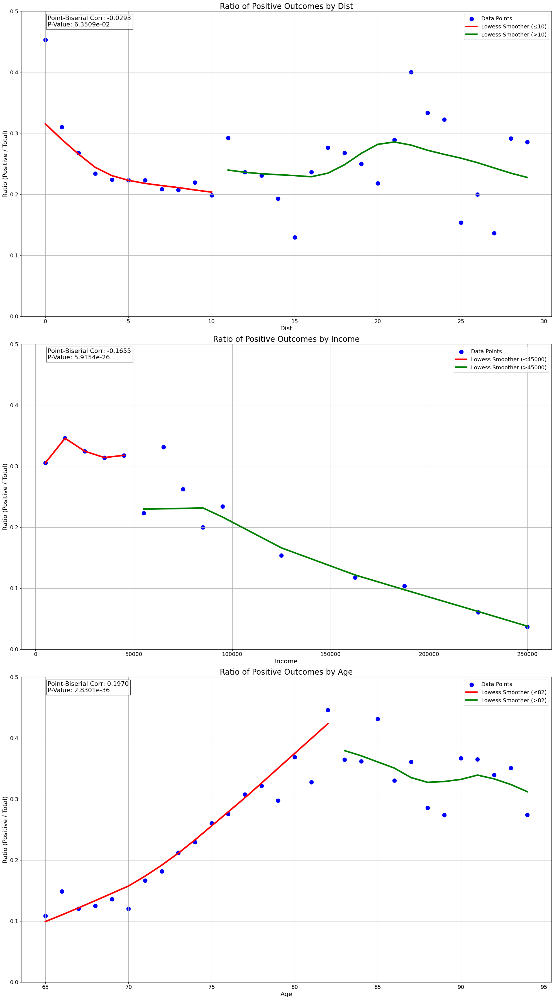
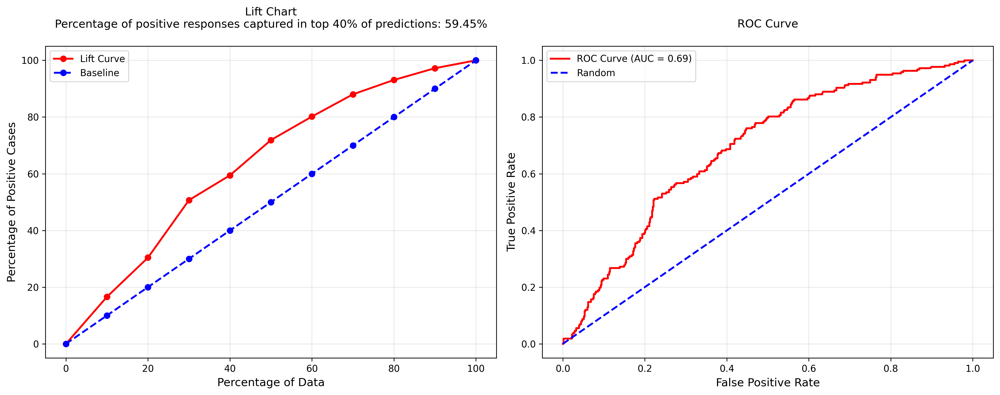

# Binary Classification Modelling


```python
import pandas as pd 
import os
import matplotlib.pyplot as plt

os.chdir("/Users/jacobrichards/Desktop/DS_DA_Projects/2-Marketing_Prediction")

data = pd.read_csv("data.csv", na_values=["", "NA"])

import warnings
warnings.filterwarnings('ignore')

plt.rcParams['figure.figsize'] = [8, 6]  
plt.rcParams['figure.dpi'] = 100  
```

### Data Preview


```python
print(data.head())
```

       id  age      dist       income gender marital_status  target
    0   1   73  4.371654    90-99,999      M              S       1
    1   2   89  1.582733  100-149,999      M            NaN       1
    2   3   85  1.223810    10-19,999      F              S       1
    3   4   76  2.962427    90-99,999      M              M       1
    4   5   76  2.594408    10-19,999      M              S       1


### Prepare Data

#### Predictors
- income from categorical to continuous variable by assigning midpoint of the range as integer (income level char: "90-99,999" --> int: 95,000)
- age and distance as integer 
- gender, marital_status as binary

#### Response
- target as binary


```python
data.iloc[:, [3, 4, 5]] = data.iloc[:, [3, 4, 5]].applymap(lambda x: "unknown" if pd.isna(x) or x == "" else x)

income_mapping = {
    "unknown": 55000,
    "Under $10k": 5000,
    "10-19,999": 15000,
    "20-29,999": 25000,
    "30-39,999": 35000,
    "40-49,999": 45000,
    "50-59,999": 55000,
    "60-69,999": 65000,
    "70-79,999": 75000,
    "80-89,999": 85000,
    "90-99,999": 95000,
    "100-149,999": 125000,
    "150 - 174,999": 162500,
    "175 - 199,999": 187500,
    "200 - 249,999": 225000,
    "250k+": 250000
}
data["income"] = data["income"].map(income_mapping).astype(int)

gender_mapping = {"M": 1, "F": 0, "unknown": 0}
data["gender"] = data["gender"].map(gender_mapping).astype(int)

marital_status_mapping = {"M": 1, "S": 0, "unknown": 1}
data["marital_status"] = data["marital_status"].map(marital_status_mapping).astype(int)

data["target"] = data["target"].astype(int)

data["dist"] = data["dist"].astype(int)
```

#### Examine individual strength of continuous predictors within data set by plotting observed probability of response corresponding to predictor values.   


```python
import seaborn as sns
from scipy.stats import pointbiserialr


def make_plot(df, var, ax, threshold=None):
    plot_df, corr, p = plot_ratio_positive_negative_with_corr(df, var, 'target')
    sns.scatterplot(x=var, y='ratio_positive_negative', data=plot_df, color='blue', s=150, label='Data Points', ax=ax)
    
    if threshold:
        df_below = plot_df[plot_df[var] <= threshold]
        df_above = plot_df[plot_df[var] > threshold]
        sns.regplot(x=var, y='ratio_positive_negative', data=df_below, scatter=False,
                   lowess=True, color='red', line_kws={'lw': 4}, 
                   label=f'Lowess Smoother (≤{threshold})', ax=ax)
        sns.regplot(x=var, y='ratio_positive_negative', data=df_above, scatter=False,
                   lowess=True, color='green', line_kws={'lw': 4}, 
                   label=f'Lowess Smoother (>{threshold})', ax=ax)
    else:
        sns.regplot(x=var, y='ratio_positive_negative', data=plot_df, scatter=False,
                   lowess=True, color='red', line_kws={'lw': 4}, label='Lowess Smoother', ax=ax)
    
    ax.text(0.05, 0.95, f'Point-Biserial Corr: {corr:.4f}\nP-Value: {p:.4e}', 
            transform=ax.transAxes, fontsize=16, bbox=dict(facecolor='white', alpha=0.8))
    ax.set_title(f'Ratio of Positive Outcomes by {var.title()}', fontsize=20)
    ax.set_xlabel(var.title(), fontsize=16)
    ax.set_ylabel('Ratio (Positive / Total)', fontsize=16)
    ax.set_ylim(0, 0.50)
    ax.legend(fontsize=14)
    ax.grid(True)
    ax.tick_params(labelsize=14)

def plot_ratio_positive_negative_with_corr(df, continuous_var, categorical_var='target', positive_value=1, negative_value=0):
    grouped = df.groupby([continuous_var, categorical_var]).size().reset_index(name='count')
    pivot = grouped.pivot(index=continuous_var, columns=categorical_var, values='count').fillna(0)
    ratio = pivot[positive_value] / (pivot[positive_value] + pivot[negative_value] + 1e-9)
    plot_df = pd.DataFrame({continuous_var: ratio.index, 'ratio_positive_negative': ratio.values})
    return plot_df, *pointbiserialr(df[continuous_var], df[categorical_var])


for var in ['dist', 'income', 'age']:
    fig, ax = plt.subplots(figsize=(20, 12))
    make_plot(data, var, ax)
    plt.tight_layout()
    plt.show()
```


    

    


    

    


    

    


#### Continuous predictors appear to have mixed effects, visualize significance of change in variable effect by plotting with separate smoother.


```python
fig, (ax1, ax2, ax3) = plt.subplots(3, 1, figsize=(20, 36))
make_plot(data, 'dist', ax1, threshold=10)
make_plot(data, 'income', ax2, threshold=45000)
make_plot(data, 'age', ax3, threshold=82)
plt.tight_layout()
plt.show()
```


    

    


#### Age and Income have most visually apparent change in relationship to response.

#### In model testing, only accounting for the mixed effects of variable age provided significant increase in model performance. 


```python
import numpy as np
data['age_lt80'] = np.where(data['age'] < 80, data['age'], 80)
data['age_ge80'] = np.where(data['age'] >= 80, data['age'] - 80, 0)
print(data.head())
```

       id  age  dist  income  gender  marital_status  target  age_lt80  age_ge80
    0   1   73     4   95000       1               0       1        73         0
    1   2   89     1  125000       1               1       1        80         9
    2   3   85     1   15000       0               0       1        80         5
    3   4   76     2   95000       1               1       1        76         0
    4   5   76     2   15000       1               0       1        76         0


#### Examine strength of categorical predictors and check for interactions between them.


```python
import plotly.graph_objects as go
from scipy import stats

def plot_ratio_by_category(data, col, labels):
    group0 = data[data[col] == 0]['target']
    group1 = data[data[col] == 1]['target']
    
    ratios = [len(data[(data[col] == i) & (data['target'] == 1)]) / len(data[data[col] == i]) for i in [0,1]]
    
    _, pvalue = stats.ttest_ind(group0, group1)
    
    fig = go.Figure(data=[go.Bar(x=labels, y=ratios)])
    fig.update_layout(
        title=f'Observed probability of response by {col}<br>p-value: {pvalue:.4e}',
        xaxis_title=col.replace('_',' ').title(),
        yaxis_title='Ratio of Positive Responses', 
        yaxis_gridcolor='lightgray',
        showlegend=False,
        height=600,
        width=1000
    )
    fig.show()

plot_ratio_by_category(data, 'gender', ['Female', 'Male'])
plot_ratio_by_category(data, 'marital_status', ['Single', 'Married'])
```


#### Observed probability of response is significantly greater for men than women (gender = 1) and is significantly greater for married than single individuals (marital_status = 1).  

### Check for interaction between gender and marital status in effects on response.


```python
import plotly.graph_objects as go

ratios = pd.DataFrame({
    'Single': [len(data[(data['gender'] == 0) & (data['marital_status'] == 0) & (data['target'] == 1)]) / len(data[(data['gender'] == 0) & (data['marital_status'] == 0)]),
               len(data[(data['gender'] == 1) & (data['marital_status'] == 0) & (data['target'] == 1)]) / len(data[(data['gender'] == 1) & (data['marital_status'] == 0)])],
    'Married': [len(data[(data['gender'] == 0) & (data['marital_status'] == 1) & (data['target'] == 1)]) / len(data[(data['gender'] == 0) & (data['marital_status'] == 1)]),
                len(data[(data['gender'] == 1) & (data['marital_status'] == 1) & (data['target'] == 1)]) / len(data[(data['gender'] == 1) & (data['marital_status'] == 1)])],
    'Total': [len(data[(data['gender'] == 0) & (data['target'] == 1)]) / len(data[data['gender'] == 0]),
              len(data[(data['gender'] == 1) & (data['target'] == 1)]) / len(data[data['gender'] == 1])]
}, index=['Female', 'Male'])

fig = go.Figure()

for col in ratios.columns:
    fig.add_trace(go.Bar(
        name=col,
        x=ratios.index,
        y=ratios[col]
    ))

fig.update_layout(
    title='Observed probability of response by gender and marital status',
    xaxis_title='Gender',
    yaxis_title='Ratio of Positive Responses',
    barmode='group',
    height=600,
    width=1000,
    yaxis_gridcolor='lightgray',
    legend_title='Marital Status'
)

fig.show()
```


#### The Observed probability for male and for married individuals being greater than the women and single individuals is due to the variable interaction revealed in this plot. 

#### There is interaction between variables gender and marital status such that marital status is a significant predictor of response for men but not for women.

### Evaluate Logistic Regression Model on training data with every possible combination of interaction terms and select combination with best performance to evaluate on testing data.


```python
from sklearn.model_selection import train_test_split
import statsmodels.api as sm
import numpy as np
import pandas as pd
from itertools import combinations

base_features = ['age_lt80', 'age_ge80', 'dist', 'income', 'gender', 'marital_status']
interaction_terms = [
    ('age_lt80', 'dist'), ('age_lt80', 'income'), ('age_lt80', 'gender'), ('age_lt80', 'marital_status'),
    ('age_ge80', 'dist'), ('age_ge80', 'income'), ('age_ge80', 'gender'), ('age_ge80', 'marital_status'),
    ('dist', 'income'), ('dist', 'gender'), ('dist', 'marital_status'),
    ('income', 'gender'), ('income', 'marital_status'), ('gender', 'marital_status')
]

X_base = data[base_features].copy()
y = data['target']
X_train_base, X_test_base, y_train, y_test = train_test_split(X_base, y, test_size=0.2, random_state=42)

results = []

for r in range(len(interaction_terms) + 1):
    for terms in combinations(interaction_terms, r):
        X_train = X_train_base.copy()
        
        for t1, t2 in terms:
            X_train[f'{t1}_{t2}'] = X_train[t1] * X_train[t2]
            
        model = sm.Logit(y_train, sm.add_constant(X_train)).fit(disp=0)
        y_pred_proba = model.predict(sm.add_constant(X_train))
        
        train_data = pd.DataFrame({'target': y_train, 'predicted_probs': y_pred_proba})
        train_data_sorted = train_data.sort_values('predicted_probs', ascending=False)
        
        total_pos = train_data_sorted['target'].sum()
        n_rows = len(train_data_sorted)
        cutoff_index = int(0.4 * n_rows)
        lift_at_40 = train_data_sorted.iloc[:cutoff_index]['target'].sum() / total_pos * 100
        
        results.append({
            'interactions': terms,
            'lift_at_40': lift_at_40
        })

results_df = pd.DataFrame(results)
results_df = results_df.sort_values('lift_at_40', ascending=False)

print("\nBest interaction term combinations by lift at 40%:")
print(results_df.head(1))

best_terms = results_df.iloc[0]['interactions']
```

    
    Best interaction term combinations by lift at 40%:
                                                                                                                                                                                                     interactions  \
    14779  ((age_lt80, gender), (age_lt80, marital_status), (age_ge80, income), (age_ge80, gender), (age_ge80, marital_status), (dist, income), (dist, gender), (dist, marital_status), (gender, marital_status))   
    
           lift_at_40  
    14779    63.85696  


#### Model performance is measured by the percentage of total responses captured among the top 40% of customers, ranked in order of descending predicted probability of response. 

#### Logistic Regression Model evaluated with best combination of interaction terms on testing data results visualized by Lift Chart.


```python
X_test = X_test_base.copy()
X_train_final = X_train_base.copy()

for t1, t2 in best_terms:
    X_train_final[f'{t1}_{t2}'] = X_train_base[t1] * X_train_base[t2]
    X_test[f'{t1}_{t2}'] = X_test_base[t1] * X_test_base[t2]

final_model = sm.Logit(y_train, sm.add_constant(X_train_final)).fit(disp=0)
y_pred_proba_test = final_model.predict(sm.add_constant(X_test))

test_data = pd.DataFrame({'target': y_test, 'predicted_probs': y_pred_proba_test})
test_data_sorted = test_data.sort_values('predicted_probs', ascending=False)

total_pos = test_data_sorted['target'].sum()
n_rows = len(test_data_sorted)
cutoff_index = int(0.4 * n_rows)
lift_at_40 = test_data_sorted.iloc[:cutoff_index]['target'].sum() / total_pos * 100

deciles = np.linspace(0, n_rows, 11, dtype=int)
lift_curve = [test_data_sorted.iloc[:i]['target'].sum() / total_pos * 100 for i in deciles]
baseline = np.linspace(0, 100, 11)

fig, (ax1, ax2) = plt.subplots(1, 2, figsize=(15, 6), dpi=300)

ax1.plot(baseline, lift_curve, marker='o', label='Lift Curve', color='red', linewidth=2)
ax1.plot(baseline, baseline, linestyle='--', marker='o', label='Baseline', color='blue', linewidth=2)
ax1.set_xlabel('Percentage of Data', fontsize=12)
ax1.set_ylabel('Percentage of Positive Cases', fontsize=12)
ax1.set_title(f'Lift Chart\nPercentage of positive responses captured in top 40% of predictions: {lift_at_40:.2f}%', 
          fontsize=12, pad=20)
ax1.legend(fontsize=10)
ax1.grid(True, alpha=0.3)
ax1.set_facecolor('white')

fpr, tpr, _ = roc_curve(y_test, y_pred_proba_test)
roc_auc = auc(fpr, tpr)

ax2.plot(fpr, tpr, color='red', linewidth=2, label=f'ROC Curve (AUC = {roc_auc:.2f})')
ax2.plot([0, 1], [0, 1], color='blue', linestyle='--', linewidth=2, label='Random')
ax2.set_xlabel('False Positive Rate', fontsize=12)
ax2.set_ylabel('True Positive Rate', fontsize=12)
ax2.set_title('ROC Curve', fontsize=12, pad=20)
ax2.legend(fontsize=10)
ax2.grid(True, alpha=0.3)
ax2.set_facecolor('white')

plt.tight_layout()
plt.show()
```


    

    


#### If this model were used on in future advertising campains assuming that the population of potential customers does not change, we can expect to yield ~60% of the responses by advertising to 40% of the potential customers.
