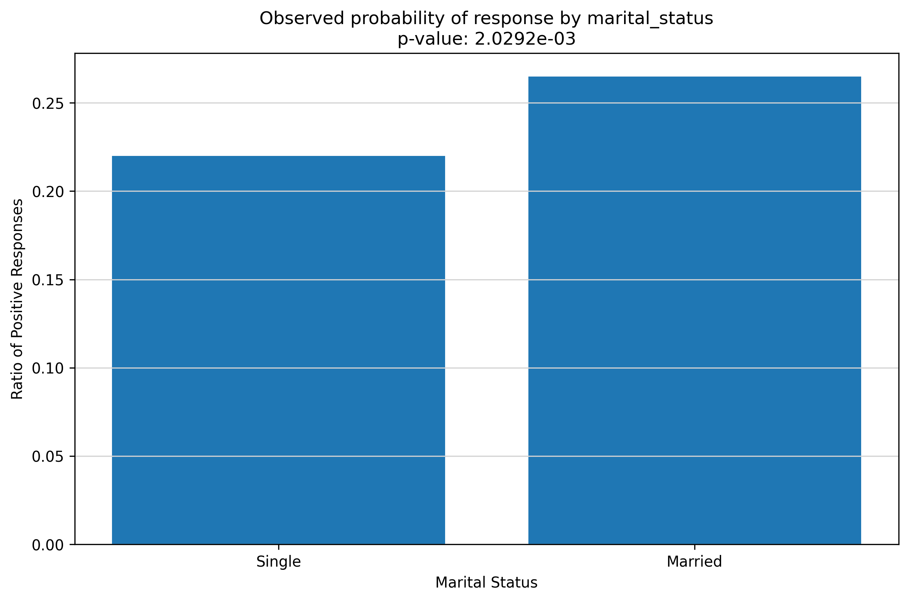

```python
import numpy as np 
import pandas as pd 
import os
import matplotlib.pyplot as plt

os.chdir("/Users/jacobrichards/Desktop/DS_DA_Projects/2-Marketing_Prediction")

data = pd.read_csv("data.csv", na_values=["", "NA"])

import warnings
warnings.filterwarnings('ignore')

plt.rcParams['figure.figsize'] = [8, 6]  # Default figure size
plt.rcParams['figure.dpi'] = 100  # Controls display resolution
```

#### data preview


```python
print(data.head())
```

       id  age      dist       income gender marital_status  target
    0   1   73  4.371654    90-99,999      M              S       1
    1   2   89  1.582733  100-149,999      M            NaN       1
    2   3   85  1.223810    10-19,999      F              S       1
    3   4   76  2.962427    90-99,999      M              M       1
    4   5   76  2.594408    10-19,999      M              S       1


#### Income: continuous, distance: integer, gender/marital_status/target: binary.


```python
import pandas as pd
import numpy as np

# Replace missing or empty values in columns 4, 5, 6 with "unknown"
data.iloc[:, [3, 4, 5]] = data.iloc[:, [3, 4, 5]].applymap(lambda x: "unknown" if pd.isna(x) or x == "" else x)

income_mapping = {
    "unknown": 55000,
    "Under $10k": 5000,
    "10-19,999": 15000,
    "20-29,999": 25000,
    "30-39,999": 35000,
    "40-49,999": 45000,
    "50-59,999": 55000,
    "60-69,999": 65000,
    "70-79,999": 75000,
    "80-89,999": 85000,
    "90-99,999": 95000,
    "100-149,999": 125000,
    "150 - 174,999": 162500,
    "175 - 199,999": 187500,
    "200 - 249,999": 225000,
    "250k+": 250000
}
data["income"] = data["income"].map(income_mapping).astype(int)

# Replace gender with 1 for male, 0 for female, and 0 for unknown
gender_mapping = {"M": 1, "F": 0, "unknown": 0}
data["gender"] = data["gender"].map(gender_mapping).astype(int)

# Replace marital_status with 1 for married, 0 for single, and 1 for unknown
marital_status_mapping = {"M": 1, "S": 0, "unknown": 1}
data["marital_status"] = data["marital_status"].map(marital_status_mapping).astype(int)

# Convert target to categorical values (0 or 1)
data["target"] = data["target"].astype(int)

# Convert distance (dist) column to integer
data["dist"] = data["dist"].astype(int)
```

#### Examine strength of continuous predictors within data set by plotting observed probability of response corresponding to predictor values.   


```python
import seaborn as sns
from scipy.stats import pointbiserialr

def plot_ratio_positive_negative_with_corr(df, continuous_var, categorical_var='target', positive_value=1, negative_value=0):
    grouped = df.groupby([continuous_var, categorical_var]).size().reset_index(name='count')
    pivot = grouped.pivot(index=continuous_var, columns=categorical_var, values='count').fillna(0)
    
    positive_counts = pivot[positive_value] if positive_value in pivot.columns else 0
    total_counts = positive_counts + pivot[negative_value] if negative_value in pivot.columns else positive_counts
    ratio = positive_counts / (total_counts + 1e-9)
    
    plot_df = pd.DataFrame({continuous_var: ratio.index, 'ratio_positive_negative': ratio.values})
    return plot_df, *pointbiserialr(df[continuous_var], df[categorical_var])

fig, (ax1, ax2, ax3) = plt.subplots(3, 1, figsize=(10, 15))

dist_plot_df, dist_corr, dist_p = plot_ratio_positive_negative_with_corr(data, 'dist', 'target')
sns.scatterplot(x='dist', y='ratio_positive_negative', data=dist_plot_df, color='blue', s=50, label='Data Points', ax=ax1)

dist_plot_df_lt10 = dist_plot_df[dist_plot_df['dist'] <= 10]
dist_plot_df_gt10 = dist_plot_df[dist_plot_df['dist'] > 10]

sns.regplot(x='dist', y='ratio_positive_negative', data=dist_plot_df_lt10, scatter=False,
            lowess=True, color='red', line_kws={'lw': 2}, label='Lowess Smoother (≤10)', ax=ax1)
sns.regplot(x='dist', y='ratio_positive_negative', data=dist_plot_df_gt10, scatter=False,
            lowess=True, color='green', line_kws={'lw': 2}, label='Lowess Smoother (>10)', ax=ax1)

ax1.text(0.05, 0.95, f'Point-Biserial Corr: {dist_corr:.4f}\nP-Value: {dist_p:.4e}', transform=ax1.transAxes, fontsize=12, verticalalignment='top', bbox=dict(facecolor='white', alpha=0.8))
ax1.set_title('Ratio of Positive Outcomes and Correlation by Distance')
ax1.set_xlabel('Distance')
ax1.set_ylabel('Ratio (Positive / Total)')
ax1.set_ylim(0, 0.50)
ax1.legend()
ax1.grid()

income_plot_df, income_corr, income_p = plot_ratio_positive_negative_with_corr(data, 'income', 'target')
sns.scatterplot(x='income', y='ratio_positive_negative', data=income_plot_df, color='blue', s=50, label='Data Points', ax=ax2)

income_plot_df_lt65k = income_plot_df[income_plot_df['income'] <= 65000]
income_plot_df_gt65k = income_plot_df[income_plot_df['income'] > 65000]

sns.regplot(x='income', y='ratio_positive_negative', data=income_plot_df_lt65k, scatter=False,
            lowess=True, color='red', line_kws={'lw': 2}, label='Lowess Smoother (≤65k)', ax=ax2)
sns.regplot(x='income', y='ratio_positive_negative', data=income_plot_df_gt65k, scatter=False,
            lowess=True, color='green', line_kws={'lw': 2}, label='Lowess Smoother (>65k)', ax=ax2)

ax2.text(0.05, 0.95, f'Point-Biserial Corr: {income_corr:.4f}\nP-Value: {income_p:.4e}', transform=ax2.transAxes, fontsize=12, verticalalignment='top', bbox=dict(facecolor='white', alpha=0.8))
ax2.set_title('Ratio of Positive Outcomes and Correlation by Income')
ax2.set_xlabel('Income')
ax2.set_ylabel('Ratio (Positive / Total)')
ax2.set_ylim(0, 0.50)
ax2.legend()
ax2.grid()

age_plot_df, age_corr, age_p = plot_ratio_positive_negative_with_corr(data, 'age', 'target')
sns.scatterplot(x='age', y='ratio_positive_negative', data=age_plot_df, color='blue', s=50, label='Data Points', ax=ax3)

age_plot_df_lt82 = age_plot_df[age_plot_df['age'] <= 82]
age_plot_df_gt82 = age_plot_df[age_plot_df['age'] > 82]

sns.regplot(x='age', y='ratio_positive_negative', data=age_plot_df_lt82, scatter=False,
            lowess=True, color='red', line_kws={'lw': 2}, label='Lowess Smoother (≤82)', ax=ax3)
sns.regplot(x='age', y='ratio_positive_negative', data=age_plot_df_gt82, scatter=False,
            lowess=True, color='green', line_kws={'lw': 2}, label='Lowess Smoother (>82)', ax=ax3)

ax3.text(0.05, 0.95, f'Point-Biserial Corr: {age_corr:.4f}\nP-Value: {age_p:.4e}', transform=ax3.transAxes, fontsize=12, verticalalignment='top', bbox=dict(facecolor='white', alpha=0.8))
ax3.set_title('Ratio of Positive Outcomes and Correlation by Age')
ax3.set_xlabel('Age')
ax3.set_ylabel('Ratio (Positive / Total)')
ax3.set_ylim(0, 0.50)
ax3.legend()
ax3.grid()

plt.tight_layout()
plt.show()
```


    

    


These predictors are relatively weak individually within the aggregate of the data. They also have mixed effects.

In model testing, "knotting" only the variable age yielded the best results. 


```python
data['age_lt80'] = np.where(data['age'] < 80, data['age'], 80)
data['age_ge80'] = np.where(data['age'] >= 80, data['age'] - 80, 0)
print(data.head())
```

       id  age  dist  income  gender  marital_status  target  age_lt80  age_ge80
    0   1   73     4   95000       1               0       1        73         0
    1   2   89     1  125000       1               1       1        80         9
    2   3   85     1   15000       0               0       1        80         5
    3   4   76     2   95000       1               1       1        76         0
    4   5   76     2   15000       1               0       1        76         0


#### Examine strength of categorical predictors while checking for interactions.


```python
predictors = pd.DataFrame({
    'Single': [data[(data['gender'] == 0) & (data['marital_status'] == 0)]['target'].mean(),
               data[(data['gender'] == 1) & (data['marital_status'] == 0)]['target'].mean()],
    'Married': [data[(data['gender'] == 0) & (data['marital_status'] == 1)]['target'].mean(),
                data[(data['gender'] == 1) & (data['marital_status'] == 1)]['target'].mean()],
    'Overall': [data[data['gender'] == 0]['target'].mean(),
                data[data['gender'] == 1]['target'].mean()]
}, index=['Female', 'Male'])

print("Proportion of Gender that Responded") 
print(predictors)
```

    Proportion of Gender that Responded
              Single   Married  Overall
    Female  0.224093  0.219920  0.22151
    Male    0.214156  0.304501  0.27927


Gender effects relationship between marital_status and response. 

##### Evaluate Logistic Regression Model with every possible combination of interaction terms and select combination with best performance. Model performance is measured by the percentage of total responses captured among the top 40% of customers, ranked by predicted response probability visualized in a lift chart. 


```python
from sklearn.linear_model import LogisticRegression
from sklearn.model_selection import train_test_split
import statsmodels.api as sm
from sklearn.metrics import roc_curve, auc, confusion_matrix
import numpy as np
import matplotlib.pyplot as plt
import seaborn as sns
import pandas as pd
from itertools import combinations

base_features = ['age_lt80', 'age_ge80', 'dist', 'income', 'gender', 'marital_status']
interaction_terms = [
    ('age_lt80', 'dist'), ('age_lt80', 'income'), ('age_lt80', 'gender'), ('age_lt80', 'marital_status'),
    ('age_ge80', 'dist'), ('age_ge80', 'income'), ('age_ge80', 'gender'), ('age_ge80', 'marital_status'),
    ('dist', 'income'), ('dist', 'gender'), ('dist', 'marital_status'),
    ('income', 'gender'), ('income', 'marital_status'), ('gender', 'marital_status')
]

results = []

for r in range(len(interaction_terms) + 1):
    for terms in combinations(interaction_terms, r):
        X = data[base_features].copy()
        
        for t1, t2 in terms:
            X[f'{t1}_{t2}'] = X[t1] * X[t2]
            
        y = data['target']
        X_train, X_test, y_train, y_test = train_test_split(X, y, test_size=0.2, random_state=42)
        
        model = sm.Logit(y_train, sm.add_constant(X_train)).fit(disp=0)
        y_pred_proba_test = model.predict(sm.add_constant(X_test))
        
        test_data = pd.DataFrame({'target': y_test, 'predicted_probs': y_pred_proba_test})
        test_data_sorted = test_data.sort_values('predicted_probs', ascending=False)
        
        total_pos = test_data_sorted['target'].sum()
        n_rows = len(test_data_sorted)
        cutoff_index = int(0.4 * n_rows)
        lift_at_40 = test_data_sorted.iloc[:cutoff_index]['target'].sum() / total_pos * 100
        
        results.append({
            'num_interactions': len(terms),
            'interactions': terms,
            'lift_at_40': lift_at_40
        })

results_df = pd.DataFrame(results)
results_df = results_df.sort_values('lift_at_40', ascending=False)

pd.set_option('display.max_rows', None)
pd.set_option('display.max_columns', None)
pd.set_option('display.width', None)
pd.set_option('display.max_colwidth', None)

print("\nTop 10 interaction combinations by lift at 40%:")
print(results_df.head(10))
```

    
    Top 10 interaction combinations by lift at 40%:
           num_interactions  \
    10034                 8   
    13078                 9   
    15077                10   
    6175                  6   
    3131                  5   
    7895                  7   
    1228                  4   
    12731                 8   
    1242                  4   
    10602                 8   
    
                                                                                                                                                                                                                 interactions  \
    10034                                        ((age_lt80, dist), (age_lt80, income), (age_lt80, gender), (age_lt80, marital_status), (age_ge80, income), (dist, income), (dist, marital_status), (gender, marital_status))   
    13078            ((age_lt80, dist), (age_lt80, income), (age_lt80, gender), (age_lt80, marital_status), (age_ge80, income), (age_ge80, marital_status), (dist, income), (dist, marital_status), (gender, marital_status))   
    15077  ((age_lt80, dist), (age_lt80, income), (age_lt80, gender), (age_lt80, marital_status), (age_ge80, income), (age_ge80, marital_status), (dist, income), (dist, gender), (income, gender), (income, marital_status))   
    6175                                                                                 ((age_lt80, marital_status), (age_ge80, income), (age_ge80, marital_status), (dist, income), (dist, gender), (dist, marital_status))   
    3131                                                                                                             ((age_lt80, marital_status), (age_ge80, income), (dist, income), (dist, gender), (dist, marital_status))   
    7895                                                             ((age_lt80, dist), (age_lt80, marital_status), (age_ge80, income), (age_ge80, marital_status), (dist, income), (dist, marital_status), (income, gender))   
    1228                                                                                                                           ((age_lt80, marital_status), (age_ge80, marital_status), (dist, income), (income, gender))   
    12731                                            ((age_lt80, gender), (age_ge80, income), (age_ge80, marital_status), (dist, income), (dist, gender), (dist, marital_status), (income, gender), (income, marital_status))   
    1242                                                                                                                                       ((age_lt80, marital_status), (dist, income), (dist, gender), (income, gender))   
    10602                                    ((age_lt80, dist), (age_lt80, income), (age_lt80, marital_status), (age_ge80, marital_status), (dist, income), (dist, gender), (dist, marital_status), (income, marital_status))   
    
           lift_at_40  
    10034   62.672811  
    13078   62.672811  
    15077   62.672811  
    6175    62.211982  
    3131    62.211982  
    7895    62.211982  
    1228    62.211982  
    12731   62.211982  
    1242    62.211982  
    10602   62.211982  


#### Logistic Regression Model evaluated with best combination of interaction terms.


```python
best_terms = results_df.iloc[0]['interactions']

X = data[base_features].copy()
for t1, t2 in best_terms:
    X[f'{t1}_{t2}'] = X[t1] * X[t2]

y = data['target']
X_train, X_test, y_train, y_test = train_test_split(X, y, test_size=0.2, random_state=42)

model = sm.Logit(y_train, sm.add_constant(X_train)).fit(disp=0)
y_pred_proba_test = model.predict(sm.add_constant(X_test))

test_data = pd.DataFrame({'target': y_test, 'predicted_probs': y_pred_proba_test})
for col in X_test.columns:
    test_data[col] = X_test[col]
test_data_sorted = test_data.sort_values('predicted_probs', ascending=False)

total_pos = test_data_sorted['target'].sum()
n_rows = len(test_data_sorted)
deciles = np.linspace(0, n_rows, 11, dtype=int)
lift_curve = [test_data_sorted.iloc[:i]['target'].sum() / total_pos * 100 for i in deciles]
baseline = np.linspace(0, 100, 11)

print(f'Yield at 40%: {lift_curve[4]:.1f}%')

plt.figure(figsize=(10, 6), dpi=300)
plt.plot(baseline, lift_curve, marker='o', label='Lift Curve', linewidth=2)
plt.plot(baseline, baseline, linestyle='--', marker='o', label='Baseline', linewidth=2)
plt.xlabel('Percentage of Data', fontsize=12)
plt.ylabel('Percentage of Positive Cases', fontsize=12)
plt.legend(fontsize=10)
plt.grid(True, alpha=0.3)
plt.tight_layout()
plt.show()

plt.figure(figsize=(10, 6), dpi=300)
plt.plot(range(11), np.array(lift_curve) / baseline, marker='o', linewidth=2)
plt.axhline(y=1, linestyle='--', color='r', linewidth=2)
plt.xlabel('Observations', fontsize=12)
plt.ylabel('Lift Curve / Baseline', fontsize=12)
plt.title('Advantage Plot', fontsize=14)
plt.grid(True, alpha=0.3)
plt.tight_layout()
plt.show()

from sklearn.metrics import roc_curve, auc
fpr, tpr, _ = roc_curve(y_test, y_pred_proba_test)
roc_auc = auc(fpr, tpr)

plt.figure(figsize=(10, 6), dpi=300)
plt.plot(fpr, tpr, label=f'ROC Curve (AUC = {roc_auc:.2f})', linewidth=2)
plt.plot([0, 1], [0, 1], 'k--', linewidth=2)
plt.xlabel('False Positive Rate', fontsize=12)
plt.ylabel('True Positive Rate', fontsize=12)
plt.title('ROC Curve', fontsize=14)
plt.legend(fontsize=10)
plt.grid(True, alpha=0.3)
plt.tight_layout()
plt.show()

print("\nTop 10 observations by predicted probability:")
print(test_data_sorted[['target', 'predicted_probs'] + base_features].head(10))

print("\nBottom 10 observations by predicted probability:")
print(test_data_sorted[['target', 'predicted_probs'] + base_features].tail(10))

```

    Yield at 40%: 62.7%


    

    


    

    


    

    


    
    Top 10 observations by predicted probability:
          target  predicted_probs  age_lt80  age_ge80  dist  income  gender  \
    1405       0         0.599455        80         0     2    5000       1   
    2586       1         0.579098        80         1     0   15000       1   
    184        0         0.572839        80         5     1    5000       1   
    3331       1         0.569536        80         1     3   15000       1   
    279        1         0.568641        80         0     5   15000       1   
    2682       0         0.549747        80         4     4   15000       1   
    893        0         0.547198        80         1     3   25000       1   
    862        0         0.541378        80        10     2    5000       1   
    63         0         0.540583        80         1     0   35000       1   
    3379       0         0.538233        80         2    11   15000       1   
    
          marital_status  
    1405               1  
    2586               1  
    184                1  
    3331               1  
    279                1  
    2682               1  
    893                1  
    862                1  
    63                 1  
    3379               1  
    
    Bottom 10 observations by predicted probability:
          target  predicted_probs  age_lt80  age_ge80  dist  income  gender  \
    1476       0         0.034817        65         0    18  125000       0   
    990        0         0.034035        66         0    18  225000       1   
    1532       0         0.032403        65         0     4  250000       0   
    538        0         0.031023        68         0     7  250000       0   
    1916       0         0.028767        70         0    17  187500       0   
    1926       1         0.028329        79         0    22  225000       1   
    3594       0         0.025362        80        13    18  225000       0   
    3052       0         0.021765        67         0    18  187500       0   
    270        0         0.021538        80         2    25  225000       1   
    2476       0         0.016740        65         0    12  250000       0   
    
          marital_status  
    1476               1  
    990                1  
    1532               1  
    538                1  
    1916               1  
    1926               1  
    3594               0  
    3052               1  
    270                1  
    2476               1  


```python
import seaborn as sns
import matplotlib.pyplot as plt

def plot_full_pairplot_with_corr_binary_target(df, continuous_vars, target_var='target', positive_value=1, negative_value=0):
    pairplot_data = df[continuous_vars + [target_var]].copy()
    pairplot_data[target_var] = pairplot_data[target_var].astype('category')
    correlation_matrix = pairplot_data[continuous_vars].corr()
    g = sns.pairplot(pairplot_data, hue=target_var, palette={positive_value: 'green', negative_value: 'red'}, diag_kind='kde', corner=False)
    for i, row_var in enumerate(continuous_vars):
        for j, col_var in enumerate(continuous_vars):
            if i != j:
                g.axes[i, j].annotate(f"Corr: {correlation_matrix.loc[row_var, col_var]:.2f}", xy=(0.5, 0.1), xycoords="axes fraction", ha="center", fontsize=9, color="blue")
    plt.suptitle(f"Full Pair Plot for Predictors Colored by '{target_var}'", y=1.02, fontsize=16)
    plt.show()

plot_full_pairplot_with_corr_binary_target(data, ['age_lt80', 'age_ge80', 'dist', 'income', 'gender', 'marital_status'], 'target')
```


    

    


#### As the data lacks strongly predictive patterns between predictors and response, the logistic regression model’s moderate confidence at best in response is actually an appropriate representation of the true relationship available to us in the given data.
