```python
import numpy as np 
import pandas as pd 
import os
import matplotlib.pyplot as plt

os.chdir("/Users/jacobrichards/Desktop/DS_DA_Projects/3-90+_DaysPastDue/data")

train = pd.read_csv("train.csv", na_values=["", "NA"])

test = pd.read_csv("test.csv", na_values=["", "NA"])

# Suppress warnings
import warnings
warnings.filterwarnings('ignore')
pd.options.mode.chained_assignment = None
```

# Process data

Remove upper and lower 1% of feature 3 for train but not test.


```python
lower_bound = train['feature_3'].quantile(0.01)
upper_bound = train['feature_3'].quantile(0.99)

train = train[(train['feature_3'] >= lower_bound) & (train['feature_3'] <= upper_bound)]
```

Replace na with median value for both.


```python
train_median = train['feature_3'].median()
train['feature_3'].fillna(train_median, inplace=True)

test_median = test['feature_3'].median()
test['feature_3'].fillna(test_median, inplace=True)
```

Replace na of feature 2 with forward fill and backward fill.


```python
train['date'] = pd.to_datetime(train['date']).dt.year
test['date'] = pd.to_datetime(test['date']).dt.year

def impute_feature_2(df):
    df = df.sort_values(by=['id', 'date'])
    df['feature_2'] = df['feature_2'].fillna(method='ffill')
    df['feature_2'] = df['feature_2'].fillna(method='bfill')
    return df

train = train.groupby('id', group_keys=False).apply(impute_feature_2)
test = test.groupby('id', group_keys=False).apply(impute_feature_2)
```

Replace y with 1 if 90+DPD and 0 if active.


```python
train['y'] = train['y'].apply(lambda x: 1 if x == "90+DPD" else 0 if x == "active" else x)
test['y'] = test['y'].apply(lambda x: 1 if x == "90+DPD" else 0 if x == "active" else x)
```

Standardize features.


```python
from sklearn.preprocessing import StandardScaler
scaler = StandardScaler()
train[['feature_1', 'feature_2', 'feature_3', 'feature_4']] = scaler.fit_transform(train[['feature_1', 'feature_2', 'feature_3', 'feature_4']])
test[['feature_1', 'feature_2', 'feature_3', 'feature_4']] = scaler.transform(test[['feature_1', 'feature_2', 'feature_3', 'feature_4']])
```

# Logistic Regression Model 

Produce interaction terms (once significant interactions were found in the EDA).


```python
train['feature_1_x_feature_2'] = train['feature_1'] * train['feature_2']
test['feature_1_x_feature_2'] = test['feature_1'] * test['feature_2']
train['feature_1_x_feature_3'] = train['feature_1'] * train['feature_3']
test['feature_1_x_feature_3'] = test['feature_1'] * test['feature_3']
train['feature_2_x_feature_3'] = train['feature_2'] * train['feature_3']
test['feature_2_x_feature_3'] = test['feature_2'] * test['feature_3']
train['feature_2_x_feature_4'] = train['feature_2'] * train['feature_4']
test['feature_2_x_feature_4'] = test['feature_2'] * test['feature_4']
train['feature_3_x_feature_4'] = train['feature_3'] * train['feature_4']
test['feature_3_x_feature_4'] = test['feature_3'] * test['feature_4']
```

Standardizing the interaction terms made it worse, probably because they're not normally distributed so the z-scores would be meaningless.

Model with interaction terms.


```python
from sklearn.linear_model import LogisticRegression
import numpy as np
X_train = train[['feature_1', 'feature_2', 'feature_3', 'feature_4',
                 'feature_1_x_feature_2', 'feature_1_x_feature_3',
                 'feature_2_x_feature_3', 'feature_2_x_feature_4',
                 'feature_3_x_feature_4']]
y_train = train['y']

model = LogisticRegression(fit_intercept=True)
model.fit(X_train, y_train);
```

ROC curve.


```python
from sklearn.metrics import roc_curve, auc
import matplotlib.pyplot as plt

X_test = test[['feature_1', 'feature_2', 'feature_3', 'feature_4',
               'feature_1_x_feature_2', 'feature_1_x_feature_3',
               'feature_2_x_feature_3', 'feature_2_x_feature_4',
               'feature_3_x_feature_4']]
y_test = test['y']
y_pred_proba = model.predict_proba(X_test)[:,1]
fpr, tpr, _ = roc_curve(y_test, y_pred_proba)
roc_auc = auc(fpr, tpr)

plt.figure()
plt.plot(fpr, tpr, color='darkorange', lw=2, label=f'ROC curve (AUC = {roc_auc:.2f})')
plt.plot([0, 1], [0, 1], color='navy', lw=2, linestyle='--')
plt.xlim([0.0, 1.0])
plt.ylim([0.0, 1.05])
plt.xlabel('False Positive Rate')
plt.ylabel('True Positive Rate')
plt.title('ROC Curve on Test Data')
plt.legend(loc="lower right")
plt.show()
```


    
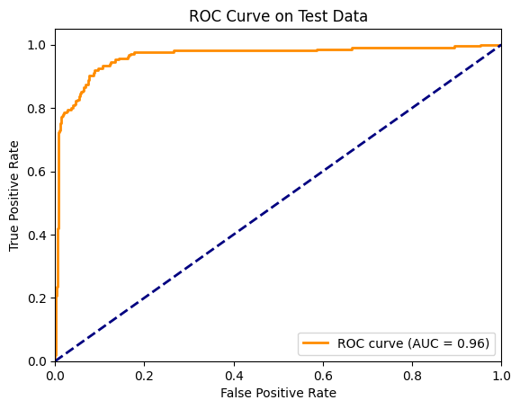
    


Optimal threshold.


```python
fpr, tpr, thresholds = roc_curve(y_test, y_pred_proba)
fnr = 1 - tpr
optimal_idx = np.argmin(np.abs(fpr - fnr))
optimal_threshold = thresholds[optimal_idx]

print(f"Optimal threshold: {optimal_threshold:.3f}")
```

    Optimal threshold: 0.307


Recall at optimal decision threshold. 


```python
from sklearn.metrics import confusion_matrix, recall_score

y_pred = (y_pred_proba >= optimal_threshold).astype(int)
conf_matrix = confusion_matrix(y_test, y_pred)
recall = recall_score(y_test, y_pred)

print("Confusion Matrix:")
print(conf_matrix)
print(f"\nRecall at optimal threshold: {recall:.3f}")
```

    Confusion Matrix:
    [[771  74]
     [ 19 195]]
    
    Recall at optimal threshold: 0.911


# Modeled Probabilities and Log(ods) against observed probabilities by predictors.


```python
import matplotlib.pyplot as plt
import numpy as np
import seaborn as sns
import statsmodels.api as sm

X = train[['feature_1', 'feature_2', 'feature_3', 'feature_4']]
y = train['y']

lr_model = LogisticRegression(random_state=42)
lr_model.fit(X, y)

fig1, ((ax1, ax2, ax3, ax4), (ax5, ax6, ax7, ax8), (ax9, ax10, ax11, ax12)) = plt.subplots(3, 4, figsize=(20, 18))

mean_values = X.mean()
coefficients = lr_model.coef_[0]

for i, feature in enumerate(['feature_1', 'feature_2', 'feature_3', 'feature_4']):
    x_range = np.linspace(X[feature].min(), X[feature].max(), 100)
    
    pred_data = np.tile(mean_values, (100, 1))
    pred_data = pd.DataFrame(pred_data, columns=X.columns)
    pred_data[feature] = x_range
    
    y_pred = lr_model.predict_proba(pred_data)[:, 1]
    
    axes_top = [ax1, ax2, ax3, ax4]
    axes_top[i].plot(x_range, y_pred, label='Predicted Probability')
    axes_top[i].text(0.05, 0.95, f'β{i+1} = {coefficients[i]:.3f}', transform=axes_top[i].transAxes)
    axes_top[i].set_title(f'Predicted Probability vs {feature}\n(Other Variables at Mean)')
    axes_top[i].set_ylabel('Predicted Probability')
    axes_top[i].set_xlabel(feature)
    axes_top[i].grid(True, alpha=0.3)
    axes_top[i].set_ylim(0, 1)
    axes_top[i].legend()
    
    X_with_const = sm.add_constant(X)
    logit_model = sm.Logit(y, X_with_const)
    result = logit_model.fit()
    
    feature_values = np.linspace(X[feature].min(), X[feature].max(), 50)
    fixed_predictors = mean_values.copy()
    log_odds = []
    
    for value in feature_values:
        temp_predictors = fixed_predictors.copy()
        temp_predictors[feature] = value
        predictors_with_const = sm.add_constant(temp_predictors.values.reshape(1, -1), has_constant='add')
        logit = np.dot(predictors_with_const, result.params)
        log_odds.append(logit[0])
    
    plot_df = pd.DataFrame({
        feature: feature_values,
        'log_odds': log_odds
    })
    
    axes_middle = [ax5, ax6, ax7, ax8]
    sns.scatterplot(x=feature, y='log_odds', data=plot_df, color='blue', s=50, 
                    ax=axes_middle[i], label='Logit Points')
    sns.regplot(x=feature, y='log_odds', data=plot_df, scatter=False, lowess=True,
                color='red', line_kws={'lw': 2}, ax=axes_middle[i], label='Smoothed Logit Curve')
    
    axes_middle[i].set_title(f'Logit Curve (Log Odds) for {feature}')
    axes_middle[i].set_xlabel(feature)
    axes_middle[i].set_ylabel('Log(P / 1-P)')
    axes_middle[i].axhline(0, color='grey', linestyle='--', label='Log Odds = 0')
    axes_middle[i].legend()
    axes_middle[i].grid(True)
    
    bins = pd.qcut(X[feature], q=50, duplicates='drop')
    bin_means = X.groupby(bins)[feature].mean()
    bin_probs = train.groupby(bins)['y'].mean()
    
    axes_bottom = [ax9, ax10, ax11, ax12]
    sns.scatterplot(x=bin_means, y=bin_probs, ax=axes_bottom[i], color='blue', s=20, label='Observed Probability')
    sns.regplot(x=bin_means, y=bin_probs, scatter=False, lowess=True,
                color='red', line_kws={'lw': 2}, ax=axes_bottom[i], label='Smoothed Curve')
    
    axes_bottom[i].set_title(f'Observed Probability vs {feature}')
    axes_bottom[i].set_xlabel(feature)
    axes_bottom[i].set_ylabel('Probability of Positive Outcome')
    axes_bottom[i].set_ylim(0, 1)
    axes_bottom[i].legend()
    axes_bottom[i].grid(True)

plt.tight_layout()
plt.show()
```

    Optimization terminated successfully.
             Current function value: 0.393480
             Iterations 8
    Optimization terminated successfully.
             Current function value: 0.393480
             Iterations 8
    Optimization terminated successfully.
             Current function value: 0.393480
             Iterations 8
    Optimization terminated successfully.
             Current function value: 0.393480
             Iterations 8


    
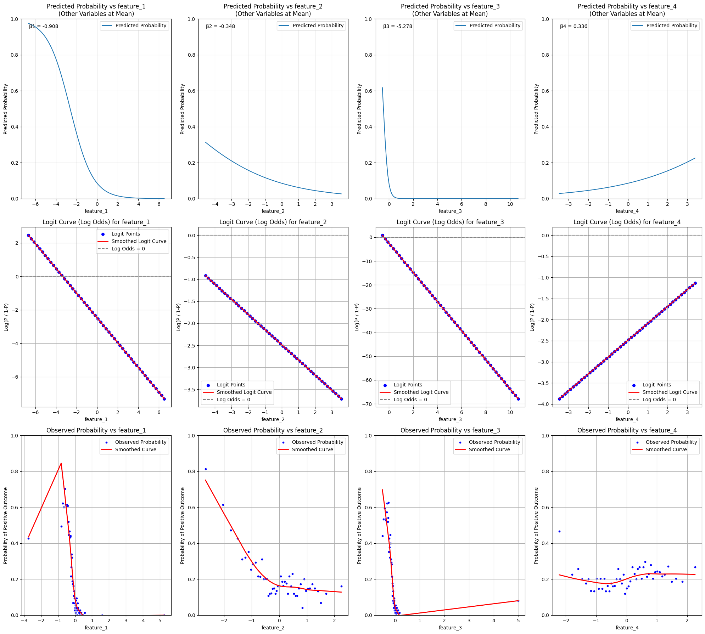
    


It appears the reason that feature 1 has such a weaker negative term coefficient is because it has some left tail outliers which weaken it's over all trend.
I evaluated the model without feature 1's bottom tail and it made no difference on model performance. 

Verifying the strength of our Interaction terms as they've produced significant term coefficients. 


```python
X = train[['feature_1', 'feature_2', 'feature_3', 'feature_4',
           'feature_1_x_feature_2', 'feature_1_x_feature_3', 
           'feature_2_x_feature_3', 'feature_2_x_feature_4',
           'feature_3_x_feature_4']]
y = train['y']

fig1, ((ax1, ax2, ax3), (ax4, ax5, _)) = plt.subplots(2, 3, figsize=(20, 12))
axes = [ax1, ax2, ax3, ax4, ax5]

interaction_terms = ['feature_1_x_feature_2', 'feature_1_x_feature_3', 
                    'feature_2_x_feature_3', 'feature_2_x_feature_4', 
                    'feature_3_x_feature_4']

for i, feature in enumerate(interaction_terms):
    bins = pd.qcut(X[feature], q=50, duplicates='drop')
    bin_means = X.groupby(bins)[feature].mean()
    bin_probs = train.groupby(bins)['y'].mean()
    
    sns.scatterplot(x=bin_means, y=bin_probs, ax=axes[i], color='blue', s=20, label='Observed Probability')
    sns.regplot(x=bin_means, y=bin_probs, scatter=False, lowess=True,
                color='red', line_kws={'lw': 2}, ax=axes[i], label='Smoothed Curve')
    
    axes[i].set_title(f'Observed Probability vs {feature}')
    axes[i].set_xlabel(feature)
    axes[i].set_ylabel('Probability of Positive Outcome')
    axes[i].set_ylim(0, 1)
    axes[i].legend()
    axes[i].grid(True)

plt.tight_layout()
plt.show()

```


    
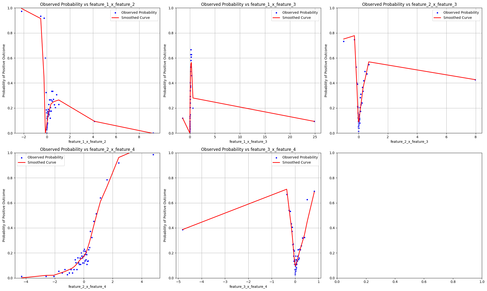
    


# Strongest Predictors Visualized 

## Features 1 and 3 

Distributions of features 1 and 3 stratified by posative and negative outcomes. 


```python
fig, ax = plt.subplots(figsize=(15, 5))

positive_data = train[train['y'] == 1]
negative_data = train[train['y'] == 0]

sns.kdeplot(data=positive_data['feature_1'], ax=ax, fill=True, alpha=0.6, label='Feature 1 (Positive)', color='darkgreen')
sns.kdeplot(data=negative_data['feature_1'], ax=ax, fill=True, alpha=0.6, label='Feature 1 (Negative)', color='black')
sns.kdeplot(data=positive_data['feature_3'], ax=ax, fill=True, alpha=0.6, label='Feature 3 (Positive)', color='lightgreen')
sns.kdeplot(data=negative_data['feature_3'], ax=ax, fill=True, alpha=0.6, label='Feature 3 (Negative)', color='black')
ax.set_title('Distribution by Outcome: Features 1 & 3')
ax.set_xlabel('Value')
ax.set_ylabel('Density')
ax.set_xlim(-1.5, 1.5)
ax.legend()

plt.tight_layout()
plt.show()

```


    
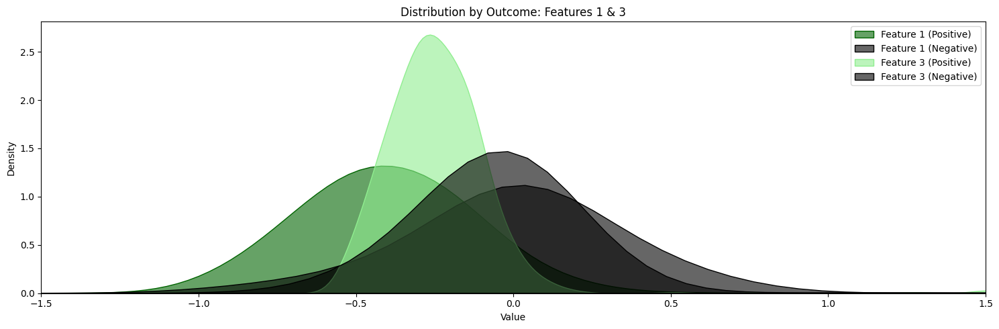
    


Significantly different means of the positive negative outcomes for features 1 and 3. 

## Features 2 and 4 

Scatter plot of these 2 variables stratified by outcome. 


```python
plt.figure(figsize=(16,12))

positive_data = train[train['y'] == 1]
negative_data = train[train['y'] == 0]

pos_corr = positive_data['feature_2'].corr(positive_data['feature_4'])
neg_corr = negative_data['feature_2'].corr(negative_data['feature_4'])

sns.scatterplot(data=train, x='feature_2', y='feature_4', hue='y',
                palette={1: 'green', 0: 'red'}, alpha=0.6)

x_pos = positive_data['feature_2']
y_pos = pos_corr * x_pos + (positive_data['feature_4'].mean() - pos_corr * positive_data['feature_2'].mean())
plt.plot(x_pos, y_pos, color='darkgreen', linestyle='--')

x_neg = negative_data['feature_2']
y_neg = neg_corr * x_neg + (negative_data['feature_4'].mean() - neg_corr * negative_data['feature_2'].mean())
plt.plot(x_neg, y_neg, color='darkred', linestyle='--')

plt.title(f'Feature 2 vs Feature 4 by Outcome\nPositive Correlation: {pos_corr:.3f}, Negative Correlation: {neg_corr:.3f}')
plt.show()
```


    
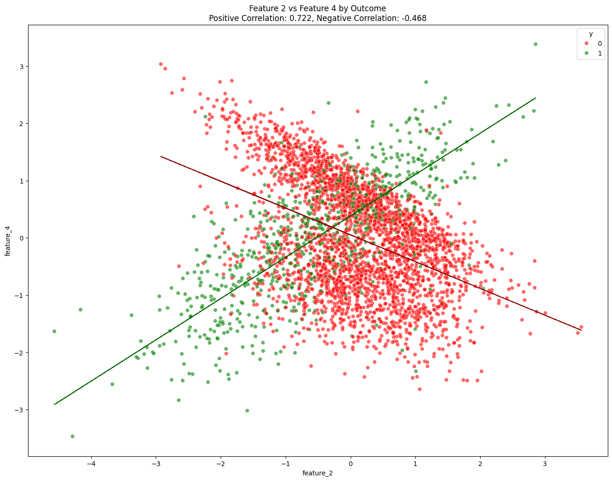
    


Probabilities produced by model of feature 2x4 interaction term in comparison to observed probabilities within data set. 


```python
X = train[['feature_1', 'feature_2', 'feature_3', 'feature_4', 
           'feature_1_x_feature_2', 'feature_1_x_feature_3',
           'feature_2_x_feature_3', 'feature_2_x_feature_4', 'feature_3_x_feature_4']]
y = train['y']

lr_model = LogisticRegression(random_state=42)
lr_model.fit(X, y)

fig1, (ax1, ax2) = plt.subplots(1, 2, figsize=(20, 12))

mean_values = X.mean()
interaction_range = np.linspace(train['feature_2_x_feature_4'].min(), train['feature_2_x_feature_4'].max(), 100)

pred_data = np.tile(mean_values, (100, 1))
pred_data = pd.DataFrame(pred_data, columns=X.columns)
pred_data['feature_2_x_feature_4'] = interaction_range

y_pred = lr_model.predict_proba(pred_data)[:, 1]

ax1.plot(interaction_range, y_pred)
ax1.set_title('Predicted Probability vs feature_2 × feature_4\n(Other Features and Interactions at Mean)')
ax1.set_ylabel('Predicted Probability')
ax1.set_xlabel('feature_2 × feature_4')
ax1.grid(True, alpha=0.3)
ax1.set_ylim(0, 1)

bins = pd.qcut(X['feature_2_x_feature_4'], q=50, duplicates='drop')
bin_means = X.groupby(bins)['feature_2_x_feature_4'].mean()
bin_probs = train.groupby(bins)['y'].mean()

sns.scatterplot(x=bin_means, y=bin_probs, ax=ax2, color='blue', s=20, label='Observed Probability')
sns.regplot(x=bin_means, y=bin_probs, scatter=False, lowess=True,
            color='red', line_kws={'lw': 2}, ax=ax2, label='Smoothed Curve')

ax2.set_title('Observed Probability vs feature_2 × feature_4')
ax2.set_xlabel('feature_2 × feature_4')
ax2.set_ylabel('Probability of Positive Outcome')
ax2.set_ylim(0, 1)
ax2.legend()
ax2.grid(True)

plt.tight_layout()
plt.show()

```


    
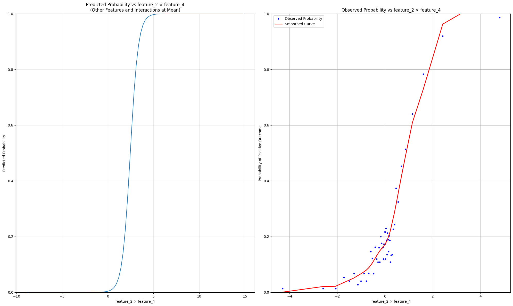
    


Thus the interaction term produced for features 2 and 4 had a highly predictive coefficient.

Interactions plot. 


```python
import numpy as np
import pandas as pd
import statsmodels.api as sm
import matplotlib.pyplot as plt

fig, ax = plt.subplots(figsize=(15, 10))

formula = 'y ~ feature_2 * feature_4'
model = sm.Logit.from_formula(formula, data=train).fit()
interaction_pvalue = model.pvalues['feature_2:feature_4']

feature_2_values = np.linspace(train['feature_2'].min(), train['feature_2'].max(), 100)
feature_4_levels = list(np.percentile(train['feature_4'], [25, 50, 75])) + [-4]

for feature_4_level in feature_4_levels:
    df = pd.DataFrame({
        'feature_2': feature_2_values,
        'feature_4': feature_4_level
    })
    df['interaction'] = df['feature_2'] * df['feature_4']
    df['predicted_prob'] = model.predict(sm.add_constant(df))
    
    ax.plot(df['feature_2'], df['predicted_prob'], 
           label=f'feature_4={feature_4_level:.1f}')

ax.set_xlabel('feature_2')
ax.set_ylabel('Predicted Probability y = 1')
ax.legend()
ax.set_title(f'Interaction: feature_2 and feature_4\nInteraction p-value: {interaction_pvalue:.4f}')

plt.tight_layout()
plt.show()

if interaction_pvalue < 0.05:
    print("\nSignificant interaction (p < 0.05):")
    print("feature_2 x feature_4")
```

    Optimization terminated successfully.
             Current function value: 0.365151
             Iterations 8


    
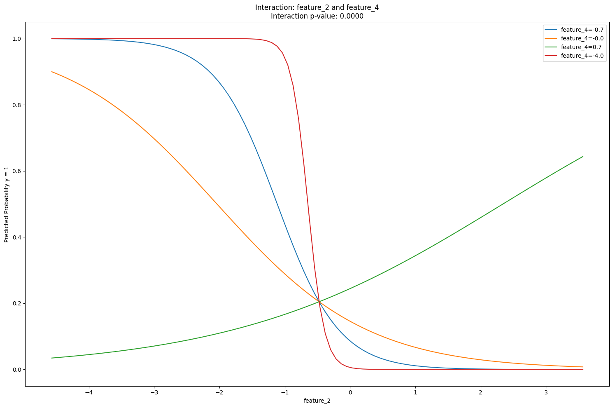
    


    
    Significant interaction (p < 0.05):
    feature_2 x feature_4


# Random Forest Model


```python
from sklearn.ensemble import RandomForestClassifier
X_train = train[['feature_1', 'feature_2', 'feature_3', 'feature_4']]
y_train = train['y']
rf_model = RandomForestClassifier()
rf_model.fit(X_train, y_train);


from sklearn.metrics import roc_auc_score
X_test = test[['feature_1', 'feature_2', 'feature_3', 'feature_4']]
y_test = test['y']


rf_pred_proba = rf_model.predict_proba(X_test)[:,1]

fpr, tpr, _ = roc_curve(y_test, rf_pred_proba)
auc_score = roc_auc_score(y_test, rf_pred_proba)


plt.figure()
plt.plot(fpr, tpr, label=f'AUC = {auc_score:.3f}')
plt.plot([0, 1], [0, 1], 'k--')
plt.xlabel('False Positive Rate')
plt.ylabel('True Positive Rate')
plt.title('ROC Curve - Random Forest')
plt.legend();


fpr, tpr, thresholds = roc_curve(y_test, rf_pred_proba)
fnr = 1 - tpr
optimal_idx = np.argmin(np.abs(fpr - fnr))
optimal_threshold = thresholds[optimal_idx]

print(f"Optimal threshold: {optimal_threshold:.3f}")


y_pred = (rf_pred_proba >= optimal_threshold).astype(int)
conf_matrix = confusion_matrix(y_test, y_pred)
recall = recall_score(y_test, y_pred)

print("Confusion Matrix:")
print(conf_matrix)
print(f"\nRecall at optimal threshold: {recall:.3f}")
```

    Optimal threshold: 0.230
    Confusion Matrix:
    [[794  51]
     [ 13 201]]
    
    Recall at optimal threshold: 0.939


    
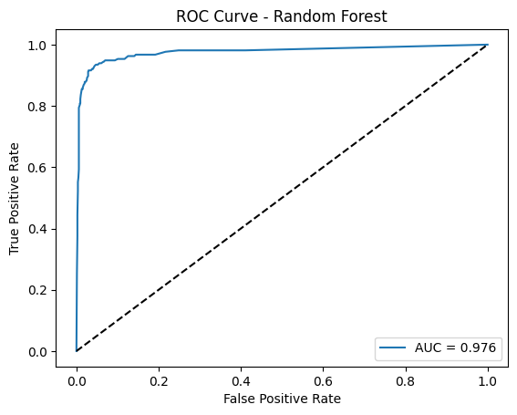
    


The RF model is moderately yet significantly better performing than our extensively fitted Logistic Regression model. 

# Check for Multi-collinearity


```python
# Feature Correlation Matrix
correlation_matrix = train[['feature_1', 'feature_2', 'feature_3', 'feature_4']].corr()
plt.figure(figsize=(8, 6))
sns.heatmap(correlation_matrix, annot=True, cmap='coolwarm', center=0)
plt.title('Feature Correlation Matrix')
plt.show()


plt.figure(figsize=(8, 6))
plt.scatter(train['feature_1'], train['feature_3'], alpha=0.5)
corr = train['feature_1'].corr(train['feature_3'])
pct_between = (train['feature_3'][(train['feature_3'] >= 8) & (train['feature_3'] <= 14)].count() / train['feature_3'].count()) * 100
plt.xlabel('Feature 1')
plt.ylabel('Feature 3')
plt.title(f'Feature 1 vs Feature 3 Scatter Plot\nCorrelation: {corr:.3f}\n{pct_between:.1f}% of Feature 3 between 8-14')
plt.show()

filtered_data = train[~((train['feature_3'] >= 8) & (train['feature_3'] <= 14))]
pct_remaining = (len(filtered_data) / len(train)) * 100
plt.figure(figsize=(8, 6))
plt.scatter(filtered_data['feature_1'], filtered_data['feature_3'], alpha=0.5)
sns.regplot(x=filtered_data['feature_1'], y=filtered_data['feature_3'], scatter=False, lowess=True, color='red')
corr = filtered_data['feature_1'].corr(filtered_data['feature_3'])
plt.xlabel('Feature 1')
plt.ylabel('Feature 3')
plt.title(f'Feature 1 vs Feature 3 Scatter Plot (Filtered)\nCorrelation: {corr:.3f}\n{pct_remaining:.1f}% of total observations')
plt.xlim(-2, 2)
plt.ylim(-2, 2)
plt.show()

zoomed_data = train[(train['feature_1'] >= -1.25) & (train['feature_1'] <= 1) & 
                    (train['feature_3'] >= -1) & (train['feature_3'] <= 0.5)]
pct_zoomed = (len(zoomed_data) / len(train)) * 100
plt.figure(figsize=(8, 6))
plt.scatter(zoomed_data['feature_1'], zoomed_data['feature_3'], alpha=0.5)
corr = zoomed_data['feature_1'].corr(zoomed_data['feature_3'])
plt.xlabel('Feature 1')
plt.ylabel('Feature 3')
plt.title(f'Feature 1 vs Feature 3 Scatter Plot (Zoomed)\nCorrelation: {corr:.3f}\n{pct_zoomed:.1f}% of total observations')
plt.xlim(-1.25, 1)
plt.ylim(-1.25, 1)
plt.show()

```


    
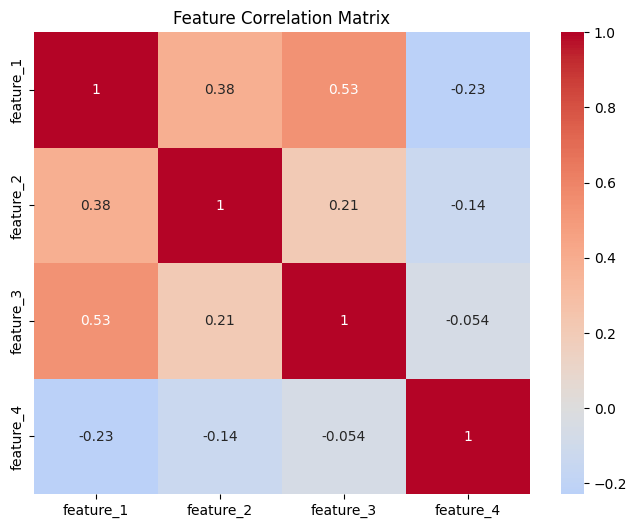
    


    
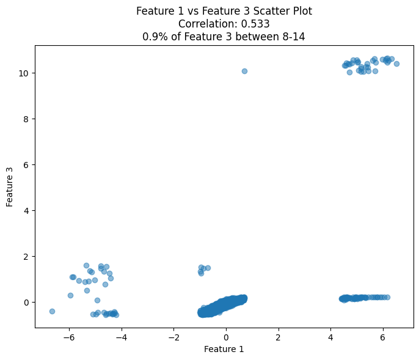
    


    
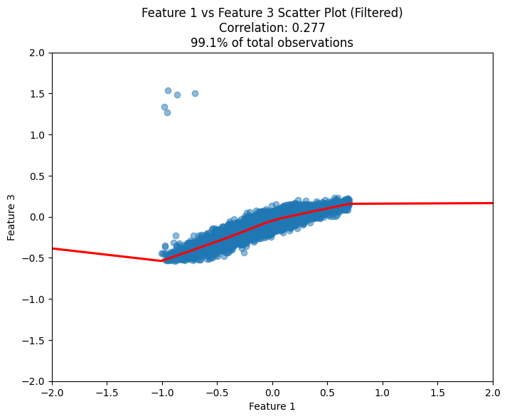
    


    
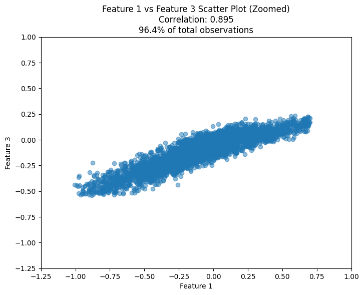
    


Any attempt made to deal with this results in the model becoming weaker, since our goal is predictive performance is doesn't actually matter but it would be nice if we could produce a cleaner model. Computationally our coefficients are unstable yet the results are good so. 

# MORE EDA 


```python
fig, ax = plt.subplots(figsize=(15, 5))

positive_data = train[train['y'] == 1]
negative_data = train[train['y'] == 0]

sns.kdeplot(data=positive_data['feature_2'], ax=ax, fill=True, alpha=0.6, label='Feature 2 (Positive)', color='darkgreen')
sns.kdeplot(data=negative_data['feature_2'], ax=ax, fill=True, alpha=0.6, label='Feature 2 (Negative)', color='grey')
sns.kdeplot(data=positive_data['feature_4'], ax=ax, fill=True, alpha=0.6, label='Feature 4 (Positive)', color='blue')
sns.kdeplot(data=negative_data['feature_4'], ax=ax, fill=True, alpha=0.6, label='Feature 4 (Negative)', color='black')
ax.set_title('Distribution by Outcome: Features 2 & 4')
ax.set_xlabel('Value')
ax.set_ylabel('Density')
ax.set_xlim(-10, 10)
ax.legend()

plt.tight_layout()
plt.show()

```


    
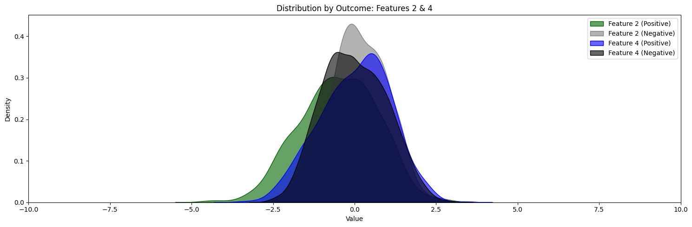
    

