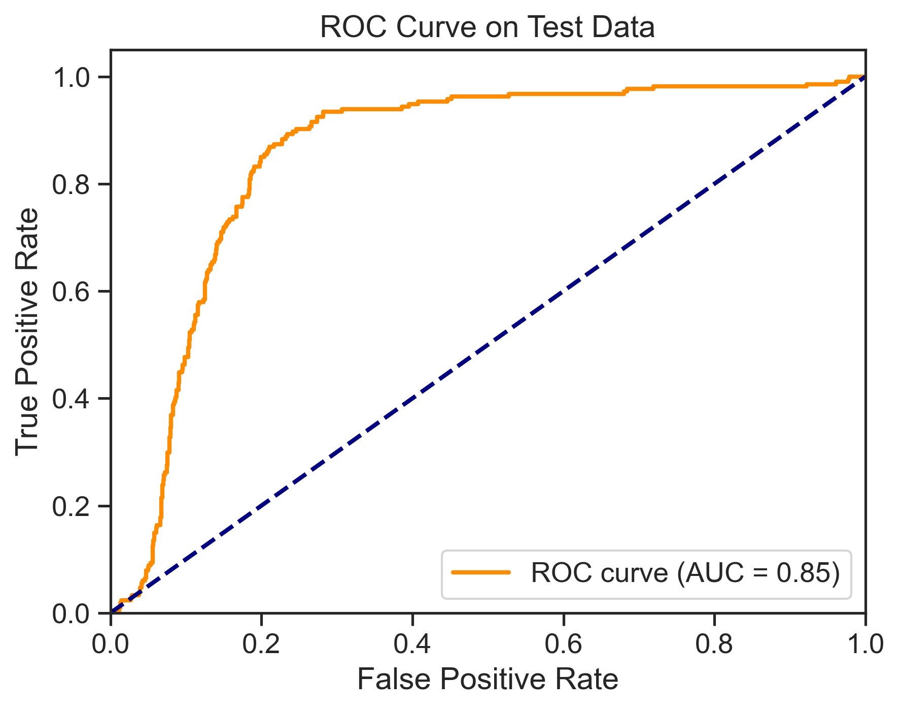
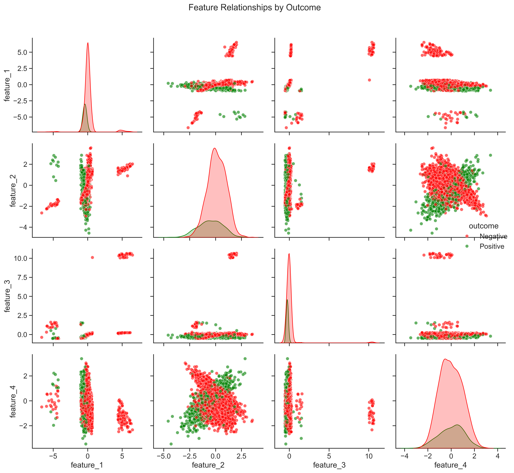
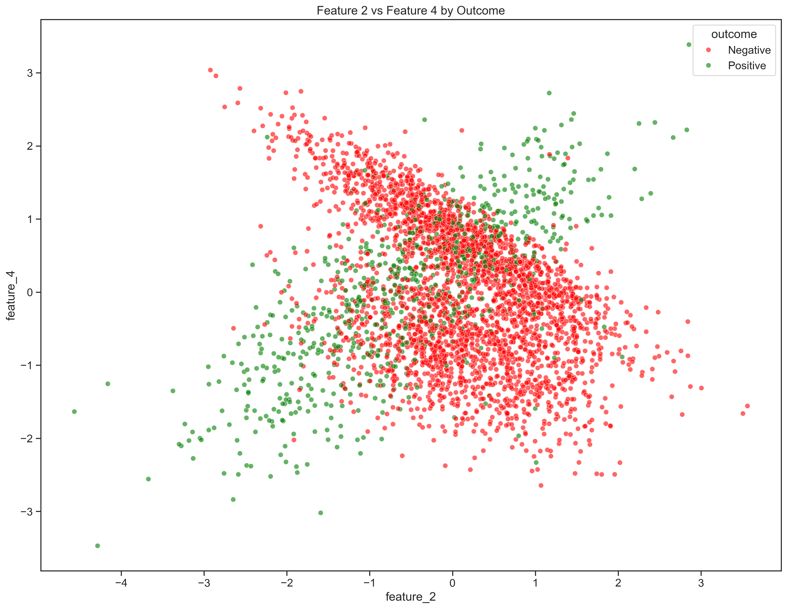
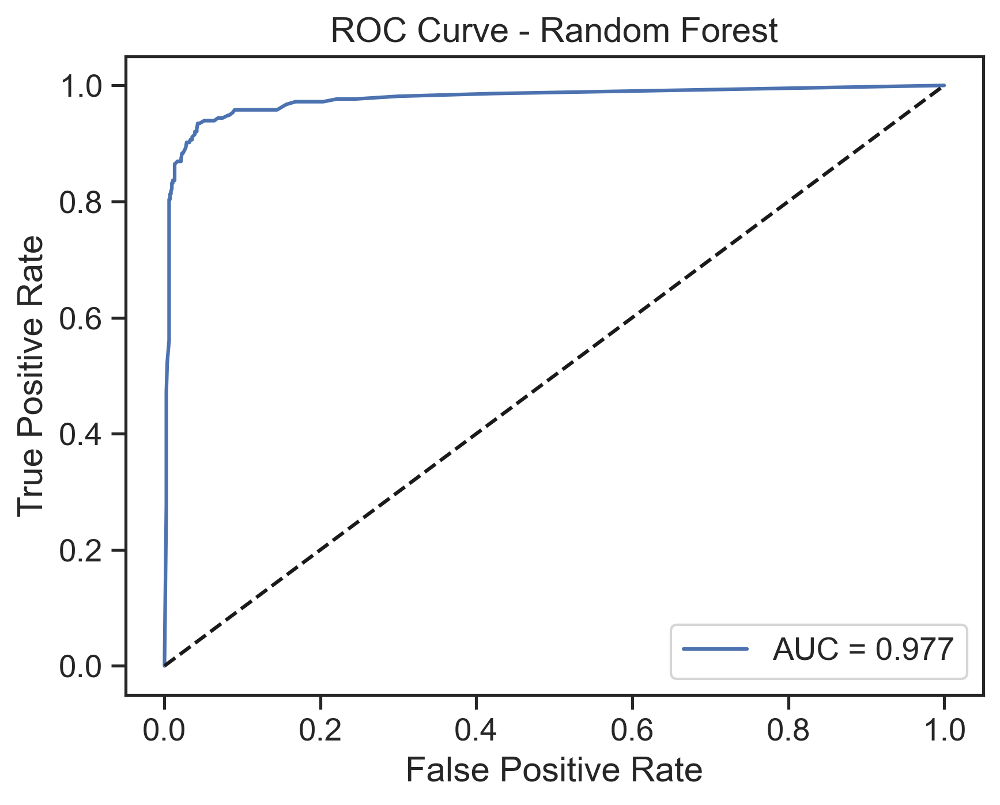

```python
import numpy as np 
import pandas as pd 
import os
import matplotlib.pyplot as plt

os.chdir("/Users/jacobrichards/Desktop/DS_DA_Projects/90+_DaysPastDue/90+DPD_files")

train = pd.read_csv("FITB_train.csv", na_values=["", "NA"])

test = pd.read_csv("FITB_test.csv", na_values=["", "NA"])

# Suppress warnings
import warnings
warnings.filterwarnings('ignore')
pd.options.mode.chained_assignment = None
```

remove upper and lower 1% of feature 3 for train but not test 


```python
lower_bound = train['feature_3'].quantile(0.01)
upper_bound = train['feature_3'].quantile(0.99)

train = train[(train['feature_3'] >= lower_bound) & (train['feature_3'] <= upper_bound)]
```

replace na with median value for both


```python
train_median = train['feature_3'].median()
train['feature_3'].fillna(train_median, inplace=True)

test_median = test['feature_3'].median()
test['feature_3'].fillna(test_median, inplace=True)
```

replace na of feature 2 with forward fill and backward fill 


```python
train['date'] = pd.to_datetime(train['date']).dt.year
test['date'] = pd.to_datetime(test['date']).dt.year

def impute_feature_2(df):
    df = df.sort_values(by=['id', 'date'])
    df['feature_2'] = df['feature_2'].fillna(method='ffill')
    df['feature_2'] = df['feature_2'].fillna(method='bfill')
    return df

train = train.groupby('id', group_keys=False).apply(impute_feature_2)
test = test.groupby('id', group_keys=False).apply(impute_feature_2)
```

replace y with 1 if 90+DPD and 0 if active 


```python
train['y'] = train['y'].apply(lambda x: 1 if x == "90+DPD" else 0 if x == "active" else x)
test['y'] = test['y'].apply(lambda x: 1 if x == "90+DPD" else 0 if x == "active" else x)
```

Standardize features


```python
from sklearn.preprocessing import StandardScaler
scaler = StandardScaler()
train[['feature_1', 'feature_2', 'feature_3', 'feature_4']] = scaler.fit_transform(train[['feature_1', 'feature_2', 'feature_3', 'feature_4']])
test[['feature_1', 'feature_2', 'feature_3', 'feature_4']] = scaler.transform(test[['feature_1', 'feature_2', 'feature_3', 'feature_4']])
```

Logistic Regression Model 


```python
from sklearn.linear_model import LogisticRegression
X_train = train[['feature_1', 'feature_2', 'feature_3', 'feature_4']]
y_train = train['y']
model = LogisticRegression(fit_intercept=True)
model.fit(X_train, y_train)
```


<style>#sk-container-id-15 {
  /* Definition of color scheme common for light and dark mode */
  --sklearn-color-text: #000;
  --sklearn-color-text-muted: #666;
  --sklearn-color-line: gray;
  /* Definition of color scheme for unfitted estimators */
  --sklearn-color-unfitted-level-0: #fff5e6;
  --sklearn-color-unfitted-level-1: #f6e4d2;
  --sklearn-color-unfitted-level-2: #ffe0b3;
  --sklearn-color-unfitted-level-3: chocolate;
  /* Definition of color scheme for fitted estimators */
  --sklearn-color-fitted-level-0: #f0f8ff;
  --sklearn-color-fitted-level-1: #d4ebff;
  --sklearn-color-fitted-level-2: #b3dbfd;
  --sklearn-color-fitted-level-3: cornflowerblue;

  /* Specific color for light theme */
  --sklearn-color-text-on-default-background: var(--sg-text-color, var(--theme-code-foreground, var(--jp-content-font-color1, black)));
  --sklearn-color-background: var(--sg-background-color, var(--theme-background, var(--jp-layout-color0, white)));
  --sklearn-color-border-box: var(--sg-text-color, var(--theme-code-foreground, var(--jp-content-font-color1, black)));
  --sklearn-color-icon: #696969;

  @media (prefers-color-scheme: dark) {
    /* Redefinition of color scheme for dark theme */
    --sklearn-color-text-on-default-background: var(--sg-text-color, var(--theme-code-foreground, var(--jp-content-font-color1, white)));
    --sklearn-color-background: var(--sg-background-color, var(--theme-background, var(--jp-layout-color0, #111)));
    --sklearn-color-border-box: var(--sg-text-color, var(--theme-code-foreground, var(--jp-content-font-color1, white)));
    --sklearn-color-icon: #878787;
  }
}

#sk-container-id-15 {
  color: var(--sklearn-color-text);
}

#sk-container-id-15 pre {
  padding: 0;
}

#sk-container-id-15 input.sk-hidden--visually {
  border: 0;
  clip: rect(1px 1px 1px 1px);
  clip: rect(1px, 1px, 1px, 1px);
  height: 1px;
  margin: -1px;
  overflow: hidden;
  padding: 0;
  position: absolute;
  width: 1px;
}

#sk-container-id-15 div.sk-dashed-wrapped {
  border: 1px dashed var(--sklearn-color-line);
  margin: 0 0.4em 0.5em 0.4em;
  box-sizing: border-box;
  padding-bottom: 0.4em;
  background-color: var(--sklearn-color-background);
}

#sk-container-id-15 div.sk-container {
  /* jupyter's `normalize.less` sets `[hidden] { display: none; }`
     but bootstrap.min.css set `[hidden] { display: none !important; }`
     so we also need the `!important` here to be able to override the
     default hidden behavior on the sphinx rendered scikit-learn.org.
     See: https://github.com/scikit-learn/scikit-learn/issues/21755 */
  display: inline-block !important;
  position: relative;
}

#sk-container-id-15 div.sk-text-repr-fallback {
  display: none;
}

div.sk-parallel-item,
div.sk-serial,
div.sk-item {
  /* draw centered vertical line to link estimators */
  background-image: linear-gradient(var(--sklearn-color-text-on-default-background), var(--sklearn-color-text-on-default-background));
  background-size: 2px 100%;
  background-repeat: no-repeat;
  background-position: center center;
}

/* Parallel-specific style estimator block */

#sk-container-id-15 div.sk-parallel-item::after {
  content: "";
  width: 100%;
  border-bottom: 2px solid var(--sklearn-color-text-on-default-background);
  flex-grow: 1;
}

#sk-container-id-15 div.sk-parallel {
  display: flex;
  align-items: stretch;
  justify-content: center;
  background-color: var(--sklearn-color-background);
  position: relative;
}

#sk-container-id-15 div.sk-parallel-item {
  display: flex;
  flex-direction: column;
}

#sk-container-id-15 div.sk-parallel-item:first-child::after {
  align-self: flex-end;
  width: 50%;
}

#sk-container-id-15 div.sk-parallel-item:last-child::after {
  align-self: flex-start;
  width: 50%;
}

#sk-container-id-15 div.sk-parallel-item:only-child::after {
  width: 0;
}

/* Serial-specific style estimator block */

#sk-container-id-15 div.sk-serial {
  display: flex;
  flex-direction: column;
  align-items: center;
  background-color: var(--sklearn-color-background);
  padding-right: 1em;
  padding-left: 1em;
}


/* Toggleable style: style used for estimator/Pipeline/ColumnTransformer box that is
clickable and can be expanded/collapsed.
- Pipeline and ColumnTransformer use this feature and define the default style
- Estimators will overwrite some part of the style using the `sk-estimator` class
*/

/* Pipeline and ColumnTransformer style (default) */

#sk-container-id-15 div.sk-toggleable {
  /* Default theme specific background. It is overwritten whether we have a
  specific estimator or a Pipeline/ColumnTransformer */
  background-color: var(--sklearn-color-background);
}

/* Toggleable label */
#sk-container-id-15 label.sk-toggleable__label {
  cursor: pointer;
  display: flex;
  width: 100%;
  margin-bottom: 0;
  padding: 0.5em;
  box-sizing: border-box;
  text-align: center;
  align-items: start;
  justify-content: space-between;
  gap: 0.5em;
}

#sk-container-id-15 label.sk-toggleable__label .caption {
  font-size: 0.6rem;
  font-weight: lighter;
  color: var(--sklearn-color-text-muted);
}

#sk-container-id-15 label.sk-toggleable__label-arrow:before {
  /* Arrow on the left of the label */
  content: "▸";
  float: left;
  margin-right: 0.25em;
  color: var(--sklearn-color-icon);
}

#sk-container-id-15 label.sk-toggleable__label-arrow:hover:before {
  color: var(--sklearn-color-text);
}

/* Toggleable content - dropdown */

#sk-container-id-15 div.sk-toggleable__content {
  max-height: 0;
  max-width: 0;
  overflow: hidden;
  text-align: left;
  /* unfitted */
  background-color: var(--sklearn-color-unfitted-level-0);
}

#sk-container-id-15 div.sk-toggleable__content.fitted {
  /* fitted */
  background-color: var(--sklearn-color-fitted-level-0);
}

#sk-container-id-15 div.sk-toggleable__content pre {
  margin: 0.2em;
  border-radius: 0.25em;
  color: var(--sklearn-color-text);
  /* unfitted */
  background-color: var(--sklearn-color-unfitted-level-0);
}

#sk-container-id-15 div.sk-toggleable__content.fitted pre {
  /* unfitted */
  background-color: var(--sklearn-color-fitted-level-0);
}

#sk-container-id-15 input.sk-toggleable__control:checked~div.sk-toggleable__content {
  /* Expand drop-down */
  max-height: 200px;
  max-width: 100%;
  overflow: auto;
}

#sk-container-id-15 input.sk-toggleable__control:checked~label.sk-toggleable__label-arrow:before {
  content: "▾";
}

/* Pipeline/ColumnTransformer-specific style */

#sk-container-id-15 div.sk-label input.sk-toggleable__control:checked~label.sk-toggleable__label {
  color: var(--sklearn-color-text);
  background-color: var(--sklearn-color-unfitted-level-2);
}

#sk-container-id-15 div.sk-label.fitted input.sk-toggleable__control:checked~label.sk-toggleable__label {
  background-color: var(--sklearn-color-fitted-level-2);
}

/* Estimator-specific style */

/* Colorize estimator box */
#sk-container-id-15 div.sk-estimator input.sk-toggleable__control:checked~label.sk-toggleable__label {
  /* unfitted */
  background-color: var(--sklearn-color-unfitted-level-2);
}

#sk-container-id-15 div.sk-estimator.fitted input.sk-toggleable__control:checked~label.sk-toggleable__label {
  /* fitted */
  background-color: var(--sklearn-color-fitted-level-2);
}

#sk-container-id-15 div.sk-label label.sk-toggleable__label,
#sk-container-id-15 div.sk-label label {
  /* The background is the default theme color */
  color: var(--sklearn-color-text-on-default-background);
}

/* On hover, darken the color of the background */
#sk-container-id-15 div.sk-label:hover label.sk-toggleable__label {
  color: var(--sklearn-color-text);
  background-color: var(--sklearn-color-unfitted-level-2);
}

/* Label box, darken color on hover, fitted */
#sk-container-id-15 div.sk-label.fitted:hover label.sk-toggleable__label.fitted {
  color: var(--sklearn-color-text);
  background-color: var(--sklearn-color-fitted-level-2);
}

/* Estimator label */

#sk-container-id-15 div.sk-label label {
  font-family: monospace;
  font-weight: bold;
  display: inline-block;
  line-height: 1.2em;
}

#sk-container-id-15 div.sk-label-container {
  text-align: center;
}

/* Estimator-specific */
#sk-container-id-15 div.sk-estimator {
  font-family: monospace;
  border: 1px dotted var(--sklearn-color-border-box);
  border-radius: 0.25em;
  box-sizing: border-box;
  margin-bottom: 0.5em;
  /* unfitted */
  background-color: var(--sklearn-color-unfitted-level-0);
}

#sk-container-id-15 div.sk-estimator.fitted {
  /* fitted */
  background-color: var(--sklearn-color-fitted-level-0);
}

/* on hover */
#sk-container-id-15 div.sk-estimator:hover {
  /* unfitted */
  background-color: var(--sklearn-color-unfitted-level-2);
}

#sk-container-id-15 div.sk-estimator.fitted:hover {
  /* fitted */
  background-color: var(--sklearn-color-fitted-level-2);
}

/* Specification for estimator info (e.g. "i" and "?") */

/* Common style for "i" and "?" */

.sk-estimator-doc-link,
a:link.sk-estimator-doc-link,
a:visited.sk-estimator-doc-link {
  float: right;
  font-size: smaller;
  line-height: 1em;
  font-family: monospace;
  background-color: var(--sklearn-color-background);
  border-radius: 1em;
  height: 1em;
  width: 1em;
  text-decoration: none !important;
  margin-left: 0.5em;
  text-align: center;
  /* unfitted */
  border: var(--sklearn-color-unfitted-level-1) 1pt solid;
  color: var(--sklearn-color-unfitted-level-1);
}

.sk-estimator-doc-link.fitted,
a:link.sk-estimator-doc-link.fitted,
a:visited.sk-estimator-doc-link.fitted {
  /* fitted */
  border: var(--sklearn-color-fitted-level-1) 1pt solid;
  color: var(--sklearn-color-fitted-level-1);
}

/* On hover */
div.sk-estimator:hover .sk-estimator-doc-link:hover,
.sk-estimator-doc-link:hover,
div.sk-label-container:hover .sk-estimator-doc-link:hover,
.sk-estimator-doc-link:hover {
  /* unfitted */
  background-color: var(--sklearn-color-unfitted-level-3);
  color: var(--sklearn-color-background);
  text-decoration: none;
}

div.sk-estimator.fitted:hover .sk-estimator-doc-link.fitted:hover,
.sk-estimator-doc-link.fitted:hover,
div.sk-label-container:hover .sk-estimator-doc-link.fitted:hover,
.sk-estimator-doc-link.fitted:hover {
  /* fitted */
  background-color: var(--sklearn-color-fitted-level-3);
  color: var(--sklearn-color-background);
  text-decoration: none;
}

/* Span, style for the box shown on hovering the info icon */
.sk-estimator-doc-link span {
  display: none;
  z-index: 9999;
  position: relative;
  font-weight: normal;
  right: .2ex;
  padding: .5ex;
  margin: .5ex;
  width: min-content;
  min-width: 20ex;
  max-width: 50ex;
  color: var(--sklearn-color-text);
  box-shadow: 2pt 2pt 4pt #999;
  /* unfitted */
  background: var(--sklearn-color-unfitted-level-0);
  border: .5pt solid var(--sklearn-color-unfitted-level-3);
}

.sk-estimator-doc-link.fitted span {
  /* fitted */
  background: var(--sklearn-color-fitted-level-0);
  border: var(--sklearn-color-fitted-level-3);
}

.sk-estimator-doc-link:hover span {
  display: block;
}

/* "?"-specific style due to the `<a>` HTML tag */

#sk-container-id-15 a.estimator_doc_link {
  float: right;
  font-size: 1rem;
  line-height: 1em;
  font-family: monospace;
  background-color: var(--sklearn-color-background);
  border-radius: 1rem;
  height: 1rem;
  width: 1rem;
  text-decoration: none;
  /* unfitted */
  color: var(--sklearn-color-unfitted-level-1);
  border: var(--sklearn-color-unfitted-level-1) 1pt solid;
}

#sk-container-id-15 a.estimator_doc_link.fitted {
  /* fitted */
  border: var(--sklearn-color-fitted-level-1) 1pt solid;
  color: var(--sklearn-color-fitted-level-1);
}

/* On hover */
#sk-container-id-15 a.estimator_doc_link:hover {
  /* unfitted */
  background-color: var(--sklearn-color-unfitted-level-3);
  color: var(--sklearn-color-background);
  text-decoration: none;
}

#sk-container-id-15 a.estimator_doc_link.fitted:hover {
  /* fitted */
  background-color: var(--sklearn-color-fitted-level-3);
}
</style><div id="sk-container-id-15" class="sk-top-container"><div class="sk-text-repr-fallback"><pre>LogisticRegression()</pre><b>In a Jupyter environment, please rerun this cell to show the HTML representation or trust the notebook. <br />On GitHub, the HTML representation is unable to render, please try loading this page with nbviewer.org.</b></div><div class="sk-container" hidden><div class="sk-item"><div class="sk-estimator fitted sk-toggleable"><input class="sk-toggleable__control sk-hidden--visually" id="sk-estimator-id-15" type="checkbox" checked><label for="sk-estimator-id-15" class="sk-toggleable__label fitted sk-toggleable__label-arrow"><div><div>LogisticRegression</div></div><div><a class="sk-estimator-doc-link fitted" rel="noreferrer" target="_blank" href="https://scikit-learn.org/1.6/modules/generated/sklearn.linear_model.LogisticRegression.html">?<span>Documentation for LogisticRegression</span></a><span class="sk-estimator-doc-link fitted">i<span>Fitted</span></span></div></label><div class="sk-toggleable__content fitted"><pre>LogisticRegression()</pre></div> </div></div></div></div>


ROC Curve 


```python
from sklearn.metrics import roc_curve, auc
import matplotlib.pyplot as plt

X_test = test[['feature_1', 'feature_2', 'feature_3', 'feature_4']]
y_test = test['y']
y_pred_proba = model.predict_proba(X_test)[:,1]
fpr, tpr, _ = roc_curve(y_test, y_pred_proba)
roc_auc = auc(fpr, tpr)

plt.figure()
plt.plot(fpr, tpr, color='darkorange', lw=2, label=f'ROC curve (AUC = {roc_auc:.2f})')
plt.plot([0, 1], [0, 1], color='navy', lw=2, linestyle='--')
plt.xlim([0.0, 1.0])
plt.ylim([0.0, 1.05])
plt.xlabel('False Positive Rate')
plt.ylabel('True Positive Rate')
plt.title('ROC Curve on Test Data')
plt.legend(loc="lower right")
plt.show()
```


    

    


optimal threshold 


```python
fpr, tpr, thresholds = roc_curve(y_test, y_pred_proba)
fnr = 1 - tpr
optimal_idx = np.argmin(np.abs(fpr - fnr))
optimal_threshold = thresholds[optimal_idx]

print(f"Optimal threshold: {optimal_threshold:.3f}")
```

    Optimal threshold: 0.264


```python
from sklearn.metrics import confusion_matrix, recall_score

y_pred = (y_pred_proba >= optimal_threshold).astype(int)
conf_matrix = confusion_matrix(y_test, y_pred)
recall = recall_score(y_test, y_pred)

print("Confusion Matrix:")
print(conf_matrix)
print(f"\nRecall at optimal threshold: {recall:.3f}")
```

    Confusion Matrix:
    [[688 157]
     [ 39 175]]
    
    Recall at optimal threshold: 0.818


# EDA for features


```python
import seaborn as sns
import matplotlib.pyplot as plt

plt.rcParams['figure.dpi'] = 300
plt.rcParams['savefig.dpi'] = 300

features = ['feature_1', 'feature_2', 'feature_3', 'feature_4']
train['outcome'] = train['y'].map({1: 'Positive', 0: 'Negative'})

sns.set(style="ticks", font_scale=1.2)
plot = sns.pairplot(train[features + ['outcome']], 
                   hue='outcome',
                   palette={'Positive': 'green', 'Negative': 'red'},
                   plot_kws={'alpha': 0.6, 'linewidth': 0.5},
                   diag_kind='kde',
                   height=3)

plot.fig.suptitle('Feature Relationships by Outcome', y=1.02, size=16)
plt.tight_layout()
plt.show()
```


    

    


```python
plt.figure(figsize=(16,12))
sns.scatterplot(data=train, x='feature_2', y='feature_4', hue='outcome', 
                palette={'Positive': 'green', 'Negative': 'red'}, alpha=0.6)
plt.title('Feature 2 vs Feature 4 by Outcome')
plt.show()
```


    

    


```python
from ipywidgets import interact, FloatSlider, Button, FloatText, HBox, VBox
import numpy as np

def plot_probability(feature_2, feature_3, feature_4):
    feature_1_range = np.linspace(train['feature_1'].min(), train['feature_1'].max(), 100)
    probabilities = []
    
    for f1 in feature_1_range:
        input_data = np.array([[f1, feature_2, feature_3, feature_4]])
        prob = model.predict_proba(input_data)[0][1]
        probabilities.append(prob)
    
    plt.figure(figsize=(6,4))
    plt.plot(feature_1_range, probabilities)
    plt.xlabel('Feature 1')
    plt.ylabel('Probability')
    plt.ylim(0, 1)
    plt.title('Predicted Probability vs Feature 1')
    plt.grid(True)
    plt.show()

feature_ranges = {}
feature_means = {}
sliders = {}
texts = {}
buttons = {}

for feature in ['feature_2', 'feature_3', 'feature_4']:
    feature_ranges[feature] = {
        'min': train[feature].min(),
        'max': train[feature].max(),
        'step': (train[feature].max() - train[feature].min()) / 100
    }
    feature_means[feature] = train[feature].mean()
    
    sliders[feature] = FloatSlider(
        min=feature_ranges[feature]['min'],
        max=feature_ranges[feature]['max'],
        step=feature_ranges[feature]['step'],
        value=feature_means[feature],
        description=feature
    )
    
    texts[feature] = FloatText(
        value=feature_means[feature],
        description=feature
    )
    
    buttons[feature] = Button(description=f'Reset {feature}')
    
    def make_reset_handler(feature):
        def reset_handler(b):
            sliders[feature].value = feature_means[feature]
            texts[feature].value = feature_means[feature]
        return reset_handler
    
    buttons[feature].on_click(make_reset_handler(feature))
    
    def make_slider_observer(feature):
        def slider_observer(change):
            texts[feature].value = change['new']
        return slider_observer
    
    def make_text_observer(feature):
        def text_observer(change):
            sliders[feature].value = change['new']
        return text_observer
    
    sliders[feature].observe(make_slider_observer(feature), names='value')
    texts[feature].observe(make_text_observer(feature), names='value')

controls = [HBox([sliders[f], texts[f], buttons[f]]) for f in ['feature_2', 'feature_3', 'feature_4']]
ui = VBox(controls)

interact(plot_probability,
         feature_2=sliders['feature_2'],
         feature_3=sliders['feature_3'],
         feature_4=sliders['feature_4'])

```


    interactive(children=(FloatSlider(value=-9.532368335928363e-18, description='feature_2', max=3.561345841752021…


    <function __main__.plot_probability(feature_2, feature_3, feature_4)>


# Random Forest Model 


```python
from sklearn.ensemble import RandomForestClassifier
X_train = train[['feature_1', 'feature_2', 'feature_3', 'feature_4']]
y_train = train['y']
rf_model = RandomForestClassifier()
rf_model.fit(X_train, y_train)
```


<style>#sk-container-id-16 {
  /* Definition of color scheme common for light and dark mode */
  --sklearn-color-text: #000;
  --sklearn-color-text-muted: #666;
  --sklearn-color-line: gray;
  /* Definition of color scheme for unfitted estimators */
  --sklearn-color-unfitted-level-0: #fff5e6;
  --sklearn-color-unfitted-level-1: #f6e4d2;
  --sklearn-color-unfitted-level-2: #ffe0b3;
  --sklearn-color-unfitted-level-3: chocolate;
  /* Definition of color scheme for fitted estimators */
  --sklearn-color-fitted-level-0: #f0f8ff;
  --sklearn-color-fitted-level-1: #d4ebff;
  --sklearn-color-fitted-level-2: #b3dbfd;
  --sklearn-color-fitted-level-3: cornflowerblue;

  /* Specific color for light theme */
  --sklearn-color-text-on-default-background: var(--sg-text-color, var(--theme-code-foreground, var(--jp-content-font-color1, black)));
  --sklearn-color-background: var(--sg-background-color, var(--theme-background, var(--jp-layout-color0, white)));
  --sklearn-color-border-box: var(--sg-text-color, var(--theme-code-foreground, var(--jp-content-font-color1, black)));
  --sklearn-color-icon: #696969;

  @media (prefers-color-scheme: dark) {
    /* Redefinition of color scheme for dark theme */
    --sklearn-color-text-on-default-background: var(--sg-text-color, var(--theme-code-foreground, var(--jp-content-font-color1, white)));
    --sklearn-color-background: var(--sg-background-color, var(--theme-background, var(--jp-layout-color0, #111)));
    --sklearn-color-border-box: var(--sg-text-color, var(--theme-code-foreground, var(--jp-content-font-color1, white)));
    --sklearn-color-icon: #878787;
  }
}

#sk-container-id-16 {
  color: var(--sklearn-color-text);
}

#sk-container-id-16 pre {
  padding: 0;
}

#sk-container-id-16 input.sk-hidden--visually {
  border: 0;
  clip: rect(1px 1px 1px 1px);
  clip: rect(1px, 1px, 1px, 1px);
  height: 1px;
  margin: -1px;
  overflow: hidden;
  padding: 0;
  position: absolute;
  width: 1px;
}

#sk-container-id-16 div.sk-dashed-wrapped {
  border: 1px dashed var(--sklearn-color-line);
  margin: 0 0.4em 0.5em 0.4em;
  box-sizing: border-box;
  padding-bottom: 0.4em;
  background-color: var(--sklearn-color-background);
}

#sk-container-id-16 div.sk-container {
  /* jupyter's `normalize.less` sets `[hidden] { display: none; }`
     but bootstrap.min.css set `[hidden] { display: none !important; }`
     so we also need the `!important` here to be able to override the
     default hidden behavior on the sphinx rendered scikit-learn.org.
     See: https://github.com/scikit-learn/scikit-learn/issues/21755 */
  display: inline-block !important;
  position: relative;
}

#sk-container-id-16 div.sk-text-repr-fallback {
  display: none;
}

div.sk-parallel-item,
div.sk-serial,
div.sk-item {
  /* draw centered vertical line to link estimators */
  background-image: linear-gradient(var(--sklearn-color-text-on-default-background), var(--sklearn-color-text-on-default-background));
  background-size: 2px 100%;
  background-repeat: no-repeat;
  background-position: center center;
}

/* Parallel-specific style estimator block */

#sk-container-id-16 div.sk-parallel-item::after {
  content: "";
  width: 100%;
  border-bottom: 2px solid var(--sklearn-color-text-on-default-background);
  flex-grow: 1;
}

#sk-container-id-16 div.sk-parallel {
  display: flex;
  align-items: stretch;
  justify-content: center;
  background-color: var(--sklearn-color-background);
  position: relative;
}

#sk-container-id-16 div.sk-parallel-item {
  display: flex;
  flex-direction: column;
}

#sk-container-id-16 div.sk-parallel-item:first-child::after {
  align-self: flex-end;
  width: 50%;
}

#sk-container-id-16 div.sk-parallel-item:last-child::after {
  align-self: flex-start;
  width: 50%;
}

#sk-container-id-16 div.sk-parallel-item:only-child::after {
  width: 0;
}

/* Serial-specific style estimator block */

#sk-container-id-16 div.sk-serial {
  display: flex;
  flex-direction: column;
  align-items: center;
  background-color: var(--sklearn-color-background);
  padding-right: 1em;
  padding-left: 1em;
}


/* Toggleable style: style used for estimator/Pipeline/ColumnTransformer box that is
clickable and can be expanded/collapsed.
- Pipeline and ColumnTransformer use this feature and define the default style
- Estimators will overwrite some part of the style using the `sk-estimator` class
*/

/* Pipeline and ColumnTransformer style (default) */

#sk-container-id-16 div.sk-toggleable {
  /* Default theme specific background. It is overwritten whether we have a
  specific estimator or a Pipeline/ColumnTransformer */
  background-color: var(--sklearn-color-background);
}

/* Toggleable label */
#sk-container-id-16 label.sk-toggleable__label {
  cursor: pointer;
  display: flex;
  width: 100%;
  margin-bottom: 0;
  padding: 0.5em;
  box-sizing: border-box;
  text-align: center;
  align-items: start;
  justify-content: space-between;
  gap: 0.5em;
}

#sk-container-id-16 label.sk-toggleable__label .caption {
  font-size: 0.6rem;
  font-weight: lighter;
  color: var(--sklearn-color-text-muted);
}

#sk-container-id-16 label.sk-toggleable__label-arrow:before {
  /* Arrow on the left of the label */
  content: "▸";
  float: left;
  margin-right: 0.25em;
  color: var(--sklearn-color-icon);
}

#sk-container-id-16 label.sk-toggleable__label-arrow:hover:before {
  color: var(--sklearn-color-text);
}

/* Toggleable content - dropdown */

#sk-container-id-16 div.sk-toggleable__content {
  max-height: 0;
  max-width: 0;
  overflow: hidden;
  text-align: left;
  /* unfitted */
  background-color: var(--sklearn-color-unfitted-level-0);
}

#sk-container-id-16 div.sk-toggleable__content.fitted {
  /* fitted */
  background-color: var(--sklearn-color-fitted-level-0);
}

#sk-container-id-16 div.sk-toggleable__content pre {
  margin: 0.2em;
  border-radius: 0.25em;
  color: var(--sklearn-color-text);
  /* unfitted */
  background-color: var(--sklearn-color-unfitted-level-0);
}

#sk-container-id-16 div.sk-toggleable__content.fitted pre {
  /* unfitted */
  background-color: var(--sklearn-color-fitted-level-0);
}

#sk-container-id-16 input.sk-toggleable__control:checked~div.sk-toggleable__content {
  /* Expand drop-down */
  max-height: 200px;
  max-width: 100%;
  overflow: auto;
}

#sk-container-id-16 input.sk-toggleable__control:checked~label.sk-toggleable__label-arrow:before {
  content: "▾";
}

/* Pipeline/ColumnTransformer-specific style */

#sk-container-id-16 div.sk-label input.sk-toggleable__control:checked~label.sk-toggleable__label {
  color: var(--sklearn-color-text);
  background-color: var(--sklearn-color-unfitted-level-2);
}

#sk-container-id-16 div.sk-label.fitted input.sk-toggleable__control:checked~label.sk-toggleable__label {
  background-color: var(--sklearn-color-fitted-level-2);
}

/* Estimator-specific style */

/* Colorize estimator box */
#sk-container-id-16 div.sk-estimator input.sk-toggleable__control:checked~label.sk-toggleable__label {
  /* unfitted */
  background-color: var(--sklearn-color-unfitted-level-2);
}

#sk-container-id-16 div.sk-estimator.fitted input.sk-toggleable__control:checked~label.sk-toggleable__label {
  /* fitted */
  background-color: var(--sklearn-color-fitted-level-2);
}

#sk-container-id-16 div.sk-label label.sk-toggleable__label,
#sk-container-id-16 div.sk-label label {
  /* The background is the default theme color */
  color: var(--sklearn-color-text-on-default-background);
}

/* On hover, darken the color of the background */
#sk-container-id-16 div.sk-label:hover label.sk-toggleable__label {
  color: var(--sklearn-color-text);
  background-color: var(--sklearn-color-unfitted-level-2);
}

/* Label box, darken color on hover, fitted */
#sk-container-id-16 div.sk-label.fitted:hover label.sk-toggleable__label.fitted {
  color: var(--sklearn-color-text);
  background-color: var(--sklearn-color-fitted-level-2);
}

/* Estimator label */

#sk-container-id-16 div.sk-label label {
  font-family: monospace;
  font-weight: bold;
  display: inline-block;
  line-height: 1.2em;
}

#sk-container-id-16 div.sk-label-container {
  text-align: center;
}

/* Estimator-specific */
#sk-container-id-16 div.sk-estimator {
  font-family: monospace;
  border: 1px dotted var(--sklearn-color-border-box);
  border-radius: 0.25em;
  box-sizing: border-box;
  margin-bottom: 0.5em;
  /* unfitted */
  background-color: var(--sklearn-color-unfitted-level-0);
}

#sk-container-id-16 div.sk-estimator.fitted {
  /* fitted */
  background-color: var(--sklearn-color-fitted-level-0);
}

/* on hover */
#sk-container-id-16 div.sk-estimator:hover {
  /* unfitted */
  background-color: var(--sklearn-color-unfitted-level-2);
}

#sk-container-id-16 div.sk-estimator.fitted:hover {
  /* fitted */
  background-color: var(--sklearn-color-fitted-level-2);
}

/* Specification for estimator info (e.g. "i" and "?") */

/* Common style for "i" and "?" */

.sk-estimator-doc-link,
a:link.sk-estimator-doc-link,
a:visited.sk-estimator-doc-link {
  float: right;
  font-size: smaller;
  line-height: 1em;
  font-family: monospace;
  background-color: var(--sklearn-color-background);
  border-radius: 1em;
  height: 1em;
  width: 1em;
  text-decoration: none !important;
  margin-left: 0.5em;
  text-align: center;
  /* unfitted */
  border: var(--sklearn-color-unfitted-level-1) 1pt solid;
  color: var(--sklearn-color-unfitted-level-1);
}

.sk-estimator-doc-link.fitted,
a:link.sk-estimator-doc-link.fitted,
a:visited.sk-estimator-doc-link.fitted {
  /* fitted */
  border: var(--sklearn-color-fitted-level-1) 1pt solid;
  color: var(--sklearn-color-fitted-level-1);
}

/* On hover */
div.sk-estimator:hover .sk-estimator-doc-link:hover,
.sk-estimator-doc-link:hover,
div.sk-label-container:hover .sk-estimator-doc-link:hover,
.sk-estimator-doc-link:hover {
  /* unfitted */
  background-color: var(--sklearn-color-unfitted-level-3);
  color: var(--sklearn-color-background);
  text-decoration: none;
}

div.sk-estimator.fitted:hover .sk-estimator-doc-link.fitted:hover,
.sk-estimator-doc-link.fitted:hover,
div.sk-label-container:hover .sk-estimator-doc-link.fitted:hover,
.sk-estimator-doc-link.fitted:hover {
  /* fitted */
  background-color: var(--sklearn-color-fitted-level-3);
  color: var(--sklearn-color-background);
  text-decoration: none;
}

/* Span, style for the box shown on hovering the info icon */
.sk-estimator-doc-link span {
  display: none;
  z-index: 9999;
  position: relative;
  font-weight: normal;
  right: .2ex;
  padding: .5ex;
  margin: .5ex;
  width: min-content;
  min-width: 20ex;
  max-width: 50ex;
  color: var(--sklearn-color-text);
  box-shadow: 2pt 2pt 4pt #999;
  /* unfitted */
  background: var(--sklearn-color-unfitted-level-0);
  border: .5pt solid var(--sklearn-color-unfitted-level-3);
}

.sk-estimator-doc-link.fitted span {
  /* fitted */
  background: var(--sklearn-color-fitted-level-0);
  border: var(--sklearn-color-fitted-level-3);
}

.sk-estimator-doc-link:hover span {
  display: block;
}

/* "?"-specific style due to the `<a>` HTML tag */

#sk-container-id-16 a.estimator_doc_link {
  float: right;
  font-size: 1rem;
  line-height: 1em;
  font-family: monospace;
  background-color: var(--sklearn-color-background);
  border-radius: 1rem;
  height: 1rem;
  width: 1rem;
  text-decoration: none;
  /* unfitted */
  color: var(--sklearn-color-unfitted-level-1);
  border: var(--sklearn-color-unfitted-level-1) 1pt solid;
}

#sk-container-id-16 a.estimator_doc_link.fitted {
  /* fitted */
  border: var(--sklearn-color-fitted-level-1) 1pt solid;
  color: var(--sklearn-color-fitted-level-1);
}

/* On hover */
#sk-container-id-16 a.estimator_doc_link:hover {
  /* unfitted */
  background-color: var(--sklearn-color-unfitted-level-3);
  color: var(--sklearn-color-background);
  text-decoration: none;
}

#sk-container-id-16 a.estimator_doc_link.fitted:hover {
  /* fitted */
  background-color: var(--sklearn-color-fitted-level-3);
}
</style><div id="sk-container-id-16" class="sk-top-container"><div class="sk-text-repr-fallback"><pre>RandomForestClassifier()</pre><b>In a Jupyter environment, please rerun this cell to show the HTML representation or trust the notebook. <br />On GitHub, the HTML representation is unable to render, please try loading this page with nbviewer.org.</b></div><div class="sk-container" hidden><div class="sk-item"><div class="sk-estimator fitted sk-toggleable"><input class="sk-toggleable__control sk-hidden--visually" id="sk-estimator-id-16" type="checkbox" checked><label for="sk-estimator-id-16" class="sk-toggleable__label fitted sk-toggleable__label-arrow"><div><div>RandomForestClassifier</div></div><div><a class="sk-estimator-doc-link fitted" rel="noreferrer" target="_blank" href="https://scikit-learn.org/1.6/modules/generated/sklearn.ensemble.RandomForestClassifier.html">?<span>Documentation for RandomForestClassifier</span></a><span class="sk-estimator-doc-link fitted">i<span>Fitted</span></span></div></label><div class="sk-toggleable__content fitted"><pre>RandomForestClassifier()</pre></div> </div></div></div></div>


RF ROC Curve 


```python
from sklearn.metrics import roc_auc_score
X_test = test[['feature_1', 'feature_2', 'feature_3', 'feature_4']]
y_test = test['y']

rf_pred_proba = rf_model.predict_proba(X_test)[:,1]

fpr, tpr, _ = roc_curve(y_test, rf_pred_proba)
auc_score = roc_auc_score(y_test, rf_pred_proba)

plt.figure()
plt.plot(fpr, tpr, label=f'AUC = {auc_score:.3f}')
plt.plot([0, 1], [0, 1], 'k--')
plt.xlabel('False Positive Rate')
plt.ylabel('True Positive Rate')
plt.title('ROC Curve - Random Forest')
plt.legend()
```


    <matplotlib.legend.Legend at 0x16aa8e9c0>


    

    


optimal threshold 


```python
fpr, tpr, thresholds = roc_curve(y_test, rf_pred_proba)
fnr = 1 - tpr
optimal_idx = np.argmin(np.abs(fpr - fnr))
optimal_threshold = thresholds[optimal_idx]

print(f"Optimal threshold: {optimal_threshold:.3f}")
```

    Optimal threshold: 0.230


recall at optimal threshold 


```python
y_pred = (rf_pred_proba >= optimal_threshold).astype(int)
conf_matrix = confusion_matrix(y_test, y_pred)
recall = recall_score(y_test, y_pred)

print("Confusion Matrix:")
print(conf_matrix)
print(f"\nRecall at optimal threshold: {recall:.3f}")
```

    Confusion Matrix:
    [[796  49]
     [ 13 201]]
    
    Recall at optimal threshold: 0.939

