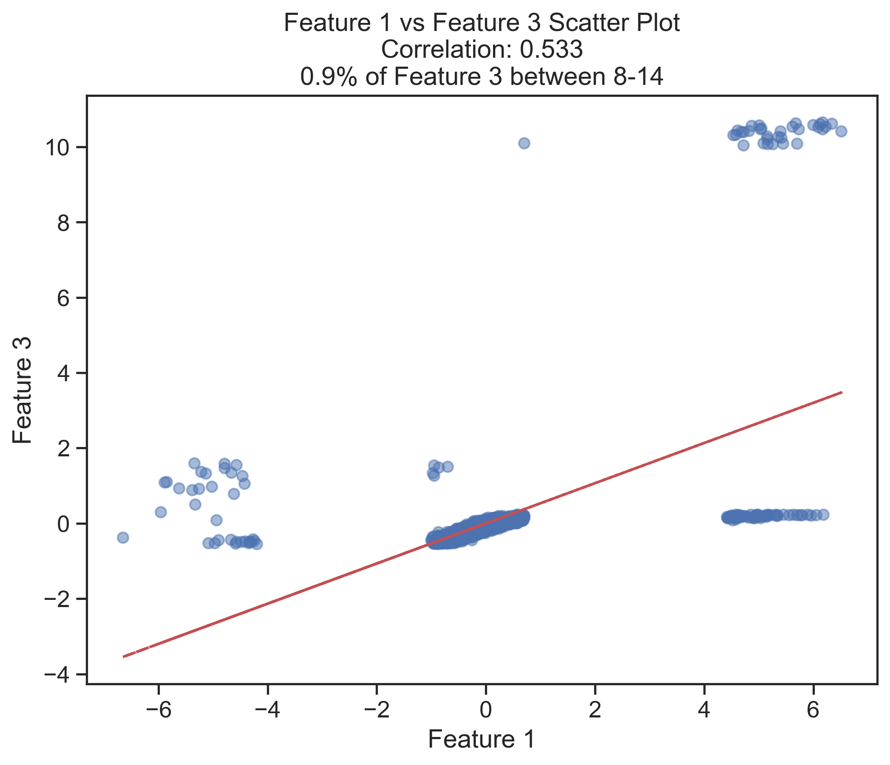
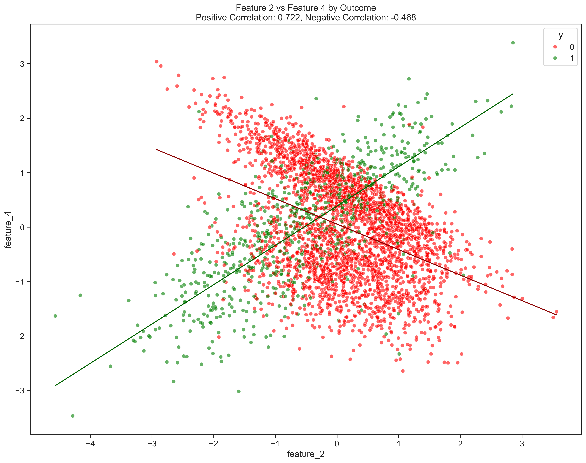

```python
import numpy as np 
import pandas as pd 
import os
import matplotlib.pyplot as plt

os.chdir("/Users/jacobrichards/Desktop/DS_DA_Projects/90+_DaysPastDue/90+DPD_files")

train = pd.read_csv("FITB_train.csv", na_values=["", "NA"])

test = pd.read_csv("FITB_test.csv", na_values=["", "NA"])

# Suppress warnings
import warnings
warnings.filterwarnings('ignore')
pd.options.mode.chained_assignment = None
```

remove upper and lower 1% of feature 3 for train but not test 


```python
lower_bound = train['feature_3'].quantile(0.01)
upper_bound = train['feature_3'].quantile(0.99)

train = train[(train['feature_3'] >= lower_bound) & (train['feature_3'] <= upper_bound)]
```

replace na with median value for both


```python
train_median = train['feature_3'].median()
train['feature_3'].fillna(train_median, inplace=True)

test_median = test['feature_3'].median()
test['feature_3'].fillna(test_median, inplace=True)
```

replace na of feature 2 with forward fill and backward fill 


```python
train['date'] = pd.to_datetime(train['date']).dt.year
test['date'] = pd.to_datetime(test['date']).dt.year

def impute_feature_2(df):
    df = df.sort_values(by=['id', 'date'])
    df['feature_2'] = df['feature_2'].fillna(method='ffill')
    df['feature_2'] = df['feature_2'].fillna(method='bfill')
    return df

train = train.groupby('id', group_keys=False).apply(impute_feature_2)
test = test.groupby('id', group_keys=False).apply(impute_feature_2)
```

replace y with 1 if 90+DPD and 0 if active 


```python
train['y'] = train['y'].apply(lambda x: 1 if x == "90+DPD" else 0 if x == "active" else x)
test['y'] = test['y'].apply(lambda x: 1 if x == "90+DPD" else 0 if x == "active" else x)
```

Standardize features


```python
from sklearn.preprocessing import StandardScaler
scaler = StandardScaler()
train[['feature_1', 'feature_2', 'feature_3', 'feature_4']] = scaler.fit_transform(train[['feature_1', 'feature_2', 'feature_3', 'feature_4']])
test[['feature_1', 'feature_2', 'feature_3', 'feature_4']] = scaler.transform(test[['feature_1', 'feature_2', 'feature_3', 'feature_4']])
```

Logistic Regression Model 

produce interaction terms (once significant interactions were found in the EDA)


```python
train['feature_1_x_feature_2'] = train['feature_1'] * train['feature_2']
test['feature_1_x_feature_2'] = test['feature_1'] * test['feature_2']
train['feature_1_x_feature_3'] = train['feature_1'] * train['feature_3']
test['feature_1_x_feature_3'] = test['feature_1'] * test['feature_3']
train['feature_2_x_feature_3'] = train['feature_2'] * train['feature_3']
test['feature_2_x_feature_3'] = test['feature_2'] * test['feature_3']
train['feature_2_x_feature_4'] = train['feature_2'] * train['feature_4']
test['feature_2_x_feature_4'] = test['feature_2'] * test['feature_4']
train['feature_3_x_feature_4'] = train['feature_3'] * train['feature_4']
test['feature_3_x_feature_4'] = test['feature_3'] * test['feature_4']
```

model with interaction terms 


```python
from sklearn.linear_model import LogisticRegression
X_train = train[['feature_1', 'feature_2', 'feature_3', 'feature_4',
                 'feature_1_x_feature_2', 'feature_1_x_feature_3',
                 'feature_2_x_feature_3', 'feature_2_x_feature_4',
                 'feature_3_x_feature_4']]
y_train = train['y']

model = LogisticRegression(fit_intercept=True)
model.fit(X_train, y_train);
```

ROC Curve 


```python
from sklearn.metrics import roc_curve, auc
import matplotlib.pyplot as plt

X_test = test[['feature_1', 'feature_2', 'feature_3', 'feature_4',
               'feature_1_x_feature_2', 'feature_1_x_feature_3',
               'feature_2_x_feature_3', 'feature_2_x_feature_4',
               'feature_3_x_feature_4']]
y_test = test['y']
y_pred_proba = model.predict_proba(X_test)[:,1]
fpr, tpr, _ = roc_curve(y_test, y_pred_proba)
roc_auc = auc(fpr, tpr)

plt.figure()
plt.plot(fpr, tpr, color='darkorange', lw=2, label=f'ROC curve (AUC = {roc_auc:.2f})')
plt.plot([0, 1], [0, 1], color='navy', lw=2, linestyle='--')
plt.xlim([0.0, 1.0])
plt.ylim([0.0, 1.05])
plt.xlabel('False Positive Rate')
plt.ylabel('True Positive Rate')
plt.title('ROC Curve on Test Data')
plt.legend(loc="lower right")
plt.show()
```


    

    


optimal threshold 


```python
fpr, tpr, thresholds = roc_curve(y_test, y_pred_proba)
fnr = 1 - tpr
optimal_idx = np.argmin(np.abs(fpr - fnr))
optimal_threshold = thresholds[optimal_idx]

print(f"Optimal threshold: {optimal_threshold:.3f}")
```

    Optimal threshold: 0.307


```python
from sklearn.metrics import confusion_matrix, recall_score

y_pred = (y_pred_proba >= optimal_threshold).astype(int)
conf_matrix = confusion_matrix(y_test, y_pred)
recall = recall_score(y_test, y_pred)

print("Confusion Matrix:")
print(conf_matrix)
print(f"\nRecall at optimal threshold: {recall:.3f}")
```

    Confusion Matrix:
    [[771  74]
     [ 19 195]]
    
    Recall at optimal threshold: 0.911


# EDA for features


```python
import seaborn as sns
import matplotlib.pyplot as plt

plt.rcParams['figure.dpi'] = 300
plt.rcParams['savefig.dpi'] = 300

features = ['feature_1', 'feature_2', 'feature_3', 'feature_4']
train['outcome'] = train['y'].map({1: 'Positive', 0: 'Negative'})

sns.set(style="ticks", font_scale=1.2)
plot = sns.pairplot(train[features + ['outcome']], 
                   hue='outcome',
                   palette={'Positive': 'green', 'Negative': 'red'},
                   plot_kws={'alpha': 0.6, 'linewidth': 0.5},
                   diag_kind='kde',
                   height=3)

plot.fig.suptitle('Feature Relationships by Outcome', y=1.02, size=16)
plt.tight_layout()
plt.show()
```


    

    


```python
plt.figure(figsize=(16,12))
sns.scatterplot(data=train, x='feature_2', y='feature_4', hue='outcome', 
                palette={'Positive': 'green', 'Negative': 'red'}, alpha=0.6)
plt.title('Feature 2 vs Feature 4 by Outcome')
plt.show()
```


    

    


```python
import numpy as np
import pandas as pd
import statsmodels.api as sm
import matplotlib.pyplot as plt

variables = ['feature_1', 'feature_2', 'feature_3', 'feature_4']

n_pairs = len(variables) * (len(variables) - 1) // 2
n_rows = (n_pairs + 1) // 2
fig, axes = plt.subplots(n_rows, 2, figsize=(15, 5*n_rows))
axes = axes.flatten()

significant_interactions = []
plot_idx = 0

for i, var1 in enumerate(variables):
    for j, var2 in enumerate(variables[i+1:], i+1):
        formula = f'y ~ {var1} * {var2}'
        model = sm.Logit.from_formula(formula, data=train).fit()
        
        interaction_pvalue = model.pvalues[f'{var1}:{var2}']
        
        if interaction_pvalue < 0.05:
            significant_interactions.append((var1, var2))
        
        var1_values = np.linspace(train[var1].min(), train[var1].max(), 100)
        var2_levels = np.percentile(train[var2], [25, 50, 75])
        
        for var2_level in var2_levels:
            df = pd.DataFrame({
                var1: var1_values,
                var2: var2_level
            })
            df['interaction'] = df[var1] * df[var2]
            df['predicted_prob'] = model.predict(sm.add_constant(df))
            
            axes[plot_idx].plot(df[var1], df['predicted_prob'], 
                              label=f'{var2}={var2_level:.1f}')
        
        axes[plot_idx].set_xlabel(var1)
        axes[plot_idx].set_ylabel('Predicted Probability y = 1')
        axes[plot_idx].legend()
        axes[plot_idx].set_title(f'Interaction: {var1} and {var2}\nInteraction p-value: {interaction_pvalue:.4f}')
        plot_idx += 1

for idx in range(plot_idx, len(axes)):
    fig.delaxes(axes[idx])

plt.tight_layout()
plt.show()

print("\nSignificant interactions (p < 0.05):")
for var1, var2 in significant_interactions:
    print(f"{var1} x {var2}")
```

    Optimization terminated successfully.
             Current function value: 0.277870
             Iterations 11
    Optimization terminated successfully.
             Current function value: 0.402580
             Iterations 18
    Optimization terminated successfully.
             Current function value: 0.458746
             Iterations 8
    Optimization terminated successfully.
             Current function value: 0.377064
             Iterations 10
    Optimization terminated successfully.
             Current function value: 0.365151
             Iterations 8
    Optimization terminated successfully.
             Current function value: 0.395740
             Iterations 9


    

    


    
    Significant interactions (p < 0.05):
    feature_1 x feature_2
    feature_1 x feature_3
    feature_1 x feature_4
    feature_2 x feature_3
    feature_2 x feature_4
    feature_3 x feature_4


```python
# Feature Correlation Matrix
correlation_matrix = train[['feature_1', 'feature_2', 'feature_3', 'feature_4']].corr()
plt.figure(figsize=(8, 6))
sns.heatmap(correlation_matrix, annot=True, cmap='coolwarm', center=0)
plt.title('Feature Correlation Matrix')
plt.show()
```


    

    


53% correlation between features 1 and 3. If you remove either feature 1 or 3 the model performance drops no matter how you try to configure interaction terms.

# Random Forest Model 


```python
from sklearn.ensemble import RandomForestClassifier
X_train = train[['feature_1', 'feature_2', 'feature_3', 'feature_4']]
y_train = train['y']
rf_model = RandomForestClassifier()
rf_model.fit(X_train, y_train);
```

RF ROC Curve 


```python
from sklearn.metrics import roc_auc_score
X_test = test[['feature_1', 'feature_2', 'feature_3', 'feature_4']]
y_test = test['y']

rf_pred_proba = rf_model.predict_proba(X_test)[:,1]

fpr, tpr, _ = roc_curve(y_test, rf_pred_proba)
auc_score = roc_auc_score(y_test, rf_pred_proba)

plt.figure()
plt.plot(fpr, tpr, label=f'AUC = {auc_score:.3f}')
plt.plot([0, 1], [0, 1], 'k--')
plt.xlabel('False Positive Rate')
plt.ylabel('True Positive Rate')
plt.title('ROC Curve - Random Forest')
plt.legend();
```


    

    


optimal threshold 


```python
fpr, tpr, thresholds = roc_curve(y_test, rf_pred_proba)
fnr = 1 - tpr
optimal_idx = np.argmin(np.abs(fpr - fnr))
optimal_threshold = thresholds[optimal_idx]

print(f"Optimal threshold: {optimal_threshold:.3f}")
```

    Optimal threshold: 0.210


recall at optimal threshold 


```python
y_pred = (rf_pred_proba >= optimal_threshold).astype(int)
conf_matrix = confusion_matrix(y_test, y_pred)
recall = recall_score(y_test, y_pred)

print("Confusion Matrix:")
print(conf_matrix)
print(f"\nRecall at optimal threshold: {recall:.3f}")
```

    Confusion Matrix:
    [[795  50]
     [ 13 201]]
    
    Recall at optimal threshold: 0.939

