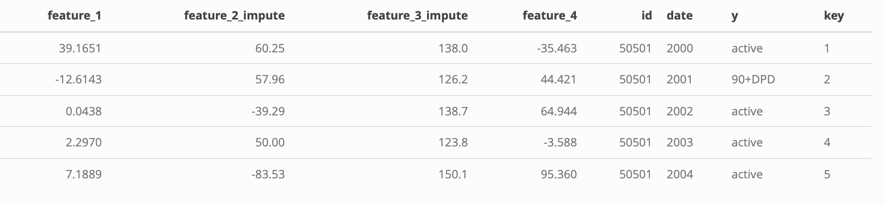
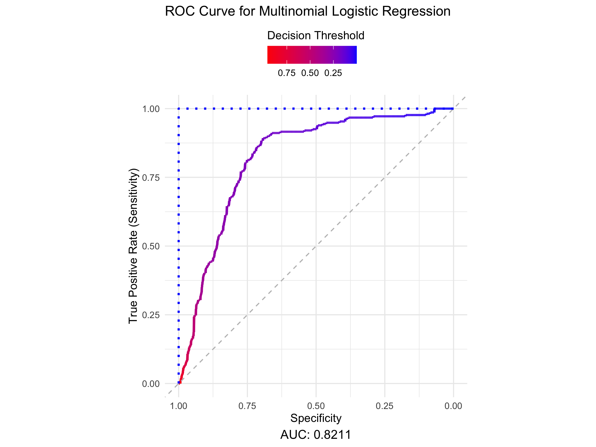
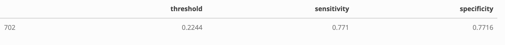

# Multivariable Logistic Binary Classifier - Delinquency Prediction

The panel data-set contains commercial customers’ financial information
and days past due indicator from 2000 to 2020. The goal is to build a
model to predict when customers will be 90+ days past due **(90+DPD)**
on payments.

## Prepare Training Data

``` r
setwd("~/Desktop/DS_DA_Projects/90+_DaysPastDue")

train <- read.csv(
  file = "/Users/jacobrichards/Desktop/DS_DA_Projects/90+_DaysPastDue/Data_Files/FITB_train.csv", 
  header = TRUE
)

test <- read.csv(
  file = "/Users/jacobrichards/Desktop/DS_DA_Projects/90+_DaysPastDue/Data_Files/FITB_test.csv", 
  header = TRUE
)
```

From checking the distribution of the data, you can see that the
distribution of feature 3 has many values in the extreme right tail.

``` r
library(ggplot2)

library(ggplot2)

ggplot(data = train) +
  geom_boxplot(aes(x = "feature_1", y = feature_1, fill = "feature_1"), color = "green", alpha = 0.5) +
  geom_boxplot(aes(x = "feature_2", y = feature_2, fill = "feature_2"), color = "red", alpha = 0.5) +
  geom_boxplot(aes(x = "feature_3", y = feature_3, fill = "feature_3"), color = "blue", alpha = 0.5) +
  geom_boxplot(aes(x = "feature_4", y = feature_4, fill = "feature_4"), color = "purple", alpha = 0.5) +
  theme_minimal() +
  xlab("Variables") +
  ylab("Values") +
  labs(fill = "Feature")
```

<div align="center">


</div>

Notice the substantial gap between the middle quartiles of Feature 3’s
distribution and its upper outliers. Such pronounced outliers could
significantly skew our model parameters, particularly because these
outliers are not balanced by a symmetric lower tail, as seen in
Feature 1. So we will remove them to produce a model which is
representative of the vast majority of our data. This is known as
**Winsorization**.

``` r
library(dplyr)

train$key <- row.names(train)

feature_3_winsor <- data.frame(
  feature_3 = train$feature_3, 
  key = row.names(train)
)

feature_3_winsor_clean <- na.omit(feature_3_winsor)

feature_3_winsor_clean <- feature_3_winsor_clean %>%
  mutate(
    z_score = (feature_3 - mean(feature_3)) / sd(feature_3),
    percentile = ecdf(feature_3)(feature_3) * 100
  )

feature_3_winsor_df <- feature_3_winsor_clean[
  !(feature_3_winsor_clean$percentile < 1 | feature_3_winsor_clean$percentile > 99), 
]

non_matching_keys <- anti_join(train, feature_3_winsor_df, by = "key")$key

train <- train %>% 
  mutate(feature_3 = ifelse(key %in% non_matching_keys, NA, feature_3))

colnames(train)[3] <- "feature_3_winsor"
```

We need to fill in the blanks from the outliers we just removed, so we
will replace them with the median of the non-outliers of feature 3.

``` r
train[is.na(train[, 3]), 3] <- median(feature_3_winsor_clean$feature_3)
colnames(train)[3] <- "feature_3_impute"

test[is.na(test[, 3]), 3] <- median(feature_3_winsor_clean$feature_3)
colnames(test)[3] <- "feature_3_impute"
```

Feature 2 contains missing values. For each missing value, we will fill
it with the corresponding value from the next year for the same ID. If
the next year’s value is also missing, we will use the previous year’s
value instead.

``` r
train$date <- format(as.Date(train$date, format = "%Y-%m-%d"), "%Y")

train <- train %>%
  arrange(id, date) %>% 
  group_by(id) %>%
  mutate(
    feature_2 = ifelse(is.na(feature_2),
                       lead(feature_2, order_by = date), # Try next year
                       feature_2)
  ) %>%
  mutate(
    feature_2 = ifelse(is.na(feature_2),
                       lag(feature_2, order_by = date), # Try previous year
                       feature_2)
  )

colnames(train)[2] <- "feature_2_impute"

test <- test %>%
  arrange(id, date) %>% 
  group_by(id) %>%
  mutate(
    feature_2 = ifelse(is.na(feature_2),
                       lead(feature_2, order_by = date), # Try next year
                       feature_2)
  ) %>%
  mutate(
    feature_2 = ifelse(is.na(feature_2),
                       lag(feature_2, order_by = date), # Try previous year
                       feature_2)
  )

colnames(test)[2] <- "feature_2_impute"

train <- na.omit(train)
test <- na.omit(test)

your_tibble <- head(train, 5)

library(knitr)
library(kableExtra)

kable(your_tibble, format = "html") %>%
  kable_styling(position = "center") %>%
  save_kable(
    file = "~/Desktop/DS_DA_Projects/90+_DaysPastDue/ReadMe_files/figure-gfm/t5.png", 
    zoom = 2
  )

knitr::include_graphics(
  "~/Desktop/DS_DA_Projects/90+_DaysPastDue/ReadMe_files/figure-gfm/t5.png"
)
```

<div align="center">



</div>

Our features represent various financial measurements, each quantified
in different units. To ensure uniform measurement across variables, we
can standardize them by replacing each value with its corresponding
z-score within the distribution of its respective variable.

``` r
library(dplyr)

train <- train %>%
  mutate(
    across(
      c(feature_1, feature_2_impute, feature_3_impute, feature_4), 
      ~ (.x - mean(.x, na.rm = TRUE)) / sd(.x, na.rm = TRUE)
    )
  )

colnames(train) <- c(
  "feature_1_standard", 
  "feature_2_standard", 
  "feature_3_standard", 
  "feature_4_standard", 
  "id", 
  "date", 
  "y", 
  "key"
)

test <- test %>%
  mutate(
    across(
      c(feature_1, feature_2_impute, feature_3_impute, feature_4), 
      ~ (.x - mean(.x, na.rm = TRUE)) / sd(.x, na.rm = TRUE)
    )
  )

colnames(test) <- c(
  "feature_1_standard", 
  "feature_2_standard", 
  "feature_3_standard", 
  "feature_4_standard", 
  "id", 
  "date", 
  "y"
)

ggplot() + 
  geom_density(data = train, aes(x = feature_3_standard), color = "blue") +
  geom_density(data = train, aes(x = feature_2_standard), color = "red") +
  geom_density(data = train, aes(x = feature_1_standard), color = "green") +
  geom_density(data = train, aes(x = feature_4_standard), color = "purple") +
  theme_minimal() +
  labs(x = "Standardized Features")
```

<div align="center">


</div>

The preparation of the training data is complete.

**Building the Model**

We are constructing a logistic regression model using Features 1 through
4 as continuous independent variables and Column Y as the binary
dependent variable (True/False).

With historical data on customers’ financial information and their
status regarding being 90+ days past due on payments, this model can
estimate the probability of a customer being 90+ days past due.

For a detailed explanation of logistic regression binary classifiers,
refer to this invaluable resource: [Binary Classification in
R](https://seantrott.github.io/binary_classification_R/).

When the model predicts the probability of an individual being 90+ days
past due (90+DPD), we must decide on a decision threshold—the minimum
predicted probability at which we conclude that the individual will be
90+DPD. The choice of this threshold significantly impacts the model’s
accuracy.

# **Fitting the Model**

**Decision Threshold:** This is the minimum predicted probability value
from the model at which we classify a customer as 90+DPD.

Since the actual outcomes (whether a customer was 90+DPD) are known in
our testing data, we can evaluate the model’s accuracy by:

    1.  Comparing the predicted outcomes to the actual outcomes in the testing data.

    2.  Assessing how the choice of the decision threshold affects the model’s accuracy.

The testing data is entirely distinct from the training data used to
produce the model, ensuring that the accuracy results on the testing
data provide a realistic estimate of how the model will perform on
future data.

The following analysis presents the accuracy results of the model’s
evaluation.

To asses the accuracy of the model and find the optimal decision
threshold we produce the ROC curve.

``` r
library(pROC)

test$predicted_y <- predict(delinquency_model, newdata = test, type = "class")
test$y_numeric <- as.numeric(as.character(factor(
  test$y, 
  levels = c("90+DPD", "active"), 
  labels = c(1, 0)
)))
test$Probability <- predict(delinquency_model, newdata = test, type = "probs")

options(digits = 4)

roc_curve <- roc(response = test$y_numeric, predictor = test$Probability)
roc_metrics <- coords(roc_curve, x = "all", ret = c("threshold", "sensitivity", "specificity"))
auc_value <- auc(roc_curve)

roc_data <- data.frame(
  TPR = roc_metrics$sensitivity,
  FPR = roc_metrics$specificity,
  Threshold = roc_metrics$threshold
)

ggplot(roc_data, aes(x = FPR, y = TPR, color = Threshold)) +
  geom_line(size = 1) +
  geom_abline(slope = 1, intercept = 1, linetype = "dashed", color = "gray") +  
  geom_line(
    data = data.frame(FPR = c(1, 1, 0), TPR = c(0, 1, 1)), 
    aes(x = FPR, y = TPR), 
    color = "blue", 
    size = 1, 
    linetype = "dotted"
  ) +
  labs(
    title = "ROC Curve for Multinomial Logistic Regression",
    x = "Specificity",
    y = "True Positive Rate (Sensitivity)",
    caption = paste("AUC:", round(auc_value, 4)),
    color = "Decision Threshold"
  ) +
  scale_color_gradient(
    low = "red",                      # Red corresponds to higher values
    high = "blue",                    # Blue corresponds to lower values
    trans = "reverse",                # Reverse the value mapping
    guide = guide_colorbar(
      direction = "horizontal",       # Make the legend horizontal
      title.position = "top"          # Place the title above the gradient
    )
  ) +
  coord_fixed() +
  scale_x_reverse() +  
  ylim(0, 1) +
  theme_minimal() +
  theme(
    legend.position = "top",          # Place legend at the top
    legend.justification = "center",  # Center-align the legend
    plot.caption = element_text(hjust = 0.5, size = 12)
  )
```

<div align="center">



</div>

#### The **ROC curve** (Receiver Operating Characteristic curve) visualizes the trade-off between the model’s **Sensitivity** (y-axis) and **1 - Specificity** (x-axis) across various decision thresholds. The thresholds are represented by a color gradient.

**Key Definitions**

    •   **Sensitivity (True Positive Rate):** The proportion of individuals who were 90+DPD that the model correctly predicted as being 90+DPD.

    •   **Specificity (True Negative Rate):** The proportion of individuals who were not 90+DPD that the model correctly predicted as not being 90+DPD.

#### **AUC (Area Under the Curve)**

The **AUC** quantifies overall model performance by aggregating accuracy
metrics across all decision thresholds.

    •   A perfect model would have an AUC of 1.0 (blue dotted line).

    •   A random model (e.g., predicting outcomes by flipping a coin) would have an AUC of 0.50 (grey diagonal line).

    •   **Our model’s AUC is 0.8211**, indicating strong performance.

**Example Decision Thresholds**

    **Threshold = 0.50 (Cyan Blue):**

    •   **Specificity \~94%:** The model correctly identifies most individuals who were not late on payments.

    •   **Sensitivity \~25%:** The model only identifies 25% of individuals who were late on payments.

    **Threshold = 0.10 (Pink-Red):**

    •   **Sensitivity \~94%:** The model correctly identifies nearly all individuals who were late on payments.

    •   **Specificity \~25%:** The model falsely predicts many non-late individuals as late.

#### **Interpretation**

The decision threshold represents a trade-off:

    •   **High Sensitivity:** Captures most late-payment cases but sacrifices accuracy in identifying non-late cases.

    •   **High Specificity:** Accurately predicts non-late cases but misses many late-payment cases.

The optimal threshold balances these goals, as shown visually in the ROC
plot. The selected threshold will depend on the priorities of the
analysis—whether it’s more critical to reduce false positives or false
negatives.

``` r
ggplot(roc_metrics, aes(x = threshold)) +
  geom_smooth(aes(y = sensitivity, color = "Sensitivity")) +
  geom_smooth(aes(y = specificity, color = "Specificity")) +
  labs(
    title = "Sensitivity and Specificity vs. Threshold",
    x = "Threshold", 
    y = "Metric Value"
  ) +
  scale_color_manual(
    name = "Metrics", 
    values = c("Sensitivity" = "red", "Specificity" = "blue")
  ) +
  theme_minimal()
```

<div align="center">


</div>

The balanced **decision threshold** is visually apparent by the
intersection of **Sensitivity** and **Specificity** and by the following
simple calculation.

``` r
optimal_threshold <- roc_metrics$threshold[which.min(abs(roc_metrics$sensitivity - roc_metrics$specificity))]

your_tibble <- roc_metrics[roc_metrics[, 1] == optimal_threshold, ]

library(knitr)
library(kableExtra)

kable(your_tibble, format = "html") %>%
  kable_styling(position = "center") %>%
  save_kable(
    file = "~/Desktop/DS_DA_Projects/90+_DaysPastDue/ReadMe_files/figure-gfm/t2.png", 
    zoom = 2
  )

knitr::include_graphics(
  "~/Desktop/DS_DA_Projects/90+_DaysPastDue/ReadMe_files/figure-gfm/t2.png"
)
```

<div align="center">



</div>

Confusion matrix displaying the results of balanced decision threshold
evaluated on the testing data.

``` r
test$predicted_class <- ifelse(
  test$Probability >= roc_metrics$threshold[which.min(abs(roc_metrics$sensitivity - roc_metrics$specificity))], 
  1, 
  0
)

library(caret)

conf_matrix <- confusionMatrix(
  factor(test$predicted_class, levels = c(0, 1)),
  factor(test$y_numeric, levels = c(0, 1))
)

confusion_table <- as.data.frame.matrix(conf_matrix$table)
rownames(confusion_table) <- c("Actual: Non-delinquent", "Actual: Delinquent")
colnames(confusion_table) <- c("Predicted: Non-delinquent", "Predicted: Delinquent")

library(kableExtra)
library(webshot2)

kable(confusion_table, format = "html") %>%
  kable_styling(position = "center") %>%
  save_kable(
    file = "~/Desktop/DS_DA_Projects/90+_DaysPastDue/ReadMe_files/figure-gfm/t3.png", 
    zoom = 2
  )

knitr::include_graphics(
  "~/Desktop/DS_DA_Projects/90+_DaysPastDue/ReadMe_files/figure-gfm/t3.png"
)
```

<div align="center">


</div>
