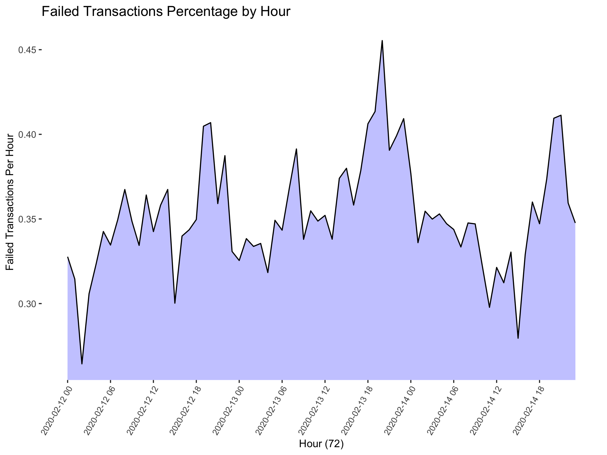
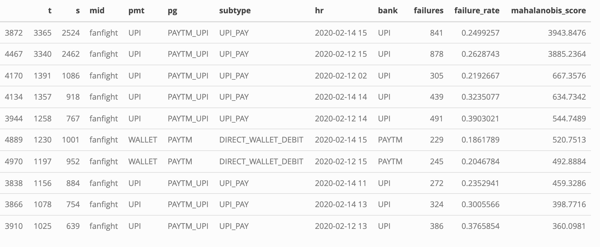
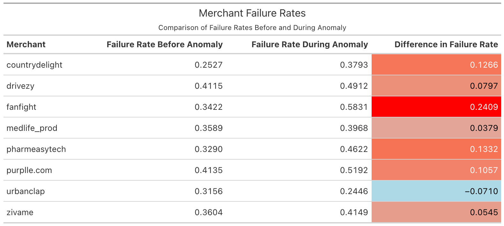
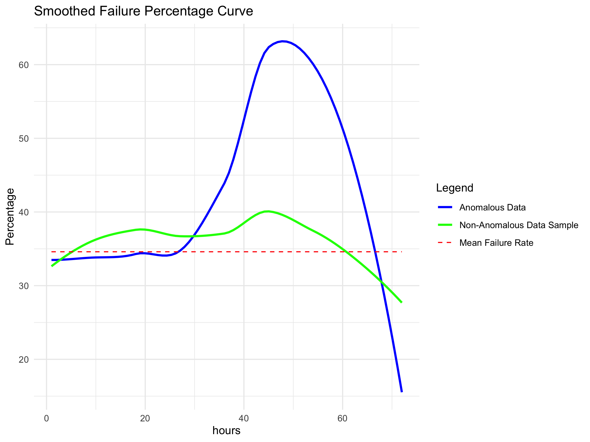
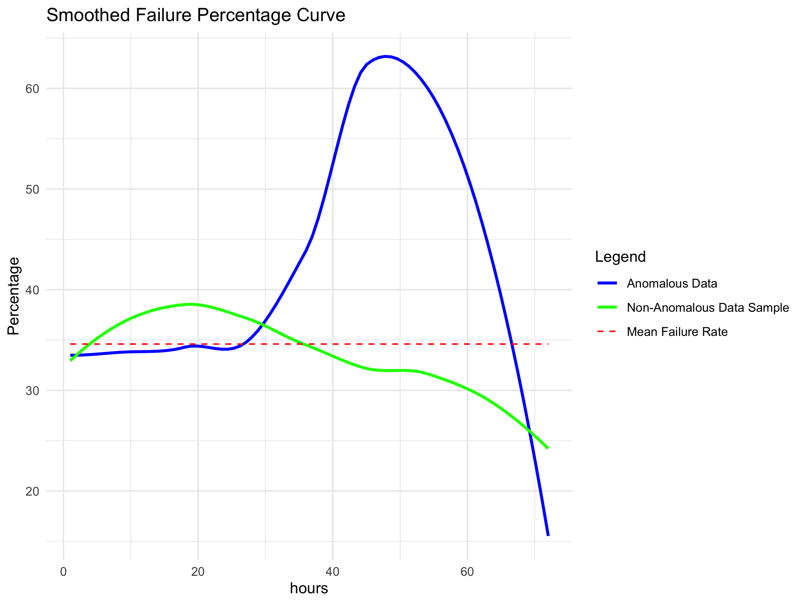

# Transaction Anomaly Detection

## Introduction

You work as a Data Scientist at a Payments processor company. On
February 14th 2020, you get calls from many merchants reporting that
they are seeing a spike in customer complaints and want you to check if
there are any issues.

## Data set

The data available to you is the transaction count and how many of which
were successful for each combination of categorical variables (Bank,
Payment Gateway, Merchant, Payment Method, etc..) for each hour within
the 72 hours from February 12th to 14th.

<div align="center">


</div>

## Initial Approach

We’re not sure what we’re looking for yet, so let’s plot the percentage
of failed transactions for each of the 72 hours within the entire data
set.

clean the data

``` r
library('ggplot2')

setwd("/Users/jacobrichards/Desktop/DS_DA_Projects/Anamoly_Detection")
transactions <- read.csv(file = "transactions.csv", na.strings = c("", "NA"))
transactions[is.na(transactions)] <- "notprovided"

data <- transactions
colnames(data) <- c("t", "s", "mid", "pmt", "pg", "subtype", "hr", "bank")
```

compute failure rate for each hour

``` r
unique_hours <- unique(data$hr)

t <- aggregate(data$t, by = list(data$hr), sum)
s <- aggregate(data$s, by = list(data$hr), sum)

f <- t[, 2] - s[, 2]
failure_rate <- f / t[, 2]
failure_count <- f

unique_hours <- sort(unique_hours)
```

plot failure rate for each hour

<div align="center">



</div>

So we do see a spike in transaction failure rates up to 45%
afternoon/overnight the day before we started receiving complaints.

Clearly there is a problem here, but we need to find precisely what
caused this so the problem can be addressed.

plotting total transaction failures for each hour

<div align="center">


</div>

This isn’t noteworthy, the failure counts are higher during the day
because that’s when customers are active.

To narrow down what caused our failure rate spike, we employ the
Mahalanobis distance method which is useful for the detection of
anomalies. Just as you can detect outliers in a variable of one
dimension by an unusually high or low z-score, you can detect outliers
in higher dimensional variables by it’s z-score within it’s higher
dimensional distribution.

The variables we will produce a distribution of will be failure
percentage and transaction count, such that observations of the data set
where both of these values are unusually high will be identified as
anomalies.

<div align="center">


</div>

Now that we have all of our variables prepared, we can form a
two-dimensional distribution from them to find which observations are
the greatest outliers.

Here is a plot of that distribution, as you can see the vast majority of
the data is concentrated in the back corner of the volume in that very
thin sliver.

The thin purple layer covering the rest of the x-y plane are where those
outlier are that we’re looking for.

To clarify, this is what a the 2-dimensional distribution of 10,000
samples for a standard Gaussian distribution looks like for comparison.

Evaluating the Mahalanobis method to find those outliers

``` r
features <- data[, c("t", "failure_rate")]

center <- colMeans(features)
cov_matrix <- cov(features)

mahalanobis_distances <- mahalanobis(features, center, cov_matrix)

data$mahalanobis_score <- mahalanobis_distances

data <- data[order(data$mahalanobis_score, decreasing = TRUE), ]
top_quartile <- quantile(data$mahalanobis_score, 0.999)
filtered_data <- data[data$mahalanobis_score >= top_quartile, ]
```

Table of the 10 observations found to have the greatest outlier score.

<div align="center">



</div>

Notice how the top 10 outliers all have a PAYTM service as the payment
gateway with only difference in the variable name being the addition of
the suffix \_UPI to PAYTM.

From that I deduced that the anomaly would be present in the PAYTM
payment gateways being PAYTM, PAYTM_V2, and PAYTM_UPI.

The failure rate of PAYTM services for the payment gateway, and the
other most common variables present in the top 10 anomalous observations
is as follows.

``` r
data <- before_anamoly_detection_data

first_subset <- data[
  (data[, 4] == c("UPI")) & 
  (data[, 5] %in% c("PAYTM", "PAYTM_V2", "PAYTM_UPI")) & 
  (data[, 6] == "UPI_PAY") & 
  (data[, 8] == "UPI"), 
]
```

<div align="center">


</div>

Unfortunately, the result is white noise. This is not the exact
problematic combination. Rather than checking each possible combination
of the variables we believe the anomaly to be contained within manually,
the following quick and dirty code will produce a failure rate plot for
all combinations of payment methods and sub-types with each of the PAYTM
payment gateways.

``` r
payment_methods <- unique(data[, 4]) # All payment methods
subtypes <- unique(data[, 6])        # All subtypes
filter_values <- c("PAYTM", "PAYTM_V2", "PAYTM_UPI") # all combinations of the previous variables with each of these

# Generate combinations for each filtered value
combinations <- expand.grid(
  Payment_Method = character(),
  Subtype = character(),
  PMT_Values = character(),
  stringsAsFactors = FALSE
)

subset_list <- list()

# Create subsets for each combination
for (pmt in payment_methods) {
  for (st in subtypes) {
    for (fv in filter_values) {
      subset_name <- paste(pmt, fv, st, sep = " | ")
      subset_data <- data[
        data[, 4] == pmt & 
        data[, 6] == st & 
        data[, 5] == fv, 
      ]
      subset_list[[subset_name]] <- subset_data
    }
  }
}
cat("number of combinations produced:",(length(subset_list)))
```

    ## number of combinations produced: 75

plotting the combinations for which there are corresponding transactions
within the data set for.

``` r
par(mfrow = c(3,3))

for (subset_name in names(subset_list)) {
  subset_data <- subset_list[[subset_name]]
  
  if (nrow(subset_data) > 0) { 
    t <- aggregate(subset_data$t, by = list(subset_data$hr), sum)
    s <- aggregate(subset_data$s, by = list(subset_data$hr), sum)
    f <- t[, 2] - s[, 2] 
    
    proportion <- f / t[, 2] * 100
    
    plot(
      x = seq(1, nrow(t), by = 1), 
      y = proportion, 
      main = paste("", subset_name),
      type = "l"
    )
    
    unique_pmt <- unique(subset_data[, 5])
    combinations <- rbind(
      combinations, 
      data.frame(
        Payment_Method = unique(subset_data[, 4]),
        Subtype = unique(subset_data[, 6]),
        PMT_Values = paste(unique_pmt, collapse = ", "),
        stringsAsFactors = FALSE
      )
    )
  }
}

par(mfrow = c(1, 1)) 
```

<div align="center">


</div>

of which only 8 of these combinations have any transactions to plot,
clearly what we’re looking for is the subset UPI \| PAYTM_V2 \|
UPI_COLLECT for payment method, payment gateway, and sub-type
respectively.

Better plot of the problematic subset of the data.

``` r
paytm_subset <- data[
  (data[, 5] %in% c("PAYTM_V2")) & 
  (data[, 6] %in% c("UPI_COLLECT")) & 
  (data[, 4] == "UPI"), 
]

unique_hours <- unique(data$hr)
unique_hours <- sort(unique_hours)

t <- aggregate(paytm_subset$t, by = list(paytm_subset$hr), sum)
s <- aggregate(paytm_subset$s, by = list(paytm_subset$hr), sum)
f <- t[, 2] - s[, 2]

proportion <- f / t[, 2] * 100

failed_transactions <- data.frame(
  hours = unique_hours, 
  failedTransactions = proportion, 
  x_index = seq(1, 72, by = 1)
)

ggplot(data = failed_transactions, aes(x = x_index, y = failedTransactions)) + 
  geom_area(fill = "blue", alpha = 0.25) + 
  geom_line(color = "black") + 
  scale_x_continuous(
    breaks = seq(1, 72, by = 6), 
    minor_breaks = 1:72, 
    labels = unique_hours[seq(1, length(unique_hours), by = 6)]
  ) + 
  coord_cartesian(ylim = range(failed_transactions$failedTransactions, na.rm = TRUE)) +  
  labs(
    title = "Failed Transactions Percentage by Hour", 
    x = "Hour (72)", 
    y = "Failed Transactions Per Hour"
  ) +
  theme(
    axis.text.x = element_text(angle = 60, hjust = 1, size = 8), 
    axis.title.x = element_text(size = 10),
    axis.title.y = element_text(size = 10), 
    plot.background = element_rect(fill = "white", color = NA),
    panel.background = element_rect(fill = "white", color = NA), 
    panel.grid.major.x = element_blank(),  
    panel.grid.minor.x = element_blank(), 
    panel.grid.major.y = element_blank(), 
    legend.position = "none"
  )
```

<div align="center">


</div>

The failure rate spike occurred from 5pm on the 13th to 6am on the 14th
the same day that merchants reported customer complaints, during which,
failure rates were at a minimum of 66% and a maximum of 85% for an
entire 13 hours.

Which merchants were impacted by this anomaly?

<div align="center">


</div>

In tabular form

<div align="center">



</div>

All of the merchants were effected except UrbanClap.

Now that we found the problem and who was impacted, we investigate
further with the following questions.

1.) Were there indicators that predicted this event so we can catch it
before it happens next time?

2.) If this could not have been predicted, how can we make sure we
detect it as soon as possible if it does happen again?

First, we separate the data that contains the anamoly from the normal
data and produce the following plots to compare the bias and variances
of the curves to the mean failure rate of the normal data across the
entire data set.

Then, to produce a fair comparison, we limit the sample size of the
normal data we plot to be equal to the sample size of the anomaly’s
data.

anomaly data:

``` r
paytm_subset <- data[
  (data[, 5] %in% c("PAYTM_V2")) & 
  (data[, 6] %in% c("UPI_COLLECT")) & 
  (data[, 4] == "UPI"), 
]

unique_hours <- unique(data$hr)
unique_hours <- sort(unique_hours)

t <- aggregate(paytm_subset$t, by = list(paytm_subset$hr), sum)
s <- aggregate(paytm_subset$s, by = list(paytm_subset$hr), sum)
f <- t[, 2] - s[, 2]

proportion_subset <- f / t[, 2] * 100

transactions_subset <- t
```

all normal data:

``` r
paytm_compliment <- data[!(rownames(data) %in% rownames(paytm_subset)), ]
t <- aggregate(paytm_compliment$t, by = list(paytm_compliment$hr), sum)
s <- aggregate(paytm_compliment$s, by = list(paytm_compliment$hr), sum)
f <- t[, 2] - s[, 2]

proportion_compliment <- f / t[, 2] * 100

transactions_compliment <- t
```

normal data but roughly equal number of transactions as the anomalous
subset selected at random:

``` r
paytm_compliment_sample <- paytm_compliment[sample(nrow(paytm_compliment), 1200), ]

t <- aggregate(paytm_compliment_sample$t, by = list(paytm_compliment_sample$hr), sum)

s <- aggregate(paytm_compliment_sample$s, by = list(paytm_compliment_sample$hr), sum)

f <- t[, 2] - s[, 2]

proportion_compliment_sample <- f / t[, 2] * 100
 
compliment_sample_sizes <- t
```

plot of the anomalous data and normal data of equal sample size to the
anomaly:

<div align="center">



</div>

In the hours before the anomaly occurs, the anomalous data has a better
fit to the mean failure rate of the normal data than the normal data of
equal sample size does.

<div align="center">



</div>

Plotting without a curve smoother, you can see that before the anomaly,
the variance of the normal data sample isn’t any better than the anomaly
data.

Confirming the result are the following, the first being a gif of the
distribution of the anomalous data over a shifting 18 hour window
displaying the mean shift.

As well, here is the density curve of the anomalous data and normal data
of equal sample size, notice how the anomalous data is synthetic by it’s
perfect distribution curve.

[Density Plot
Animation](ReadMe_files/figure-gfm/density_animation_high_quality.gif)

<div align="center">


</div>

What all of these plots indicate is that the anomalous data before the
anomaly event was no different than the rest of the data, that something
happened outside of the data set to cause the spike in failure rate.
This is evident in the density curve of the anomaly, containing a second
node displaying the failure rate during the anomaly as it’s own district
distribution.

So now that we know that this failure rate event could not had been
predicted. How can we monitor the data to see an event occurring before
any of out clients do.

The following is a interactive dashboard displaying the failure rates
and transaction volume of each combination of categories within the data
set. These visualizations upon your inspection will clearly reveal the
normal and abnormal patterns in the data which we have discovered.

**Right click to open in a new tab.**

[shiny dashboard of failure rate and
transaction](https://jacob-j-richards.shinyapps.io/shiny/ "open in a new tab")
