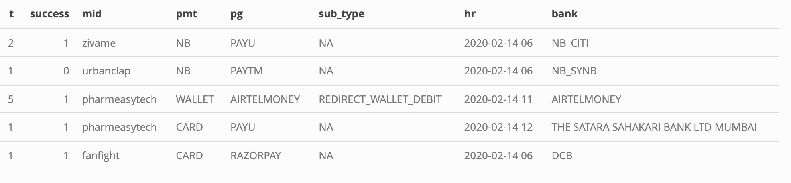
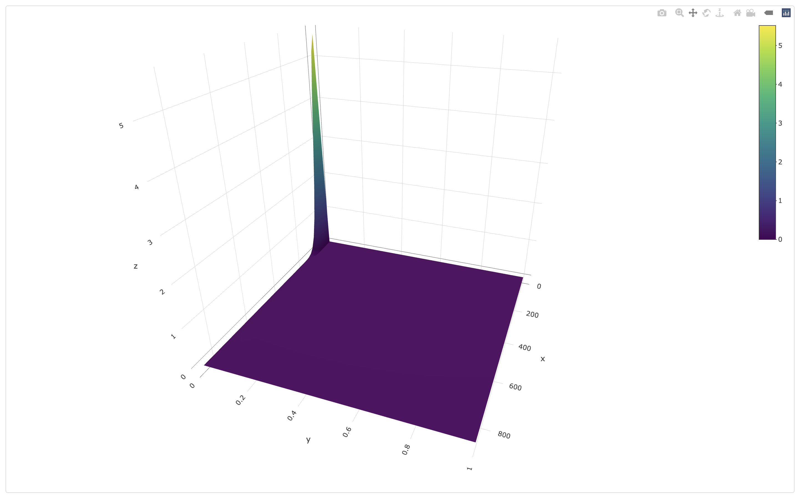
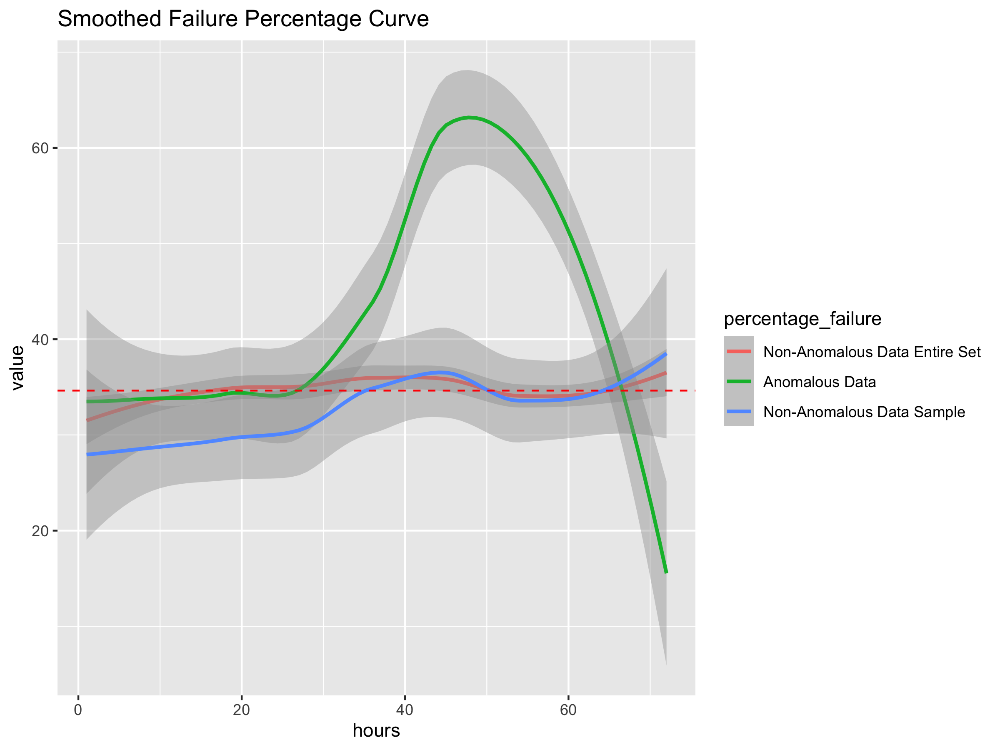

# Transaction Anomaly Detection

## Introduction

You work as a Data Scientist at a Payments processor company. On
February 14th 2020, you get calls from many merchants reporting that
they are seeing a spike in customer complaints and want you to check if
there are any issues.

## Data set

The data available to you is the transaction count and how many of which
were successful for each combination of categorical variables (Bank,
Payment Gateway, Merchant, Payment Method, etc..) for each hour within
the 72 hours from February 12th to 14th.

``` r
setwd("/Users/jacobrichards/Desktop/DS_DA_Projects/Anamoly_Detection")
transactions <- read.csv(file = "transactions.csv", na.strings = c("", "NA"))

library(knitr)
library(kableExtra)

your_tibble <- head(transactions, 5)

kable(your_tibble, format = "html") %>%
  kable_styling(position = "center") %>% 
  save_kable(
    file = "~/Desktop/DS_DA_Projects/Anamoly_Detection/ReadMe_files/figure-gfm/AD_1.png", 
    zoom = 2
  )

knitr::include_graphics(
  "~/Desktop/DS_DA_Projects/Anamoly_Detection/ReadMe_files/figure-gfm/AD_1.png"
)
```

<div align="center">



</div>

## Initial Approach

We’re not sure what we’re looking for yet, so let’s plot the percentage
of failed transactions for each of the 72 hours within the entire data
set.

###### clean the data

``` r
library('ggplot2')

setwd("/Users/jacobrichards/Desktop/DS_DA_Projects/Anamoly_Detection")
transactions <- read.csv(file = "transactions.csv", na.strings = c("", "NA"))
transactions[is.na(transactions)] <- "notprovided"

data <- transactions
colnames(data) <- c("t", "s", "mid", "pmt", "pg", "subtype", "hr", "bank")
```

###### compute failure rate for each hour

``` r
unique_hours <- unique(data$hr)

t <- aggregate(data$t, by = list(data$hr), sum)
s <- aggregate(data$s, by = list(data$hr), sum)

f <- t[, 2] - s[, 2]
failure_rate <- f / t[, 2]
failure_count <- f

unique_hours <- sort(unique_hours)
```

###### plot failure rate for each hour

``` r
failed_transactions_rate <- data.frame(
  hours = unique_hours, 
  failedTransactions = failure_rate, 
  x_index = seq(1, 72, by = 1)
)

ggplot(data = failed_transactions_rate, aes(x = x_index, y = failedTransactions)) + 
  geom_area(fill = "blue", alpha = 0.25) + 
  geom_line(color = "black") +  
  scale_x_continuous(
    breaks = seq(1, 72, by = 6), 
    minor_breaks = 1:72, 
    labels = unique_hours[seq(1, length(unique_hours), by = 6)]
  ) + 
  coord_cartesian(ylim = range(failed_transactions_rate$failedTransactions, na.rm = TRUE)) +  
  labs(
    title = "Failed Transactions Percentage by Hour", 
    x = "Hour (72)", 
    y = "Failed Transactions Per Hour"
  ) +
  theme(
    axis.text.x = element_text(angle = 60, hjust = 1, size = 8), 
    axis.title.x = element_text(size = 10), 
    axis.title.y = element_text(size = 10),
    plot.background = element_rect(fill = "white", color = NA),
    panel.background = element_rect(fill = "white", color = NA),
    panel.grid.major.x = element_blank(), 
    panel.grid.minor.x = element_blank(), 
    panel.grid.major.y = element_blank(), 
    legend.position = "none"
  )
```

<div align="center">


</div>

So we do see a spike in transaction failure rates up to 45%
afternoon/overnight the day before we started receiving complaints.

Clearly there is a problem here, but we need to find precisely what
caused this so the problem can be addressed.

###### plotting total transaction failures for each hour

``` r
failed_transactions <- data.frame(
  hours = unique_hours, 
  failedTransactions = failure_count, 
  x_index = seq(1, 72, by = 1)
)

ggplot(data = failed_transactions, aes(x = x_index, y = failedTransactions)) + 
  geom_area(fill = "blue", alpha = 0.25) + 
  geom_line(color = "black") +  
  scale_x_continuous(
    breaks = seq(1, 72, by = 6), 
    minor_breaks = 1:72, 
    labels = unique_hours[seq(1, length(unique_hours), by = 6)]
  ) + 
  coord_cartesian(ylim = range(failed_transactions$failedTransactions, na.rm = TRUE)) +  
  labs(
    title = "Failed Transactions Counts by Hour", 
    x = "Hour (72)", 
    y = "Failed Transactions Per Hour"
  ) +
  theme(
    axis.text.x = element_text(angle = 60, hjust = 1, size = 8), 
    axis.title.x = element_text(size = 10), 
    axis.title.y = element_text(size = 10),
    plot.background = element_rect(fill = "white", color = NA),
    panel.background = element_rect(fill = "white", color = NA),
    panel.grid.major.x = element_blank(), 
    panel.grid.minor.x = element_blank(), 
    panel.grid.major.y = element_blank(), 
    legend.position = "none"
  )
```

<div align="center">


</div>

This isn’t noteworthy, the failure counts are higher during the day
because that’s when customers are active.

To narrow down what caused our failure rate spike, we employ the
Mahalanobis distance method which is useful for the detection of
anomalies. Just as you can detect outliers in a variable of one
dimension by an unusually high or low z-score, you can detect outliers
in higher dimensional variables by it’s z-score within it’s higher
dimensional distribution.

The variables we will produce a distribution of will be failure
percentage and transaction count.

``` r
before_anamoly_detection_data <- data

data$failures <- data[, 1] - data[, 2]
data$failure_rate <- (data[, 1] - data[, 2]) / data[, 1]

kable(head(data, 3), format = "html") %>%
  kable_styling(position = "center") %>% 
  save_kable(
    file = "~/Desktop/DS_DA_Projects/Anamoly_Detection/ReadMe_files/figure-gfm/appended_1.png", 
    zoom = 2
  )

knitr::include_graphics(
  "~/Desktop/DS_DA_Projects/Anamoly_Detection/ReadMe_files/figure-gfm/appended_1.png"
)
```

<div align="center">


</div>

Now that we have all of our variables prepared, we can form a higher
dimensional distribution from them to find which observations are the
greatest outliers.

Here is a plot of that distribution, as you can see the vast majority is
concentrated in the back corner of the volume.

``` r
distribution <- data.frame(failures = data$failures,rate = data$failure_rate )

library(plotly)
library(MASS)

kde <- kde2d(data$failures, data$failure_rate, n = 50)

  plot_ly(
    x = kde$x,
    y = kde$y,
    z = kde$z,
    type = "surface"
  )
```

``` r
knitr::include_graphics(
  "/Users/jacobrichards/Desktop/DS_DA_Projects/Anamoly_Detection/ReadMe_files/figure-gfm/3Ddistribution.png"
)
```

<div align="center">



</div>

Evaluating the Mahalanobis method to find those outliers

``` r
features <- data[, c("t", "failure_rate")]

center <- colMeans(features)
cov_matrix <- cov(features)

mahalanobis_distances <- mahalanobis(features, center, cov_matrix)

data$mahalanobis_score <- mahalanobis_distances

data <- data[order(data$mahalanobis_score, decreasing = TRUE), ]
top_quartile <- quantile(data$mahalanobis_score, 0.999)
filtered_data <- data[data$mahalanobis_score >= top_quartile, ]
```

Table of the 10 observations found to have the greatest outlier score.

``` r
your_tibble <- head(filtered_data, 10)

kable(your_tibble, format = "html") %>%
  kable_styling(position = "center") %>% 
  save_kable(
    file = "~/Desktop/DS_DA_Projects/Anamoly_Detection/ReadMe_files/figure-gfm/mscoreog.png", 
    zoom = 2
  )

knitr::include_graphics(
  "~/Desktop/DS_DA_Projects/Anamoly_Detection/ReadMe_files/figure-gfm/mscoreog.png"
)
```

<div align="center">


</div>

Notice how the top 10 outliers all have a PAYTM service as the payment
gateway with only difference in the variable name being the addition of
the suffix \_UPI to PAYTM. From that I deduced that the anomaly would be
present in the PAYTM payment gateways being PAYTM, PAYTM_V2, and
PAYTM_UPI. The most common combination of the remaining variables of
these top 10 observations is UPI for pmt, UPI_PAY for subtype, and UPI
for bank.

The combination of PAYTM services for the payment gateway, combined with
UPI for pmt, UPI_PAY for subtype, and UPI for bank may be responsible
for payment failures as deduced from the outliers.

Plotting the failure rates over the entire 72 hours of observations for
which this combination of variables is present.

``` r
data <- before_anamoly_detection_data

first_subset <- data[
  (data[, 4] %in% c("UPI")) & 
  (data[, 5] %in% c("PAYTM", "PAYTM_V2", "PAYTM_UPI")) & 
  (data[, 6] == "UPI_PAY") & 
  (data[, 8] == "UPI"), 
]

unique_hours <- unique(data$hr)
unique_hours <- sort(unique_hours)

t <- aggregate(first_subset$t, by = list(first_subset$hr), sum)
s <- aggregate(first_subset$s, by = list(first_subset$hr), sum)
f <- t[, 2] - s[, 2]

proportion <- f / t[, 2] * 100

failed_transactions <- data.frame(
  hours = unique_hours, 
  failedTransactions = proportion, 
  x_index = seq(1, 72, by = 1)
)

ggplot(data = failed_transactions, aes(x = x_index, y = failedTransactions)) + 
  geom_area(fill = "blue", alpha = 0.25) + 
  geom_line(color = "black") + 
  scale_x_continuous(
    breaks = seq(1, 72, by = 6), 
    minor_breaks = 1:72, 
    labels = unique_hours[seq(1, length(unique_hours), by = 6)]
  ) + 
  coord_cartesian(ylim = range(failed_transactions$failedTransactions, na.rm = TRUE)) +  
  labs(
    title = "Failed Transactions Percentage by Hour", 
    x = "Hour (72)", 
    y = "Failed Transactions Per Hour"
  ) +
  theme(
    axis.text.x = element_text(angle = 60, hjust = 1, size = 8), 
    axis.title.x = element_text(size = 10),
    axis.title.y = element_text(size = 10), 
    plot.background = element_rect(fill = "white", color = NA),
    panel.background = element_rect(fill = "white", color = NA), 
    panel.grid.major.x = element_blank(),  
    panel.grid.minor.x = element_blank(), 
    panel.grid.major.y = element_blank(), 
    legend.position = "none"
  )
```

<div align="center">


</div>

Unfortunately, the result is white noise. This is not the exact
problematic combination.

Assuming that the PAYTM payment gateways (PAYTM, PAYTM_V2, and
PAYTM_UPI) are part of the problem what we can do is plot the failure
rates of the observations which contain all possible combinations of the
remaining variables (payment method, subtype) with each of the PAYTM
payment gateways (PAYTM or PAYTM_V2 or PAYTM_UPI).

We will omit any combinations including the variable bank as it has over
300 different values within the data set.

``` r
payment_methods <- unique(data[, 4])
subtypes <- unique(data[, 6])
filter_values <- c("PAYTM", "PAYTM_V2", "PAYTM_UPI")
subset_list <- list()

for (pm in payment_methods) {
  for (st in subtypes) {
    subset_name <- paste(pm, st, sep = "_")
    subset_list[[subset_name]] <- data[(data[, 4] == pm) & 
                                       (data[, 6] == st) & 
                                       (data[, 5] %in% filter_values), ]
  }
}

combinations <- data.frame(
  Payment_Method = character(),
  Subtype = character(),
  PMT_Values = character(),
  stringsAsFactors = FALSE
)

par(mfrow = c(3,3))

for (subset_name in names(subset_list)) {
  subset_data <- subset_list[[subset_name]]
  
  if (nrow(subset_data) > 0) { 
    
    t <- aggregate(subset_data$t, by = list(subset_data$hr), sum)
    s <- aggregate(subset_data$s, by = list(subset_data$hr), sum)
    f <- t[, 2] - s[, 2] 
    
    proportion <- f / t[, 2] * 100
    
    plot(
      x = seq(1, nrow(t), by = 1), 
      y = proportion, 
      main = paste("Plot for", subset_name), 
      xlab = "Time (hr)", 
      ylab = "Proportion (%)",
      type = "l"
    )
    
    unique_pmt <- unique(subset_data[, 5])
    combinations <- rbind(combinations, data.frame(
      Payment_Method = unique(subset_data[, 4]),
      Subtype = unique(subset_data[, 6]),
      PMT_Values = paste(unique_pmt, collapse = ", ")
    ))
  }
}

par(mfrow = c(1, 1)) 
```

<div align="center">


</div>

``` r
print(combinations)
```

    ##   Payment_Method               Subtype          PMT_Values
    ## 1             NB           notprovided               PAYTM
    ## 2         WALLET           notprovided               PAYTM
    ## 3         WALLET REDIRECT_WALLET_DEBIT               PAYTM
    ## 4         WALLET   DIRECT_WALLET_DEBIT               PAYTM
    ## 5           CARD           notprovided               PAYTM
    ## 6            UPI           UPI_COLLECT            PAYTM_V2
    ## 7            UPI               UPI_PAY PAYTM_V2, PAYTM_UPI

The plot of UPI for payment method and UPI_COLLECT for subtype reveals
that this is the combination of variables within the PAYTM payment
gateways that is casing customer complaints.

Better plot of the problematic subset of the data.

``` r
paytm_subset <- data[
  (data[, 5] %in% c("PAYTM", "PAYTM_V2", "PAYTM_UPI")) & 
  (data[, 6] %in% c("UPI_COLLECT")) & 
  (data[, 4] == "UPI"), 
]

unique_hours <- unique(data$hr)
unique_hours <- sort(unique_hours)

t <- aggregate(paytm_subset$t, by = list(paytm_subset$hr), sum)
s <- aggregate(paytm_subset$s, by = list(paytm_subset$hr), sum)
f <- t[, 2] - s[, 2]

proportion <- f / t[, 2] * 100

failed_transactions <- data.frame(
  hours = unique_hours, 
  failedTransactions = proportion, 
  x_index = seq(1, 72, by = 1)
)

ggplot(data = failed_transactions, aes(x = x_index, y = failedTransactions)) + 
  geom_area(fill = "blue", alpha = 0.25) + 
  geom_line(color = "black") + 
  scale_x_continuous(
    breaks = seq(1, 72, by = 6), 
    minor_breaks = 1:72, 
    labels = unique_hours[seq(1, length(unique_hours), by = 6)]
  ) + 
  coord_cartesian(ylim = range(failed_transactions$failedTransactions, na.rm = TRUE)) +  
  labs(
    title = "Failed Transactions Percentage by Hour", 
    x = "Hour (72)", 
    y = "Failed Transactions Per Hour"
  ) +
  theme(
    axis.text.x = element_text(angle = 60, hjust = 1, size = 8), 
    axis.title.x = element_text(size = 10),
    axis.title.y = element_text(size = 10), 
    plot.background = element_rect(fill = "white", color = NA),
    panel.background = element_rect(fill = "white", color = NA), 
    panel.grid.major.x = element_blank(),  
    panel.grid.minor.x = element_blank(), 
    panel.grid.major.y = element_blank(), 
    legend.position = "none"
  )
```

<div align="center">


</div>

The failure rate spike occurred from 5pm on the 13th to 6am on the 14th
the same day that merchants reported customer complaints.

Which merchants were impacted by this anomaly?

``` r
paytm_subset <- data[(data[, 5] %in% c("PAYTM", "PAYTM_V2", "PAYTM_UPI", "notprovided")) & 
                     (data[, 6] %in% c("UPI_COLLECT")) & 
                     (data[, 4] == "UPI"), ]

paytm_subset$failure_sum <- paytm_subset[, 1] - paytm_subset[, 2]
paytm_subset
```

    ##        t  s            mid pmt          pg     subtype            hr bank
    ## 323    1  0  pharmeasytech UPI notprovided UPI_COLLECT 2020-02-12 09 Zeta
    ## 3837  34 25   medlife_prod UPI    PAYTM_V2 UPI_COLLECT 2020-02-14 11  UPI
    ## 3840  35  7 countrydelight UPI    PAYTM_V2 UPI_COLLECT 2020-02-14 07  UPI
    ## 3843  49 26        drivezy UPI    PAYTM_V2 UPI_COLLECT 2020-02-14 12  UPI
    ## 3844  28 14       fanfight UPI    PAYTM_V2 UPI_COLLECT 2020-02-14 11  UPI
    ## 3846  19 12   medlife_prod UPI    PAYTM_V2 UPI_COLLECT 2020-02-14 09  UPI
    ## 3848  46  9   medlife_prod UPI    PAYTM_V2 UPI_COLLECT 2020-02-14 05  UPI
    ## 3850  44 25         zivame UPI    PAYTM_V2 UPI_COLLECT 2020-02-14 12  UPI
    ## 3852  29 22      urbanclap UPI    PAYTM_V2 UPI_COLLECT 2020-02-14 07  UPI
    ## 3853  12  6    purplle.com UPI    PAYTM_V2 UPI_COLLECT 2020-02-14 09  UPI
    ## 3854  34  7   medlife_prod UPI    PAYTM_V2 UPI_COLLECT 2020-02-14 02  UPI
    ## 3855  35  7       fanfight UPI    PAYTM_V2 UPI_COLLECT 2020-02-14 05  UPI
    ## 3856  35  1  pharmeasytech UPI    PAYTM_V2 UPI_COLLECT 2020-02-14 04  UPI
    ## 3857  21  4    purplle.com UPI    PAYTM_V2 UPI_COLLECT 2020-02-14 03  UPI
    ## 3858  47 30         zivame UPI    PAYTM_V2 UPI_COLLECT 2020-02-14 08  UPI
    ## 3859  23 16  pharmeasytech UPI    PAYTM_V2 UPI_COLLECT 2020-02-14 12  UPI
    ## 3860  43  8        drivezy UPI    PAYTM_V2 UPI_COLLECT 2020-02-14 03  UPI
    ## 3861  26 10 countrydelight UPI    PAYTM_V2 UPI_COLLECT 2020-02-14 08  UPI
    ## 3862  34  6    purplle.com UPI    PAYTM_V2 UPI_COLLECT 2020-02-14 06  UPI
    ## 3863  24 13         zivame UPI    PAYTM_V2 UPI_COLLECT 2020-02-14 02  UPI
    ## 3864  45 38      urbanclap UPI    PAYTM_V2 UPI_COLLECT 2020-02-14 04  UPI
    ## 3865  48  9 countrydelight UPI    PAYTM_V2 UPI_COLLECT 2020-02-14 05  UPI
    ## 3867  14 12 countrydelight UPI    PAYTM_V2 UPI_COLLECT 2020-02-14 09  UPI
    ## 3868  25 19   medlife_prod UPI    PAYTM_V2 UPI_COLLECT 2020-02-14 12  UPI
    ## 3869  27  5        drivezy UPI    PAYTM_V2 UPI_COLLECT 2020-02-14 02  UPI
    ## 3870  23  5 countrydelight UPI    PAYTM_V2 UPI_COLLECT 2020-02-14 01  UPI
    ## 3874  44 22         zivame UPI    PAYTM_V2 UPI_COLLECT 2020-02-14 10  UPI
    ## 3875  78 44         zivame UPI    PAYTM_V2 UPI_COLLECT 2020-02-14 17  UPI
    ## 3876  33  6        drivezy UPI    PAYTM_V2 UPI_COLLECT 2020-02-14 04  UPI
    ## 3878   2  0    purplle.com UPI    PAYTM_V2 UPI_COLLECT 2020-02-14 00  UPI
    ## 3879  23 10    purplle.com UPI    PAYTM_V2 UPI_COLLECT 2020-02-14 13  UPI
    ## 3880  12  9      urbanclap UPI    PAYTM_V2 UPI_COLLECT 2020-02-14 19  UPI
    ## 3883  21 12    purplle.com UPI    PAYTM_V2 UPI_COLLECT 2020-02-14 14  UPI
    ## 3886  24 14         zivame UPI    PAYTM_V2 UPI_COLLECT 2020-02-14 19  UPI
    ## 3887  38 18       fanfight UPI    PAYTM_V2 UPI_COLLECT 2020-02-14 14  UPI
    ## 3888  55 38         zivame UPI    PAYTM_V2 UPI_COLLECT 2020-02-14 16  UPI
    ## 3891  20 16      urbanclap UPI    PAYTM_V2 UPI_COLLECT 2020-02-14 17  UPI
    ## 3892   2  2      urbanclap UPI    PAYTM_V2 UPI_COLLECT 2020-02-14 21  UPI
    ## 3893   2  2         zivame UPI    PAYTM_V2 UPI_COLLECT 2020-02-14 23  UPI
    ## 3894   5  5  pharmeasytech UPI    PAYTM_V2 UPI_COLLECT 2020-02-14 21  UPI
    ## 3895  32 23       fanfight UPI    PAYTM_V2 UPI_COLLECT 2020-02-14 13  UPI
    ## 3896  28 20 countrydelight UPI    PAYTM_V2 UPI_COLLECT 2020-02-14 15  UPI
    ## 3897  40 25        drivezy UPI    PAYTM_V2 UPI_COLLECT 2020-02-14 16  UPI
    ## 3898  21 19   medlife_prod UPI    PAYTM_V2 UPI_COLLECT 2020-02-14 16  UPI
    ## 3899  15  7   medlife_prod UPI    PAYTM_V2 UPI_COLLECT 2020-02-14 17  UPI
    ## 3900  21 18 countrydelight UPI    PAYTM_V2 UPI_COLLECT 2020-02-14 13  UPI
    ## 3902  11  2       fanfight UPI    PAYTM_V2 UPI_COLLECT 2020-02-14 04  UPI
    ## 3903  12  6       fanfight UPI    PAYTM_V2 UPI_COLLECT 2020-02-14 10  UPI
    ## 3904   6  5 countrydelight UPI    PAYTM_V2 UPI_COLLECT 2020-02-14 19  UPI
    ## 3905  20 12    purplle.com UPI    PAYTM_V2 UPI_COLLECT 2020-02-14 18  UPI
    ## 3906  18 13       fanfight UPI    PAYTM_V2 UPI_COLLECT 2020-02-14 19  UPI
    ## 3907  51 33        drivezy UPI    PAYTM_V2 UPI_COLLECT 2020-02-12 06  UPI
    ## 3909  33 19         zivame UPI    PAYTM_V2 UPI_COLLECT 2020-02-12 07  UPI
    ## 3917  28 21      urbanclap UPI    PAYTM_V2 UPI_COLLECT 2020-02-12 10  UPI
    ## 3919  24 12         zivame UPI    PAYTM_V2 UPI_COLLECT 2020-02-12 04  UPI
    ## 3920  16  8    purplle.com UPI    PAYTM_V2 UPI_COLLECT 2020-02-12 11  UPI
    ## 3924  25  7       fanfight UPI    PAYTM_V2 UPI_COLLECT 2020-02-12 10  UPI
    ## 3925  53 32   medlife_prod UPI    PAYTM_V2 UPI_COLLECT 2020-02-12 07  UPI
    ## 3927  27 16        drivezy UPI    PAYTM_V2 UPI_COLLECT 2020-02-12 11  UPI
    ## 3928  17  8       fanfight UPI    PAYTM_V2 UPI_COLLECT 2020-02-12 08  UPI
    ## 3929  29 25   medlife_prod UPI    PAYTM_V2 UPI_COLLECT 2020-02-12 09  UPI
    ## 3930  20  7       fanfight UPI    PAYTM_V2 UPI_COLLECT 2020-02-12 03  UPI
    ## 3931  41 29 countrydelight UPI    PAYTM_V2 UPI_COLLECT 2020-02-12 09  UPI
    ## 3932  11  9         zivame UPI    PAYTM_V2 UPI_COLLECT 2020-02-12 02  UPI
    ## 3934  19 12  pharmeasytech UPI    PAYTM_V2 UPI_COLLECT 2020-02-12 12  UPI
    ## 3936  33 19        drivezy UPI    PAYTM_V2 UPI_COLLECT 2020-02-12 10  UPI
    ## 3937  25  8       fanfight UPI    PAYTM_V2 UPI_COLLECT 2020-02-12 09  UPI
    ## 3938  25 17         zivame UPI    PAYTM_V2 UPI_COLLECT 2020-02-12 06  UPI
    ## 3939  39 27 countrydelight UPI    PAYTM_V2 UPI_COLLECT 2020-02-12 05  UPI
    ## 3940  36 26      urbanclap UPI    PAYTM_V2 UPI_COLLECT 2020-02-12 04  UPI
    ## 3941  35 21        drivezy UPI    PAYTM_V2 UPI_COLLECT 2020-02-12 05  UPI
    ## 3943  20 11    purplle.com UPI    PAYTM_V2 UPI_COLLECT 2020-02-12 10  UPI
    ## 3945  30  7       fanfight UPI    PAYTM_V2 UPI_COLLECT 2020-02-12 07  UPI
    ## 3946  13  6        drivezy UPI    PAYTM_V2 UPI_COLLECT 2020-02-12 02  UPI
    ## 3947  30 15  pharmeasytech UPI    PAYTM_V2 UPI_COLLECT 2020-02-12 06  UPI
    ## 3948  20 10        drivezy UPI    PAYTM_V2 UPI_COLLECT 2020-02-12 03  UPI
    ## 3949   5  2         zivame UPI    PAYTM_V2 UPI_COLLECT 2020-02-12 01  UPI
    ## 3950  27 23  pharmeasytech UPI    PAYTM_V2 UPI_COLLECT 2020-02-12 07  UPI
    ## 3951  16 11 countrydelight UPI    PAYTM_V2 UPI_COLLECT 2020-02-12 02  UPI
    ## 3952  10  8 countrydelight UPI    PAYTM_V2 UPI_COLLECT 2020-02-12 01  UPI
    ## 3954 143 66       fanfight UPI    PAYTM_V2 UPI_COLLECT 2020-02-12 15  UPI
    ## 3956  38 24   medlife_prod UPI    PAYTM_V2 UPI_COLLECT 2020-02-12 14  UPI
    ## 3957  48 37         zivame UPI    PAYTM_V2 UPI_COLLECT 2020-02-12 18  UPI
    ## 3959   2  0      urbanclap UPI    PAYTM_V2 UPI_COLLECT 2020-02-12 22  UPI
    ## 3960  31 22 countrydelight UPI    PAYTM_V2 UPI_COLLECT 2020-02-12 15  UPI
    ## 3961  41 31 countrydelight UPI    PAYTM_V2 UPI_COLLECT 2020-02-12 16  UPI
    ## 3962  47 34        drivezy UPI    PAYTM_V2 UPI_COLLECT 2020-02-12 16  UPI
    ## 3963   4  4       fanfight UPI    PAYTM_V2 UPI_COLLECT 2020-02-12 20  UPI
    ## 3964  26 20    purplle.com UPI    PAYTM_V2 UPI_COLLECT 2020-02-12 15  UPI
    ## 3965  34 15    purplle.com UPI    PAYTM_V2 UPI_COLLECT 2020-02-12 14  UPI
    ## 3969  13 12      urbanclap UPI    PAYTM_V2 UPI_COLLECT 2020-02-12 16  UPI
    ## 3970   5  3  pharmeasytech UPI    PAYTM_V2 UPI_COLLECT 2020-02-12 20  UPI
    ## 3971   3  2      urbanclap UPI    PAYTM_V2 UPI_COLLECT 2020-02-12 21  UPI
    ## 3972  46 34         zivame UPI    PAYTM_V2 UPI_COLLECT 2020-02-12 16  UPI
    ## 3973   7  6  pharmeasytech UPI    PAYTM_V2 UPI_COLLECT 2020-02-12 18  UPI
    ## 3975   9  2       fanfight UPI    PAYTM_V2 UPI_COLLECT 2020-02-12 17  UPI
    ## 3976  15 13      urbanclap UPI    PAYTM_V2 UPI_COLLECT 2020-02-12 15  UPI
    ## 3978   2  2      urbanclap UPI    PAYTM_V2 UPI_COLLECT 2020-02-14 00  UPI
    ## 3979  10  2  pharmeasytech UPI    PAYTM_V2 UPI_COLLECT 2020-02-14 01  UPI
    ## 3980   8  7         zivame UPI    PAYTM_V2 UPI_COLLECT 2020-02-14 21  UPI
    ## 3981  10  7 countrydelight UPI    PAYTM_V2 UPI_COLLECT 2020-02-14 12  UPI
    ## 3982   4  4 countrydelight UPI    PAYTM_V2 UPI_COLLECT 2020-02-14 20  UPI
    ## 3983   3  3         zivame UPI    PAYTM_V2 UPI_COLLECT 2020-02-14 22  UPI
    ## 3984  26  6    purplle.com UPI    PAYTM_V2 UPI_COLLECT 2020-02-13 07  UPI
    ## 3988  15 13 countrydelight UPI    PAYTM_V2 UPI_COLLECT 2020-02-13 08  UPI
    ## 3992  22 19      urbanclap UPI    PAYTM_V2 UPI_COLLECT 2020-02-13 13  UPI
    ## 3993  42 20        drivezy UPI    PAYTM_V2 UPI_COLLECT 2020-02-13 08  UPI
    ## 3994  45 26        drivezy UPI    PAYTM_V2 UPI_COLLECT 2020-02-13 06  UPI
    ## 3998  17  6    purplle.com UPI    PAYTM_V2 UPI_COLLECT 2020-02-13 06  UPI
    ## 3999  31 19        drivezy UPI    PAYTM_V2 UPI_COLLECT 2020-02-13 04  UPI
    ## 4001  19 14 countrydelight UPI    PAYTM_V2 UPI_COLLECT 2020-02-13 02  UPI
    ## 4002  14 11 countrydelight UPI    PAYTM_V2 UPI_COLLECT 2020-02-13 11  UPI
    ## 4003  28 18  pharmeasytech UPI    PAYTM_V2 UPI_COLLECT 2020-02-13 06  UPI
    ## 4004  36 19         zivame UPI    PAYTM_V2 UPI_COLLECT 2020-02-13 05  UPI
    ## 4005  27 22      urbanclap UPI    PAYTM_V2 UPI_COLLECT 2020-02-13 03  UPI
    ## 4007   7  5       fanfight UPI    PAYTM_V2 UPI_COLLECT 2020-02-13 00  UPI
    ## 4008  30 22   medlife_prod UPI    PAYTM_V2 UPI_COLLECT 2020-02-13 08  UPI
    ## 4009  35 23   medlife_prod UPI    PAYTM_V2 UPI_COLLECT 2020-02-13 06  UPI
    ## 4010  14  8    purplle.com UPI    PAYTM_V2 UPI_COLLECT 2020-02-13 04  UPI
    ## 4012  18 14  pharmeasytech UPI    PAYTM_V2 UPI_COLLECT 2020-02-13 12  UPI
    ## 4013  30 21         zivame UPI    PAYTM_V2 UPI_COLLECT 2020-02-13 13  UPI
    ## 4014  31  8  pharmeasytech UPI    PAYTM_V2 UPI_COLLECT 2020-02-13 08  UPI
    ## 4015  42 23   medlife_prod UPI    PAYTM_V2 UPI_COLLECT 2020-02-13 07  UPI
    ## 4016  18 11        drivezy UPI    PAYTM_V2 UPI_COLLECT 2020-02-13 02  UPI
    ## 4017  27 18  pharmeasytech UPI    PAYTM_V2 UPI_COLLECT 2020-02-13 11  UPI
    ## 4018  55  7        drivezy UPI    PAYTM_V2 UPI_COLLECT 2020-02-13 18  UPI
    ## 4019  27 16    purplle.com UPI    PAYTM_V2 UPI_COLLECT 2020-02-13 15  UPI
    ## 4020  20 11        drivezy UPI    PAYTM_V2 UPI_COLLECT 2020-02-13 03  UPI
    ## 4022  18 14 countrydelight UPI    PAYTM_V2 UPI_COLLECT 2020-02-13 07  UPI
    ## 4026  19 14  pharmeasytech UPI    PAYTM_V2 UPI_COLLECT 2020-02-13 03  UPI
    ## 4028   3  2       fanfight UPI    PAYTM_V2 UPI_COLLECT 2020-02-13 09  UPI
    ## 4031  56 30         zivame UPI    PAYTM_V2 UPI_COLLECT 2020-02-13 14  UPI
    ## 4032  78 35         zivame UPI    PAYTM_V2 UPI_COLLECT 2020-02-13 18  UPI
    ## 4034  48 32        drivezy UPI    PAYTM_V2 UPI_COLLECT 2020-02-13 15  UPI
    ## 4037  70 28         zivame UPI    PAYTM_V2 UPI_COLLECT 2020-02-13 16  UPI
    ## 4038  54 27         zivame UPI    PAYTM_V2 UPI_COLLECT 2020-02-13 19  UPI
    ## 4039  28  5        drivezy UPI    PAYTM_V2 UPI_COLLECT 2020-02-13 19  UPI
    ## 4041  13  3       fanfight UPI    PAYTM_V2 UPI_COLLECT 2020-02-13 15  UPI
    ## 4042  25  5    purplle.com UPI    PAYTM_V2 UPI_COLLECT 2020-02-13 19  UPI
    ## 4043   9  2        drivezy UPI    PAYTM_V2 UPI_COLLECT 2020-02-13 21  UPI
    ## 4044  18  3   medlife_prod UPI    PAYTM_V2 UPI_COLLECT 2020-02-13 19  UPI
    ## 4045   2  0    purplle.com UPI    PAYTM_V2 UPI_COLLECT 2020-02-13 23  UPI
    ## 4047  53 28        drivezy UPI    PAYTM_V2 UPI_COLLECT 2020-02-13 14  UPI
    ## 4048   9  2 countrydelight UPI    PAYTM_V2 UPI_COLLECT 2020-02-13 19  UPI
    ## 4049   2  0 countrydelight UPI    PAYTM_V2 UPI_COLLECT 2020-02-13 22  UPI
    ## 4050  17 11  pharmeasytech UPI    PAYTM_V2 UPI_COLLECT 2020-02-12 13  UPI
    ## 4051  29 20        drivezy UPI    PAYTM_V2 UPI_COLLECT 2020-02-12 12  UPI
    ## 4052   9  7    purplle.com UPI    PAYTM_V2 UPI_COLLECT 2020-02-12 03  UPI
    ## 4053   1  1   medlife_prod UPI    PAYTM_V2 UPI_COLLECT 2020-02-12 22  UPI
    ## 4054   5  3       fanfight UPI    PAYTM_V2 UPI_COLLECT 2020-02-12 18  UPI
    ## 4055  10  9      urbanclap UPI    PAYTM_V2 UPI_COLLECT 2020-02-12 17  UPI
    ## 4056   2  1  pharmeasytech UPI    PAYTM_V2 UPI_COLLECT 2020-02-12 19  UPI
    ## 4057  35 26 countrydelight UPI    PAYTM_V2 UPI_COLLECT 2020-02-12 14  UPI
    ## 4058   7  2    purplle.com UPI    PAYTM_V2 UPI_COLLECT 2020-02-12 01  UPI
    ## 4059  11 11   medlife_prod UPI    PAYTM_V2 UPI_COLLECT 2020-02-12 18  UPI
    ## 4060   5  4      urbanclap UPI    PAYTM_V2 UPI_COLLECT 2020-02-12 20  UPI
    ## 4061  21 16  pharmeasytech UPI    PAYTM_V2 UPI_COLLECT 2020-02-13 10  UPI
    ## 4062  43 18        drivezy UPI    PAYTM_V2 UPI_COLLECT 2020-02-13 10  UPI
    ## 4063   4  2      urbanclap UPI    PAYTM_V2 UPI_COLLECT 2020-02-13 00  UPI
    ## 4064   4  0  pharmeasytech UPI    PAYTM_V2 UPI_COLLECT 2020-02-13 21  UPI
    ## 4065  14  3    purplle.com UPI    PAYTM_V2 UPI_COLLECT 2020-02-13 20  UPI
    ## 4066   8  6      urbanclap UPI    PAYTM_V2 UPI_COLLECT 2020-02-12 02  UPI
    ## 4067   3  2    purplle.com UPI    PAYTM_V2 UPI_COLLECT 2020-02-12 21  UPI
    ## 4068   6  2        drivezy UPI    PAYTM_V2 UPI_COLLECT 2020-02-12 22  UPI
    ## 4069   3  2         zivame UPI    PAYTM_V2 UPI_COLLECT 2020-02-12 20  UPI
    ## 4070   5  3    purplle.com UPI    PAYTM_V2 UPI_COLLECT 2020-02-12 00  UPI
    ## 4072   9  5        drivezy UPI    PAYTM_V2 UPI_COLLECT 2020-02-13 01  UPI
    ## 4073   4  1       fanfight UPI    PAYTM_V2 UPI_COLLECT 2020-02-13 17  UPI
    ## 4074   3  0  pharmeasytech UPI    PAYTM_V2 UPI_COLLECT 2020-02-13 23  UPI
    ## 4076   4  1    purplle.com UPI    PAYTM_V2 UPI_COLLECT 2020-02-12 20  UPI
    ## 4077   4  2       fanfight UPI    PAYTM_V2 UPI_COLLECT 2020-02-13 04  UPI
    ## 4078   4  3    purplle.com UPI    PAYTM_V2 UPI_COLLECT 2020-02-13 02  UPI
    ## 4079   2  0  pharmeasytech UPI    PAYTM_V2 UPI_COLLECT 2020-02-13 19  UPI
    ## 4080   5  3        drivezy UPI    PAYTM_V2 UPI_COLLECT 2020-02-13 00  UPI
    ## 4081   2  2       fanfight UPI    PAYTM_V2 UPI_COLLECT 2020-02-12 21  UPI
    ## 4082   1  1       fanfight UPI    PAYTM_V2 UPI_COLLECT 2020-02-12 16  UPI
    ## 4083   1  0       fanfight UPI    PAYTM_V2 UPI_COLLECT 2020-02-14 22  UPI
    ## 4084   3  0   medlife_prod UPI    PAYTM_V2 UPI_COLLECT 2020-02-13 22  UPI
    ## 4085   1  0   medlife_prod UPI    PAYTM_V2 UPI_COLLECT 2020-02-13 21  UPI
    ## 4087   1  1      urbanclap UPI    PAYTM_V2 UPI_COLLECT 2020-02-13 23  UPI
    ## 4088   1  1      urbanclap UPI    PAYTM_V2 UPI_COLLECT 2020-02-12 00  UPI
    ## 4089   1  1    purplle.com UPI    PAYTM_V2 UPI_COLLECT 2020-02-12 23  UPI
    ## 4090  84 16   medlife_prod UPI    PAYTM_V2 UPI_COLLECT 2020-02-14 03  UPI
    ## 4093  55 35         zivame UPI    PAYTM_V2 UPI_COLLECT 2020-02-14 06  UPI
    ## 4094  24  7       fanfight UPI    PAYTM_V2 UPI_COLLECT 2020-02-14 08  UPI
    ## 4096  30  9        drivezy UPI    PAYTM_V2 UPI_COLLECT 2020-02-14 08  UPI
    ## 4100  28  5  pharmeasytech UPI    PAYTM_V2 UPI_COLLECT 2020-02-14 05  UPI
    ## 4101  34 21         zivame UPI    PAYTM_V2 UPI_COLLECT 2020-02-14 11  UPI
    ## 4102  29 21        drivezy UPI    PAYTM_V2 UPI_COLLECT 2020-02-14 10  UPI
    ## 4103  45 28         zivame UPI    PAYTM_V2 UPI_COLLECT 2020-02-14 05  UPI
    ## 4104  57 11        drivezy UPI    PAYTM_V2 UPI_COLLECT 2020-02-14 05  UPI
    ## 4105  35 27      urbanclap UPI    PAYTM_V2 UPI_COLLECT 2020-02-14 09  UPI
    ## 4106  57 11   medlife_prod UPI    PAYTM_V2 UPI_COLLECT 2020-02-14 06  UPI
    ## 4110  22 15 countrydelight UPI    PAYTM_V2 UPI_COLLECT 2020-02-14 10  UPI
    ## 4111  14 11      urbanclap UPI    PAYTM_V2 UPI_COLLECT 2020-02-14 02  UPI
    ## 4113  45 28         zivame UPI    PAYTM_V2 UPI_COLLECT 2020-02-14 07  UPI
    ## 4114   8  3         zivame UPI    PAYTM_V2 UPI_COLLECT 2020-02-14 00  UPI
    ## 4115  25 18        drivezy UPI    PAYTM_V2 UPI_COLLECT 2020-02-14 09  UPI
    ## 4116  43 26        drivezy UPI    PAYTM_V2 UPI_COLLECT 2020-02-14 11  UPI
    ## 4117  32 19         zivame UPI    PAYTM_V2 UPI_COLLECT 2020-02-14 04  UPI
    ## 4118  48  9  pharmeasytech UPI    PAYTM_V2 UPI_COLLECT 2020-02-14 07  UPI
    ## 4119  38 22         zivame UPI    PAYTM_V2 UPI_COLLECT 2020-02-14 09  UPI
    ## 4120  53  9   medlife_prod UPI    PAYTM_V2 UPI_COLLECT 2020-02-14 07  UPI
    ## 4121  14  2 countrydelight UPI    PAYTM_V2 UPI_COLLECT 2020-02-14 03  UPI
    ## 4122  30 22      urbanclap UPI    PAYTM_V2 UPI_COLLECT 2020-02-14 10  UPI
    ## 4123  15 10    purplle.com UPI    PAYTM_V2 UPI_COLLECT 2020-02-14 11  UPI
    ## 4124   8  5         zivame UPI    PAYTM_V2 UPI_COLLECT 2020-02-14 01  UPI
    ## 4125  15 10 countrydelight UPI    PAYTM_V2 UPI_COLLECT 2020-02-14 11  UPI
    ## 4127  28 20      urbanclap UPI    PAYTM_V2 UPI_COLLECT 2020-02-14 12  UPI
    ## 4128  27  1  pharmeasytech UPI    PAYTM_V2 UPI_COLLECT 2020-02-14 03  UPI
    ## 4129  11  5       fanfight UPI    PAYTM_V2 UPI_COLLECT 2020-02-14 09  UPI
    ## 4130   7  2  pharmeasytech UPI    PAYTM_V2 UPI_COLLECT 2020-02-14 11  UPI
    ## 4131  21  3  pharmeasytech UPI    PAYTM_V2 UPI_COLLECT 2020-02-14 02  UPI
    ## 4132  36  7 countrydelight UPI    PAYTM_V2 UPI_COLLECT 2020-02-14 02  UPI
    ## 4133  33 28      urbanclap UPI    PAYTM_V2 UPI_COLLECT 2020-02-14 03  UPI
    ## 4137   7  4       fanfight UPI    PAYTM_V2 UPI_COLLECT 2020-02-14 16  UPI
    ## 4138  16 10    purplle.com UPI    PAYTM_V2 UPI_COLLECT 2020-02-14 08  UPI
    ## 4140   7  1        drivezy UPI    PAYTM_V2 UPI_COLLECT 2020-02-14 00  UPI
    ## 4142  11  1  pharmeasytech UPI    PAYTM_V2 UPI_COLLECT 2020-02-14 00  UPI
    ## 4146  57 33         zivame UPI    PAYTM_V2 UPI_COLLECT 2020-02-14 18  UPI
    ## 4147  33 23        drivezy UPI    PAYTM_V2 UPI_COLLECT 2020-02-14 14  UPI
    ## 4148  25 18      urbanclap UPI    PAYTM_V2 UPI_COLLECT 2020-02-14 18  UPI
    ## 4149  30 20   medlife_prod UPI    PAYTM_V2 UPI_COLLECT 2020-02-14 14  UPI
    ## 4150   6  5      urbanclap UPI    PAYTM_V2 UPI_COLLECT 2020-02-14 20  UPI
    ## 4151  33 26      urbanclap UPI    PAYTM_V2 UPI_COLLECT 2020-02-14 14  UPI
    ## 4152  27 14  pharmeasytech UPI    PAYTM_V2 UPI_COLLECT 2020-02-14 14  UPI
    ## 4153  86 51       fanfight UPI    PAYTM_V2 UPI_COLLECT 2020-02-14 15  UPI
    ## 4154  64 36         zivame UPI    PAYTM_V2 UPI_COLLECT 2020-02-14 13  UPI
    ## 4155  22 13    purplle.com UPI    PAYTM_V2 UPI_COLLECT 2020-02-14 17  UPI
    ## 4157  19 11         zivame UPI    PAYTM_V2 UPI_COLLECT 2020-02-14 20  UPI
    ## 4158  51 30         zivame UPI    PAYTM_V2 UPI_COLLECT 2020-02-14 14  UPI
    ## 4161  29 18 countrydelight UPI    PAYTM_V2 UPI_COLLECT 2020-02-14 14  UPI
    ## 4162  17 12        drivezy UPI    PAYTM_V2 UPI_COLLECT 2020-02-14 20  UPI
    ## 4163   2  1  pharmeasytech UPI    PAYTM_V2 UPI_COLLECT 2020-02-14 22  UPI
    ## 4164   8  6  pharmeasytech UPI    PAYTM_V2 UPI_COLLECT 2020-02-14 20  UPI
    ## 4165  41 29        drivezy UPI    PAYTM_V2 UPI_COLLECT 2020-02-14 13  UPI
    ## 4166  52 10        drivezy UPI    PAYTM_V2 UPI_COLLECT 2020-02-14 07  UPI
    ## 4167   9  2    purplle.com UPI    PAYTM_V2 UPI_COLLECT 2020-02-14 02  UPI
    ## 4177  30 20  pharmeasytech UPI    PAYTM_V2 UPI_COLLECT 2020-02-12 09  UPI
    ## 4179  23 23 countrydelight UPI    PAYTM_V2 UPI_COLLECT 2020-02-12 10  UPI
    ## 4180  26 11         zivame UPI    PAYTM_V2 UPI_COLLECT 2020-02-12 09  UPI
    ## 4181  15 10    purplle.com UPI    PAYTM_V2 UPI_COLLECT 2020-02-12 04  UPI
    ## 4182  23 12        drivezy UPI    PAYTM_V2 UPI_COLLECT 2020-02-12 07  UPI
    ## 4183  37 25   medlife_prod UPI    PAYTM_V2 UPI_COLLECT 2020-02-12 08  UPI
    ## 4184  29 19         zivame UPI    PAYTM_V2 UPI_COLLECT 2020-02-12 08  UPI
    ## 4186  21 16 countrydelight UPI    PAYTM_V2 UPI_COLLECT 2020-02-12 13  UPI
    ## 4188  16 11    purplle.com UPI    PAYTM_V2 UPI_COLLECT 2020-02-12 05  UPI
    ## 4189  32 10         zivame UPI    PAYTM_V2 UPI_COLLECT 2020-02-12 13  UPI
    ## 4190  26 23      urbanclap UPI    PAYTM_V2 UPI_COLLECT 2020-02-12 11  UPI
    ## 4192  36 21        drivezy UPI    PAYTM_V2 UPI_COLLECT 2020-02-12 04  UPI
    ## 4193  37 27   medlife_prod UPI    PAYTM_V2 UPI_COLLECT 2020-02-12 11  UPI
    ## 4194  43 32   medlife_prod UPI    PAYTM_V2 UPI_COLLECT 2020-02-12 12  UPI
    ## 4195  43 26        drivezy UPI    PAYTM_V2 UPI_COLLECT 2020-02-12 13  UPI
    ## 4196   9  7        drivezy UPI    PAYTM_V2 UPI_COLLECT 2020-02-12 01  UPI
    ## 4198  32 20 countrydelight UPI    PAYTM_V2 UPI_COLLECT 2020-02-12 08  UPI
    ## 4200  31 23      urbanclap UPI    PAYTM_V2 UPI_COLLECT 2020-02-12 07  UPI
    ## 4201  15 10    purplle.com UPI    PAYTM_V2 UPI_COLLECT 2020-02-12 06  UPI
    ## 4202   6  5  pharmeasytech UPI    PAYTM_V2 UPI_COLLECT 2020-02-12 01  UPI
    ## 4203  13  8         zivame UPI    PAYTM_V2 UPI_COLLECT 2020-02-12 03  UPI
    ## 4204  13 10 countrydelight UPI    PAYTM_V2 UPI_COLLECT 2020-02-12 03  UPI
    ## 4205  62 19       fanfight UPI    PAYTM_V2 UPI_COLLECT 2020-02-12 14  UPI
    ## 4206  26 12       fanfight UPI    PAYTM_V2 UPI_COLLECT 2020-02-12 12  UPI
    ## 4207  33 27   medlife_prod UPI    PAYTM_V2 UPI_COLLECT 2020-02-12 10  UPI
    ## 4208  35 31   medlife_prod UPI    PAYTM_V2 UPI_COLLECT 2020-02-12 02  UPI
    ## 4209   3  1       fanfight UPI    PAYTM_V2 UPI_COLLECT 2020-02-12 01  UPI
    ## 4212  14  9       fanfight UPI    PAYTM_V2 UPI_COLLECT 2020-02-12 05  UPI
    ## 4213  19 15  pharmeasytech UPI    PAYTM_V2 UPI_COLLECT 2020-02-12 03  UPI
    ## 4214  17 16      urbanclap UPI    PAYTM_V2 UPI_COLLECT 2020-02-12 13  UPI
    ## 4215  31 19         zivame UPI    PAYTM_V2 UPI_COLLECT 2020-02-12 11  UPI
    ## 4216  18 11 countrydelight UPI    PAYTM_V2 UPI_COLLECT 2020-02-12 04  UPI
    ## 4217  48 29         zivame UPI    PAYTM_V2 UPI_COLLECT 2020-02-12 17  UPI
    ## 4219  35 20        drivezy UPI    PAYTM_V2 UPI_COLLECT 2020-02-12 15  UPI
    ## 4220  20 16        drivezy UPI    PAYTM_V2 UPI_COLLECT 2020-02-12 18  UPI
    ## 4222  46 28        drivezy UPI    PAYTM_V2 UPI_COLLECT 2020-02-12 14  UPI
    ## 4224  25 15    purplle.com UPI    PAYTM_V2 UPI_COLLECT 2020-02-12 16  UPI
    ## 4225  16  5        drivezy UPI    PAYTM_V2 UPI_COLLECT 2020-02-12 20  UPI
    ## 4227  30 22   medlife_prod UPI    PAYTM_V2 UPI_COLLECT 2020-02-12 15  UPI
    ## 4229  18  9    purplle.com UPI    PAYTM_V2 UPI_COLLECT 2020-02-12 18  UPI
    ## 4230   8  7      urbanclap UPI    PAYTM_V2 UPI_COLLECT 2020-02-12 19  UPI
    ## 4232  28 17    purplle.com UPI    PAYTM_V2 UPI_COLLECT 2020-02-12 17  UPI
    ## 4233  29 20        drivezy UPI    PAYTM_V2 UPI_COLLECT 2020-02-12 17  UPI
    ## 4234   7  6       fanfight UPI    PAYTM_V2 UPI_COLLECT 2020-02-12 19  UPI
    ## 4235  47 24         zivame UPI    PAYTM_V2 UPI_COLLECT 2020-02-12 14  UPI
    ## 4236  44 33 countrydelight UPI    PAYTM_V2 UPI_COLLECT 2020-02-12 17  UPI
    ## 4237  18 14  pharmeasytech UPI    PAYTM_V2 UPI_COLLECT 2020-02-12 16  UPI
    ## 4239   3  0   medlife_prod UPI    PAYTM_V2 UPI_COLLECT 2020-02-14 00  UPI
    ## 4242  16 12  pharmeasytech UPI    PAYTM_V2 UPI_COLLECT 2020-02-14 16  UPI
    ## 4243   4  1  pharmeasytech UPI    PAYTM_V2 UPI_COLLECT 2020-02-14 19  UPI
    ## 4244   1  1   medlife_prod UPI    PAYTM_V2 UPI_COLLECT 2020-02-14 21  UPI
    ## 4245  18 11         zivame UPI    PAYTM_V2 UPI_COLLECT 2020-02-13 02  UPI
    ## 4249  25 18         zivame UPI    PAYTM_V2 UPI_COLLECT 2020-02-13 09  UPI
    ## 4250  48 38   medlife_prod UPI    PAYTM_V2 UPI_COLLECT 2020-02-13 04  UPI
    ## 4259  15  8         zivame UPI    PAYTM_V2 UPI_COLLECT 2020-02-13 03  UPI
    ## 4260  18 11         zivame UPI    PAYTM_V2 UPI_COLLECT 2020-02-13 08  UPI
    ## 4261  28 22  pharmeasytech UPI    PAYTM_V2 UPI_COLLECT 2020-02-13 04  UPI
    ## 4263  34 16        drivezy UPI    PAYTM_V2 UPI_COLLECT 2020-02-13 09  UPI
    ## 4264  39 17        drivezy UPI    PAYTM_V2 UPI_COLLECT 2020-02-13 07  UPI
    ## 4265  31 15  pharmeasytech UPI    PAYTM_V2 UPI_COLLECT 2020-02-13 07  UPI
    ## 4266  48 32        drivezy UPI    PAYTM_V2 UPI_COLLECT 2020-02-13 11  UPI
    ## 4267  38 28   medlife_prod UPI    PAYTM_V2 UPI_COLLECT 2020-02-13 09  UPI
    ## 4269   5  2       fanfight UPI    PAYTM_V2 UPI_COLLECT 2020-02-13 12  UPI
    ## 4270  24 16         zivame UPI    PAYTM_V2 UPI_COLLECT 2020-02-13 11  UPI
    ## 4271  42 28      urbanclap UPI    PAYTM_V2 UPI_COLLECT 2020-02-13 06  UPI
    ## 4272  37 28 countrydelight UPI    PAYTM_V2 UPI_COLLECT 2020-02-13 06  UPI
    ## 4273  16  6    purplle.com UPI    PAYTM_V2 UPI_COLLECT 2020-02-13 08  UPI
    ## 4274  18 12   medlife_prod UPI    PAYTM_V2 UPI_COLLECT 2020-02-13 11  UPI
    ## 4275  40 29   medlife_prod UPI    PAYTM_V2 UPI_COLLECT 2020-02-13 05  UPI
    ## 4276  22 12         zivame UPI    PAYTM_V2 UPI_COLLECT 2020-02-13 07  UPI
    ## 4277  24 21      urbanclap UPI    PAYTM_V2 UPI_COLLECT 2020-02-13 11  UPI
    ## 4278  21 13  pharmeasytech UPI    PAYTM_V2 UPI_COLLECT 2020-02-13 02  UPI
    ## 4279  18 13    purplle.com UPI    PAYTM_V2 UPI_COLLECT 2020-02-13 11  UPI
    ## 4280  28 21   medlife_prod UPI    PAYTM_V2 UPI_COLLECT 2020-02-13 12  UPI
    ## 4281  16 11 countrydelight UPI    PAYTM_V2 UPI_COLLECT 2020-02-13 09  UPI
    ## 4282  34 23      urbanclap UPI    PAYTM_V2 UPI_COLLECT 2020-02-13 10  UPI
    ## 4286  20  6 countrydelight UPI    PAYTM_V2 UPI_COLLECT 2020-02-13 18  UPI
    ## 4287  33  8       fanfight UPI    PAYTM_V2 UPI_COLLECT 2020-02-13 13  UPI
    ## 4288  34 25 countrydelight UPI    PAYTM_V2 UPI_COLLECT 2020-02-13 16  UPI
    ## 4289  12  5       fanfight UPI    PAYTM_V2 UPI_COLLECT 2020-02-13 01  UPI
    ## 4290   6  4       fanfight UPI    PAYTM_V2 UPI_COLLECT 2020-02-13 11  UPI
    ## 4295  12  9   medlife_prod UPI    PAYTM_V2 UPI_COLLECT 2020-02-13 01  UPI
    ## 4296  80 41         zivame UPI    PAYTM_V2 UPI_COLLECT 2020-02-13 17  UPI
    ## 4297  20 12   medlife_prod UPI    PAYTM_V2 UPI_COLLECT 2020-02-13 17  UPI
    ## 4298  40 21        drivezy UPI    PAYTM_V2 UPI_COLLECT 2020-02-13 16  UPI
    ## 4299  53 31         zivame UPI    PAYTM_V2 UPI_COLLECT 2020-02-13 15  UPI
    ## 4300  41 31 countrydelight UPI    PAYTM_V2 UPI_COLLECT 2020-02-13 17  UPI
    ## 4301   9  2       fanfight UPI    PAYTM_V2 UPI_COLLECT 2020-02-13 21  UPI
    ## 4303  24  2    purplle.com UPI    PAYTM_V2 UPI_COLLECT 2020-02-13 18  UPI
    ## 4306  11  2 countrydelight UPI    PAYTM_V2 UPI_COLLECT 2020-02-13 23  UPI
    ## 4307  10  7  pharmeasytech UPI    PAYTM_V2 UPI_COLLECT 2020-02-13 17  UPI
    ## 4308  26 16   medlife_prod UPI    PAYTM_V2 UPI_COLLECT 2020-02-13 16  UPI
    ## 4309  32 22   medlife_prod UPI    PAYTM_V2 UPI_COLLECT 2020-02-13 14  UPI
    ## 4310  33 20   medlife_prod UPI    PAYTM_V2 UPI_COLLECT 2020-02-13 15  UPI
    ## 4311  11  7      urbanclap UPI    PAYTM_V2 UPI_COLLECT 2020-02-13 18  UPI
    ## 4312   4  1       fanfight UPI    PAYTM_V2 UPI_COLLECT 2020-02-13 19  UPI
    ## 4313   2  0  pharmeasytech UPI    PAYTM_V2 UPI_COLLECT 2020-02-13 22  UPI
    ## 4314   2  0  pharmeasytech UPI notprovided UPI_COLLECT 2020-02-14 03  UPI
    ## 4315   3  2   medlife_prod UPI    PAYTM_V2 UPI_COLLECT 2020-02-14 20  UPI
    ## 4316   1  1       fanfight UPI    PAYTM_V2 UPI_COLLECT 2020-02-14 20  UPI
    ## 4317   6  6  pharmeasytech UPI    PAYTM_V2 UPI_COLLECT 2020-02-12 00  UPI
    ## 4318  16  9  pharmeasytech UPI    PAYTM_V2 UPI_COLLECT 2020-02-12 08  UPI
    ## 4319  23 16         zivame UPI    PAYTM_V2 UPI_COLLECT 2020-02-12 12  UPI
    ## 4320  21 13   medlife_prod UPI    PAYTM_V2 UPI_COLLECT 2020-02-12 13  UPI
    ## 4321  16  8  pharmeasytech UPI    PAYTM_V2 UPI_COLLECT 2020-02-12 17  UPI
    ## 4322  26 19   medlife_prod UPI    PAYTM_V2 UPI_COLLECT 2020-02-12 17  UPI
    ## 4323  13  7  pharmeasytech UPI    PAYTM_V2 UPI_COLLECT 2020-02-12 14  UPI
    ## 4324  13 12 countrydelight UPI    PAYTM_V2 UPI_COLLECT 2020-02-12 07  UPI
    ## 4325   4  2         zivame UPI    PAYTM_V2 UPI_COLLECT 2020-02-12 21  UPI
    ## 4326  16  1    purplle.com UPI    PAYTM_V2 UPI_COLLECT 2020-02-12 19  UPI
    ## 4327   1  1       fanfight UPI    PAYTM_V2 UPI_COLLECT 2020-02-12 23  UPI
    ## 4329  13  6    purplle.com UPI    PAYTM_V2 UPI_COLLECT 2020-02-13 10  UPI
    ## 4330  12  4       fanfight UPI    PAYTM_V2 UPI_COLLECT 2020-02-13 10  UPI
    ## 4331   9  5    purplle.com UPI    PAYTM_V2 UPI_COLLECT 2020-02-13 03  UPI
    ## 4332   3  2         zivame UPI    PAYTM_V2 UPI_COLLECT 2020-02-13 01  UPI
    ## 4333  15  1   medlife_prod UPI    PAYTM_V2 UPI_COLLECT 2020-02-13 18  UPI
    ## 4334  12 10  pharmeasytech UPI    PAYTM_V2 UPI_COLLECT 2020-02-13 15  UPI
    ## 4335   4  0   medlife_prod UPI    PAYTM_V2 UPI_COLLECT 2020-02-13 20  UPI
    ## 4336   4  3         zivame UPI    PAYTM_V2 UPI_COLLECT 2020-02-13 22  UPI
    ## 4337   6  1  pharmeasytech UPI    PAYTM_V2 UPI_COLLECT 2020-02-13 20  UPI
    ## 4338  15 11  pharmeasytech UPI    PAYTM_V2 UPI_COLLECT 2020-02-13 16  UPI
    ## 4339   2  2      urbanclap UPI    PAYTM_V2 UPI_COLLECT 2020-02-13 19  UPI
    ## 4340   4  3        drivezy UPI    PAYTM_V2 UPI_COLLECT 2020-02-12 21  UPI
    ## 4341   1  1 countrydelight UPI    PAYTM_V2 UPI_COLLECT 2020-02-12 19  UPI
    ## 4342  12  4       fanfight UPI    PAYTM_V2 UPI_COLLECT 2020-02-13 06  UPI
    ## 4343   1  0       fanfight UPI    PAYTM_V2 UPI_COLLECT 2020-02-13 02  UPI
    ## 4344   1  1 countrydelight UPI    PAYTM_V2 UPI_COLLECT 2020-02-13 00  UPI
    ## 4345   9  1        drivezy UPI    PAYTM_V2 UPI_COLLECT 2020-02-13 20  UPI
    ## 4346   2  0   medlife_prod UPI    PAYTM_V2 UPI_COLLECT 2020-02-13 23  UPI
    ## 4347   7  5         zivame UPI    PAYTM_V2 UPI_COLLECT 2020-02-13 20  UPI
    ## 4348   1  0        drivezy UPI    PAYTM_V2 UPI_COLLECT 2020-02-13 23  UPI
    ## 4349   1  0    purplle.com UPI    PAYTM_V2 UPI_COLLECT 2020-02-13 22  UPI
    ## 4350   6  4   medlife_prod UPI    PAYTM_V2 UPI_COLLECT 2020-02-13 00  UPI
    ## 4351   4  3    purplle.com UPI    PAYTM_V2 UPI_COLLECT 2020-02-13 01  UPI
    ## 4352   8  1       fanfight UPI    PAYTM_V2 UPI_COLLECT 2020-02-13 18  UPI
    ## 4353   1  1   medlife_prod UPI    PAYTM_V2 UPI_COLLECT 2020-02-12 23  UPI
    ## 4354   1  1  pharmeasytech UPI    PAYTM_V2 UPI_COLLECT 2020-02-12 22  UPI
    ## 4355   2  2  pharmeasytech UPI    PAYTM_V2 UPI_COLLECT 2020-02-12 21  UPI
    ## 4356   1  1       fanfight UPI    PAYTM_V2 UPI_COLLECT 2020-02-12 00  UPI
    ## 4360  41  8 countrydelight UPI    PAYTM_V2 UPI_COLLECT 2020-02-14 06  UPI
    ## 4362  38  7    purplle.com UPI    PAYTM_V2 UPI_COLLECT 2020-02-14 05  UPI
    ## 4363  25 21      urbanclap UPI    PAYTM_V2 UPI_COLLECT 2020-02-14 11  UPI
    ## 4365  29 25   medlife_prod UPI    PAYTM_V2 UPI_COLLECT 2020-02-14 10  UPI
    ## 4367  43  8 countrydelight UPI    PAYTM_V2 UPI_COLLECT 2020-02-14 04  UPI
    ## 4372  39  8       fanfight UPI    PAYTM_V2 UPI_COLLECT 2020-02-14 07  UPI
    ## 4376  24 18      urbanclap UPI    PAYTM_V2 UPI_COLLECT 2020-02-14 13  UPI
    ## 4377  35 20   medlife_prod UPI    PAYTM_V2 UPI_COLLECT 2020-02-14 08  UPI
    ## 4378  24 16         zivame UPI    PAYTM_V2 UPI_COLLECT 2020-02-14 03  UPI
    ## 4380  53 10        drivezy UPI    PAYTM_V2 UPI_COLLECT 2020-02-14 06  UPI
    ## 4381  25  5    purplle.com UPI    PAYTM_V2 UPI_COLLECT 2020-02-14 04  UPI
    ## 4383  66 12   medlife_prod UPI    PAYTM_V2 UPI_COLLECT 2020-02-14 04  UPI
    ## 4384   1  0       fanfight UPI    PAYTM_V2 UPI_COLLECT 2020-02-14 00  UPI
    ## 4385  32  1  pharmeasytech UPI    PAYTM_V2 UPI_COLLECT 2020-02-14 06  UPI
    ## 4386  21 17      urbanclap UPI    PAYTM_V2 UPI_COLLECT 2020-02-14 06  UPI
    ## 4387  13  2   medlife_prod UPI    PAYTM_V2 UPI_COLLECT 2020-02-14 01  UPI
    ## 4389  12  8    purplle.com UPI    PAYTM_V2 UPI_COLLECT 2020-02-14 12  UPI
    ## 4390  20 16      urbanclap UPI    PAYTM_V2 UPI_COLLECT 2020-02-14 08  UPI
    ## 4392  33 25      urbanclap UPI    PAYTM_V2 UPI_COLLECT 2020-02-14 05  UPI
    ## 4393  10  2       fanfight UPI    PAYTM_V2 UPI_COLLECT 2020-02-14 03  UPI
    ## 4395  37 24        drivezy UPI    PAYTM_V2 UPI_COLLECT 2020-02-14 17  UPI
    ## 4396   4  0       fanfight UPI    PAYTM_V2 UPI_COLLECT 2020-02-14 01  UPI
    ## 4397   4  4      urbanclap UPI    PAYTM_V2 UPI_COLLECT 2020-02-14 01  UPI
    ## 4398  17 14  pharmeasytech UPI    PAYTM_V2 UPI_COLLECT 2020-02-14 13  UPI
    ## 4400  37 27 countrydelight UPI    PAYTM_V2 UPI_COLLECT 2020-02-14 17  UPI
    ## 4401  34 29   medlife_prod UPI    PAYTM_V2 UPI_COLLECT 2020-02-14 15  UPI
    ## 4403  32 23 countrydelight UPI    PAYTM_V2 UPI_COLLECT 2020-02-14 16  UPI
    ## 4405   7  5    purplle.com UPI    PAYTM_V2 UPI_COLLECT 2020-02-14 19  UPI
    ## 4407  27 22      urbanclap UPI    PAYTM_V2 UPI_COLLECT 2020-02-14 15  UPI
    ## 4408  42 32        drivezy UPI    PAYTM_V2 UPI_COLLECT 2020-02-14 15  UPI
    ## 4409  30 10       fanfight UPI    PAYTM_V2 UPI_COLLECT 2020-02-14 17  UPI
    ## 4410  56 37         zivame UPI    PAYTM_V2 UPI_COLLECT 2020-02-14 15  UPI
    ## 4411  12 10       fanfight UPI    PAYTM_V2 UPI_COLLECT 2020-02-14 18  UPI
    ## 4415  21 14      urbanclap UPI    PAYTM_V2 UPI_COLLECT 2020-02-14 16  UPI
    ## 4416  12 10  pharmeasytech UPI    PAYTM_V2 UPI_COLLECT 2020-02-14 17  UPI
    ## 4417  19 14  pharmeasytech UPI    PAYTM_V2 UPI_COLLECT 2020-02-14 15  UPI
    ## 4418  25 20   medlife_prod UPI    PAYTM_V2 UPI_COLLECT 2020-02-14 13  UPI
    ## 4419  24 15        drivezy UPI    PAYTM_V2 UPI_COLLECT 2020-02-14 19  UPI
    ## 4420  11 10   medlife_prod UPI    PAYTM_V2 UPI_COLLECT 2020-02-14 18  UPI
    ## 4421  14  6    purplle.com UPI    PAYTM_V2 UPI_COLLECT 2020-02-14 15  UPI
    ## 4422  17  9    purplle.com UPI    PAYTM_V2 UPI_COLLECT 2020-02-14 16  UPI
    ## 4423   9  1  pharmeasytech UPI    PAYTM_V2 UPI_COLLECT 2020-02-14 08  UPI
    ## 4424   1  0    purplle.com UPI    PAYTM_V2 UPI_COLLECT 2020-02-14 07  UPI
    ## 4425  11  7       fanfight UPI    PAYTM_V2 UPI_COLLECT 2020-02-14 12  UPI
    ## 4427  13  2        drivezy UPI    PAYTM_V2 UPI_COLLECT 2020-02-14 01  UPI
    ## 4428  18 11 countrydelight UPI    PAYTM_V2 UPI_COLLECT 2020-02-14 18  UPI
    ## 4429   9  4    purplle.com UPI    PAYTM_V2 UPI_COLLECT 2020-02-14 10  UPI
    ## 4430  29 20        drivezy UPI    PAYTM_V2 UPI_COLLECT 2020-02-14 18  UPI
    ## 4431   7  7        drivezy UPI    PAYTM_V2 UPI_COLLECT 2020-02-14 22  UPI
    ## 4432   5  4  pharmeasytech UPI    PAYTM_V2 UPI_COLLECT 2020-02-14 18  UPI
    ## 4433   9  7        drivezy UPI    PAYTM_V2 UPI_COLLECT 2020-02-14 21  UPI
    ## 4434   7  3  pharmeasytech UPI    PAYTM_V2 UPI_COLLECT 2020-02-14 23  UPI
    ## 4440  46 18      urbanclap UPI    PAYTM_V2 UPI_COLLECT 2020-02-12 05  UPI
    ## 4444   7  5       fanfight UPI    PAYTM_V2 UPI_COLLECT 2020-02-12 04  UPI
    ## 4445  50 39   medlife_prod UPI    PAYTM_V2 UPI_COLLECT 2020-02-12 03  UPI
    ## 4447  18 14   medlife_prod UPI    PAYTM_V2 UPI_COLLECT 2020-02-12 01  UPI
    ## 4448  29 19       fanfight UPI    PAYTM_V2 UPI_COLLECT 2020-02-12 02  UPI
    ## 4449  65 42   medlife_prod UPI    PAYTM_V2 UPI_COLLECT 2020-02-12 04  UPI
    ## 4451  29 16       fanfight UPI    PAYTM_V2 UPI_COLLECT 2020-02-12 06  UPI
    ## 4452  23 19    purplle.com UPI    PAYTM_V2 UPI_COLLECT 2020-02-12 09  UPI
    ## 4453  38 28 countrydelight UPI    PAYTM_V2 UPI_COLLECT 2020-02-12 06  UPI
    ## 4454  19 10    purplle.com UPI    PAYTM_V2 UPI_COLLECT 2020-02-12 12  UPI
    ## 4455  40 34   medlife_prod UPI    PAYTM_V2 UPI_COLLECT 2020-02-12 06  UPI
    ## 4456  29 19         zivame UPI    PAYTM_V2 UPI_COLLECT 2020-02-12 10  UPI
    ## 4457  36 17        drivezy UPI    PAYTM_V2 UPI_COLLECT 2020-02-12 08  UPI
    ## 4458  16 13  pharmeasytech UPI    PAYTM_V2 UPI_COLLECT 2020-02-12 11  UPI
    ## 4460  26 17      urbanclap UPI    PAYTM_V2 UPI_COLLECT 2020-02-12 03  UPI
    ## 4461  33 25      urbanclap UPI    PAYTM_V2 UPI_COLLECT 2020-02-12 09  UPI
    ## 4462  30 23      urbanclap UPI    PAYTM_V2 UPI_COLLECT 2020-02-12 08  UPI
    ## 4463  20 13        drivezy UPI    PAYTM_V2 UPI_COLLECT 2020-02-12 09  UPI
    ## 4464  22 16 countrydelight UPI    PAYTM_V2 UPI_COLLECT 2020-02-12 12  UPI
    ## 4465  26 19    purplle.com UPI    PAYTM_V2 UPI_COLLECT 2020-02-12 08  UPI
    ## 4466  62 40   medlife_prod UPI    PAYTM_V2 UPI_COLLECT 2020-02-12 05  UPI
    ## 4468  17 12    purplle.com UPI    PAYTM_V2 UPI_COLLECT 2020-02-12 07  UPI
    ## 4469  24 12  pharmeasytech UPI    PAYTM_V2 UPI_COLLECT 2020-02-12 05  UPI
    ## 4470  28 19      urbanclap UPI    PAYTM_V2 UPI_COLLECT 2020-02-12 06  UPI
    ## 4471  25 19         zivame UPI    PAYTM_V2 UPI_COLLECT 2020-02-12 05  UPI
    ## 4472  31 22 countrydelight UPI    PAYTM_V2 UPI_COLLECT 2020-02-12 11  UPI
    ## 4478  35 23         zivame UPI    PAYTM_V2 UPI_COLLECT 2020-02-12 19  UPI
    ## 4483  18 11        drivezy UPI    PAYTM_V2 UPI_COLLECT 2020-02-12 19  UPI
    ## 4484   1  1       fanfight UPI    PAYTM_V2 UPI_COLLECT 2020-02-12 22  UPI
    ## 4485   9  7      urbanclap UPI    PAYTM_V2 UPI_COLLECT 2020-02-12 18  UPI
    ## 4486  24 18 countrydelight UPI    PAYTM_V2 UPI_COLLECT 2020-02-12 18  UPI
    ## 4488  26 21      urbanclap UPI    PAYTM_V2 UPI_COLLECT 2020-02-12 14  UPI
    ## 4489  24 16   medlife_prod UPI    PAYTM_V2 UPI_COLLECT 2020-02-12 16  UPI
    ## 4490  51 29         zivame UPI    PAYTM_V2 UPI_COLLECT 2020-02-12 15  UPI
    ## 4491  14  8    purplle.com UPI    PAYTM_V2 UPI_COLLECT 2020-02-12 13  UPI
    ## 4492  29 15       fanfight UPI    PAYTM_V2 UPI_COLLECT 2020-02-12 13  UPI
    ## 4493   8  5 countrydelight UPI    PAYTM_V2 UPI_COLLECT 2020-02-12 20  UPI
    ## 4494  19 12  pharmeasytech UPI    PAYTM_V2 UPI_COLLECT 2020-02-12 15  UPI
    ## 4496  15  3       fanfight UPI    PAYTM_V2 UPI_COLLECT 2020-02-14 06  UPI
    ## 4497  14  3 countrydelight UPI    PAYTM_V2 UPI_COLLECT 2020-02-14 00  UPI
    ## 4499   3  2 countrydelight UPI    PAYTM_V2 UPI_COLLECT 2020-02-14 23  UPI
    ## 4500   9  3        drivezy UPI    PAYTM_V2 UPI_COLLECT 2020-02-14 23  UPI
    ## 4501   5  2    purplle.com UPI    PAYTM_V2 UPI_COLLECT 2020-02-14 23  UPI
    ## 4502   5  4   medlife_prod UPI    PAYTM_V2 UPI_COLLECT 2020-02-14 19  UPI
    ## 4506  33 24      urbanclap UPI    PAYTM_V2 UPI_COLLECT 2020-02-13 07  UPI
    ## 4509  46 16        drivezy UPI    PAYTM_V2 UPI_COLLECT 2020-02-13 05  UPI
    ## 4510  15  1       fanfight UPI    PAYTM_V2 UPI_COLLECT 2020-02-13 05  UPI
    ## 4512  27 17 countrydelight UPI    PAYTM_V2 UPI_COLLECT 2020-02-13 12  UPI
    ## 4514  24 16         zivame UPI    PAYTM_V2 UPI_COLLECT 2020-02-13 04  UPI
    ## 4516  28 24      urbanclap UPI    PAYTM_V2 UPI_COLLECT 2020-02-13 12  UPI
    ## 4519  34 25   medlife_prod UPI    PAYTM_V2 UPI_COLLECT 2020-02-13 02  UPI
    ## 4520  12 12 countrydelight UPI    PAYTM_V2 UPI_COLLECT 2020-02-13 01  UPI
    ## 4521  28 15      urbanclap UPI    PAYTM_V2 UPI_COLLECT 2020-02-13 08  UPI
    ## 4522   2  2      urbanclap UPI    PAYTM_V2 UPI_COLLECT 2020-02-13 01  UPI
    ## 4523  36 20      urbanclap UPI    PAYTM_V2 UPI_COLLECT 2020-02-13 05  UPI
    ## 4524  13  6    purplle.com UPI    PAYTM_V2 UPI_COLLECT 2020-02-13 12  UPI
    ## 4526  21 16  pharmeasytech UPI    PAYTM_V2 UPI_COLLECT 2020-02-13 13  UPI
    ## 4527  47 22         zivame UPI    PAYTM_V2 UPI_COLLECT 2020-02-13 06  UPI
    ## 4529  28 14    purplle.com UPI    PAYTM_V2 UPI_COLLECT 2020-02-13 05  UPI
    ## 4530  28 18  pharmeasytech UPI    PAYTM_V2 UPI_COLLECT 2020-02-13 05  UPI
    ## 4531  31 27      urbanclap UPI    PAYTM_V2 UPI_COLLECT 2020-02-13 09  UPI
    ## 4532  27 24      urbanclap UPI    PAYTM_V2 UPI_COLLECT 2020-02-13 04  UPI
    ## 4533  32 12        drivezy UPI    PAYTM_V2 UPI_COLLECT 2020-02-13 12  UPI
    ## 4534  44 36   medlife_prod UPI    PAYTM_V2 UPI_COLLECT 2020-02-13 03  UPI
    ## 4535  22 20 countrydelight UPI    PAYTM_V2 UPI_COLLECT 2020-02-13 04  UPI
    ## 4536  29 19   medlife_prod UPI    PAYTM_V2 UPI_COLLECT 2020-02-13 10  UPI
    ## 4538  25 13 countrydelight UPI    PAYTM_V2 UPI_COLLECT 2020-02-13 05  UPI
    ## 4540  26 17 countrydelight UPI    PAYTM_V2 UPI_COLLECT 2020-02-13 13  UPI
    ## 4541  44 26        drivezy UPI    PAYTM_V2 UPI_COLLECT 2020-02-13 17  UPI
    ## 4542  13 11 countrydelight UPI    PAYTM_V2 UPI_COLLECT 2020-02-13 03  UPI
    ## 4545  33 20         zivame UPI    PAYTM_V2 UPI_COLLECT 2020-02-13 12  UPI
    ## 4546  24 16   medlife_prod UPI    PAYTM_V2 UPI_COLLECT 2020-02-13 13  UPI
    ## 4547  21 14  pharmeasytech UPI    PAYTM_V2 UPI_COLLECT 2020-02-13 09  UPI
    ## 4548  41 29      urbanclap UPI    PAYTM_V2 UPI_COLLECT 2020-02-13 14  UPI
    ## 4550   5  4  pharmeasytech UPI    PAYTM_V2 UPI_COLLECT 2020-02-13 00  UPI
    ## 4552   7  6         zivame UPI    PAYTM_V2 UPI_COLLECT 2020-02-13 21  UPI
    ## 4553  23 11    purplle.com UPI    PAYTM_V2 UPI_COLLECT 2020-02-13 14  UPI
    ## 4554  18 15      urbanclap UPI    PAYTM_V2 UPI_COLLECT 2020-02-13 17  UPI
    ## 4556  25 21 countrydelight UPI    PAYTM_V2 UPI_COLLECT 2020-02-13 15  UPI
    ## 4558   3  0        drivezy UPI    PAYTM_V2 UPI_COLLECT 2020-02-13 22  UPI
    ## 4559  28 20      urbanclap UPI    PAYTM_V2 UPI_COLLECT 2020-02-13 15  UPI
    ## 4562  26 17 countrydelight UPI    PAYTM_V2 UPI_COLLECT 2020-02-13 14  UPI
    ## 4563  21 13    purplle.com UPI    PAYTM_V2 UPI_COLLECT 2020-02-13 16  UPI
    ## 4564   2  0      urbanclap UPI    PAYTM_V2 UPI_COLLECT 2020-02-13 21  UPI
    ## 4565  41 25        drivezy UPI    PAYTM_V2 UPI_COLLECT 2020-02-13 13  UPI
    ## 4566  20 12      urbanclap UPI    PAYTM_V2 UPI_COLLECT 2020-02-13 16  UPI
    ## 4567  44  8       fanfight UPI    PAYTM_V2 UPI_COLLECT 2020-02-12 11  UPI
    ## 4568   5  2         zivame UPI    PAYTM_V2 UPI_COLLECT 2020-02-12 00  UPI
    ## 4569   5  5 countrydelight UPI    PAYTM_V2 UPI_COLLECT 2020-02-12 00  UPI
    ## 4570  22 16  pharmeasytech UPI    PAYTM_V2 UPI_COLLECT 2020-02-12 10  UPI
    ## 4571  15 12  pharmeasytech UPI    PAYTM_V2 UPI_COLLECT 2020-02-12 02  UPI
    ## 4572   3  3      urbanclap UPI    PAYTM_V2 UPI_COLLECT 2020-02-12 01  UPI
    ## 4573   8  4    purplle.com UPI    PAYTM_V2 UPI_COLLECT 2020-02-12 02  UPI
    ## 4574   4  2 countrydelight UPI    PAYTM_V2 UPI_COLLECT 2020-02-12 21  UPI
    ## 4575  28 17  pharmeasytech UPI    PAYTM_V2 UPI_COLLECT 2020-02-12 04  UPI
    ## 4576  24 22      urbanclap UPI    PAYTM_V2 UPI_COLLECT 2020-02-12 12  UPI
    ## 4577   9  4        drivezy UPI    PAYTM_V2 UPI_COLLECT 2020-02-12 23  UPI
    ## 4578   2  2 countrydelight UPI    PAYTM_V2 UPI_COLLECT 2020-02-12 22  UPI
    ## 4579   3  0    purplle.com UPI    PAYTM_V2 UPI_COLLECT 2020-02-12 22  UPI
    ## 4580   5  1    purplle.com UPI    PAYTM_V2 UPI_COLLECT 2020-02-14 01  UPI
    ## 4581   2  2    purplle.com UPI    PAYTM_V2 UPI_COLLECT 2020-02-14 21  UPI
    ## 4582  15 13 countrydelight UPI    PAYTM_V2 UPI_COLLECT 2020-02-13 10  UPI
    ## 4583  12  2       fanfight UPI    PAYTM_V2 UPI_COLLECT 2020-02-13 07  UPI
    ## 4584   7  5    purplle.com UPI    PAYTM_V2 UPI_COLLECT 2020-02-13 09  UPI
    ## 4585  13 11      urbanclap UPI    PAYTM_V2 UPI_COLLECT 2020-02-13 02  UPI
    ## 4586  16 12    purplle.com UPI    PAYTM_V2 UPI_COLLECT 2020-02-13 13  UPI
    ## 4587  24 14  pharmeasytech UPI    PAYTM_V2 UPI_COLLECT 2020-02-13 14  UPI
    ## 4588  20  8    purplle.com UPI    PAYTM_V2 UPI_COLLECT 2020-02-13 17  UPI
    ## 4589  14  8       fanfight UPI    PAYTM_V2 UPI_COLLECT 2020-02-13 14  UPI
    ## 4590   6  1 countrydelight UPI    PAYTM_V2 UPI_COLLECT 2020-02-13 20  UPI
    ## 4591   3  2   medlife_prod UPI    PAYTM_V2 UPI_COLLECT 2020-02-12 00  UPI
    ## 4593   5  3   medlife_prod UPI    PAYTM_V2 UPI_COLLECT 2020-02-12 19  UPI
    ## 4594   3  2   medlife_prod UPI    PAYTM_V2 UPI_COLLECT 2020-02-12 20  UPI
    ## 4595   1  1         zivame UPI    PAYTM_V2 UPI_COLLECT 2020-02-12 23  UPI
    ## 4596   2  1       fanfight UPI    PAYTM_V2 UPI_COLLECT 2020-02-13 03  UPI
    ## 4597  19  8         zivame UPI    PAYTM_V2 UPI_COLLECT 2020-02-13 10  UPI
    ## 4598   7  5  pharmeasytech UPI    PAYTM_V2 UPI_COLLECT 2020-02-13 01  UPI
    ## 4600   7  7      urbanclap UPI    PAYTM_V2 UPI_COLLECT 2020-02-13 20  UPI
    ## 4601   7  1  pharmeasytech UPI    PAYTM_V2 UPI_COLLECT 2020-02-13 18  UPI
    ## 4602   6  2       fanfight UPI    PAYTM_V2 UPI_COLLECT 2020-02-13 16  UPI
    ## 4603   2  2         zivame UPI    PAYTM_V2 UPI_COLLECT 2020-02-12 22  UPI
    ## 4604   2  2         zivame UPI    PAYTM_V2 UPI_COLLECT 2020-02-13 00  UPI
    ## 4605   5  2       fanfight UPI    PAYTM_V2 UPI_COLLECT 2020-02-13 08  UPI
    ## 4606   2  0       fanfight UPI    PAYTM_V2 UPI_COLLECT 2020-02-14 02  UPI
    ## 4607   1  1 countrydelight UPI    PAYTM_V2 UPI_COLLECT 2020-02-12 23  UPI
    ##      failure_sum
    ## 323            1
    ## 3837           9
    ## 3840          28
    ## 3843          23
    ## 3844          14
    ## 3846           7
    ## 3848          37
    ## 3850          19
    ## 3852           7
    ## 3853           6
    ## 3854          27
    ## 3855          28
    ## 3856          34
    ## 3857          17
    ## 3858          17
    ## 3859           7
    ## 3860          35
    ## 3861          16
    ## 3862          28
    ## 3863          11
    ## 3864           7
    ## 3865          39
    ## 3867           2
    ## 3868           6
    ## 3869          22
    ## 3870          18
    ## 3874          22
    ## 3875          34
    ## 3876          27
    ## 3878           2
    ## 3879          13
    ## 3880           3
    ## 3883           9
    ## 3886          10
    ## 3887          20
    ## 3888          17
    ## 3891           4
    ## 3892           0
    ## 3893           0
    ## 3894           0
    ## 3895           9
    ## 3896           8
    ## 3897          15
    ## 3898           2
    ## 3899           8
    ## 3900           3
    ## 3902           9
    ## 3903           6
    ## 3904           1
    ## 3905           8
    ## 3906           5
    ## 3907          18
    ## 3909          14
    ## 3917           7
    ## 3919          12
    ## 3920           8
    ## 3924          18
    ## 3925          21
    ## 3927          11
    ## 3928           9
    ## 3929           4
    ## 3930          13
    ## 3931          12
    ## 3932           2
    ## 3934           7
    ## 3936          14
    ## 3937          17
    ## 3938           8
    ## 3939          12
    ## 3940          10
    ## 3941          14
    ## 3943           9
    ## 3945          23
    ## 3946           7
    ## 3947          15
    ## 3948          10
    ## 3949           3
    ## 3950           4
    ## 3951           5
    ## 3952           2
    ## 3954          77
    ## 3956          14
    ## 3957          11
    ## 3959           2
    ## 3960           9
    ## 3961          10
    ## 3962          13
    ## 3963           0
    ## 3964           6
    ## 3965          19
    ## 3969           1
    ## 3970           2
    ## 3971           1
    ## 3972          12
    ## 3973           1
    ## 3975           7
    ## 3976           2
    ## 3978           0
    ## 3979           8
    ## 3980           1
    ## 3981           3
    ## 3982           0
    ## 3983           0
    ## 3984          20
    ## 3988           2
    ## 3992           3
    ## 3993          22
    ## 3994          19
    ## 3998          11
    ## 3999          12
    ## 4001           5
    ## 4002           3
    ## 4003          10
    ## 4004          17
    ## 4005           5
    ## 4007           2
    ## 4008           8
    ## 4009          12
    ## 4010           6
    ## 4012           4
    ## 4013           9
    ## 4014          23
    ## 4015          19
    ## 4016           7
    ## 4017           9
    ## 4018          48
    ## 4019          11
    ## 4020           9
    ## 4022           4
    ## 4026           5
    ## 4028           1
    ## 4031          26
    ## 4032          43
    ## 4034          16
    ## 4037          42
    ## 4038          27
    ## 4039          23
    ## 4041          10
    ## 4042          20
    ## 4043           7
    ## 4044          15
    ## 4045           2
    ## 4047          25
    ## 4048           7
    ## 4049           2
    ## 4050           6
    ## 4051           9
    ## 4052           2
    ## 4053           0
    ## 4054           2
    ## 4055           1
    ## 4056           1
    ## 4057           9
    ## 4058           5
    ## 4059           0
    ## 4060           1
    ## 4061           5
    ## 4062          25
    ## 4063           2
    ## 4064           4
    ## 4065          11
    ## 4066           2
    ## 4067           1
    ## 4068           4
    ## 4069           1
    ## 4070           2
    ## 4072           4
    ## 4073           3
    ## 4074           3
    ## 4076           3
    ## 4077           2
    ## 4078           1
    ## 4079           2
    ## 4080           2
    ## 4081           0
    ## 4082           0
    ## 4083           1
    ## 4084           3
    ## 4085           1
    ## 4087           0
    ## 4088           0
    ## 4089           0
    ## 4090          68
    ## 4093          20
    ## 4094          17
    ## 4096          21
    ## 4100          23
    ## 4101          13
    ## 4102           8
    ## 4103          17
    ## 4104          46
    ## 4105           8
    ## 4106          46
    ## 4110           7
    ## 4111           3
    ## 4113          17
    ## 4114           5
    ## 4115           7
    ## 4116          17
    ## 4117          13
    ## 4118          39
    ## 4119          16
    ## 4120          44
    ## 4121          12
    ## 4122           8
    ## 4123           5
    ## 4124           3
    ## 4125           5
    ## 4127           8
    ## 4128          26
    ## 4129           6
    ## 4130           5
    ## 4131          18
    ## 4132          29
    ## 4133           5
    ## 4137           3
    ## 4138           6
    ## 4140           6
    ## 4142          10
    ## 4146          24
    ## 4147          10
    ## 4148           7
    ## 4149          10
    ## 4150           1
    ## 4151           7
    ## 4152          13
    ## 4153          35
    ## 4154          28
    ## 4155           9
    ## 4157           8
    ## 4158          21
    ## 4161          11
    ## 4162           5
    ## 4163           1
    ## 4164           2
    ## 4165          12
    ## 4166          42
    ## 4167           7
    ## 4177          10
    ## 4179           0
    ## 4180          15
    ## 4181           5
    ## 4182          11
    ## 4183          12
    ## 4184          10
    ## 4186           5
    ## 4188           5
    ## 4189          22
    ## 4190           3
    ## 4192          15
    ## 4193          10
    ## 4194          11
    ## 4195          17
    ## 4196           2
    ## 4198          12
    ## 4200           8
    ## 4201           5
    ## 4202           1
    ## 4203           5
    ## 4204           3
    ## 4205          43
    ## 4206          14
    ## 4207           6
    ## 4208           4
    ## 4209           2
    ## 4212           5
    ## 4213           4
    ## 4214           1
    ## 4215          12
    ## 4216           7
    ## 4217          19
    ## 4219          15
    ## 4220           4
    ## 4222          18
    ## 4224          10
    ## 4225          11
    ## 4227           8
    ## 4229           9
    ## 4230           1
    ## 4232          11
    ## 4233           9
    ## 4234           1
    ## 4235          23
    ## 4236          11
    ## 4237           4
    ## 4239           3
    ## 4242           4
    ## 4243           3
    ## 4244           0
    ## 4245           7
    ## 4249           7
    ## 4250          10
    ## 4259           7
    ## 4260           7
    ## 4261           6
    ## 4263          18
    ## 4264          22
    ## 4265          16
    ## 4266          16
    ## 4267          10
    ## 4269           3
    ## 4270           8
    ## 4271          14
    ## 4272           9
    ## 4273          10
    ## 4274           6
    ## 4275          11
    ## 4276          10
    ## 4277           3
    ## 4278           8
    ## 4279           5
    ## 4280           7
    ## 4281           5
    ## 4282          11
    ## 4286          14
    ## 4287          25
    ## 4288           9
    ## 4289           7
    ## 4290           2
    ## 4295           3
    ## 4296          39
    ## 4297           8
    ## 4298          19
    ## 4299          22
    ## 4300          10
    ## 4301           7
    ## 4303          22
    ## 4306           9
    ## 4307           3
    ## 4308          10
    ## 4309          10
    ## 4310          13
    ## 4311           4
    ## 4312           3
    ## 4313           2
    ## 4314           2
    ## 4315           1
    ## 4316           0
    ## 4317           0
    ## 4318           7
    ## 4319           7
    ## 4320           8
    ## 4321           8
    ## 4322           7
    ## 4323           6
    ## 4324           1
    ## 4325           2
    ## 4326          15
    ## 4327           0
    ## 4329           7
    ## 4330           8
    ## 4331           4
    ## 4332           1
    ## 4333          14
    ## 4334           2
    ## 4335           4
    ## 4336           1
    ## 4337           5
    ## 4338           4
    ## 4339           0
    ## 4340           1
    ## 4341           0
    ## 4342           8
    ## 4343           1
    ## 4344           0
    ## 4345           8
    ## 4346           2
    ## 4347           2
    ## 4348           1
    ## 4349           1
    ## 4350           2
    ## 4351           1
    ## 4352           7
    ## 4353           0
    ## 4354           0
    ## 4355           0
    ## 4356           0
    ## 4360          33
    ## 4362          31
    ## 4363           4
    ## 4365           4
    ## 4367          35
    ## 4372          31
    ## 4376           6
    ## 4377          15
    ## 4378           8
    ## 4380          43
    ## 4381          20
    ## 4383          54
    ## 4384           1
    ## 4385          31
    ## 4386           4
    ## 4387          11
    ## 4389           4
    ## 4390           4
    ## 4392           8
    ## 4393           8
    ## 4395          13
    ## 4396           4
    ## 4397           0
    ## 4398           3
    ## 4400          10
    ## 4401           5
    ## 4403           9
    ## 4405           2
    ## 4407           5
    ## 4408          10
    ## 4409          20
    ## 4410          19
    ## 4411           2
    ## 4415           7
    ## 4416           2
    ## 4417           5
    ## 4418           5
    ## 4419           9
    ## 4420           1
    ## 4421           8
    ## 4422           8
    ## 4423           8
    ## 4424           1
    ## 4425           4
    ## 4427          11
    ## 4428           7
    ## 4429           5
    ## 4430           9
    ## 4431           0
    ## 4432           1
    ## 4433           2
    ## 4434           4
    ## 4440          28
    ## 4444           2
    ## 4445          11
    ## 4447           4
    ## 4448          10
    ## 4449          23
    ## 4451          13
    ## 4452           4
    ## 4453          10
    ## 4454           9
    ## 4455           6
    ## 4456          10
    ## 4457          19
    ## 4458           3
    ## 4460           9
    ## 4461           8
    ## 4462           7
    ## 4463           7
    ## 4464           6
    ## 4465           7
    ## 4466          22
    ## 4468           5
    ## 4469          12
    ## 4470           9
    ## 4471           6
    ## 4472           9
    ## 4478          12
    ## 4483           7
    ## 4484           0
    ## 4485           2
    ## 4486           6
    ## 4488           5
    ## 4489           8
    ## 4490          22
    ## 4491           6
    ## 4492          14
    ## 4493           3
    ## 4494           7
    ## 4496          12
    ## 4497          11
    ## 4499           1
    ## 4500           6
    ## 4501           3
    ## 4502           1
    ## 4506           9
    ## 4509          30
    ## 4510          14
    ## 4512          10
    ## 4514           8
    ## 4516           4
    ## 4519           9
    ## 4520           0
    ## 4521          13
    ## 4522           0
    ## 4523          16
    ## 4524           7
    ## 4526           5
    ## 4527          25
    ## 4529          14
    ## 4530          10
    ## 4531           4
    ## 4532           3
    ## 4533          20
    ## 4534           8
    ## 4535           2
    ## 4536          10
    ## 4538          12
    ## 4540           9
    ## 4541          18
    ## 4542           2
    ## 4545          13
    ## 4546           8
    ## 4547           7
    ## 4548          12
    ## 4550           1
    ## 4552           1
    ## 4553          12
    ## 4554           3
    ## 4556           4
    ## 4558           3
    ## 4559           8
    ## 4562           9
    ## 4563           8
    ## 4564           2
    ## 4565          16
    ## 4566           8
    ## 4567          36
    ## 4568           3
    ## 4569           0
    ## 4570           6
    ## 4571           3
    ## 4572           0
    ## 4573           4
    ## 4574           2
    ## 4575          11
    ## 4576           2
    ## 4577           5
    ## 4578           0
    ## 4579           3
    ## 4580           4
    ## 4581           0
    ## 4582           2
    ## 4583          10
    ## 4584           2
    ## 4585           2
    ## 4586           4
    ## 4587          10
    ## 4588          12
    ## 4589           6
    ## 4590           5
    ## 4591           1
    ## 4593           2
    ## 4594           1
    ## 4595           0
    ## 4596           1
    ## 4597          11
    ## 4598           2
    ## 4600           0
    ## 4601           6
    ## 4602           4
    ## 4603           0
    ## 4604           0
    ## 4605           3
    ## 4606           2
    ## 4607           0

``` r
failure_sum_by_merchant <- aggregate(paytm_subset[, 9], by = list(paytm_subset$mid), sum)
transaction_sum_by_merchant <- aggregate(paytm_subset[, 1], by = list(paytm_subset$mid), sum)

failure_sum_by_merchant$transction_sum <- transaction_sum_by_merchant[, 2]
failure_sum_by_merchant$failue_rate_merchant <- failure_sum_by_merchant[, 2] / failure_sum_by_merchant[, 3]
subset_failures_by_merchant <- failure_sum_by_merchant

data$failures <- data[, 1] - data[, 2]
rest_of_data_set_failure_count_by_merchant <- aggregate(data[, 9], by = list(data$mid), sum)
rest_of_data_transaction_count_by_merchant <- aggregate(data[, 1], by = list(data$mid), sum)

rest_of_data_transaction_count_by_merchant$failure_rate <- rest_of_data_set_failure_count_by_merchant[, 2] / rest_of_data_transaction_count_by_merchant[, 2]
entire_set_failures_by_merchant <- rest_of_data_transaction_count_by_merchant
entire_set_failures_by_merchant$subset_rate <- subset_failures_by_merchant[, 4]
entire_set_failures_by_merchant$diff <- entire_set_failures_by_merchant[, 4] - entire_set_failures_by_merchant[, 3]

colnames(entire_set_failures_by_merchant) <- c(
  "Merchant", 
  "Failures", 
  "Failure_rate_Pre", 
  "Failure_Rate_Anamoly", 
  "Failure_Rate_Difference"
)

entire_set_failures_by_merchant <- entire_set_failures_by_merchant[c(
  "Merchant", 
  "Failure_rate_Pre", 
  "Failure_Rate_Anamoly", 
  "Failure_Rate_Difference"
)]

library('reshape2')
long_set_failures_by_merchant <- melt(
  data = entire_set_failures_by_merchant, 
  id.vars = c("Merchant"),
  measured.vars = c(
    "Failure_rate_Before_Anamoly", 
    "Failure_Rate_During_Anamoly", 
    "Difference_between_Failure_Rate"
  ),
  variable.name = "Before_after_difference", 
  value.name = "Rate"
)

ggplot(data = long_set_failures_by_merchant, 
  aes(x = Before_after_difference, y = Rate, fill = Merchant)) +
  geom_bar(stat = "identity", position = "dodge") +
  scale_fill_brewer(palette = "Set2") +  
  labs(
    title = "Failure Rates Before and During Anomaly by Merchant",
    x = "Period", 
    y = "Failure Rate"
  ) +
  theme_minimal()
```

<div align="center">


</div>

``` r
library(webshot2)
library(gt)

gt_table <- entire_set_failures_by_merchant %>%
  gt() %>%
  tab_header(
    title = "Merchant Failure Rates",
    subtitle = "Comparison of Failure Rates Before and During Anomaly"
  ) %>%
  cols_label(
    Merchant = "Merchant",
    Failure_rate_Pre = "Failure Rate Before Anomaly",
    Failure_Rate_Anamoly = "Failure Rate During Anomaly",
    Failure_Rate_Difference = "Difference in Failure Rate"
  ) %>%
  fmt_number(
    columns = c(Failure_rate_Pre, Failure_Rate_Anamoly, Failure_Rate_Difference),
    decimals = 4
  ) %>%
  tab_style(
    style = cell_text(weight = "bold"),
    locations = cells_column_labels(everything())
  ) %>%
  tab_options(
    table.font.size = "small",
    table.width = pct(80),
    heading.align = "center"
  ) %>%
  data_color(
    columns = Failure_Rate_Difference,
    colors = scales::col_numeric(
      palette = c("lightblue", "red"),
      domain = NULL
    )
  )

gtsave(
  gt_table, 
  "~/Desktop/DS_DA_Projects/Anamoly_Detection/ReadMe_files/figure-gfm/gt_table_image.png"
)

knitr::include_graphics(
  "~/Desktop/DS_DA_Projects/Anamoly_Detection/ReadMe_files/figure-gfm/gt_table_image.png"
)
```

<div align="center">


</div>

All of the merchants were effected except UrbanClap.

Could such a massive spike in payment failure rates have been predicted?
To investigate this, we separate the data with the combination of
variables we found to be problematic from the normal data and produce
the following plots to compare the normal and abnormal data.

###### anomaly data

``` r
paytm_subset <- data[
  (data[, 5] %in% c("PAYTM", "PAYTM_V2", "PAYTM_UPI")) & 
  (data[, 6] %in% c("UPI_COLLECT")) & 
  (data[, 4] == "UPI"), 
]

unique_hours <- unique(data$hr)
unique_hours <- sort(unique_hours)

t <- aggregate(paytm_subset$t, by = list(paytm_subset$hr), sum)
s <- aggregate(paytm_subset$s, by = list(paytm_subset$hr), sum)
f <- t[, 2] - s[, 2]

proportion_subset <- f / t[, 2] * 100
```

###### normal data

``` r
paytm_compliment <- data[!(rownames(data) %in% rownames(paytm_subset)), ]

t <- aggregate(paytm_compliment$t, by = list(paytm_compliment$hr), sum)
s <- aggregate(paytm_compliment$s, by = list(paytm_compliment$hr), sum)
f <- t[, 2] - s[, 2]

proportion_c <- f / t[, 2] * 100
```

``` r
hours <- seq(1, 72, 1)
wide <- as.data.frame(cbind(hours, proportion_c, proportion_subset))

long <- melt(
  data = wide, 
  id.vars = c("hours"), 
  measured.vars = c("proportion_c", "proportion_subset"), 
  variable.name = "percentage_failure"
)
```

``` r
ggplot(data = long, aes(x = hours, y = value, group = percentage_failure, color = percentage_failure)) + 
  geom_smooth() + 
  labs(
    title = "Smoothed Failure Percentage Curve", 
    ylab = "Percentage"
  ) + 
  scale_color_discrete(labels = c("Non-Anomalous Data", "Anomalous Data"))
```

<div align="center">


</div>

in comparison of the anomalous observations to the normal data, there
isn’t any clear indication that something was wrong until around hour
40.

``` r
ggplot(data = long, aes(x = hours, y = value, group = percentage_failure, color = percentage_failure)) + 
  geom_line() + 
  labs(
    title = "Failure Percentage Line", 
    ylab = "Percentage"
  ) + 
  scale_color_discrete(labels = c("Non-Anomalous Data", "Anomalous Data"))
```

<div align="center">



</div>

``` r
write.csv(wide,file="density_data.csv")
```

You can see that the anomalous data has much higher variance than the
normal data, but this is expected as the anomalous data only has ~500
observations and the normal data has 1800.

The plot that clarifies the situation is the plot of the distribution of
the anomaly data.

``` r
library(plotly)

ggplot(data = wide, aes(proportion_subset)) + 
  geom_density(fill = "blue", alpha = 0.20) + 
  theme_minimal() + 
  labs(
    title = "Anomalous Data Failure Rate Density", 
    x = "Failure Rate", 
    y = "Density"
  )
```

<div align="center">


</div>

``` r
wide 
```

    ##    hours proportion_c proportion_subset
    ## 1      1     33.21492          23.07692
    ## 2      2     31.46438          31.14754
    ## 3      3     26.40682          27.40741
    ## 4      4     30.44784          33.52941
    ## 5      5     32.07547          37.11790
    ## 6      6     33.93373          39.84674
    ## 7      7     33.49403          32.81250
    ## 8      8     34.76718          38.32599
    ## 9      9     36.71452          37.21973
    ## 10    10     34.91561          33.92070
    ## 11    11     33.47140          32.86385
    ## 12    12     36.20241          40.35088
    ## 13    13     34.37216          31.70732
    ## 14    14     35.61839          40.72165
    ## 15    15     36.23932          45.51495
    ## 16    16     29.54492          41.71429
    ## 17    17     34.51266          26.97674
    ## 18    18     34.32602          34.76190
    ## 19    19     35.86291          24.64789
    ## 20    20     40.31511          42.39130
    ## 21    21     40.22556          45.83333
    ## 22    22     36.10503          31.81818
    ## 23    23     37.74510          50.00000
    ## 24    24     32.93173          35.71429
    ## 25    25     32.64516          30.00000
    ## 26    26     34.02579          29.50820
    ## 27    27     33.50860          31.25000
    ## 28    28     33.84868          27.51678
    ## 29    29     32.19984          24.74747
    ## 30    30     34.10405          48.81890
    ## 31    31     33.90453          41.06464
    ## 32    32     36.05551          49.32735
    ## 33    33     38.69700          47.56757
    ## 34    34     33.94988          30.85714
    ## 35    35     35.10050          42.47312
    ## 36    36     35.19313          29.05028
    ## 37    37     35.11989          36.95652
    ## 38    38     33.63349          37.08920
    ## 39    39     37.19283          40.89219
    ## 40    40     38.14083          35.98326
    ## 41    41     35.17370          44.82759
    ## 42    42     37.63326          40.50633
    ## 43    43     36.97479          72.47706
    ## 44    44     37.92487          68.30986
    ## 45    45     43.71859          66.03774
    ## 46    46     36.98031          68.75000
    ## 47    47     37.15596          80.00000
    ## 48    48     37.54789          85.00000
    ## 49    49     33.47458          79.16667
    ## 50    50     30.86104          73.75000
    ## 51    51     32.80000          71.25749
    ## 52    52     32.26788          69.92188
    ## 53    53     33.11512          68.62069
    ## 54    54     32.30704          69.39394
    ## 55    55     32.07625          70.45455
    ## 56    56     31.14854          69.20530
    ## 57    57     33.95513          50.24155
    ## 58    58     34.74445          33.76623
    ## 59    59     32.12658          34.28571
    ## 60    60     29.54009          35.82090
    ## 61    61     31.89992          36.63366
    ## 62    62     31.18985          31.98381
    ## 63    63     32.77342          38.54962
    ## 64    64     27.84165          31.04575
    ## 65    65     33.03510          31.10048
    ## 66    66     35.61035          39.84064
    ## 67    67     34.85523          33.33333
    ## 68    68     37.61170          34.00000
    ## 69    69     42.04545          29.31034
    ## 70    70     43.47826          11.11111
    ## 71    71     37.25490          15.38462
    ## 72    72     32.36715          53.84615

<iframe src="https://github.com/Jacob-J-Richards/DS_DA_Projects/blob/main/Anamoly_Detection/interactive_density_plot.html" 
        width="100%" 
        height="600px">
</iframe>

There are tons of plots that can be produced here but only one has a
meaningful implication.

Question: Could have this anomaly been predicted before it occurred?

1.) The node on the left is the distribution of failure rates of the
anomalous subset of data before and after the anomaly

2.) The node on the right is the distribution of failure rates of the
anomalous subset of data during the anomaly

3.) these are two district distributions representing two distinct
processes.

Therefore, real life process of which this data set is a collection of
measurements on changed around February 13th 6PM and reverted back to
it’s original state around February 14th 9AM.
