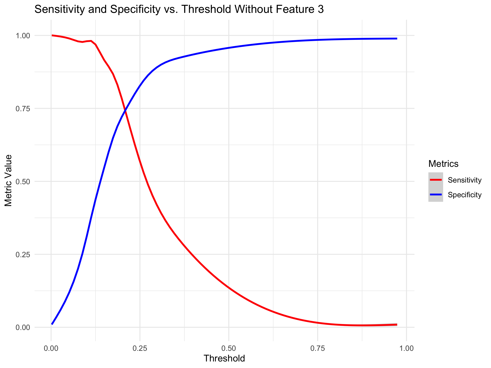

# Multivariable Logistic Binary Classifier - Delinquency Prediction

The panel data-set contains commercial customers' financial information and days past due indicator from 2000 to 2020. The goal is to build a binary classifier to predict customers 90+ days past due **(90+DPD)** probability.


``` r
train <- read.csv(file="FITB_train.csv",header=TRUE)
test <- read.csv(file="FITB_test.csv",header=TRUE)
```

Checking the distribution of the data. If you look carefully you can see that the distribution of feature 3 has a lot of values in the extreme right tail. Red does not as evident by it's flat distribution. You can't even see green (feature 1) in the upper tail which means it's under the red curve so it's not problematic.


``` r
library(ggplot2)
ggplot(data=train,aes(feature_3,color="blue")) + geom_density() + 
  geom_density(data=train,aes(feature_2,color="red")) + 
  geom_density(data=train,aes(feature_1,color="green")) + 
  geom_density(data=train,aes(feature_4,color="purple"))
```

<!-- -->

Removing the top and bottom 1% from the tails of feature 3. "Winsorize**"** feature 3.


``` r
library(dplyr)
```

```
## 
## Attaching package: 'dplyr'
```

```
## The following objects are masked from 'package:stats':
## 
##     filter, lag
```

```
## The following objects are masked from 'package:base':
## 
##     intersect, setdiff, setequal, union
```

``` r
train$key <- row.names(train)
feature_3_winsor <- data.frame(feature_3 = train$feature_3, key = row.names(train))
feature_3_winsor_clean <- na.omit(feature_3_winsor)

feature_3_winsor_clean <- feature_3_winsor_clean %>%
  mutate(z_score = (feature_3 - mean(feature_3)) / sd(feature_3),percentile = ecdf(feature_3)(feature_3) * 100)

feature_3_winsor_df <- feature_3_winsor_clean[!(feature_3_winsor_clean[, 4] < 1 | feature_3_winsor_clean[, 4] > 99), ]

non_matching_keys <- anti_join(train, feature_3_winsor_df, by = "key")$key

train <- train %>% mutate(feature_3 = ifelse(key %in% non_matching_keys, NA, feature_3))

colnames(train)[3] <- "feature_3_winsor"
```


``` r
ggplot(data=train,aes(feature_3_winsor)) + geom_density()
```

<!-- -->

Replace missing values from Winsorization with median of feature 3.


``` r
train[is.na(train[,3]),3] <- median(feature_3_winsor_clean$feature_3)

colnames(train)[3] <- "feature_3_impute"

test[is.na(test[,3]),3] <- median(feature_3_winsor_clean$feature_3)
colnames(test)[3] <- "feature_3_impute"
```

Impute missing values of feature 2 with value from next or previous year of that same ID.


``` r
train$date <- format(as.Date(train$date, format = "%Y-%m-%d"), "%Y")

train <- train %>%
  arrange(id, date) %>% # Sort by id and date
  group_by(id) %>%
  mutate(feature_2 = ifelse(is.na(feature_2),
                            lead(feature_2, order_by = date), # Try next year
                            feature_2)) %>%
  mutate(feature_2 = ifelse(is.na(feature_2),
                            lag(feature_2, order_by = date), # Try previous year
                            feature_2))

colnames(train)[2] <- "feature_2_impute"


test <- test %>%
  arrange(id, date) %>% 
  group_by(id) %>%
  mutate(feature_2 = ifelse(is.na(feature_2),
                            lead(feature_2, order_by = date), # Try next year
                            feature_2)) %>%
  mutate(feature_2 = ifelse(is.na(feature_2),
                            lag(feature_2, order_by = date), # Try previous year
                            feature_2))

colnames(test)[2] <- "feature_2_impute"

train <- na.omit(train)
test <- na.omit(test)
```

Normalize the variables.


``` r
library(dplyr)
train <- train %>%
  mutate(across(c(feature_1, feature_2_impute, feature_3_impute, feature_4), 
                ~ (.x - mean(.x, na.rm = TRUE)) / sd(.x, na.rm = TRUE)))

colnames(train) <- c("feature_1_standard","feature_2_standard","feature_3_standard","feature_4_standard","id","date","y","key")

test <- test %>%
  mutate(across(c(feature_1, feature_2_impute, feature_3_impute, feature_4), 
                ~ (.x - mean(.x, na.rm = TRUE)) / sd(.x, na.rm = TRUE)))

colnames(test) <- c("feature_1_standard","feature_2_standard","feature_3_standard","feature_4_standard","id","date","y")

ggplot(data=train,aes(feature_1_standard,color="blue")) + geom_density() + 
  geom_density(data=train,aes(feature_2_standard,color="red")) + 
  geom_density(data=train,aes(feature_3_standard,color="green")) + 
  geom_density(data=train,aes(feature_4_standard,color="purple"))
```

<!-- -->

Building a logistic regression model where features 1 to 4 are independent variables and column y of the training data set is our categorical dependent variable. Converting y value "90+ DPD" to 1 and "active" to 0, as in, 1 for delinquent and 0 for non-delinquent. The model will be producing probabilities for value 1 ( "90+ DPD": delinquency).


``` r
library(nnet)
train$y <- as.numeric(as.character(factor(train$y, levels = c("90+DPD", "active"), labels = c(1, 0))))
#This is necessary so that the delinquent value is recognized as the positive outcome.
delinquency_model <- multinom(y ~ feature_1_standard + feature_2_standard + feature_3_standard + feature_4_standard, 
                              data=train,family=binomial())
```

```
## # weights:  6 (5 variable)
## initial  value 2730.999891 
## iter  10 value 1604.602929
## final  value 1604.602903 
## converged
```

``` r
summary(delinquency_model)
```

```
## Call:
## multinom(formula = y ~ feature_1_standard + feature_2_standard + 
##     feature_3_standard + feature_4_standard, data = train, family = binomial())
## 
## Coefficients:
##                        Values  Std. Err.
## (Intercept)        -1.7978070 0.05452505
## feature_1_standard -0.5889688 0.07635082
## feature_2_standard -0.1989696 0.05108342
## feature_3_standard -0.8885600 0.06997357
## feature_4_standard  0.1973470 0.05150389
## 
## Residual Deviance: 3209.206 
## AIC: 3219.206
```

Evaluating the accuracy of the model by the AUC and ROC curve resulting from the model being evaluated on the testing data.


``` r
    library(pROC)
```

```
## Type 'citation("pROC")' for a citation.
```

```
## 
## Attaching package: 'pROC'
```

```
## The following objects are masked from 'package:stats':
## 
##     cov, smooth, var
```

``` r
    test$predicted_y <- predict(delinquency_model, newdata = test, type = "class")
    test$y_numeric <- as.numeric(as.character(factor(test$y, levels = c("90+DPD", "active"), labels = c(1, 0))))
    test$Probability <- predict(delinquency_model, newdata = test, type = "probs")
    options(digits = 4)
    
    roc_curve <- roc(response = test$y_numeric, predictor = test$Probability)
```

```
## Setting levels: control = 0, case = 1
```

```
## Setting direction: controls < cases
```

``` r
    roc_metrics <- coords(roc_curve, x = "all", ret = c("threshold", "sensitivity", "specificity"))
    (head(roc_metrics,5))
```

```
##   threshold sensitivity specificity
## 1      -Inf           1    0.000000
## 2 0.0003493           1    0.001183
## 3 0.0003954           1    0.002367
## 4 0.0004220           1    0.003550
## 5 0.0004640           1    0.004734
```

``` r
    auc_value <- auc(roc_curve) 
    optimal_threshold <- roc_metrics$threshold[which.min(abs(roc_metrics$sensitivity - roc_metrics$specificity))]
    
    roc_metrics$threshold <- as.numeric(roc_metrics$threshold)
    plot(roc_curve, main = "ROC Curve for Multinomial Logistic Regression", col = "blue", lwd = 2)
    text(0.2, 0.2, paste("AUC:", round(auc_value, 4)), col = "black", cex = 1.2)
    text(0.2, 0.1, paste("Optimal Threshold:", round(optimal_threshold, 4)), col = "black", cex = 1.2)
```

<!-- -->

``` r
    options(digits = 7)
```

The AUC of the model on the testing data is 82% (50% would be random guess).

As well, the optimal threshold found was 0.2243997. The model produces a probability of delinquency for each observation, a probability value must be selected where observations that have a probability equal or greater to this value are categorized as delinquent. The effectinveness of this probability threshold can be evaluated by comparing the resulting predicted outcomes of delinquency against the actual delinquency outcomes.

| threshold | sensitivity | specificity |
|----------:|------------:|------------:|
| 0.2241302 |      0.7710 |    0.770414 |

**Specificity:** is the proportion of negative outcomes (not delinquent) correctly identified by the model, as in, what proportion of people who did not go delinquent on payments were not mis-categorized as delinquent.

**Sensitivity:** is the proportion of positive outcomes (delinquent) correctly identified by the model, as in, what proportion of delinquencies were caught by the model.

The optimal threshold is that which maximizes the delinquencies successfully predicted and minimizes the number of delinquencies incorrectly predicted. This value is visually apparent by this plot.


``` r
ggplot(roc_metrics, aes(x = threshold)) +
    geom_line(aes(y = sensitivity, color = "Sensitivity")) +
    geom_line(aes(y = specificity, color = "Specificity")) +
    labs(title = "Sensitivity and Specificity vs. Threshold",
    x = "Threshold", y = "Metric Value") +
    scale_color_manual(name = "Metrics", values = c("Sensitivity" = "red", "Specificity" = "blue")) +
    theme_minimal()
```

<!-- -->

Confusion matrix displaying the accuracy of the found optimal decision threshold.


``` r
test$predicted_class <- ifelse(test$Probability >= roc_metrics$threshold[which.min(abs(roc_metrics$sensitivity - roc_metrics$specificity))], 1, 0)

library(caret)
```

```
## Loading required package: lattice
```

``` r
conf_matrix <- confusionMatrix(
  factor(test$predicted_class, levels = c(0, 1)),
  factor(test$y_numeric, levels = c(0, 1)))

confusion_table <- as.data.frame.matrix(conf_matrix$table)
rownames(confusion_table) <- c("Actual: Non-delinquent", "Actual: Delinquent")
colnames(confusion_table) <- c("Predicted: Non-delinquent", "Predicted: Delinquent")

print("Confusion Matrix:")
```

```
## [1] "Confusion Matrix:"
```

``` r
print(confusion_table)
```

```
##                        Predicted: Non-delinquent Predicted: Delinquent
## Actual: Non-delinquent                       652                    49
## Actual: Delinquent                           193                   165
```

``` r
true_positives <- confusion_table[2, 2]  
false_positives <- confusion_table[1, 2] 
true_negatives <- confusion_table[1, 1]  
false_negatives <- confusion_table[2, 1] 
```

Checking for Multicollinearity


``` r
library(car)
```

```
## Loading required package: carData
```

```
## 
## Attaching package: 'car'
```

```
## The following object is masked from 'package:dplyr':
## 
##     recode
```

``` r
X <- model.matrix(~ feature_1_standard + feature_2_standard + feature_3_standard + feature_4_standard, data=train)
vif_values <- diag(solve(cor(X[, -1]))) 
names(vif_values) <- colnames(X)[-1]    
print(vif_values)
```

```
## feature_1_standard feature_2_standard feature_3_standard feature_4_standard 
##           2.109258           1.342519           1.900574           1.214876
```

``` r
library(corrplot)
```

```
## corrplot 0.95 loaded
```

``` r
cor_matrix <- cor(train[, c("feature_1_standard", "feature_2_standard", "feature_3_standard", "feature_4_standard")])
corrplot(cor_matrix, 
         method = "color",        
         col = colorRampPalette(c("white", "red"))(200),  
         type = "upper",          
         tl.col = "black",        
         tl.srt = 45,             
         addCoef.col = "black",  
         number.cex = 0.8)
```

<!-- -->

There is Multicollinearity between feature 1 and feature 3

Analysis of deviance test, for difference of goodness of fit between full model and model without feature 1 or feature 2.


``` r
full_model <- glm(y ~ feature_1_standard + feature_2_standard + feature_3_standard + feature_4_standard, data = train, family = binomial())

model_without_feature_1 <- glm(y ~ feature_2_standard + feature_3_standard + feature_4_standard, data = train, family = binomial())

model_without_feature_3 <- glm(y ~ feature_1_standard + feature_2_standard + feature_4_standard, data = train, family = binomial())

anova(model_without_feature_1, full_model, test = "LRT")
```

```
## Analysis of Deviance Table
## 
## Model 1: y ~ feature_2_standard + feature_3_standard + feature_4_standard
## Model 2: y ~ feature_1_standard + feature_2_standard + feature_3_standard + 
##     feature_4_standard
##   Resid. Df Resid. Dev Df Deviance  Pr(>Chi)    
## 1      3936     3263.8                          
## 2      3935     3209.2  1   54.561 1.507e-13 ***
## ---
## Signif. codes:  0 '***' 0.001 '**' 0.01 '*' 0.05 '.' 0.1 ' ' 1
```

``` r
anova(model_without_feature_3, full_model, test = "LRT")
```

```
## Analysis of Deviance Table
## 
## Model 1: y ~ feature_1_standard + feature_2_standard + feature_4_standard
## Model 2: y ~ feature_1_standard + feature_2_standard + feature_3_standard + 
##     feature_4_standard
##   Resid. Df Resid. Dev Df Deviance  Pr(>Chi)    
## 1      3936     3416.2                          
## 2      3935     3209.2  1   207.01 < 2.2e-16 ***
## ---
## Signif. codes:  0 '***' 0.001 '**' 0.01 '*' 0.05 '.' 0.1 ' ' 1
```

Reject the null hypothesis that the reduced model does not have significantly different goodness of fit to the original. Feature 1 is necessary.


``` r
library(pROC)
library(ggplot2)

model_without_feature_1 <- glm(y ~ feature_2_standard + feature_3_standard + feature_4_standard, 
                               data = train, family = binomial())

test_no_feature_1 <- test %>%
  select(-feature_1_standard) 

test_no_feature_1$Probability <- predict(model_without_feature_1, newdata = test_no_feature_1, type = "response")

test_no_feature_1$y_numeric <- as.numeric(as.character(factor(test_no_feature_1$y, 
                                                              levels = c("90+DPD", "active"), 
                                                              labels = c(1, 0))))

roc_curve <- roc(response = test_no_feature_1$y_numeric, 
                 predictor = test_no_feature_1$Probability)
```

```
## Setting levels: control = 0, case = 1
```

```
## Setting direction: controls < cases
```

``` r
roc_metrics <- coords(roc_curve, x = "all", ret = c("threshold", "sensitivity", "specificity"))
print(head(roc_metrics, 5)) 
```

```
##      threshold sensitivity specificity
## 1         -Inf           1 0.000000000
## 2 0.0006650011           1 0.001183432
## 3 0.0007546129           1 0.002366864
## 4 0.0008732794           1 0.003550296
## 5 0.0010023908           1 0.004733728
```

``` r
test_no_feature_1
```

```
## # A tibble: 1,059 × 10
## # Groups:   id [81]
##    feature_2_standard feature_3_standard feature_4_standard    id date     y    
##                 <dbl>              <dbl>              <dbl> <int> <chr>    <chr>
##  1            -0.991             0.0121               0.993 50821 2000-12… acti…
##  2            -0.327            -0.938               -0.328 50821 2001-12… acti…
##  3            -0.899            -2.18                -0.658 50821 2002-12… acti…
##  4             0.940             1.33                -0.279 50821 2003-12… acti…
##  5            -1.45             -0.415                1.27  50821 2004-12… acti…
##  6            -0.519             0.534                1.17  50821 2005-12… acti…
##  7             0.186            -0.00465             -0.335 50821 2006-12… acti…
##  8            -0.0670            1.33                 1.34  50821 2007-12… acti…
##  9             1.52              0.0825              -1.48  50821 2008-12… 90+D…
## 10             0.967            -0.259                0.338 50821 2009-12… acti…
## # ℹ 1,049 more rows
## # ℹ 4 more variables: predicted_y <fct>, y_numeric <dbl>, Probability <dbl>,
## #   predicted_class <dbl>
```

``` r
plot(roc_curve, main = "ROC Curve Without Feature 1", col = "blue", lwd = 2)
auc_value <- auc(roc_curve) 
optimal_threshold <- coords(roc_curve, "best", ret = "threshold")
text(0.2, 0.2, paste("AUC:", round(auc_value, 4)), col = "black", cex = 1.2)
text(0.2, 0.1, paste("Optimal Threshold:", round(optimal_threshold, 4)), col = "black", cex = 1.2)
```

<!-- -->

``` r
roc_metrics_df <- as.data.frame(roc_metrics) 
ggplot(roc_metrics_df, aes(x = threshold)) +
    geom_line(aes(y = sensitivity, color = "Sensitivity")) +
    geom_line(aes(y = specificity, color = "Specificity")) +
    labs(title = "Sensitivity and Specificity vs. Threshold Without Feature 1",
         x = "Threshold", y = "Metric Value") +
    scale_color_manual(name = "Metrics", values = c("Sensitivity" = "red", "Specificity" = "blue")) +
    theme_minimal()
```

<!-- -->

The AUC is slightly inferior.


``` r
library(pROC)
library(ggplot2)

model_without_feature_3 <- glm(y ~ feature_1_standard + feature_2_standard + feature_4_standard, 
                               data = train, family = binomial())

test_no_feature_3 <- test %>%
  select(-feature_3_standard) 

test_no_feature_3$Probability <- predict(model_without_feature_3, newdata = test_no_feature_3, type = "response")

test_no_feature_3$y_numeric <- as.numeric(as.character(factor(test_no_feature_3$y, 
                                                              levels = c("90+DPD", "active"), 
                                                              labels = c(1, 0))))

roc_curve <- roc(response = test_no_feature_3$y_numeric, 
                 predictor = test_no_feature_3$Probability)
```

```
## Setting levels: control = 0, case = 1
```

```
## Setting direction: controls < cases
```

``` r
roc_metrics <- coords(roc_curve, x = "all", ret = c("threshold", "sensitivity", "specificity"))
print(head(roc_metrics, 5)) 
```

```
##     threshold sensitivity specificity
## 1        -Inf           1 0.000000000
## 2 0.001903202           1 0.001183432
## 3 0.002142986           1 0.002366864
## 4 0.002302889           1 0.003550296
## 5 0.002353089           1 0.004733728
```

``` r
test_no_feature_3
```

```
## # A tibble: 1,059 × 10
## # Groups:   id [81]
##    feature_1_standard feature_2_standard feature_4_standard    id date     y    
##                 <dbl>              <dbl>              <dbl> <int> <chr>    <chr>
##  1             0.161             -0.991               0.993 50821 2000-12… acti…
##  2             0.121             -0.327              -0.328 50821 2001-12… acti…
##  3            -0.0959            -0.899              -0.658 50821 2002-12… acti…
##  4             0.584              0.940              -0.279 50821 2003-12… acti…
##  5             0.0399            -1.45                1.27  50821 2004-12… acti…
##  6             0.248             -0.519               1.17  50821 2005-12… acti…
##  7             0.315              0.186              -0.335 50821 2006-12… acti…
##  8             0.392             -0.0670              1.34  50821 2007-12… acti…
##  9            -3.39               1.52               -1.48  50821 2008-12… 90+D…
## 10             0.183              0.967               0.338 50821 2009-12… acti…
## # ℹ 1,049 more rows
## # ℹ 4 more variables: predicted_y <fct>, y_numeric <dbl>, Probability <dbl>,
## #   predicted_class <dbl>
```

``` r
plot(roc_curve, main = "ROC Curve Without Feature 3", col = "blue", lwd = 2)
auc_value <- auc(roc_curve) 
optimal_threshold <- coords(roc_curve, "best", ret = "threshold")
text(0.2, 0.2, paste("AUC:", round(auc_value, 4)), col = "black", cex = 1.2)
text(0.2, 0.1, paste("Optimal Threshold:", round(optimal_threshold, 4)), col = "black", cex = 1.2)
```

<!-- -->

``` r
roc_metrics_df <- as.data.frame(roc_metrics) 
ggplot(roc_metrics_df, aes(x = threshold)) +
    geom_line(aes(y = sensitivity, color = "Sensitivity")) +
    geom_line(aes(y = specificity, color = "Specificity")) +
    labs(title = "Sensitivity and Specificity vs. Threshold Without Feature 3",
         x = "Threshold", y = "Metric Value") +
    scale_color_manual(name = "Metrics", values = c("Sensitivity" = "red", "Specificity" = "blue")) +
    theme_minimal()
```

<!-- -->

The result is verified, the reduced models are inferior. The original model should be retained with the awareness of possible problems with multicollinearity.
