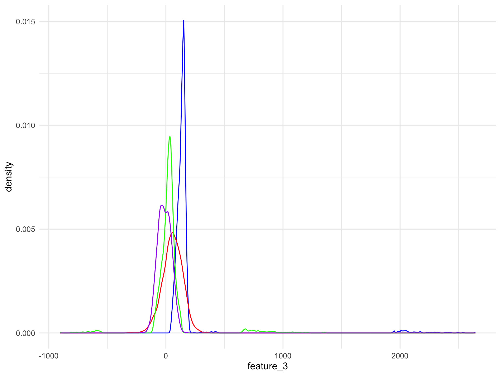
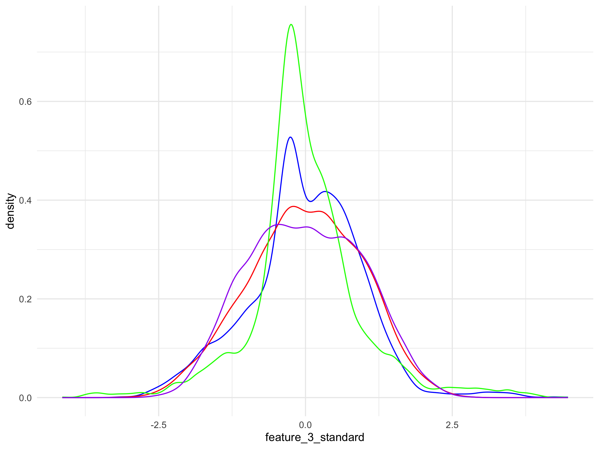
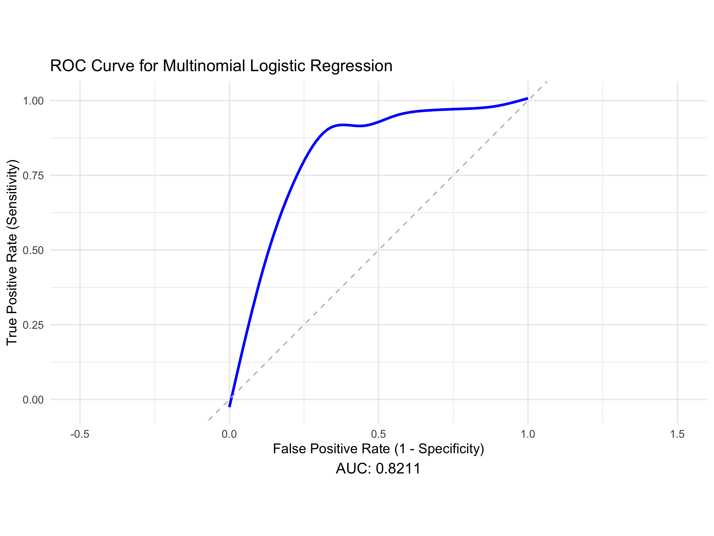
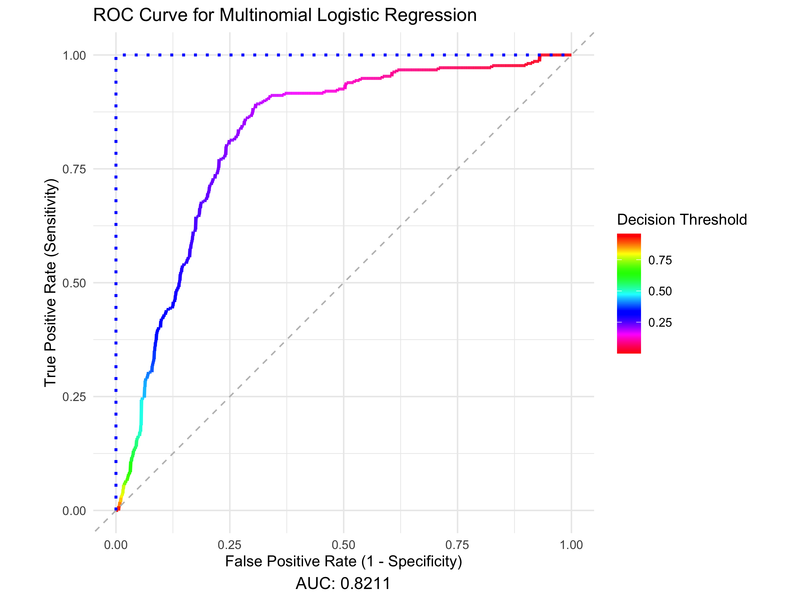
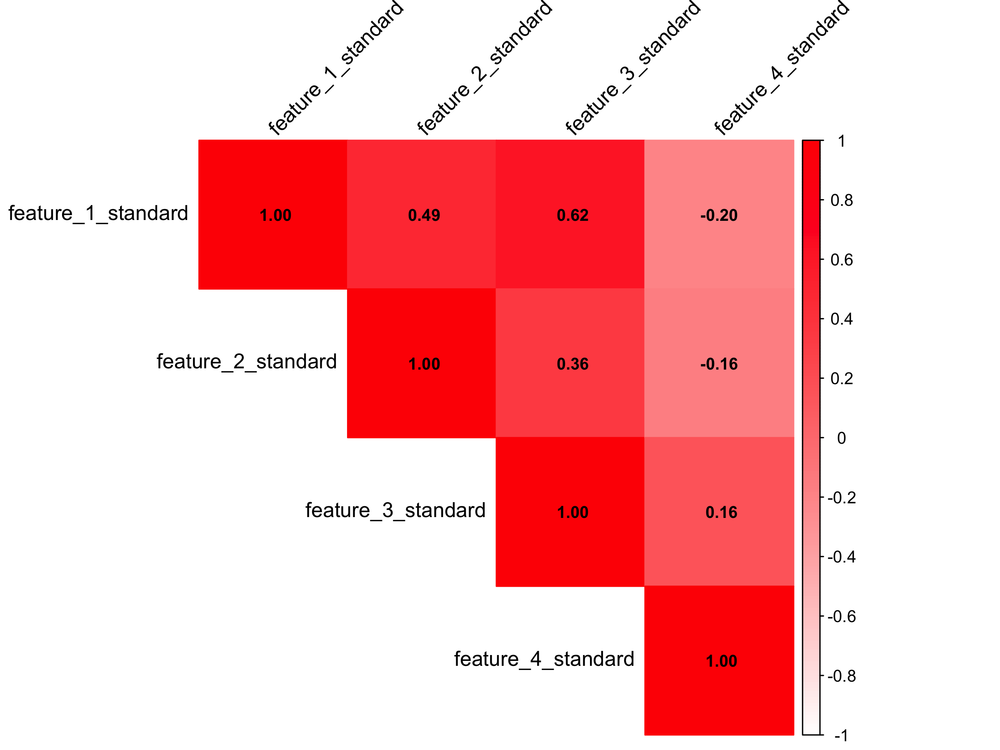
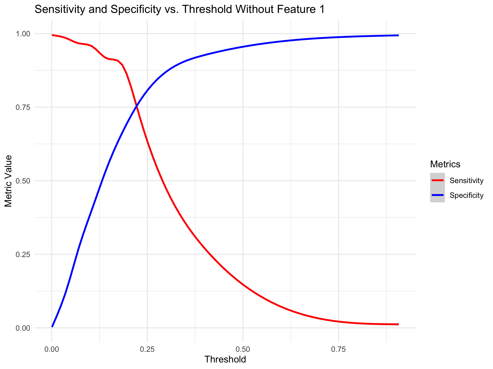

# Multivariable Logistic Binary Classifier - Delinquency Prediction

The panel data-set contains commercial customers’ financial information
and days past due indicator from 2000 to 2020. The goal is to build a
binary classifier to predict customers 90+ days past due **(90+DPD)**
probability.

``` r
setwd("~/Desktop/DS_DA_Projects/Delinquency")
train <- read.csv(file="FITB_train.csv",header=TRUE)
test <- read.csv(file="FITB_test.csv",header=TRUE)
```

Checking the distribution of the data. If you look carefully you can see
that the distribution of feature 3 has a lot of values in the extreme
right tail. Red does not as evident by it’s flat distribution. You can’t
even see green (feature 1) in the upper tail which means it’s under the
red curve so it’s not problematic.

``` r
library(ggplot2)
ggplot() + geom_density(data=train, aes(x=feature_3), color="blue") +
           geom_density(data=train, aes(x=feature_2), color="red") +
           geom_density(data=train, aes(x=feature_1), color="green") +
           geom_density(data=train, aes(x=feature_4), color="purple") +
           theme_minimal()
```

<center>


</center>

Removing the top and bottom 1% from the tails of feature 3.
“Winsorize**“** feature 3.

``` r
library(dplyr)
train$key <- row.names(train)
feature_3_winsor <- data.frame(feature_3 = train$feature_3, key = row.names(train))
feature_3_winsor_clean <- na.omit(feature_3_winsor)

feature_3_winsor_clean <- feature_3_winsor_clean %>%
  mutate(z_score = (feature_3 - mean(feature_3)) / sd(feature_3),percentile = ecdf(feature_3)(feature_3) * 100)

feature_3_winsor_df <- feature_3_winsor_clean[!(feature_3_winsor_clean[, 4] < 1 | feature_3_winsor_clean[, 4] > 99), ]

non_matching_keys <- anti_join(train, feature_3_winsor_df, by = "key")$key

train <- train %>% mutate(feature_3 = ifelse(key %in% non_matching_keys, NA, feature_3))

colnames(train)[3] <- "feature_3_winsor"
```

Replace missing values from Winsorization with median of feature 3.

``` r
train[is.na(train[,3]),3] <- median(feature_3_winsor_clean$feature_3)

colnames(train)[3] <- "feature_3_impute"

test[is.na(test[,3]),3] <- median(feature_3_winsor_clean$feature_3)
colnames(test)[3] <- "feature_3_impute"
```

Impute missing values of feature 2 with value from next or previous year
of that same ID.

``` r
train$date <- format(as.Date(train$date, format = "%Y-%m-%d"), "%Y")

train <- train %>%
  arrange(id, date) %>% # Sort by id and date
  group_by(id) %>%
  mutate(feature_2 = ifelse(is.na(feature_2),
                            lead(feature_2, order_by = date), # Try next year
                            feature_2)) %>%
  mutate(feature_2 = ifelse(is.na(feature_2),
                            lag(feature_2, order_by = date), # Try previous year
                            feature_2))

colnames(train)[2] <- "feature_2_impute"


test <- test %>%
  arrange(id, date) %>% 
  group_by(id) %>%
  mutate(feature_2 = ifelse(is.na(feature_2),
                            lead(feature_2, order_by = date), # Try next year
                            feature_2)) %>%
  mutate(feature_2 = ifelse(is.na(feature_2),
                            lag(feature_2, order_by = date), # Try previous year
                            feature_2))

colnames(test)[2] <- "feature_2_impute"

train <- na.omit(train)
test <- na.omit(test)
```

Normalize the variables.

``` r
library(dplyr)
train <- train %>%
  mutate(across(c(feature_1, feature_2_impute, feature_3_impute, feature_4), 
                ~ (.x - mean(.x, na.rm = TRUE)) / sd(.x, na.rm = TRUE)))

colnames(train) <- c("feature_1_standard","feature_2_standard","feature_3_standard","feature_4_standard","id","date","y","key")

test <- test %>%
  mutate(across(c(feature_1, feature_2_impute, feature_3_impute, feature_4), 
                ~ (.x - mean(.x, na.rm = TRUE)) / sd(.x, na.rm = TRUE)))

colnames(test) <- c("feature_1_standard","feature_2_standard","feature_3_standard","feature_4_standard","id","date","y")

ggplot() + geom_density(data=train, aes(x=feature_3_standard), color="blue") +
           geom_density(data=train, aes(x=feature_2_standard), color="red") +
           geom_density(data=train, aes(x=feature_1_standard), color="green") +
           geom_density(data=train, aes(x=feature_4_standard), color="purple") +
           theme_minimal()
```

<center>


</center>

Building a logistic regression model where features 1 to 4 are
independent variables and column y of the training data set is our
categorical dependent variable. Converting y value “90+ DPD” to 1 and
“active” to 0, as in, 1 for delinquent and 0 for non-delinquent. The
model will be producing probabilities for value 1 ( “90+ DPD”:
delinquency).

``` r
library(nnet)
train$y <- as.numeric(as.character(factor(train$y, levels = c("90+DPD", "active"), labels = c(1, 0))))
#This is necessary so that the delinquent value is recognized as the positive outcome.
delinquency_model <- multinom(y ~ feature_1_standard + feature_2_standard + feature_3_standard + feature_4_standard, 
                              data=train,family=binomial())
```

    ## # weights:  6 (5 variable)
    ## initial  value 2730.999891 
    ## iter  10 value 1604.602929
    ## final  value 1604.602903 
    ## converged

``` r
summary(delinquency_model)
```

    ## Call:
    ## multinom(formula = y ~ feature_1_standard + feature_2_standard + 
    ##     feature_3_standard + feature_4_standard, data = train, family = binomial())
    ## 
    ## Coefficients:
    ##                        Values  Std. Err.
    ## (Intercept)        -1.7978070 0.05452505
    ## feature_1_standard -0.5889688 0.07635082
    ## feature_2_standard -0.1989696 0.05108342
    ## feature_3_standard -0.8885600 0.06997357
    ## feature_4_standard  0.1973470 0.05150389
    ## 
    ## Residual Deviance: 3209.206 
    ## AIC: 3219.206

Evaluating the accuracy of the model by the AUC and ROC curve resulting
from the model being evaluated on the testing data.

``` r
    library(pROC)
    test$predicted_y <- predict(delinquency_model, newdata = test, type = "class")
    test$y_numeric <- as.numeric(as.character(factor(test$y, levels = c("90+DPD", "active"), labels = c(1, 0))))
    test$Probability <- predict(delinquency_model, newdata = test, type = "probs")
    options(digits = 4)
    
    roc_curve <- roc(response = test$y_numeric, predictor = test$Probability)

    roc_metrics <- coords(roc_curve, x = "all", ret = c("threshold", "sensitivity", "specificity"))
    (head(roc_metrics,5))
```

    ##   threshold sensitivity specificity
    ## 1      -Inf           1    0.000000
    ## 2 0.0003493           1    0.001183
    ## 3 0.0003954           1    0.002367
    ## 4 0.0004220           1    0.003550
    ## 5 0.0004640           1    0.004734

``` r
    auc_value <- auc(roc_curve) 
    optimal_threshold <- roc_metrics$threshold[which.min(abs(roc_metrics$sensitivity - roc_metrics$specificity))]
    
    roc_metrics$threshold <- as.numeric(roc_metrics$threshold)
    
roc_data <- data.frame(
  TPR = rev(roc_curve$sensitivities),  
  FPR = rev(1 - roc_curve$specificities)  
)

auc_value <- auc(roc_curve)

ggplot(roc_data, aes(x = FPR, y = TPR)) +
  geom_smooth(color = "blue", size = 1) +
  geom_abline(linetype = "dashed", color = "gray") +
  labs(
    title = "ROC Curve for Multinomial Logistic Regression",
    x = "False Positive Rate (1 - Specificity)",
    y = "True Positive Rate (Sensitivity)",
    caption = paste("AUC:", round(auc_value, 4))
  ) +
  coord_fixed() +  # Maintain proportional scales
  xlim(-0.5, 1.5) +  # Expand x-axis
  theme_minimal() +
  theme(plot.caption = element_text(hjust = 0.5, size = 12))
```

<center>


</center>

The AUC of the model on the testing data is 82% (50% would be random
guess).

As well, the optimal threshold found was 0.2243997. The model produces a
probability of delinquency for each observation, a probability value
must be selected where observations that have a probability equal or
greater to this value are categorized as delinquent. The effectiveness
of this probability threshold can be evaluated by comparing the
resulting predicted outcomes of delinquency against the actual
delinquency outcomes.

| threshold | sensitivity | specificity |
|:---------:|:-----------:|:-----------:|
| 0.2241302 |   0.7710    |  0.770414   |

**Sensitivity:** is the proportion of positive outcomes (delinquent)
correctly identified by the model, as in, what proportion of
delinquencies were caught by the model.

**Specificity:** is the proportion of negative outcomes (not delinquent)
correctly identified by the model, as in, what proportion of people who
did not go delinquent on payments were not mis-categorized as
delinquent.

Thus the compliment of Specificity is the false positive rate.

The optimal threshold is that which maximizes the delinquencies
successfully predicted and minimizes the number of delinquencies
incorrectly predicted. This value is visually apparent by this plot.

``` r
ggplot(roc_metrics, aes(x = threshold)) +
    geom_smooth(aes(y = sensitivity, color = "Sensitivity")) +
    geom_smooth(aes(y = specificity, color = "Specificity")) +
    labs(title = "Sensitivity and Specificity vs. Threshold",
    x = "Threshold", y = "Metric Value") +
    scale_color_manual(name = "Metrics", values = c("Sensitivity" = "red", "Specificity" = "blue")) +
    theme_minimal()
```

<center>


</center>

Confusion matrix displaying the accuracy of the found optimal decision
threshold.

``` r
test$predicted_class <- ifelse(test$Probability >= roc_metrics$threshold[which.min(abs(roc_metrics$sensitivity - roc_metrics$specificity))], 1, 0)

library(caret)
conf_matrix <- confusionMatrix(
  factor(test$predicted_class, levels = c(0, 1)),
  factor(test$y_numeric, levels = c(0, 1)))

confusion_table <- as.data.frame.matrix(conf_matrix$table)
rownames(confusion_table) <- c("Actual: Non-delinquent", "Actual: Delinquent")
colnames(confusion_table) <- c("Predicted: Non-delinquent", "Predicted: Delinquent")

print("Confusion Matrix:")
```

    ## [1] "Confusion Matrix:"

``` r
print(confusion_table)
```

    ##                        Predicted: Non-delinquent Predicted: Delinquent
    ## Actual: Non-delinquent                       652                    49
    ## Actual: Delinquent                           193                   165

``` r
true_positives <- confusion_table[2, 2]  
false_positives <- confusion_table[1, 2] 
true_negatives <- confusion_table[1, 1]  
false_negatives <- confusion_table[2, 1] 
```

Checking for Multicollinearity

``` r
library(car)
X <- model.matrix(~ feature_1_standard + feature_2_standard + feature_3_standard + feature_4_standard, data=train)
vif_values <- diag(solve(cor(X[, -1]))) 
names(vif_values) <- colnames(X)[-1]    
print(vif_values)
```

    ## feature_1_standard feature_2_standard feature_3_standard feature_4_standard 
    ##              2.109              1.343              1.901              1.215

``` r
library(corrplot)

cor_matrix <- cor(train[, c("feature_1_standard", "feature_2_standard", "feature_3_standard", "feature_4_standard")])
corrplot(cor_matrix, 
         method = "color",        
         col = colorRampPalette(c("white", "red"))(200),  
         type = "upper",          
         tl.col = "black",        
         tl.srt = 45,             
         addCoef.col = "black",  
         number.cex = 0.8)
```

<center>


</center>

There is Multicollinearity between feature 1 and feature 3

Analysis of deviance test, for difference of goodness of fit between
full model and model without feature 1 or feature 2.

``` r
full_model <- glm(y ~ feature_1_standard + feature_2_standard + feature_3_standard + feature_4_standard, data = train, family = binomial())

model_without_feature_1 <- glm(y ~ feature_2_standard + feature_3_standard + feature_4_standard, data = train, family = binomial())

model_without_feature_3 <- glm(y ~ feature_1_standard + feature_2_standard + feature_4_standard, data = train, family = binomial())

anova(model_without_feature_1, full_model, test = "LRT")
```

    ## Analysis of Deviance Table
    ## 
    ## Model 1: y ~ feature_2_standard + feature_3_standard + feature_4_standard
    ## Model 2: y ~ feature_1_standard + feature_2_standard + feature_3_standard + 
    ##     feature_4_standard
    ##   Resid. Df Resid. Dev Df Deviance Pr(>Chi)    
    ## 1      3936       3264                         
    ## 2      3935       3209  1     54.6  1.5e-13 ***
    ## ---
    ## Signif. codes:  0 '***' 0.001 '**' 0.01 '*' 0.05 '.' 0.1 ' ' 1

``` r
anova(model_without_feature_3, full_model, test = "LRT")
```

    ## Analysis of Deviance Table
    ## 
    ## Model 1: y ~ feature_1_standard + feature_2_standard + feature_4_standard
    ## Model 2: y ~ feature_1_standard + feature_2_standard + feature_3_standard + 
    ##     feature_4_standard
    ##   Resid. Df Resid. Dev Df Deviance Pr(>Chi)    
    ## 1      3936       3416                         
    ## 2      3935       3209  1      207   <2e-16 ***
    ## ---
    ## Signif. codes:  0 '***' 0.001 '**' 0.01 '*' 0.05 '.' 0.1 ' ' 1

Reject the null hypothesis that the reduced model does not have
significantly different goodness of fit to the original. Feature 1 is
necessary.

``` r
library(pROC)
library(ggplot2)

model_without_feature_1 <- glm(y ~ feature_2_standard + feature_3_standard + feature_4_standard, 
                               data = train, family = binomial())

test_no_feature_1 <- test %>%
  select(-feature_1_standard) 

test_no_feature_1$Probability <- predict(model_without_feature_1, newdata = test_no_feature_1, type = "response")

test_no_feature_1$y_numeric <- as.numeric(as.character(factor(test_no_feature_1$y, 
                                                              levels = c("90+DPD", "active"), 
                                                              labels = c(1, 0))))

roc_curve <- roc(response = test_no_feature_1$y_numeric, 
                 predictor = test_no_feature_1$Probability)

roc_metrics <- coords(roc_curve, x = "all", ret = c("threshold", "sensitivity", "specificity"))


# Extract data for ROC curve
roc_data <- data.frame(
  TPR = rev(roc_curve$sensitivities),  # True Positive Rate (Sensitivity)
  FPR = rev(1 - roc_curve$specificities)  # False Positive Rate (1 - Specificity)
)

# Calculate AUC value
auc_value <- auc(roc_curve)

# Create the ROC curve plot using ggplot2
ggplot(roc_data, aes(x = FPR, y = TPR)) +
  geom_smooth(color = "blue", size = 1) +
  geom_abline(linetype = "dashed", color = "gray") +  # Diagonal line for random chance
  labs(
    title = "ROC Curve Without Feature 3",
    x = "False Positive Rate (1 - Specificity)",
    y = "True Positive Rate (Sensitivity)",
    caption = paste("AUC:", round(auc_value, 4))
  ) +
  coord_fixed() +  # Maintain proportional scales
  xlim(-0.5, 1.5) +  # Expand x-axis for better visualization
  theme_minimal() +
  theme(plot.caption = element_text(hjust = 0.5, size = 12))
```

<center>


</center>

``` r
roc_metrics_df <- as.data.frame(roc_metrics) 
ggplot(roc_metrics_df, aes(x = threshold)) +
    geom_smooth(aes(y = sensitivity, color = "Sensitivity")) +
    geom_smooth(aes(y = specificity, color = "Specificity")) +
    labs(title = "Sensitivity and Specificity vs. Threshold Without Feature 1",
         x = "Threshold", y = "Metric Value") +
    scale_color_manual(name = "Metrics", values = c("Sensitivity" = "red", "Specificity" = "blue")) +
    theme_minimal()
```

<center>


</center>

The AUC is slightly inferior.

``` r
library(pROC)
library(ggplot2)

model_without_feature_3 <- glm(y ~ feature_1_standard + feature_2_standard + feature_4_standard, 
                               data = train, family = binomial())

test_no_feature_3 <- test %>%
  select(-feature_3_standard) 

test_no_feature_3$Probability <- predict(model_without_feature_3, newdata = test_no_feature_3, type = "response")

test_no_feature_3$y_numeric <- as.numeric(as.character(factor(test_no_feature_3$y, 
                                                              levels = c("90+DPD", "active"), 
                                                              labels = c(1, 0))))

roc_curve <- roc(response = test_no_feature_3$y_numeric, 
                 predictor = test_no_feature_3$Probability)

roc_metrics <- coords(roc_curve, x = "all", ret = c("threshold", "sensitivity", "specificity"))


# Extract data for ROC curve
roc_data <- data.frame(
  TPR = rev(roc_curve$sensitivities),  # True Positive Rate (Sensitivity)
  FPR = rev(1 - roc_curve$specificities)  # False Positive Rate (1 - Specificity)
)

# Calculate AUC value
auc_value <- auc(roc_curve)

# Create the ROC curve plot using ggplot2
ggplot(roc_data, aes(x = FPR, y = TPR)) +
  geom_smooth(color = "blue", size = 1) +
  geom_abline(linetype = "dashed", color = "gray") +  # Diagonal line for random chance
  labs(
    title = "ROC Curve Without Feature 3",
    x = "False Positive Rate (1 - Specificity)",
    y = "True Positive Rate (Sensitivity)",
    caption = paste("AUC:", round(auc_value, 4))
  ) +
  coord_fixed() +  # Maintain proportional scales
  xlim(-0.5, 1.5) +  # Expand x-axis for better visualization
  theme_minimal() +
  theme(plot.caption = element_text(hjust = 0.5, size = 12))
```

<center>


</center>

``` r
roc_metrics_df <- as.data.frame(roc_metrics) 
ggplot(roc_metrics_df, aes(x = threshold)) +
    geom_smooth(aes(y = sensitivity, color = "Sensitivity")) +
    geom_smooth(aes(y = specificity, color = "Specificity")) +
    labs(title = "Sensitivity and Specificity vs. Threshold Without Feature 3",
         x = "Threshold", y = "Metric Value") +
    scale_color_manual(name = "Metrics", values = c("Sensitivity" = "red", "Specificity" = "blue")) +
    theme_minimal()
```

<center>


</center>

The result is verified, the reduced models are inferior. The original
model should be retained with the awareness of possible problems with
multicollinearity.
