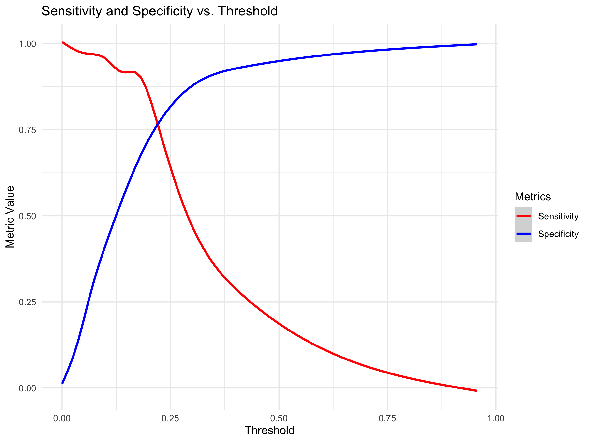
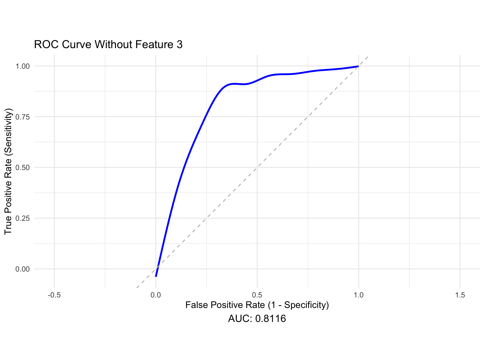
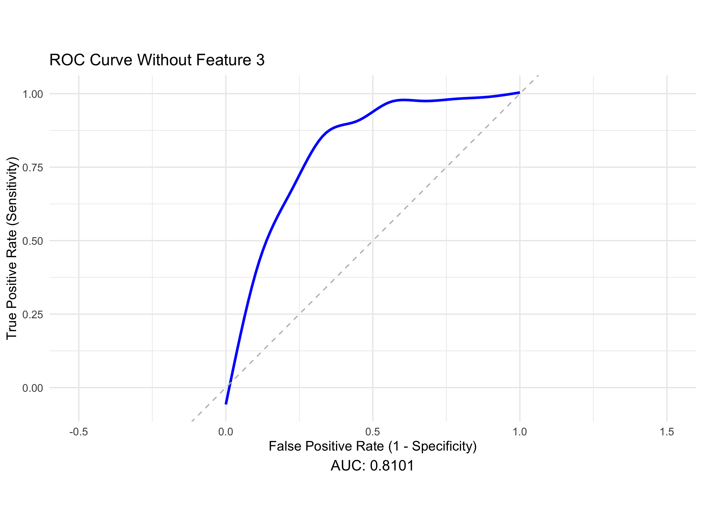
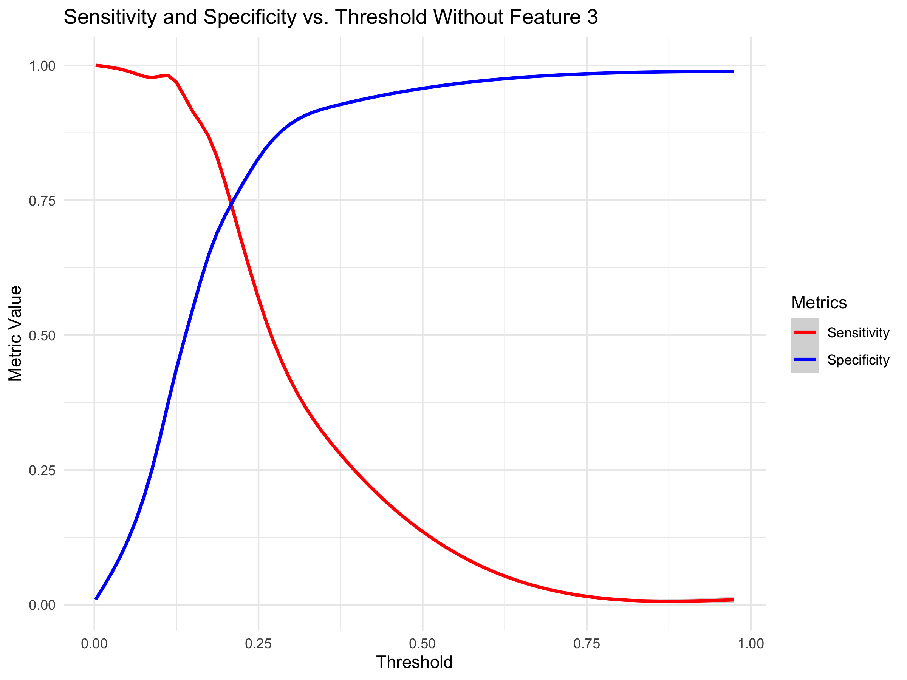

# Multivariable Logistic Binary Classifier - Delinquency Prediction

The panel data-set contains commercial customers’ financial information
and days past due indicator from 2000 to 2020. The goal is to build a
binary classifier to predict customers 90+ days past due **(90+DPD)**
probability.

## Prepare Training Data

``` r
setwd("~/Desktop/DS_DA_Projects/Delinquency")
#setwd("C:/Users/jake pc/Desktop/DS_DA_Projects/Delinquency")
train <- read.csv(file="FITB_train.csv",header=TRUE)
test <- read.csv(file="FITB_test.csv",header=TRUE)
```

Checking the distribution of the data. If you look carefully you can see
that the distribution of feature 3 has a lot of values in the extreme
right tail. Red does not as evident by it’s flat distribution. You can’t
even see green (feature 1) in the upper tail which means it’s under the
red curve so it’s not problematic.

``` r
library(ggplot2)
ggplot() + geom_density(data=train, aes(x=feature_3), color="blue") +
           geom_density(data=train, aes(x=feature_2), color="red") +
           geom_density(data=train, aes(x=feature_1), color="green") +
           geom_density(data=train, aes(x=feature_4), color="purple") +
           theme_minimal()
```

<div align="center">


</div>

Removing the top and bottom 1% from the tails of feature 3.
“Winsorize**“** feature 3.

``` r
library(dplyr)
train$key <- row.names(train)
feature_3_winsor <- data.frame(feature_3 = train$feature_3, key = row.names(train))
feature_3_winsor_clean <- na.omit(feature_3_winsor)

feature_3_winsor_clean <- feature_3_winsor_clean %>%
  mutate(z_score = (feature_3 - mean(feature_3)) / sd(feature_3),percentile = ecdf(feature_3)(feature_3) * 100)

feature_3_winsor_df <- feature_3_winsor_clean[!(feature_3_winsor_clean[, 4] < 1 | feature_3_winsor_clean[, 4] > 99), ]

non_matching_keys <- anti_join(train, feature_3_winsor_df, by = "key")$key

train <- train %>% mutate(feature_3 = ifelse(key %in% non_matching_keys, NA, feature_3))

colnames(train)[3] <- "feature_3_winsor"
```

Replace missing values of feature 3 resulting from **Winsorization**
with median value of feature 3.

``` r
train[is.na(train[,3]),3] <- median(feature_3_winsor_clean$feature_3)

colnames(train)[3] <- "feature_3_impute"

test[is.na(test[,3]),3] <- median(feature_3_winsor_clean$feature_3)
colnames(test)[3] <- "feature_3_impute"
```

Impute missing values of feature 2 with value from next or previous year
of that same ID. I.e. if feature 2 for DEC 31 2001 is missing for ID
number 5021, then replace with value from DEC 31 2002 or DEC 31 2000 of
feature 2 of that same ID number (individual).

``` r
train$date <- format(as.Date(train$date, format = "%Y-%m-%d"), "%Y")

train <- train %>%
  arrange(id, date) %>% # Sort by id and date
  group_by(id) %>%
  mutate(feature_2 = ifelse(is.na(feature_2),
                            lead(feature_2, order_by = date), # Try next year
                            feature_2)) %>%
  mutate(feature_2 = ifelse(is.na(feature_2),
                            lag(feature_2, order_by = date), # Try previous year
                            feature_2))

colnames(train)[2] <- "feature_2_impute"


test <- test %>%
  arrange(id, date) %>% 
  group_by(id) %>%
  mutate(feature_2 = ifelse(is.na(feature_2),
                            lead(feature_2, order_by = date), # Try next year
                            feature_2)) %>%
  mutate(feature_2 = ifelse(is.na(feature_2),
                            lag(feature_2, order_by = date), # Try previous year
                            feature_2))

colnames(test)[2] <- "feature_2_impute"

train <- na.omit(train)
test <- na.omit(test)
print(head(train,5))
```

    ## # A tibble: 5 × 8
    ## # Groups:   id [1]
    ##   feature_1 feature_2_impute feature_3_impute feature_4    id date  y      key  
    ##       <dbl>            <dbl>            <dbl>     <dbl> <int> <chr> <chr>  <chr>
    ## 1   39.2                60.3             138.    -35.5  50501 2000  active 1    
    ## 2  -12.6                58.0             126.     44.4  50501 2001  90+DPD 2    
    ## 3    0.0438            -39.3             139.     64.9  50501 2002  active 3    
    ## 4    2.30               50.0             124.     -3.59 50501 2003  active 4    
    ## 5    7.19              -83.5             150.     95.4  50501 2004  active 5

The actual numeric values of each variable are meaningless to
determining the outcome of delinquency, what’s important is the value of
each variable in relation to the other values of that same variable.
Thus we transform features 1 to 4 into individual normal distributions
and re-assign the value of each variable with their z-score within their
respective distributions.

That is to say, we **Normalize** or **Standardize** the data.

``` r
library(dplyr)
train <- train %>%
  mutate(across(c(feature_1, feature_2_impute, feature_3_impute, feature_4), 
                ~ (.x - mean(.x, na.rm = TRUE)) / sd(.x, na.rm = TRUE)))

colnames(train) <- c("feature_1_standard","feature_2_standard","feature_3_standard","feature_4_standard","id","date","y","key")

test <- test %>%
  mutate(across(c(feature_1, feature_2_impute, feature_3_impute, feature_4), 
                ~ (.x - mean(.x, na.rm = TRUE)) / sd(.x, na.rm = TRUE)))

colnames(test) <- c("feature_1_standard","feature_2_standard","feature_3_standard","feature_4_standard","id","date","y")

ggplot() + geom_density(data=train, aes(x=feature_3_standard), color="blue") +
           geom_density(data=train, aes(x=feature_2_standard), color="red") +
           geom_density(data=train, aes(x=feature_1_standard), color="green") +
           geom_density(data=train, aes(x=feature_4_standard), color="purple") +
           theme_minimal()
```

<div align="center">


</div>

``` r
print(head(train,5))
```

    ## # A tibble: 5 × 8
    ## # Groups:   id [1]
    ##   feature_1_standard feature_2_standard feature_3_standard feature_4_standard
    ##                <dbl>              <dbl>              <dbl>              <dbl>
    ## 1             -0.346             -0.131            -0.516              -0.708
    ## 2             -0.515             -0.159            -1.09                0.616
    ## 3             -0.473             -1.36             -0.481               0.956
    ## 4             -0.466             -0.257            -1.21               -0.180
    ## 5             -0.450             -1.91              0.0759              1.46 
    ## # ℹ 4 more variables: id <int>, date <chr>, y <chr>, key <chr>

The preparation of the training data is complete.

## Building The Model

Building a logistic regression model where features 1 to 4 are
independent variables and column y of the training data set is our
categorical dependent variable. Converting y value “90+ DPD” to 1 and
“active” to 0, as in, 1 for delinquent and 0 for non-delinquent.
Delinquency is the “positive” outcome for which we build the model to
assign probabilities of, for each observation (each year for each
customer).

For explanation of binary classifiers see the following invaluable
resource: <https://seantrott.github.io/binary_classification_R/>

The model is produced from the training data that we have just prepared,
containing 4000 observations.

``` r
library(nnet)
train$y <- as.numeric(as.character(factor(train$y, levels = c("90+DPD", "active"), labels = c(1, 0))))
delinquency_model <- multinom(y ~ feature_1_standard + feature_2_standard + feature_3_standard + feature_4_standard, data=train,family=binomial())
```

    ## # weights:  6 (5 variable)
    ## initial  value 2730.999891 
    ## iter  10 value 1604.602929
    ## final  value 1604.602903 
    ## converged

When the model produces a probability for an individual being delinquent
on payments, we will have to decide at what probability we conclude that
that individual will indeed be delinquent. Determination of this
probability value (decision threshold) is extremely important to the
effectiveness of the model.

## Fitting The Model

To determine this decision threshold, we evaluate the model on our
testing data, our testing data originated from the same data set as our
training data. However, since the testing data was not included in
producing the model, the accuracy of this evaluation will have
meaningful implications to the models accuracy applied to future data.

Since the outcome of delinquency is known in our testing data, we can
directly asses the accuracy of the models predictions, as well as what
decision threshold selection yields the greatest performance from the
model.

Column y is known delinquency status.

``` r
(head(test,5))
```

    ## # A tibble: 5 × 7
    ## # Groups:   id [1]
    ##   feature_1_standard feature_2_standard feature_3_standard feature_4_standard
    ##                <dbl>              <dbl>              <dbl>              <dbl>
    ## 1             0.161              -0.991             0.0121              0.993
    ## 2             0.121              -0.327            -0.938              -0.328
    ## 3            -0.0959             -0.899            -2.18               -0.658
    ## 4             0.584               0.940             1.33               -0.279
    ## 5             0.0399             -1.45             -0.415               1.27 
    ## # ℹ 3 more variables: id <int>, date <chr>, y <chr>

To evaluate the effectiveness of the model and optimal decision
threshold, we produce an ROC curve from the predicted outcome produced
by the model and known outcome against the known outcome.

``` r
    library(pROC)
    test$predicted_y <- predict(delinquency_model, newdata = test, type = "class")
    test$y_numeric <- as.numeric(as.character(factor(test$y, levels = c("90+DPD", "active"), labels = c(1, 0))))
    test$Probability <- predict(delinquency_model, newdata = test, type = "probs")
    options(digits = 4)
    
    roc_curve <- roc(response = test$y_numeric, predictor = test$Probability)

    
    roc_metrics <- coords(roc_curve, x = "all", ret = c("threshold", "sensitivity", "specificity"))
    
    auc_value <- auc(roc_curve) 
    
    roc_data <- data.frame( TPR = roc_metrics$sensitivity, FPR = 1 - roc_metrics$specificity, threshold = roc_metrics$threshold)

ggplot(roc_data, aes(x = FPR, y = TPR, color = threshold)) +
  geom_line(size = 1) +
  geom_abline(linetype = "dashed", color = "gray") +
  # Add the perfect model line
  geom_line(data = data.frame(FPR = c(0, 0, 1), TPR = c(0, 1, 1)), aes(x = FPR, y = TPR), 
            color = "blue", size = 1, linetype = "dotted") +
  labs(title = "ROC Curve for Multinomial Logistic Regression",
       x = "False Positive Rate (1 - Specificity)", y = "True Positive Rate (Sensitivity)", 
       caption = paste("AUC:", round(auc_value, 4)), color = "Decision Threshold") +
  scale_color_gradientn(colors = rev(rainbow(100))) + 
  coord_fixed() + xlim(0, 1) + ylim(0, 1) + theme_minimal() +
  theme(plot.caption = element_text(hjust = 0.5, size = 12))
```

<div align="center">


</div>

**Sensitivity:** The proportion of positive outcomes (delinquent)
correctly identified by the model, as in, what proportion of
delinquencies were caught by the model.

**Specificity:** The proportion of negative outcomes (not delinquent)
correctly identified by the model, as in, what proportion of people who
did not go delinquent on payments were not mis-categorized as
delinquent.

**False Positive Rate:** The proportion of negative outcomes (not
delinquent) incorrectly identified by the model as delinquent. Notice
how this is the compliment to **Specificity**.

**Decision Threshold:** The probability value of which observations with
probability values of delinquency from the model equal to or greater
than it are classified as delinquent (1), if less than this value they
are classified as non-delinquent (0).

**AUC:** The area under the curve is used as a metric for effectiveness
of the model as a curve, the blue dotted would be a perfect model which
captures 100% of the area under it’s curve (everything right), and the
grey dotted is random chance (coin toss) which would only capture 50% of
the area (half right,half wrong).

The **AUC** of our model is 0.8211.

The ROC curve is the plot of the **True Positive Rate** TRP
**(Sensitivity)** and **False Positive Rate** FPR (1- **Specificity**)
as a function of decision threshold displayed by color gradient along
the curve.

For example: when the decision threshold is around 0.4 (blue above
cyan), the **False Positive Rate** around 0.125 and the **True Positive
Rate** is 0.4, meaning that when the decision threshold value is
relatively high, the false positive rate is relatively low however only
40% of delinquencies are being caught by the model.

Where as if you look at decision threshold around 0.20 (hot pink), the
**False Positive Rate** around 0.40 and the **True Positive Rate** is
0.90, such that we catch 90% of the delinquencies but 40% of non
delinquencies were mis-identified as delinquent.

Another way to visualize **True Positive Rate** and **Specificity** by
decision threshold is as follows:

``` r
ggplot(roc_metrics, aes(x = threshold)) +
    geom_smooth(aes(y = sensitivity, color = "Sensitivity")) +
    geom_smooth(aes(y = specificity, color = "Specificity")) +
    labs(title = "Sensitivity and Specificity vs. Threshold",
    x = "Threshold", y = "Metric Value") +
    scale_color_manual(name = "Metrics", values = c("Sensitivity" = "red", "Specificity" = "blue")) +
    theme_minimal()
```

<div align="center">



</div>

The optimal decision threshold is visually apparent by the intersection
of **Sensitivity** and **Specificity** and by the following simple
calculation. The significance of this threshold is that this value
balances both priorities of catching a high proportion of delinquencies
and maintaining a lower rate of identifying individuals as delinquent
when they are not.

``` r
(optimal_threshold <- roc_metrics$threshold[which.min(abs(roc_metrics$sensitivity - roc_metrics$specificity))])
```

    ## [1] 0.2244

| threshold | sensitivity | specificity |
|:---------:|:-----------:|:-----------:|
| 0.2241302 |   0.7710    |  0.770414   |

You could select a decision threshold that would yield a higher **True
Positive Rate** but beyond the decision threshold of 0.2244 it would be
at the expense of increasing the **False Positive Rate** which defeats
the purpose of having the model in the first place.

Confusion matrix displaying the accuracy of the found optimal decision
threshold.

``` r
test$predicted_class <- ifelse(test$Probability >= roc_metrics$threshold[which.min(abs(roc_metrics$sensitivity - roc_metrics$specificity))], 1, 0)

library(caret)
conf_matrix <- confusionMatrix(
  factor(test$predicted_class, levels = c(0, 1)),
  factor(test$y_numeric, levels = c(0, 1)))

confusion_table <- as.data.frame.matrix(conf_matrix$table)
rownames(confusion_table) <- c("Actual: Non-delinquent", "Actual: Delinquent")
colnames(confusion_table) <- c("Predicted: Non-delinquent", "Predicted: Delinquent")

print("Confusion Matrix:")
```

    ## [1] "Confusion Matrix:"

``` r
print(confusion_table)
```

    ##                        Predicted: Non-delinquent Predicted: Delinquent
    ## Actual: Non-delinquent                       652                    49
    ## Actual: Delinquent                           193                   165

``` r
true_positives <- confusion_table[2, 2]  
false_positives <- confusion_table[1, 2] 
true_negatives <- confusion_table[1, 1]  
false_negatives <- confusion_table[2, 1] 
```

## Fitting The Model - Checking for Multicollinearity

``` r
library(car)
X <- model.matrix(~ feature_1_standard + feature_2_standard + feature_3_standard + feature_4_standard, data=train)
vif_values <- diag(solve(cor(X[, -1]))) 
names(vif_values) <- colnames(X)[-1]    
print(vif_values)
```

    ## feature_1_standard feature_2_standard feature_3_standard feature_4_standard 
    ##              2.109              1.343              1.901              1.215

``` r
library(corrplot)

cor_matrix <- cor(train[, c("feature_1_standard", "feature_2_standard", "feature_3_standard", "feature_4_standard")])
corrplot(cor_matrix, 
         method = "color",        
         col = colorRampPalette(c("white", "red"))(200),  
         type = "upper",          
         tl.col = "black",        
         tl.srt = 45,             
         addCoef.col = "black",  
         number.cex = 0.8)
```

<div align="center">


</div>

Variables feature 1 and feature 3 have a correlation coefficient of 0.62
which is noteworthy.

Analysis of deviance test, for difference of goodness of fit between
full model and model without feature 1 or feature 2.

``` r
full_model <- glm(y ~ feature_1_standard + feature_2_standard + feature_3_standard + feature_4_standard, data = train, family = binomial())

model_without_feature_1 <- glm(y ~ feature_2_standard + feature_3_standard + feature_4_standard, data = train, family = binomial())

model_without_feature_3 <- glm(y ~ feature_1_standard + feature_2_standard + feature_4_standard, data = train, family = binomial())

anova(model_without_feature_1, full_model, test = "LRT")
```

    ## Analysis of Deviance Table
    ## 
    ## Model 1: y ~ feature_2_standard + feature_3_standard + feature_4_standard
    ## Model 2: y ~ feature_1_standard + feature_2_standard + feature_3_standard + 
    ##     feature_4_standard
    ##   Resid. Df Resid. Dev Df Deviance Pr(>Chi)    
    ## 1      3936       3264                         
    ## 2      3935       3209  1     54.6  1.5e-13 ***
    ## ---
    ## Signif. codes:  0 '***' 0.001 '**' 0.01 '*' 0.05 '.' 0.1 ' ' 1

``` r
anova(model_without_feature_3, full_model, test = "LRT")
```

    ## Analysis of Deviance Table
    ## 
    ## Model 1: y ~ feature_1_standard + feature_2_standard + feature_4_standard
    ## Model 2: y ~ feature_1_standard + feature_2_standard + feature_3_standard + 
    ##     feature_4_standard
    ##   Resid. Df Resid. Dev Df Deviance Pr(>Chi)    
    ## 1      3936       3416                         
    ## 2      3935       3209  1      207   <2e-16 ***
    ## ---
    ## Signif. codes:  0 '***' 0.001 '**' 0.01 '*' 0.05 '.' 0.1 ' ' 1

Reject the null hypothesis that the reduced model does not have
significantly different goodness of fit to the original. Feature 1 is
necessary.

Verify result that feature 1 and feature 3 are necessary to the model

``` r
library(pROC)
library(ggplot2)

model_without_feature_1 <- glm(y ~ feature_2_standard + feature_3_standard + feature_4_standard, 
                               data = train, family = binomial())

test_no_feature_1 <- test %>%
  select(-feature_1_standard) 

test_no_feature_1$Probability <- predict(model_without_feature_1, newdata = test_no_feature_1, type = "response")

test_no_feature_1$y_numeric <- as.numeric(as.character(factor(test_no_feature_1$y, 
                                                              levels = c("90+DPD", "active"), 
                                                              labels = c(1, 0))))

roc_curve <- roc(response = test_no_feature_1$y_numeric, 
                 predictor = test_no_feature_1$Probability)

roc_metrics <- coords(roc_curve, x = "all", ret = c("threshold", "sensitivity", "specificity"))


# Extract data for ROC curve
roc_data <- data.frame(
  TPR = rev(roc_curve$sensitivities),  # True Positive Rate (Sensitivity)
  FPR = rev(1 - roc_curve$specificities)  # False Positive Rate (1 - Specificity)
)

# Calculate AUC value
auc_value <- auc(roc_curve)

# Create the ROC curve plot using ggplot2
ggplot(roc_data, aes(x = FPR, y = TPR)) +
  geom_smooth(color = "blue", size = 1) +
  geom_abline(linetype = "dashed", color = "gray") +  # Diagonal line for random chance
  labs(
    title = "ROC Curve Without Feature 3",
    x = "False Positive Rate (1 - Specificity)",
    y = "True Positive Rate (Sensitivity)",
    caption = paste("AUC:", round(auc_value, 4))
  ) +
  coord_fixed() +  # Maintain proportional scales
  xlim(-0.5, 1.5) +  # Expand x-axis for better visualization
  theme_minimal() +
  theme(plot.caption = element_text(hjust = 0.5, size = 12))
```

<div align="center">



</div>

``` r
roc_metrics_df <- as.data.frame(roc_metrics) 
ggplot(roc_metrics_df, aes(x = threshold)) +
    geom_smooth(aes(y = sensitivity, color = "Sensitivity")) +
    geom_smooth(aes(y = specificity, color = "Specificity")) +
    labs(title = "Sensitivity and Specificity vs. Threshold Without Feature 1",
         x = "Threshold", y = "Metric Value") +
    scale_color_manual(name = "Metrics", values = c("Sensitivity" = "red", "Specificity" = "blue")) +
    theme_minimal()
```

<div align="center">


</div>

The AUC is slightly inferior. Result verified for feature 3

Checking result for feature 1.

``` r
library(pROC)
library(ggplot2)

model_without_feature_3 <- glm(y ~ feature_1_standard + feature_2_standard + feature_4_standard, 
                               data = train, family = binomial())

test_no_feature_3 <- test %>%
  select(-feature_3_standard) 

test_no_feature_3$Probability <- predict(model_without_feature_3, newdata = test_no_feature_3, type = "response")

test_no_feature_3$y_numeric <- as.numeric(as.character(factor(test_no_feature_3$y, 
                                                              levels = c("90+DPD", "active"), 
                                                              labels = c(1, 0))))

roc_curve <- roc(response = test_no_feature_3$y_numeric, 
                 predictor = test_no_feature_3$Probability)

roc_metrics <- coords(roc_curve, x = "all", ret = c("threshold", "sensitivity", "specificity"))


# Extract data for ROC curve
roc_data <- data.frame(
  TPR = rev(roc_curve$sensitivities),  # True Positive Rate (Sensitivity)
  FPR = rev(1 - roc_curve$specificities)  # False Positive Rate (1 - Specificity)
)

# Calculate AUC value
auc_value <- auc(roc_curve)

# Create the ROC curve plot using ggplot2
ggplot(roc_data, aes(x = FPR, y = TPR)) +
  geom_smooth(color = "blue", size = 1) +
  geom_abline(linetype = "dashed", color = "gray") +  # Diagonal line for random chance
  labs(
    title = "ROC Curve Without Feature 3",
    x = "False Positive Rate (1 - Specificity)",
    y = "True Positive Rate (Sensitivity)",
    caption = paste("AUC:", round(auc_value, 4))
  ) +
  coord_fixed() +  # Maintain proportional scales
  xlim(-0.5, 1.5) +  # Expand x-axis for better visualization
  theme_minimal() +
  theme(plot.caption = element_text(hjust = 0.5, size = 12))
```

<div align="center">



</div>

``` r
roc_metrics_df <- as.data.frame(roc_metrics) 
ggplot(roc_metrics_df, aes(x = threshold)) +
    geom_smooth(aes(y = sensitivity, color = "Sensitivity")) +
    geom_smooth(aes(y = specificity, color = "Specificity")) +
    labs(title = "Sensitivity and Specificity vs. Threshold Without Feature 3",
         x = "Threshold", y = "Metric Value") +
    scale_color_manual(name = "Metrics", values = c("Sensitivity" = "red", "Specificity" = "blue")) +
    theme_minimal()
```

<div align="center">



</div>

The result is verified, the reduced models ommitting feature 1 or
feature 3 are inferior, albeit just slightly. The original model should
be retained with the awareness of possible problems with
multicollinearity.
