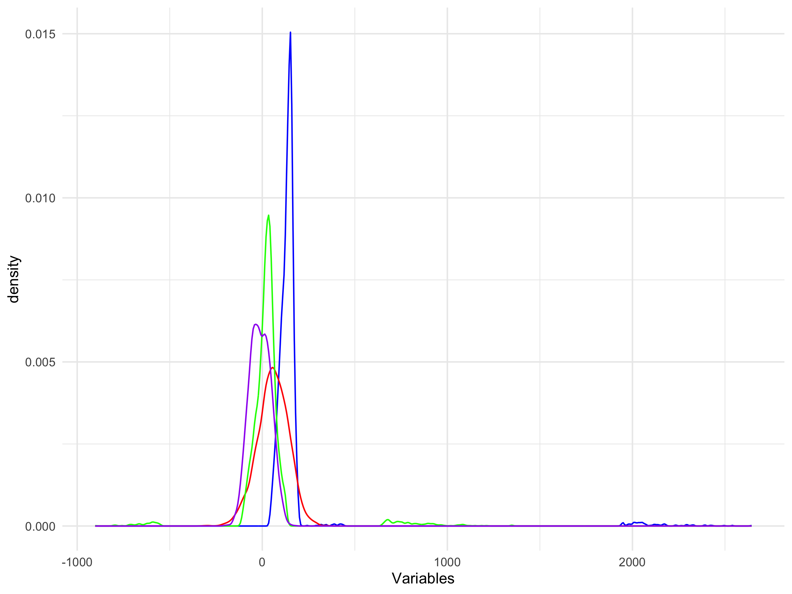
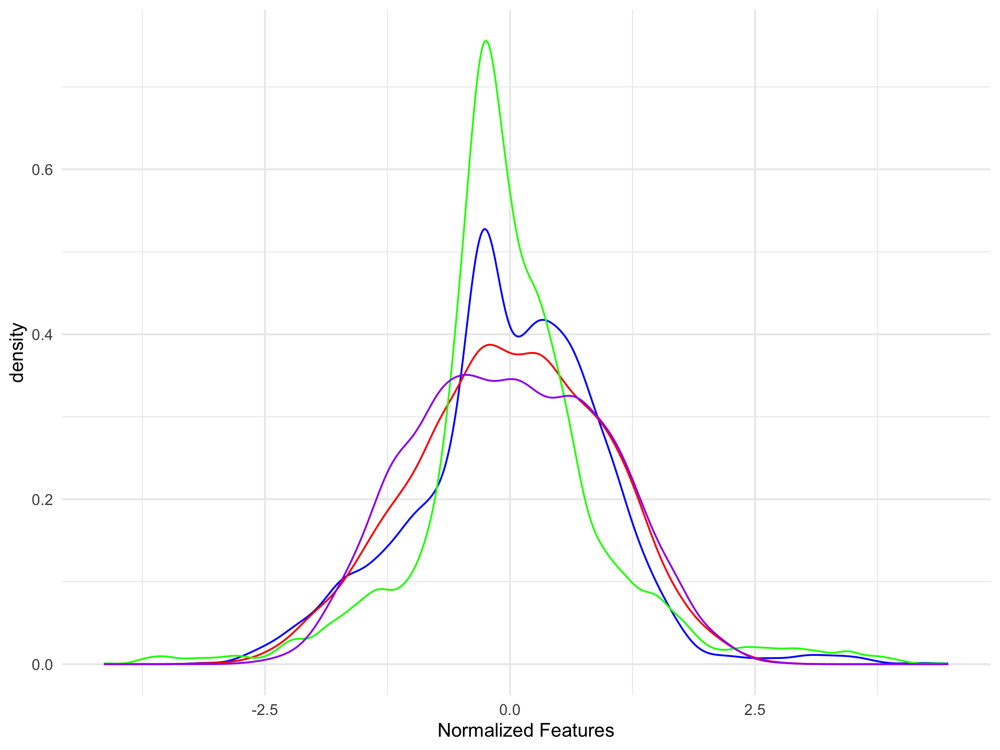
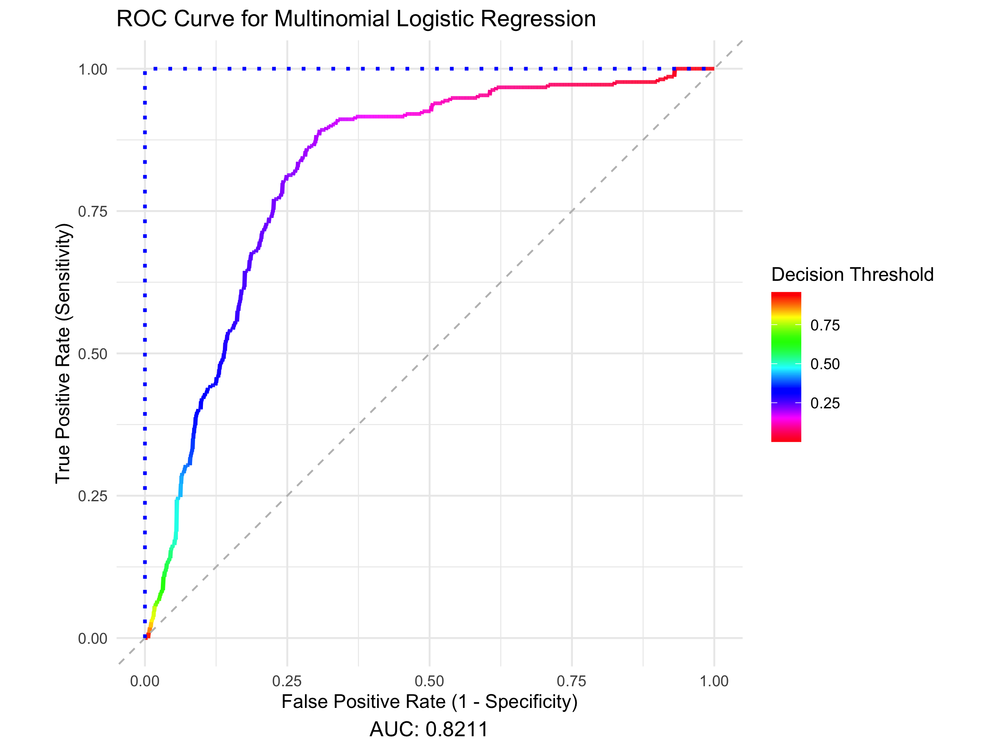
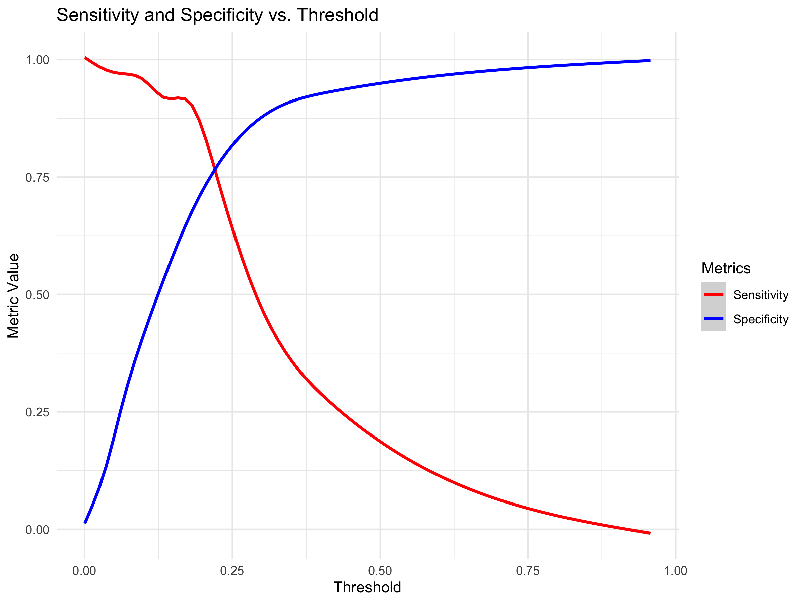

# Multivariable Logistic Binary Classifier - Delinquency Prediction

The panel data-set contains commercial customers’ financial information
and days past due indicator from 2000 to 2020. The goal is to build a
model to predict when customers will be 90+ days past due **(90+DPD)**
on payments.

## Prepare Training Data

``` r
setwd("/Users/jacobrichards/Desktop/DS_DA_Projects/Delinquency_Prediction")
train <- read.csv(file="/Users/jacobrichards/Desktop/DS_DA_Projects/Delinquency_Prediction/Data_Files/FITB_train.csv",header=TRUE)
test <- read.csv(file="/Users/jacobrichards/Desktop/DS_DA_Projects/Delinquency_Prediction/Data_Files/FITB_test.csv",header=TRUE)
```

From checking the distribution of the data, if you look carefully you
can see that the distribution of feature 3 (displayed by the blue curve)
has a lot of values in the extreme right tail.

``` r
library(ggplot2)
ggplot() + geom_density(data=train, aes(x=feature_3), color="blue") +
           geom_density(data=train, aes(x=feature_2), color="red") +
           geom_density(data=train, aes(x=feature_1), color="green") +
           geom_density(data=train, aes(x=feature_4), color="purple") +
           theme_minimal() + xlab("variables")
```

<div align="center">



</div>

This many outliers will add noise that disrupts our models ability to
capture the trend of the data, so we remove the top and bottom
percentiles from feature 3. This is known as **Winsorization**.

``` r
library(dplyr)
train$key <- row.names(train)
feature_3_winsor <- data.frame(feature_3 = train$feature_3, key = row.names(train))
feature_3_winsor_clean <- na.omit(feature_3_winsor)

feature_3_winsor_clean <- feature_3_winsor_clean %>%
  mutate(z_score = (feature_3 - mean(feature_3)) / sd(feature_3),percentile = ecdf(feature_3)(feature_3) * 100)

feature_3_winsor_df <- feature_3_winsor_clean[!(feature_3_winsor_clean[, 4] < 1 | feature_3_winsor_clean[, 4] > 99), ]

non_matching_keys <- anti_join(train, feature_3_winsor_df, by = "key")$key

train <- train %>% mutate(feature_3 = ifelse(key %in% non_matching_keys, NA, feature_3))

colnames(train)[3] <- "feature_3_winsor"
```

We need to fill in the blanks from the values we just removed, so we
will replace them with the median of the non-outliers of feature 3.

``` r
train[is.na(train[,3]),3] <- median(feature_3_winsor_clean$feature_3)

colnames(train)[3] <- "feature_3_impute"

test[is.na(test[,3]),3] <- median(feature_3_winsor_clean$feature_3)
colnames(test)[3] <- "feature_3_impute"
```

Feature 2 has missing values, so for each missing value for we will fill
in the blank with the next years value or the previous years (if the
next year is also missing) corresponding to the same ID.

``` r
train$date <- format(as.Date(train$date, format = "%Y-%m-%d"), "%Y")

train <- train %>%
  arrange(id, date) %>% # Sort by id and date
  group_by(id) %>%
  mutate(feature_2 = ifelse(is.na(feature_2),
                            lead(feature_2, order_by = date), # Try next year
                            feature_2)) %>%
  mutate(feature_2 = ifelse(is.na(feature_2),
                            lag(feature_2, order_by = date), # Try previous year
                            feature_2))

colnames(train)[2] <- "feature_2_impute"


test <- test %>%
  arrange(id, date) %>% 
  group_by(id) %>%
  mutate(feature_2 = ifelse(is.na(feature_2),
                            lead(feature_2, order_by = date), # Try next year
                            feature_2)) %>%
  mutate(feature_2 = ifelse(is.na(feature_2),
                            lag(feature_2, order_by = date), # Try previous year
                            feature_2))

colnames(test)[2] <- "feature_2_impute"

train <- na.omit(train)
test <- na.omit(test)
```

<table style="width:95%;">
<colgroup>
<col style="width: 13%" />
<col style="width: 16%" />
<col style="width: 16%" />
<col style="width: 11%" />
<col style="width: 8%" />
<col style="width: 8%" />
<col style="width: 8%" />
<col style="width: 8%" />
</colgroup>
<thead>
<tr>
<th style="text-align: center;"><p>feature_1</p>
<p>&lt;dbl&gt;</p></th>
<th style="text-align: center;"><p>feature_2_impute</p>
<p>&lt;dbl&gt;</p></th>
<th style="text-align: center;"><p>feature_3_impute</p>
<p>&lt;dbl&gt;</p></th>
<th style="text-align: center;"><p>feature_4</p>
<p>&lt;dbl&gt;</p></th>
<th style="text-align: center;"><p>id</p>
<p>&lt;int&gt;</p></th>
<th style="text-align: center;"><p>date</p>
<p>&lt;chr&gt;</p></th>
<th style="text-align: center;"><p>y</p>
<p>&lt;chr&gt;</p></th>
<th style="text-align: center;"><p>key</p>
<p>&lt;chr&gt;</p></th>
</tr>
</thead>
<tbody>
<tr>
<td style="text-align: center;">39.16508528</td>
<td style="text-align: center;">60.25377</td>
<td style="text-align: center;">137.9861</td>
<td style="text-align: center;">-35.462685</td>
<td style="text-align: center;">50501</td>
<td style="text-align: center;">2000</td>
<td style="text-align: center;">active</td>
<td style="text-align: center;">1</td>
</tr>
<tr>
<td style="text-align: center;">-12.61428906</td>
<td style="text-align: center;">57.95924</td>
<td style="text-align: center;">126.2123</td>
<td style="text-align: center;">44.420647</td>
<td style="text-align: center;">50501</td>
<td style="text-align: center;">2001</td>
<td style="text-align: center;">90+DPD</td>
<td style="text-align: center;">2</td>
</tr>
<tr>
<td style="text-align: center;">0.04381321</td>
<td style="text-align: center;">-39.29391</td>
<td style="text-align: center;">138.6872</td>
<td style="text-align: center;">64.944112</td>
<td style="text-align: center;">50501</td>
<td style="text-align: center;">2002</td>
<td style="text-align: center;">active</td>
<td style="text-align: center;">3</td>
</tr>
<tr>
<td style="text-align: center;">2.29698365</td>
<td style="text-align: center;">49.99669</td>
<td style="text-align: center;">123.7825</td>
<td style="text-align: center;">-3.587873</td>
<td style="text-align: center;">50501</td>
<td style="text-align: center;">2003</td>
<td style="text-align: center;">active</td>
<td style="text-align: center;">4</td>
</tr>
<tr>
<td style="text-align: center;">7.18889687</td>
<td style="text-align: center;">-83.53323</td>
<td style="text-align: center;">150.1020</td>
<td style="text-align: center;">95.359641</td>
<td style="text-align: center;">50501</td>
<td style="text-align: center;">2004</td>
<td style="text-align: center;">active</td>
<td style="text-align: center;">5</td>
</tr>
</tbody>
</table>

Our features (variables) all represent different financial measurements
quantified by different units. In order for these variables to be
measured uniformly, we can reassign each value with it’s corresponding
z-score within it’s respective variable distribution.

``` r
library(dplyr)
train <- train %>%
  mutate(across(c(feature_1, feature_2_impute, feature_3_impute, feature_4), 
                ~ (.x - mean(.x, na.rm = TRUE)) / sd(.x, na.rm = TRUE)))

colnames(train) <- c("feature_1_standard","feature_2_standard","feature_3_standard","feature_4_standard","id","date","y","key")

test <- test %>%
  mutate(across(c(feature_1, feature_2_impute, feature_3_impute, feature_4), 
                ~ (.x - mean(.x, na.rm = TRUE)) / sd(.x, na.rm = TRUE)))

colnames(test) <- c("feature_1_standard","feature_2_standard","feature_3_standard","feature_4_standard","id","date","y")

ggplot() + 
  geom_density(data = train, aes(x = feature_3_standard), color = "blue") +
  geom_density(data = train, aes(x = feature_2_standard), color = "red") +
  geom_density(data = train, aes(x = feature_1_standard), color = "green") +
  geom_density(data = train, aes(x = feature_4_standard), color = "purple") +
  theme_minimal() +
  labs(x = "Standardized Features")
```

<div align="center">



</div>

The preparation of the training data is complete.

## Building The Model

Building a logistic regression model from features 1 to 4 as continuous
independent variables and column y as the binary dependent variable
(true/false).

Given historical data of customers financial information and whether or
not they were **90+ days past due** on payments, we can produce a model
which will generates a probability that a customer will be **90+ days
past due** on payments.

For explanation of logistic regression binary classifiers see the
following invaluable resource:
<https://seantrott.github.io/binary_classification_R/>

When the model produces a probability of an individual being **90+DPD**,
we will have to decide at what probability we draw the conclusion that
the individual will be **90+DPD**. The value chosen has great impact on
the accuracy of the model.

## Fitting The Model

**decision threshold:** The minimum predicted probability value from the
model that a customer will be **90+ DPD** at which it is concluded that
the customer will be **90+ DPD**.

Since the outcome of whether or not there will be late payments is known
in our testing data. We can asses the accuracy of the model by
evaluating the model on the testing data and directly comparing the
predicted outcomes to the actual outcomes, as well we can asses the
impact of the **decision threshold** we used on the models accuracy.

The testing data is completely distinct from the data used to produce
the model, so the accuracy results of the model being evaluated on it
are representative of the models accuracy being evaluated of future
data. The following analysis are those accuracy results.

``` r
print(head(test,5))
```

    ## # A tibble: 5 × 7
    ## # Groups:   id [1]
    ##   feature_1_standard feature_2_standard feature_3_standard feature_4_standard
    ##                <dbl>              <dbl>              <dbl>              <dbl>
    ## 1             0.161              -0.991             0.0121              0.993
    ## 2             0.121              -0.327            -0.938              -0.328
    ## 3            -0.0959             -0.899            -2.18               -0.658
    ## 4             0.584               0.940             1.33               -0.279
    ## 5             0.0399             -1.45             -0.415               1.27 
    ## # ℹ 3 more variables: id <int>, date <chr>, y <chr>

To asses the accuracy of the model and find the optimal decision
threshold we produce the ROC curve.

``` r
    library(pROC)
    test$predicted_y <- predict(delinquency_model, newdata = test, type = "class")
    test$y_numeric <- as.numeric(as.character(factor(test$y, levels = c("90+DPD", "active"), labels = c(1, 0))))
    test$Probability <- predict(delinquency_model, newdata = test, type = "probs")
    options(digits = 4)
    
roc_curve <- roc(response = test$y_numeric, predictor = test$Probability)

roc_metrics <- coords(roc_curve, x = "all", ret = c("threshold", "sensitivity", "specificity"))

auc_value <- auc(roc_curve)

roc_data <- data.frame(TPR = roc_metrics$sensitivity,FPR = roc_metrics$specificity,Threshold = roc_metrics$threshold)

ggplot(roc_data, aes(x = FPR, y = TPR, color = Threshold)) +
  geom_line(size = 1) +
  geom_abline(slope = 1, intercept = 1, linetype = "dashed", color = "gray") +  
  geom_line(data = data.frame(FPR = c(1, 1, 0), TPR = c(0, 1, 1)), aes(x = FPR, y = TPR), 
  color = "blue", size = 1, linetype = "dotted") +
  labs(title = "ROC Curve for Multinomial Logistic Regression",
  x = "Specificity",
  y = "True Positive Rate (Sensitivity)",
  caption = paste("AUC:", round(auc_value, 4)),
  color = "Decision Threshold") +
  scale_color_gradientn(colors = rev(rainbow(100))) +
  coord_fixed() +
  scale_x_reverse() +  # Reverse the x-axis
  ylim(0, 1) +
  theme_minimal() +
  theme(plot.caption = element_text(hjust = 0.5, size = 12))
```

<div align="center">



</div>

### The ROC curve is a plot of the models prediction accuracy ratios Sensitivity (y-axis) by Specificity (x-axis) as a result of the decision threshold chosen which is displayed by color gradient.

**Sensitivity:** *what proportion of individuals who were **90+ DPD**
did the model correctly predict as being **90+ DPD.***

**Specificity:** *what proportion of individuals who were **not 90+
DDP** did the model correctly predict as being **not 90+ DPD.***

**AUC:** The area under the ROC curve, AUC is used as a metric for
overall model performance as the ROC curve is the result of accuracy
metrics from the entire range of decision thresholds. The blue dotted
line is a perfect model containing 100% of the area under it’s curve,
the grey line is if you were to predict the outcome by tossing a coin
and thus naturally the area under it’s curve is 50%.

The **AUC** of our model is 0.8211.

To illustrate the meaning of this curve take for example the accuracy
results if you were to select a decision threshold of 0.50 represented
as cyan blue: Your specificity would be about 94% which is good since
you did not falsely predict too many late payments. However, your
sensitivity would only be 25%, such that you only successfully predicted
25% of the late payments. Conversely if you had selected a decision
threshold of .10 represented as pink-red you would successfully predict
94% of late payments but only 25% of individuals who were not late on
payments were correctly identified as such by the model.

Therefore, the **decision threshold** we choose is a trade off between
successfully predicting late payments and successfully predicting non
late payments.

The **decision threshold** which balances these goals is visually
evident in the following plot.

``` r
ggplot(roc_metrics, aes(x = threshold)) +
    geom_smooth(aes(y = sensitivity, color = "Sensitivity")) +
    geom_smooth(aes(y = specificity, color = "Specificity")) +
    labs(title = "Sensitivity and Specificity vs. Threshold",
    x = "Threshold", y = "Metric Value") +
    scale_color_manual(name = "Metrics", values = c("Sensitivity" = "red", "Specificity" = "blue")) +
    theme_minimal()
```

<div align="center">



</div>

The balanced **decision threshold** is visually apparent by the
intersection of **Sensitivity** and **Specificity** and by the following
simple calculation.

``` r
optimal_threshold <- roc_metrics$threshold[which.min(abs(roc_metrics$sensitivity - roc_metrics$specificity))]
```

| **threshold** | **sensitivity** | **specificity** |
|:-------------:|:---------------:|:---------------:|
|    0.2244     |      0.771      |     0.7716      |

Confusion matrix displaying the results of balanced decision threshold
evaluated on the testing data.

``` r
test$predicted_class <- ifelse(test$Probability >= roc_metrics$threshold[which.min(abs(roc_metrics$sensitivity - roc_metrics$specificity))], 1, 0)

library(caret)
conf_matrix <- confusionMatrix(
  factor(test$predicted_class, levels = c(0, 1)),
  factor(test$y_numeric, levels = c(0, 1)))

confusion_table <- as.data.frame.matrix(conf_matrix$table)
rownames(confusion_table) <- c("Actual: Non-delinquent", "Actual: Delinquent")
colnames(confusion_table) <- c("Predicted: Non-delinquent", "Predicted: Delinquent")
```

|  | **Predicted: Non-delinquent** | **Predicted: Delinquent** |
|:--:|:--:|:--:|
| Actual: Non-delinquent | 652 | 49 |
| Actual: Delinquent | 193 | 165 |
