```python
import numpy as np 
import pandas as pd 
import os
import matplotlib.pyplot as plt

os.chdir("/Users/jacobrichards/Desktop/DS_DA_Projects/Marketing_Prediction")

data = pd.read_csv("data.csv", na_values=["", "NA"])

import warnings
warnings.filterwarnings('ignore')

```

# Investigation of Logistic Regression Performance for Binary Classification

## By diagnosing why the Logistic Regression model failed to make accurate predictions, we can study first-hand the best practices and proper utilization of the Logistic Regression method.

## Our model performs binary classification to predict responses to an advertisement campaign based on individual characteristics: age, distance from sales location, income bracket, gender, and marital status.


```python
display(data.head())
```


<div>
<style scoped>
    .dataframe tbody tr th:only-of-type {
        vertical-align: middle;
    }

    .dataframe tbody tr th {
        vertical-align: top;
    }

    .dataframe thead th {
        text-align: right;
    }
</style>
<table border="1" class="dataframe">
  <thead>
    <tr style="text-align: right;">
      <th></th>
      <th>id</th>
      <th>age</th>
      <th>dist</th>
      <th>income</th>
      <th>gender</th>
      <th>marital_status</th>
      <th>target</th>
    </tr>
  </thead>
  <tbody>
    <tr>
      <th>0</th>
      <td>1</td>
      <td>73</td>
      <td>4.371654</td>
      <td>90-99,999</td>
      <td>M</td>
      <td>S</td>
      <td>1</td>
    </tr>
    <tr>
      <th>1</th>
      <td>2</td>
      <td>89</td>
      <td>1.582733</td>
      <td>100-149,999</td>
      <td>M</td>
      <td>NaN</td>
      <td>1</td>
    </tr>
    <tr>
      <th>2</th>
      <td>3</td>
      <td>85</td>
      <td>1.223810</td>
      <td>10-19,999</td>
      <td>F</td>
      <td>S</td>
      <td>1</td>
    </tr>
    <tr>
      <th>3</th>
      <td>4</td>
      <td>76</td>
      <td>2.962427</td>
      <td>90-99,999</td>
      <td>M</td>
      <td>M</td>
      <td>1</td>
    </tr>
    <tr>
      <th>4</th>
      <td>5</td>
      <td>76</td>
      <td>2.594408</td>
      <td>10-19,999</td>
      <td>M</td>
      <td>S</td>
      <td>1</td>
    </tr>
  </tbody>
</table>
</div>


# clean data 


```python
import pandas as pd
import numpy as np

# Replace missing or empty values in columns 4, 5, 6 with "unknown"
data.iloc[:, [3, 4, 5]] = data.iloc[:, [3, 4, 5]].applymap(lambda x: "unknown" if pd.isna(x) or x == "" else x)

# Replace income with appropriate midpoints or custom values
income_mapping = {
    "unknown": 6,              # replacing unknown with the median income level
    "Under $10k": 1,            # midpoint of "Under $10k"
    "10-19,999": 2,            # midpoint of "10-19,999"
    "20-29,999": 3,            # midpoint of "20-29,999"
    "30-39,999": 4,            # midpoint of "30-39,999"
    "40-49,999": 5,            # midpoint of "40-49,999"
    "50-59,999": 6,            # midpoint of "50-59,999"
    "60-69,999": 7,            # midpoint of "60-69,999"
    "70-79,999": 8,            # midpoint of "70-79,999"
    "80-89,999": 9,            # midpoint of "80-89,999"
    "90-99,999": 10,            # midpoint of "90-99,999"
    "100-149,999": 11,         # midpoint of "100-149,999"
    "150 - 174,999": 12,       # midpoint of "150 - 174,999"
    "175 - 199,999": 13,       # midpoint of "175 - 199,999"
    "200 - 249,999": 14,       # midpoint of "200 - 249,999"
    "250k+": 15               # custom value for "250k+"
}
data["income"] = data["income"].map(income_mapping).astype(int)

# Replace gender with 1 for male, 0 for female, and 0 for unknown
gender_mapping = {"M": 1, "F": 0, "unknown": 0}
data["gender"] = data["gender"].map(gender_mapping).astype(int)

# Replace marital_status with 1 for married, 0 for single, and 1 for unknown
marital_status_mapping = {"M": 1, "S": 0, "unknown": 1}
data["marital_status"] = data["marital_status"].map(marital_status_mapping).astype(int)

# Convert target to categorical values (0 or 1)
data["target"] = data["target"].astype(int)

# Convert distance (dist) column to integer
data["dist"] = data["dist"].astype(int)
```

Male is 1 and female is 0, married is 1 and single is 0, and response is 1 and no response is 0. 


```python
display(data.head())
```


<div>
<style scoped>
    .dataframe tbody tr th:only-of-type {
        vertical-align: middle;
    }

    .dataframe tbody tr th {
        vertical-align: top;
    }

    .dataframe thead th {
        text-align: right;
    }
</style>
<table border="1" class="dataframe">
  <thead>
    <tr style="text-align: right;">
      <th></th>
      <th>id</th>
      <th>age</th>
      <th>dist</th>
      <th>income</th>
      <th>gender</th>
      <th>marital_status</th>
      <th>target</th>
    </tr>
  </thead>
  <tbody>
    <tr>
      <th>0</th>
      <td>1</td>
      <td>73</td>
      <td>4</td>
      <td>10</td>
      <td>1</td>
      <td>0</td>
      <td>1</td>
    </tr>
    <tr>
      <th>1</th>
      <td>2</td>
      <td>89</td>
      <td>1</td>
      <td>11</td>
      <td>1</td>
      <td>1</td>
      <td>1</td>
    </tr>
    <tr>
      <th>2</th>
      <td>3</td>
      <td>85</td>
      <td>1</td>
      <td>2</td>
      <td>0</td>
      <td>0</td>
      <td>1</td>
    </tr>
    <tr>
      <th>3</th>
      <td>4</td>
      <td>76</td>
      <td>2</td>
      <td>10</td>
      <td>1</td>
      <td>1</td>
      <td>1</td>
    </tr>
    <tr>
      <th>4</th>
      <td>5</td>
      <td>76</td>
      <td>2</td>
      <td>2</td>
      <td>1</td>
      <td>0</td>
      <td>1</td>
    </tr>
  </tbody>
</table>
</div>


# Evaluate Logistic Regression


```python
# LOGISTIC REGRESSION MODEL

from sklearn.linear_model import LogisticRegression
from sklearn.model_selection import train_test_split
import statsmodels.api as sm
from sklearn.metrics import roc_curve, auc
import numpy as np
import matplotlib.pyplot as plt
from sklearn.metrics import confusion_matrix
import seaborn as sns

# Prepare features (X) and target (y)
X = data[['age', 'dist', 'income', 'gender', 'marital_status']]
y = data['target']

# Add a constant (intercept) to the features
X = sm.add_constant(X)

# Split the data into training and testing sets
X_train, X_test, y_train, y_test = train_test_split(X, y, test_size=0.2, random_state=42)

# Create and fit the logistic regression model with increased max_iter
log_reg = LogisticRegression(random_state=42, fit_intercept=True, max_iter=1000)
log_reg.fit(X_train, y_train)

# Print model parameters including intercept
print("Model Intercept:", log_reg.intercept_[0])
print("\nFeature Coefficients:")
for feature, coef in zip(X.columns[1:], log_reg.coef_[0][1:]):  # Skip the constant column
    print(f"{feature}: {coef:.4f}")

# Calculate and print the model accuracy
train_accuracy = log_reg.score(X_train, y_train)
test_accuracy = log_reg.score(X_test, y_test)

print(f"\nTraining Accuracy: {train_accuracy:.3f}")
print(f"Testing Accuracy: {test_accuracy:.3f}")

# Get prediction probabilities
y_pred_proba = log_reg.predict_proba(X_test)[:, 1]

# Calculate ROC curve points
fpr, tpr, thresholds = roc_curve(y_test, y_pred_proba)
roc_auc = auc(fpr, tpr)

# Calculate sensitivity and specificity for different thresholds
sensitivity = tpr
specificity = 1 - fpr

# Find optimal threshold where sensitivity and specificity are closest
differences = np.abs(sensitivity - specificity)
optimal_idx = np.argmin(differences)
optimal_threshold = thresholds[optimal_idx]

# Create figure with two subplots
fig, (ax1, ax2) = plt.subplots(1, 2, figsize=(10, 5))

# Plot ROC curve
ax1.plot(fpr, tpr, color='darkorange', lw=2, label=f'ROC curve (AUC = {roc_auc:.2f})')
ax1.plot([0, 1], [0, 1], color='navy', lw=2, linestyle='--')
ax1.set_xlim([0.0, 1.0])
ax1.set_ylim([0.0, 1.05])
ax1.set_xlabel('False Positive Rate')
ax1.set_ylabel('True Positive Rate')
ax1.set_title('Receiver Operating Characteristic (ROC)')
ax1.legend(loc="lower right")

# Plot sensitivity/specificity vs threshold
ax2.plot(thresholds, sensitivity, label='Sensitivity', color='green')
ax2.plot(thresholds, specificity, label='Specificity', color='red')
ax2.axvline(x=optimal_threshold, color='black', linestyle='--', label=f'Optimal threshold ({optimal_threshold:.3f})')
ax2.set_xlabel('Decision Threshold')
ax2.set_ylabel('Score')
ax2.set_title('Sensitivity and Specificity vs Threshold')
ax2.legend()

plt.tight_layout()
plt.show()

# Find optimal threshold where sensitivity and specificity are closest
differences = np.abs(sensitivity - specificity)
optimal_idx = np.argmin(differences)
optimal_threshold = thresholds[optimal_idx]

print(f"Optimal threshold: {optimal_threshold:.3f}")
print(f"At this threshold:")
print(f"Sensitivity: {sensitivity[optimal_idx]:.3f}")
print(f"Specificity: {specificity[optimal_idx]:.3f}")

# Get predictions using optimal threshold
y_pred_optimal = (y_pred_proba >= optimal_threshold).astype(int)

# Calculate and plot confusion matrix
cm = confusion_matrix(y_test, y_pred_optimal)

plt.figure(figsize=(8, 6))
sns.heatmap(cm, annot=True, fmt='d', cmap='Blues')
plt.title('Confusion Matrix at Optimal Threshold')
plt.ylabel('True Label')
plt.xlabel('Predicted Label')
plt.show()

# Train Logistic Regression model and get predictions for lift chart
predictors = ['age', 'income', 'dist', 'gender', 'marital_status']
target = 'target'

# Split data into training and test sets
X = data[predictors]
y = data[target]
X_train, X_test, y_train, y_test = train_test_split(X, y, test_size=0.2, random_state=42)

# Initialize and fit Logistic Regression model
lr_model = LogisticRegression(random_state=42)
lr_model.fit(X_train, y_train)

# Predict probabilities for the entire dataset
data['predicted_probs'] = lr_model.predict_proba(X)[:, 1]

# Sort and shuffle data
data_sorted_lr = data.sort_values(by='predicted_probs', ascending=False)
data_shuffled_lr = data.sample(frac=1, random_state=42).reset_index(drop=True)

def lift_chart(sorted_data, shuffled_data):
    """
    Computes and plots the lift chart comparing sorted vs shuffled data
    
    Parameters:
    - sorted_data: DataFrame sorted by predicted probabilities
    - shuffled_data: DataFrame in random order
    """
    # Calculate cumulative positives at each decile
    total_positives = sorted_data['target'].sum()
    n_rows = len(sorted_data)
    
    lift_curve = []
    baseline_curve = []
    
    for i in range(11):
        cutoff = int((i/10) * n_rows)
        
        # Lift curve from sorted data
        lift_percentage = sorted_data.iloc[:cutoff]['target'].sum() / total_positives * 100
        lift_curve.append(lift_percentage)
        
        # Baseline from shuffled data 
        baseline_percentage = (i/10) * 100
        baseline_curve.append(baseline_percentage)
    
    # Create results DataFrame
    lift_data = pd.DataFrame({
        'Lift Curve': lift_curve,
        'Baseline': baseline_curve
    })
    lift_data['Lift'] = lift_data['Lift Curve'] - lift_data['Baseline']
    
    print("\nLogistic Regression Lift Chart Data:")
    display(lift_data)
    
    # Plot lift chart
    plt.figure(figsize=(10, 6))
    plt.plot(np.linspace(0, 100, 11), lift_data['Lift Curve'],
             label='Lift Curve', color='blue', marker='o')
    plt.plot(np.linspace(0, 100, 11), lift_data['Baseline'],
             label='Baseline', color='red', linestyle='--', marker='o')
    
    plt.title('Logistic Regression Lift Chart Analysis')
    plt.xlabel('Percentage of Data')
    plt.ylabel('Percentage of Positive Cases Captured')
    plt.xticks(np.linspace(0, 100, 11))
    plt.yticks(np.linspace(0, 100, 11))
    plt.legend()
    plt.grid(True, linestyle='--', alpha=0.5)
    plt.show()
    
    # Calculate and plot advantage curve
    advantage_data = lift_data.copy()
    advantage_data['Lift Curve'] = advantage_data['Lift Curve'] / advantage_data['Baseline']
    advantage_data['Baseline'] = advantage_data['Baseline'] / advantage_data['Baseline']
    advantage_data = advantage_data.iloc[1:] # Remove first row to avoid division by zero
    
    plt.figure(figsize=(10, 6))
    plt.plot(np.linspace(10, 100, 10), advantage_data['Lift Curve'],
             label='Lift Curve', color='blue', marker='o')
    plt.plot(np.linspace(10, 100, 10), advantage_data['Baseline'],
             label='Baseline', color='red', linestyle='--', marker='o')
    
    plt.title('Logistic Regression Advantage Curve Analysis')
    plt.xlabel('Percentage of Customers Contacted')
    plt.ylabel('Relative Lift (Lift/Baseline)')
    plt.xticks(np.linspace(10, 100, 10))
    plt.ylim(0.5, 5)
    plt.legend(title='Legend')
    plt.grid(True, linestyle='--', alpha=0.5)
    plt.show()
    
    return lift_data

# Generate lift chart
print("Lift Chart for Logistic Regression Model:")
lift_data_lr = lift_chart(data_sorted_lr, data_shuffled_lr)

print("\nTop rows of sorted data (by predicted probabilities):")
display(data_sorted_lr.head())

print("\nTop rows of shuffled data (random order):")
display(data_shuffled_lr.head())
```

    Model Intercept: -4.5547880441748685
    
    Feature Coefficients:
    age: 0.0488
    dist: -0.0162
    income: -0.1106
    gender: 0.4162
    marital_status: 0.4290
    
    Training Accuracy: 0.754
    Testing Accuracy: 0.715


    
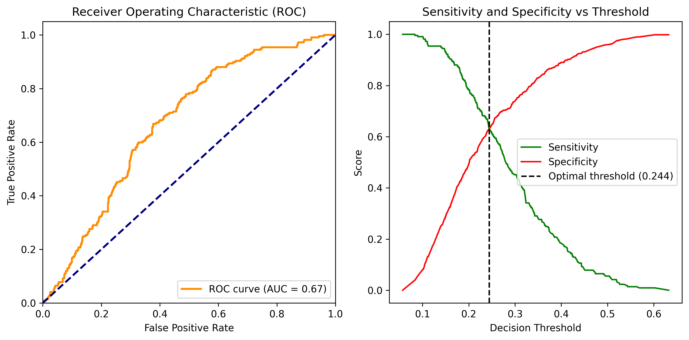
    


    Optimal threshold: 0.244
    At this threshold:
    Sensitivity: 0.627
    Specificity: 0.628


    
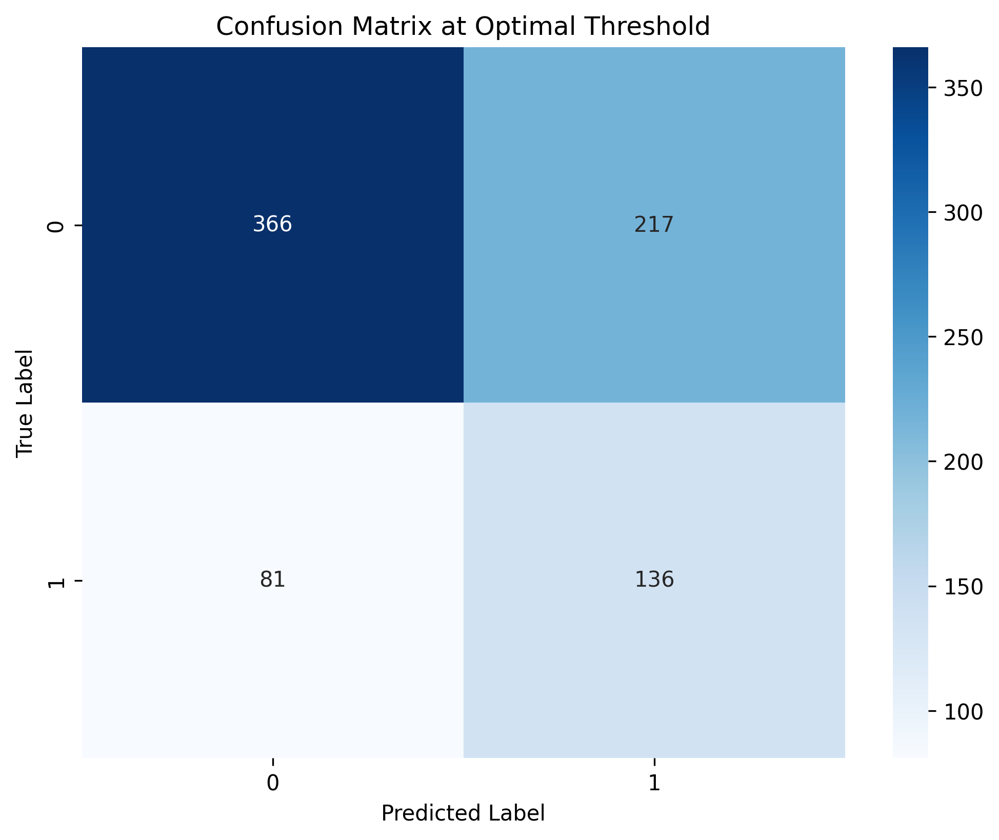
    


    Lift Chart for Logistic Regression Model:
    
    Logistic Regression Lift Chart Data:


<div>
<style scoped>
    .dataframe tbody tr th:only-of-type {
        vertical-align: middle;
    }

    .dataframe tbody tr th {
        vertical-align: top;
    }

    .dataframe thead th {
        text-align: right;
    }
</style>
<table border="1" class="dataframe">
  <thead>
    <tr style="text-align: right;">
      <th></th>
      <th>Lift Curve</th>
      <th>Baseline</th>
      <th>Lift</th>
    </tr>
  </thead>
  <tbody>
    <tr>
      <th>0</th>
      <td>0.0</td>
      <td>0.0</td>
      <td>0.0</td>
    </tr>
    <tr>
      <th>1</th>
      <td>15.6</td>
      <td>10.0</td>
      <td>5.6</td>
    </tr>
    <tr>
      <th>2</th>
      <td>31.4</td>
      <td>20.0</td>
      <td>11.4</td>
    </tr>
    <tr>
      <th>3</th>
      <td>46.5</td>
      <td>30.0</td>
      <td>16.5</td>
    </tr>
    <tr>
      <th>4</th>
      <td>61.3</td>
      <td>40.0</td>
      <td>21.3</td>
    </tr>
    <tr>
      <th>5</th>
      <td>72.1</td>
      <td>50.0</td>
      <td>22.1</td>
    </tr>
    <tr>
      <th>6</th>
      <td>78.9</td>
      <td>60.0</td>
      <td>18.9</td>
    </tr>
    <tr>
      <th>7</th>
      <td>85.8</td>
      <td>70.0</td>
      <td>15.8</td>
    </tr>
    <tr>
      <th>8</th>
      <td>92.0</td>
      <td>80.0</td>
      <td>12.0</td>
    </tr>
    <tr>
      <th>9</th>
      <td>97.2</td>
      <td>90.0</td>
      <td>7.2</td>
    </tr>
    <tr>
      <th>10</th>
      <td>100.0</td>
      <td>100.0</td>
      <td>0.0</td>
    </tr>
  </tbody>
</table>
</div>


    
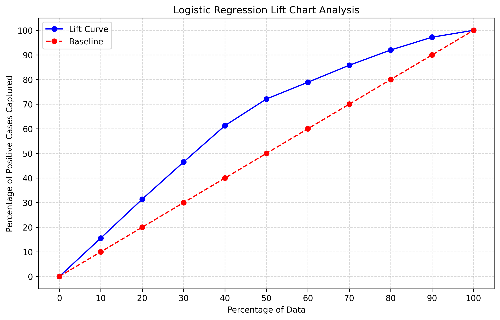
    


    
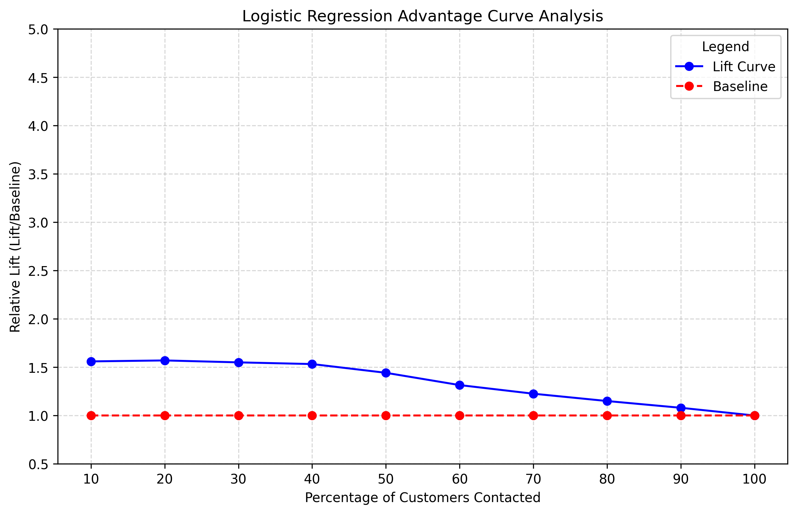
    


    
    Top rows of sorted data (by predicted probabilities):


<div>
<style scoped>
    .dataframe tbody tr th:only-of-type {
        vertical-align: middle;
    }

    .dataframe tbody tr th {
        vertical-align: top;
    }

    .dataframe thead th {
        text-align: right;
    }
</style>
<table border="1" class="dataframe">
  <thead>
    <tr style="text-align: right;">
      <th></th>
      <th>id</th>
      <th>age</th>
      <th>dist</th>
      <th>income</th>
      <th>gender</th>
      <th>marital_status</th>
      <th>target</th>
      <th>predicted_probs</th>
    </tr>
  </thead>
  <tbody>
    <tr>
      <th>3917</th>
      <td>3918</td>
      <td>94</td>
      <td>1</td>
      <td>2</td>
      <td>1</td>
      <td>1</td>
      <td>0</td>
      <td>0.655432</td>
    </tr>
    <tr>
      <th>2393</th>
      <td>2394</td>
      <td>94</td>
      <td>2</td>
      <td>2</td>
      <td>1</td>
      <td>1</td>
      <td>1</td>
      <td>0.651772</td>
    </tr>
    <tr>
      <th>442</th>
      <td>443</td>
      <td>94</td>
      <td>3</td>
      <td>2</td>
      <td>1</td>
      <td>1</td>
      <td>1</td>
      <td>0.648094</td>
    </tr>
    <tr>
      <th>2151</th>
      <td>2152</td>
      <td>94</td>
      <td>0</td>
      <td>3</td>
      <td>1</td>
      <td>1</td>
      <td>0</td>
      <td>0.633796</td>
    </tr>
    <tr>
      <th>460</th>
      <td>461</td>
      <td>92</td>
      <td>1</td>
      <td>2</td>
      <td>1</td>
      <td>1</td>
      <td>1</td>
      <td>0.633055</td>
    </tr>
  </tbody>
</table>
</div>


    
    Top rows of shuffled data (random order):


<div>
<style scoped>
    .dataframe tbody tr th:only-of-type {
        vertical-align: middle;
    }

    .dataframe tbody tr th {
        vertical-align: top;
    }

    .dataframe thead th {
        text-align: right;
    }
</style>
<table border="1" class="dataframe">
  <thead>
    <tr style="text-align: right;">
      <th></th>
      <th>id</th>
      <th>age</th>
      <th>dist</th>
      <th>income</th>
      <th>gender</th>
      <th>marital_status</th>
      <th>target</th>
      <th>predicted_probs</th>
    </tr>
  </thead>
  <tbody>
    <tr>
      <th>0</th>
      <td>556</td>
      <td>77</td>
      <td>5</td>
      <td>11</td>
      <td>0</td>
      <td>0</td>
      <td>0</td>
      <td>0.109804</td>
    </tr>
    <tr>
      <th>1</th>
      <td>3492</td>
      <td>82</td>
      <td>3</td>
      <td>11</td>
      <td>1</td>
      <td>1</td>
      <td>1</td>
      <td>0.274687</td>
    </tr>
    <tr>
      <th>2</th>
      <td>528</td>
      <td>80</td>
      <td>3</td>
      <td>11</td>
      <td>0</td>
      <td>1</td>
      <td>0</td>
      <td>0.184691</td>
    </tr>
    <tr>
      <th>3</th>
      <td>3926</td>
      <td>73</td>
      <td>1</td>
      <td>3</td>
      <td>1</td>
      <td>0</td>
      <td>0</td>
      <td>0.284534</td>
    </tr>
    <tr>
      <th>4</th>
      <td>2990</td>
      <td>69</td>
      <td>5</td>
      <td>2</td>
      <td>1</td>
      <td>1</td>
      <td>0</td>
      <td>0.344707</td>
    </tr>
  </tbody>
</table>
</div>


# Logistic Regression Performance.

The most important performance metric for this model is our lift chart. We want to yeild the most customer responses while sampling the least percentage of potential customers. 
The logistic regression model obtained 70% of the totall responses from potential customers only upon sampling 50% of potential customers. This is very poor, as if we had sampled customers randomly we would has obtain 50% of the totall responses upon sampling 50% of them.

This is indicative of the models poor ability to predict posative responses.

# Evaluate Random Forest


```python
# 1. Train Random Forest model
from sklearn.ensemble import RandomForestClassifier
from sklearn.model_selection import train_test_split

# Prepare features (X) and target (y)
X = data[['age', 'dist', 'income', 'gender', 'marital_status']]
y = data['target']

# Split the data
X_train, X_test, y_train, y_test = train_test_split(X, y, test_size=0.2, random_state=42)

# Create and fit the random forest model
rf_model = RandomForestClassifier(n_estimators=100, random_state=42)
rf_model.fit(X_train, y_train)

# Calculate and print model accuracy
train_accuracy = rf_model.score(X_train, y_train)
test_accuracy = rf_model.score(X_test, y_test)

print(f"Training Accuracy: {train_accuracy:.3f}")
print(f"Testing Accuracy: {test_accuracy:.3f}")

# 2. ROC Curve
import numpy as np
import matplotlib.pyplot as plt
from sklearn.metrics import roc_curve, auc

# Get prediction probabilities
y_pred_proba = rf_model.predict_proba(X_test)[:, 1]

# Calculate ROC curve points
fpr, tpr, thresholds = roc_curve(y_test, y_pred_proba)
roc_auc = auc(fpr, tpr)

# Calculate sensitivity and specificity
sensitivity = tpr
specificity = 1 - fpr

# Find optimal threshold
differences = np.abs(sensitivity - specificity)
optimal_idx = np.argmin(differences)
optimal_threshold = thresholds[optimal_idx]

# Create figure with two subplots
fig, (ax1, ax2) = plt.subplots(1, 2, figsize=(10, 5))

# Plot ROC curve
ax1.plot(fpr, tpr, color='darkorange', lw=2, label=f'ROC curve (AUC = {roc_auc:.2f})')
ax1.plot([0, 1], [0, 1], color='navy', lw=2, linestyle='--')
ax1.set_xlim([0.0, 1.0])
ax1.set_ylim([0.0, 1.05])
ax1.set_xlabel('False Positive Rate')
ax1.set_ylabel('True Positive Rate')
ax1.set_title('Receiver Operating Characteristic (ROC)')
ax1.legend(loc="lower right")

# Plot sensitivity/specificity vs threshold
ax2.plot(thresholds, sensitivity, label='Sensitivity', color='green')
ax2.plot(thresholds, specificity, label='Specificity', color='red')
ax2.axvline(x=optimal_threshold, color='black', linestyle='--', label=f'Optimal threshold ({optimal_threshold:.3f})')
ax2.set_xlabel('Decision Threshold')
ax2.set_ylabel('Score')
ax2.set_title('Sensitivity and Specificity vs Threshold')
ax2.legend()

plt.tight_layout()
plt.show()

# 3. Print threshold metrics and confusion matrix
print(f"Optimal threshold: {optimal_threshold:.3f}")
print(f"At this threshold:")
print(f"Sensitivity: {sensitivity[optimal_idx]:.3f}")
print(f"Specificity: {specificity[optimal_idx]:.3f}")

# Get predictions using optimal threshold
y_pred_optimal = (y_pred_proba >= optimal_threshold).astype(int)

# Calculate and plot confusion matrix
from sklearn.metrics import confusion_matrix
import seaborn as sns

cm = confusion_matrix(y_test, y_pred_optimal)

plt.figure(figsize=(8, 6))
sns.heatmap(cm, annot=True, fmt='d', cmap='Blues')
plt.title('Confusion Matrix at Optimal Threshold')
plt.ylabel('True Label')
plt.xlabel('Predicted Label')
plt.show()

# 4. Lift Chart and Advantage Curve
# Get predictions for entire dataset
data['predicted_probs'] = rf_model.predict_proba(X)[:, 1]

# Sort and shuffle data
data_sorted = data.sort_values(by='predicted_probs', ascending=False)
data_shuffled = data.sample(frac=1, random_state=42).reset_index(drop=True)

# Calculate lift chart data
total_positives = data_sorted['target'].sum()
n_rows = len(data_sorted)

lift_curve = []
baseline_curve = []

for i in range(11):
    cutoff = int((i/10) * n_rows)
    lift_percentage = data_sorted.iloc[:cutoff]['target'].sum() / total_positives * 100
    baseline_percentage = (i/10) * 100
    lift_curve.append(lift_percentage)
    baseline_curve.append(baseline_percentage)

# Create lift chart DataFrame
lift_data = pd.DataFrame({
    'Lift Curve': lift_curve,
    'Baseline': baseline_curve
})
lift_data['Lift'] = lift_data['Lift Curve'] - lift_data['Baseline']
# ... previous code up to lift_data creation ...

# Display lift chart data table
print("\nRandom Forest Lift Chart Data:")
display(lift_data)

# ... rest of the code (visualizations and data previews) ...
# Plot lift chart
plt.figure(figsize=(10, 6))
plt.plot(np.linspace(0, 100, 11), lift_data['Lift Curve'],
         label='Lift Curve', color='blue', marker='o')
plt.plot(np.linspace(0, 100, 11), lift_data['Baseline'],
         label='Baseline', color='red', linestyle='--', marker='o')

plt.title('Random Forest Lift Chart Analysis')
plt.xlabel('Percentage of Data')
plt.ylabel('Percentage of Positive Cases Captured')
plt.xticks(np.linspace(0, 100, 11))
plt.yticks(np.linspace(0, 100, 11))
plt.legend()
plt.grid(True, linestyle='--', alpha=0.5)
plt.show()

# Plot advantage curve
advantage_data = lift_data.copy()
advantage_data['Lift Curve'] = advantage_data['Lift Curve'] / advantage_data['Baseline']
advantage_data['Baseline'] = advantage_data['Baseline'] / advantage_data['Baseline']
advantage_data = advantage_data.iloc[1:] # Remove first row to avoid division by zero

plt.figure(figsize=(10, 6))
plt.plot(np.linspace(10, 100, 10), advantage_data['Lift Curve'],
         label='Lift Curve', color='blue', marker='o')
plt.plot(np.linspace(10, 100, 10), advantage_data['Baseline'],
         label='Baseline', color='red', linestyle='--', marker='o')

plt.title('Random Forest Advantage Curve Analysis')
plt.xlabel('Percentage of Customers Contacted')
plt.ylabel('Relative Lift (Lift/Baseline)')
plt.xticks(np.linspace(10, 100, 10))
plt.ylim(0.5, 5)
plt.legend(title='Legend')
plt.grid(True, linestyle='--', alpha=0.5)
plt.show()

# ... previous code remains the same until after the advantage curve plot ...

# Display preview of sorted and shuffled data
print("\nTop rows of sorted data (by predicted probabilities):")
display(data_sorted.head())

print("\nTop rows of shuffled data (random order):")
display(data_shuffled.head())
```

    Training Accuracy: 0.973
    Testing Accuracy: 0.680


    
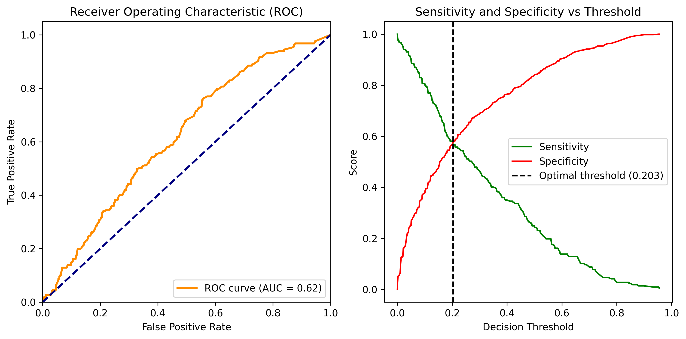
    


    Optimal threshold: 0.203
    At this threshold:
    Sensitivity: 0.567
    Specificity: 0.576


    
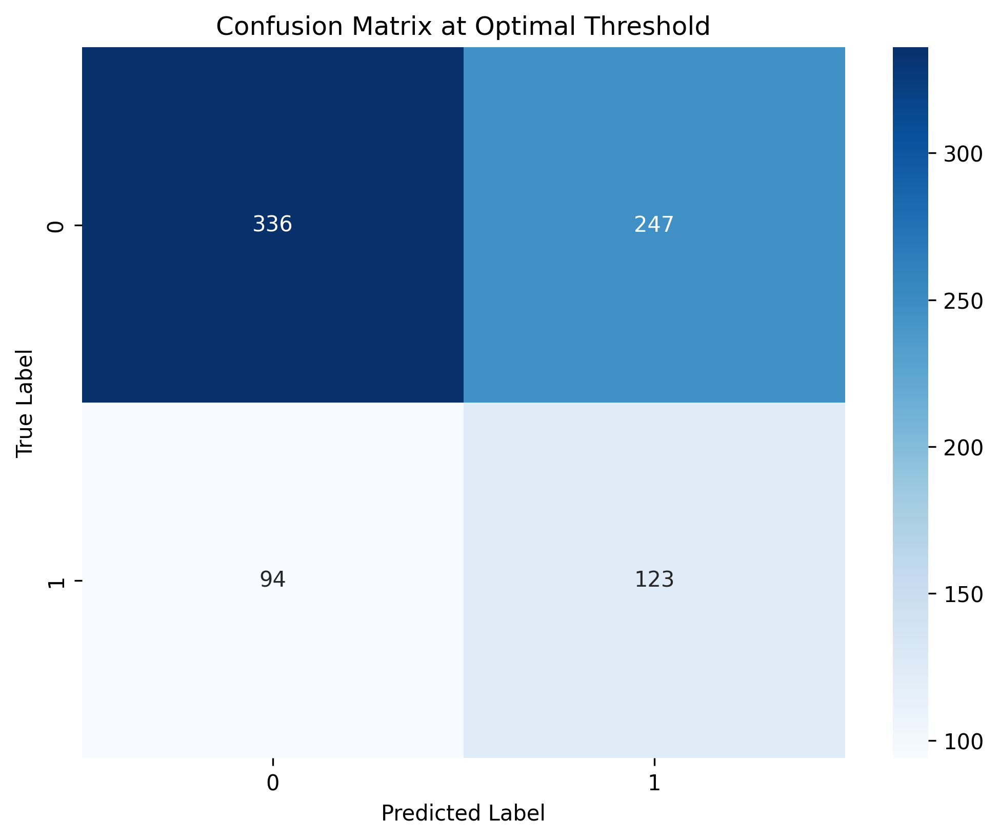
    


    
    Random Forest Lift Chart Data:


<div>
<style scoped>
    .dataframe tbody tr th:only-of-type {
        vertical-align: middle;
    }

    .dataframe tbody tr th {
        vertical-align: top;
    }

    .dataframe thead th {
        text-align: right;
    }
</style>
<table border="1" class="dataframe">
  <thead>
    <tr style="text-align: right;">
      <th></th>
      <th>Lift Curve</th>
      <th>Baseline</th>
      <th>Lift</th>
    </tr>
  </thead>
  <tbody>
    <tr>
      <th>0</th>
      <td>0.0</td>
      <td>0.0</td>
      <td>0.0</td>
    </tr>
    <tr>
      <th>1</th>
      <td>37.3</td>
      <td>10.0</td>
      <td>27.3</td>
    </tr>
    <tr>
      <th>2</th>
      <td>72.9</td>
      <td>20.0</td>
      <td>52.9</td>
    </tr>
    <tr>
      <th>3</th>
      <td>88.7</td>
      <td>30.0</td>
      <td>58.7</td>
    </tr>
    <tr>
      <th>4</th>
      <td>92.2</td>
      <td>40.0</td>
      <td>52.2</td>
    </tr>
    <tr>
      <th>5</th>
      <td>95.0</td>
      <td>50.0</td>
      <td>45.0</td>
    </tr>
    <tr>
      <th>6</th>
      <td>96.7</td>
      <td>60.0</td>
      <td>36.7</td>
    </tr>
    <tr>
      <th>7</th>
      <td>98.1</td>
      <td>70.0</td>
      <td>28.1</td>
    </tr>
    <tr>
      <th>8</th>
      <td>98.8</td>
      <td>80.0</td>
      <td>18.8</td>
    </tr>
    <tr>
      <th>9</th>
      <td>99.3</td>
      <td>90.0</td>
      <td>9.3</td>
    </tr>
    <tr>
      <th>10</th>
      <td>100.0</td>
      <td>100.0</td>
      <td>0.0</td>
    </tr>
  </tbody>
</table>
</div>


    
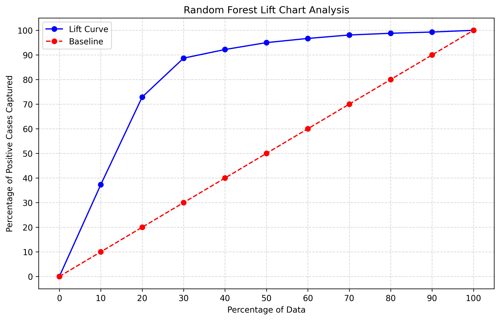
    


    
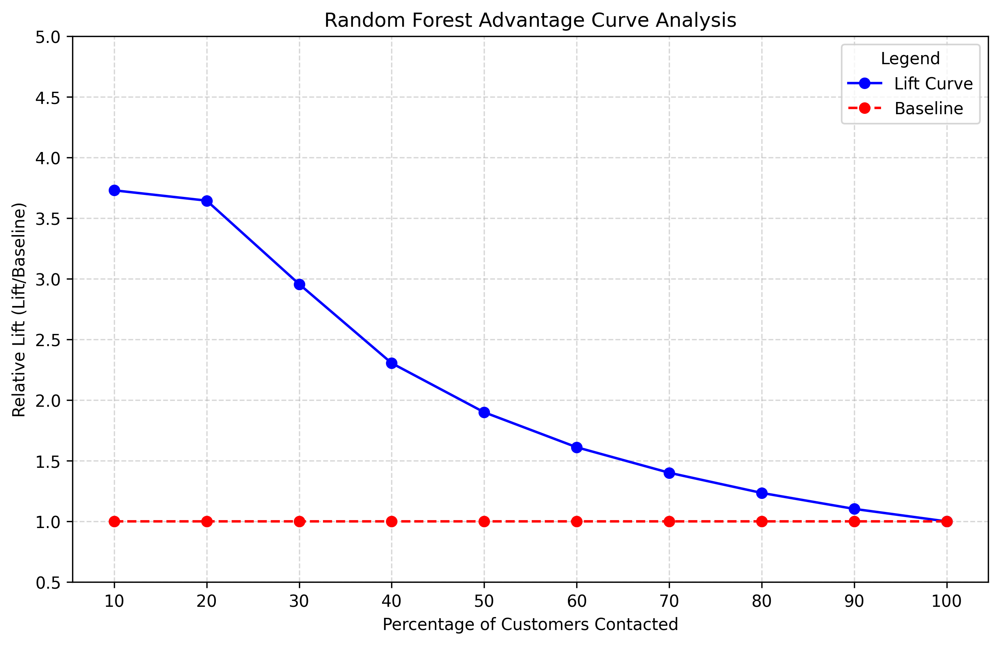
    


    
    Top rows of sorted data (by predicted probabilities):


<div>
<style scoped>
    .dataframe tbody tr th:only-of-type {
        vertical-align: middle;
    }

    .dataframe tbody tr th {
        vertical-align: top;
    }

    .dataframe thead th {
        text-align: right;
    }
</style>
<table border="1" class="dataframe">
  <thead>
    <tr style="text-align: right;">
      <th></th>
      <th>id</th>
      <th>age</th>
      <th>dist</th>
      <th>income</th>
      <th>gender</th>
      <th>marital_status</th>
      <th>target</th>
      <th>predicted_probs</th>
    </tr>
  </thead>
  <tbody>
    <tr>
      <th>585</th>
      <td>586</td>
      <td>80</td>
      <td>16</td>
      <td>4</td>
      <td>1</td>
      <td>1</td>
      <td>1</td>
      <td>0.99</td>
    </tr>
    <tr>
      <th>1804</th>
      <td>1805</td>
      <td>80</td>
      <td>16</td>
      <td>4</td>
      <td>1</td>
      <td>1</td>
      <td>1</td>
      <td>0.99</td>
    </tr>
    <tr>
      <th>2726</th>
      <td>2727</td>
      <td>79</td>
      <td>0</td>
      <td>2</td>
      <td>0</td>
      <td>1</td>
      <td>1</td>
      <td>0.98</td>
    </tr>
    <tr>
      <th>171</th>
      <td>172</td>
      <td>77</td>
      <td>5</td>
      <td>11</td>
      <td>1</td>
      <td>1</td>
      <td>1</td>
      <td>0.98</td>
    </tr>
    <tr>
      <th>702</th>
      <td>703</td>
      <td>85</td>
      <td>2</td>
      <td>10</td>
      <td>1</td>
      <td>1</td>
      <td>1</td>
      <td>0.98</td>
    </tr>
  </tbody>
</table>
</div>


    
    Top rows of shuffled data (random order):


<div>
<style scoped>
    .dataframe tbody tr th:only-of-type {
        vertical-align: middle;
    }

    .dataframe tbody tr th {
        vertical-align: top;
    }

    .dataframe thead th {
        text-align: right;
    }
</style>
<table border="1" class="dataframe">
  <thead>
    <tr style="text-align: right;">
      <th></th>
      <th>id</th>
      <th>age</th>
      <th>dist</th>
      <th>income</th>
      <th>gender</th>
      <th>marital_status</th>
      <th>target</th>
      <th>predicted_probs</th>
    </tr>
  </thead>
  <tbody>
    <tr>
      <th>0</th>
      <td>556</td>
      <td>77</td>
      <td>5</td>
      <td>11</td>
      <td>0</td>
      <td>0</td>
      <td>0</td>
      <td>0.080</td>
    </tr>
    <tr>
      <th>1</th>
      <td>3492</td>
      <td>82</td>
      <td>3</td>
      <td>11</td>
      <td>1</td>
      <td>1</td>
      <td>1</td>
      <td>0.060</td>
    </tr>
    <tr>
      <th>2</th>
      <td>528</td>
      <td>80</td>
      <td>3</td>
      <td>11</td>
      <td>0</td>
      <td>1</td>
      <td>0</td>
      <td>0.160</td>
    </tr>
    <tr>
      <th>3</th>
      <td>3926</td>
      <td>73</td>
      <td>1</td>
      <td>3</td>
      <td>1</td>
      <td>0</td>
      <td>0</td>
      <td>0.255</td>
    </tr>
    <tr>
      <th>4</th>
      <td>2990</td>
      <td>69</td>
      <td>5</td>
      <td>2</td>
      <td>1</td>
      <td>1</td>
      <td>0</td>
      <td>0.285</td>
    </tr>
  </tbody>
</table>
</div>


# good performance 

Within sampling only 30% of potential customers, Random Forest obtained 90% of the posative outcomes. 

# why did Logistic Reggression perform so poorly and Random Forest Perform so well 

What is it about the data that makes Logistic Regression perform so poorly and random Forest perform so much better.
What can we learn about the Logstics Regression from answering these questions and what do those answers imply for best practises. 

# Examination of predictor variables


```python
import seaborn as sns
import matplotlib.pyplot as plt

def plot_full_pairplot_with_corr_binary_target(df, continuous_vars, target_var='target', positive_value=1, negative_value=0):
    """
    Generate a Seaborn pair plot with correlation coefficients annotated on the scatter plots,
    showing a full matrix, and color-coded by a binary target variable.

    Parameters:
    - df: DataFrame containing the data.
    - continuous_vars: List of continuous variable column names.
    - target_var: Name of the binary target column (default='target').
    - positive_value: Value representing positive outcomes (default=1).
    - negative_value: Value representing negative outcomes (default=0).
    """
    # Filter DataFrame for the required columns
    pairplot_data = df[continuous_vars + [target_var]].copy()
    
    # Ensure the target variable is categorical for coloring
    pairplot_data[target_var] = pairplot_data[target_var].astype('category')
    
    # Calculate pairwise correlations
    correlation_matrix = pairplot_data[continuous_vars].corr()
    
    # Create the pair plot
    g = sns.pairplot(
        pairplot_data,
        hue=target_var,
        palette={positive_value: 'green', negative_value: 'red'},
        diag_kind='kde',
        corner=False  # Full matrix
    )
    
    # Annotate correlation coefficients
    for i, row_var in enumerate(continuous_vars):
        for j, col_var in enumerate(continuous_vars):
            if i != j:  # Skip diagonal
                # Get the current axis
                ax = g.axes[i, j]
                # Get the correlation value
                corr = correlation_matrix.loc[row_var, col_var]
                # Annotate the correlation on the scatter plot
                ax.annotate(
                    f"Corr: {corr:.2f}",
                    xy=(0.5, 0.1),
                    xycoords="axes fraction",
                    ha="center",
                    fontsize=9,
                    color="blue"
                )
    
    # Add a title for context
    plt.suptitle(f"Full Pair Plot for Predictors Colored by '{target_var}'", y=1.02, fontsize=16)
    plt.show()

# Continuous variables and target variable
continuous_vars = ['age', 'dist', 'income', 'marital_status', 'gender']
target_var = 'target'

# Call the function with the DataFrame
plot_full_pairplot_with_corr_binary_target(data, continuous_vars, target_var, positive_value=1, negative_value=0)
```


    

    


1. The plots off the main diagonals are scatterplots of the predictor variables with green dots coresponding to posative outcomes of the variable pair within observations and red dots for negative outcomes. 
Within this data we fail to see a clear pattern of posative or negative  outcomes at the intersection of variables increasing or decreasing.

2. across the diagnonal are the density curves of the predictors stratified by the values which corespond to posative or negative outcomes within observations. 
In visual examination of the variable density curves divided by posative and negative outocomes, signifigant differences fail to be viusally evident between the two outcome groups for variables gender, marital status, and distance.

3. only within the density plots of age and income do we see signifigant difference in the values corespsonging to different outcomes. Thus these will be out two strongest predictors of posative outcome. 

# distributions stratified by outcome


```python
import pandas as pd
import matplotlib.pyplot as plt
import seaborn as sns

def ridge_plot_by_response(df, variables, categorical_var='target', positive_value=1, negative_value=0):
    """
    Create ridge line plots for variables showing the distribution for positive and negative responses.
    
    Parameters:
    - df: DataFrame containing the data.
    - variables: List of continuous variables to plot.
    - categorical_var: Name of the binary target column.
    - positive_value: Value representing positive outcomes (default=1).
    - negative_value: Value representing negative outcomes (default=0).
    """
    # Create the ridge plot for each variable
    plt.figure(figsize=(12, 6))
    
    for i, var in enumerate(variables):
        plt.subplot(2, 1, i + 1)
        
        # Positive responses
        sns.kdeplot(data=df[df[categorical_var] == positive_value], x=var, 
                    fill=True, alpha=0.6, label=f'Positive ({positive_value})', color='green')
        
        # Negative responses
        sns.kdeplot(data=df[df[categorical_var] == negative_value], x=var, 
                    fill=True, alpha=0.6, label=f'Negative ({negative_value})', color='red')
        
        # Add plot details
        plt.title(f'Distribution of {var} by Response')
        plt.xlabel(var)
        plt.ylabel('Density')
        plt.legend()
    
    plt.tight_layout()
    plt.show()

# Example usage:
variables = ['age', 'income']
ridge_plot_by_response(data, variables, categorical_var='target', positive_value=1, negative_value=0)
```


    

    


The density curve is dependent upon sample size as well as proportion. To isolate the relationship between these variables and posative or negative outcomes, we plot the proportion of outcomes which were posative coresponding to each value of the predictor variables across the entire span of the data set. 


```python
import pandas as pd
import matplotlib.pyplot as plt
import numpy as np

# Assuming `data` is a DataFrame that exists
df = data.copy()

# Calculate normalized proportions within each 'age' group
proportions = (
    df.groupby(["age", "target"])
    .size()
    .unstack(fill_value=0)
    .apply(lambda x: x / x.sum(), axis=1)
)

# Plot
fig, ax = plt.subplots(figsize=(8, 6))

# Plot stacked bars with normalized height
proportions[[1, 0]].plot(  # Reorder columns to put 1 on bottom
    kind="bar",
    stacked=True,
    ax=ax,
    width=0.7,
    legend=True,
    color=['green', 'red']  # Set explicit colors
)

# Add labels and title
ax.set_title("Bar Chart with Fill Position Equivalent to ggplot2", fontsize=14)
ax.set_ylabel("Proportion", fontsize=12)
ax.set_xlabel("Age Group", fontsize=12)

# Customize x-axis labels to be horizontal
ax.set_xticklabels(ax.get_xticklabels(), rotation=0, ha='center')

# Customize legend
ax.legend(title="Target", title_fontsize=12, fontsize=10)

# Display the plot
plt.tight_layout()
plt.show()

```


    
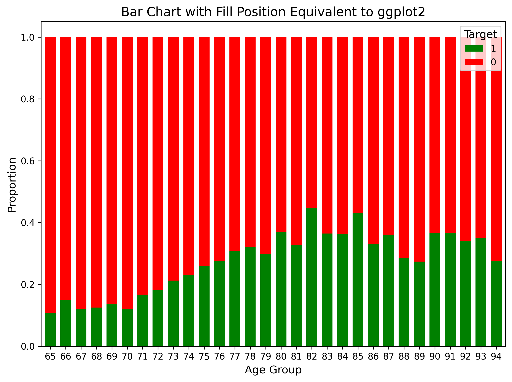
    


```python
import pandas as pd
import matplotlib.pyplot as plt
import numpy as np

# Assuming `data` is a DataFrame that exists
df = data.copy()

# Calculate normalized proportions within each 'income' group
proportions = (
    df.groupby(["income", "target"])
    .size()
    .unstack(fill_value=0)
    .apply(lambda x: x / x.sum(), axis=1)
)

# Plot
fig, ax = plt.subplots(figsize=(8, 6))

# Plot stacked bars with normalized height
proportions[[1, 0]].plot(  # Reorder columns to put 1 on bottom
    kind="bar",
    stacked=True,
    ax=ax,
    width=0.7,
    legend=True,
    color=['green', 'red']  # Set explicit colors
)

# Add labels and title
ax.set_title("Income Distribution by Target", fontsize=14)
ax.set_ylabel("Proportion", fontsize=12)
ax.set_xlabel("Income Level", fontsize=12)

# Customize x-axis labels to be horizontal
ax.set_xticklabels(ax.get_xticklabels(), rotation=0, ha='center')

# Customize legend
ax.legend(title="Target", title_fontsize=12, fontsize=10)

# Display the plot
plt.tight_layout()
plt.show()
```


    
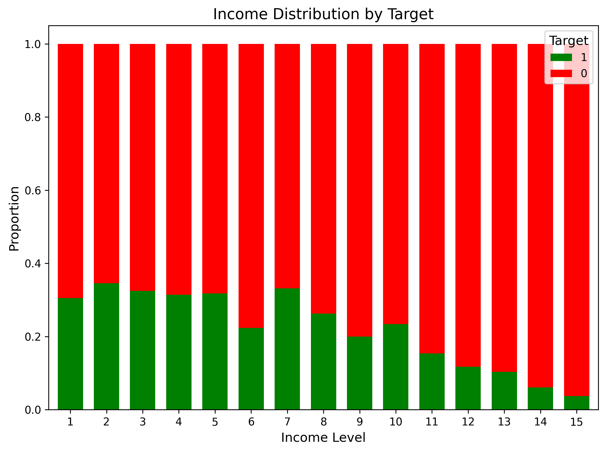
    


```python
import pandas as pd
import matplotlib.pyplot as plt
import seaborn as sns
from scipy.stats import pointbiserialr

def plot_ratio_positive_negative_with_corr(df, continuous_var, categorical_var='target', positive_value=1, negative_value=0):
    """
    Plot the ratio of positive to total outcomes for a continuous variable with a smoother
    and display the correlation coefficient.
    
    Parameters:
    - df: DataFrame containing the data.
    - continuous_var: Name of the continuous predictor column.
    - categorical_var: Name of the binary target column.
    - positive_value: Value representing positive outcomes (default=1).
    - negative_value: Value representing negative outcomes (default=0).
    """
    # Group by continuous variable and category to get counts
    grouped = df.groupby([continuous_var, categorical_var]).size().reset_index(name='count')
    
    # Pivot so we have positive and negative counts
    pivot = grouped.pivot(index=continuous_var, columns=categorical_var, values='count').fillna(0)
    
    # Extract positive and total counts
    positive_counts = pivot[positive_value] if positive_value in pivot.columns else 0
    total_counts = positive_counts + pivot[negative_value] if negative_value in pivot.columns else positive_counts

    # To avoid division by zero, add a small epsilon
    epsilon = 1e-9
    ratio = positive_counts / (total_counts + epsilon)

    # Create a DataFrame for plotting
    plot_df = pd.DataFrame({
        continuous_var: ratio.index,
        'ratio_positive_negative': ratio.values
    })
    
    # Calculate Point-Biserial Correlation
    correlation, p_value = pointbiserialr(df[continuous_var], df[categorical_var])
    
    return plot_df, correlation, p_value

# Create figure with four subplots in 2x2 grid
fig, ((ax1, ax2), (ax3, ax4)) = plt.subplots(2, 2, figsize=(20, 12))

# Top row - Age plots
# Left plot - Scatter plot with regression for age
age_plot_df, age_corr, age_p = plot_ratio_positive_negative_with_corr(data, 'age', 'target')

sns.scatterplot(x='age', y='ratio_positive_negative', data=age_plot_df, color='blue', s=50, label='Data Points', ax=ax1)
sns.regplot(x='age', y='ratio_positive_negative', data=age_plot_df, 
            scatter=False, lowess=True, color='red', line_kws={'lw': 2}, label='Lowess Smoother', ax=ax1)

ax1.text(0.05, 0.95, f'Point-Biserial Corr: {age_corr:.4f}\nP-Value: {age_p:.4e}', 
         transform=ax1.transAxes, fontsize=12, verticalalignment='top', bbox=dict(facecolor='white', alpha=0.8))
ax1.set_title('Ratio of Positive Outcomes and Correlation by Age')
ax1.set_xlabel('Age')
ax1.set_ylabel('Ratio (Positive / Total)')
ax1.set_ylim(0, 0.50)
ax1.legend()
ax1.grid()

# Right plot - Bar chart for age
age_proportions = (
    data.groupby(["age", "target"])
    .size()
    .unstack(fill_value=0)
    .apply(lambda x: x / x.sum(), axis=1)
)

age_proportions[[1, 0]].plot(
    kind="bar",
    stacked=True,
    ax=ax2,
    width=0.7,
    legend=True,
    color=['green', 'red']
)

ax2.set_title("Age Distribution by Target", fontsize=14)
ax2.set_ylabel("Proportion", fontsize=12)
ax2.set_xlabel("Age", fontsize=12)
ax2.set_xticklabels(ax2.get_xticklabels(), rotation=0, ha='center')
ax2.legend(title="Target", title_fontsize=12, fontsize=10)

# Bottom row - Income plots
# Left plot - Scatter plot with regression for income
income_plot_df, income_corr, income_p = plot_ratio_positive_negative_with_corr(data, 'income', 'target')

sns.scatterplot(x='income', y='ratio_positive_negative', data=income_plot_df, color='blue', s=50, label='Data Points', ax=ax3)
sns.regplot(x='income', y='ratio_positive_negative', data=income_plot_df, 
            scatter=False, lowess=True, color='red', line_kws={'lw': 2}, label='Lowess Smoother', ax=ax3)

ax3.text(0.05, 0.95, f'Point-Biserial Corr: {income_corr:.4f}\nP-Value: {income_p:.4e}', 
         transform=ax3.transAxes, fontsize=12, verticalalignment='top', bbox=dict(facecolor='white', alpha=0.8))
ax3.set_title('Ratio of Positive Outcomes and Correlation by Income')
ax3.set_xlabel('Income')
ax3.set_ylabel('Ratio (Positive / Total)')
ax3.set_ylim(0, 0.50)
ax3.legend()
ax3.grid()

# Right plot - Bar chart for income
income_proportions = (
    data.groupby(["income", "target"])
    .size()
    .unstack(fill_value=0)
    .apply(lambda x: x / x.sum(), axis=1)
)

income_proportions[[1, 0]].plot(
    kind="bar",
    stacked=True,
    ax=ax4,
    width=0.7,
    legend=True,
    color=['green', 'red']
)

ax4.set_title("Income Distribution by Target", fontsize=14)
ax4.set_ylabel("Proportion", fontsize=12)
ax4.set_xlabel("Income Level", fontsize=12)
ax4.set_xticklabels(ax4.get_xticklabels(), rotation=0, ha='center')
ax4.legend(title="Target", title_fontsize=12, fontsize=10)

plt.tight_layout()
plt.show()

```


    
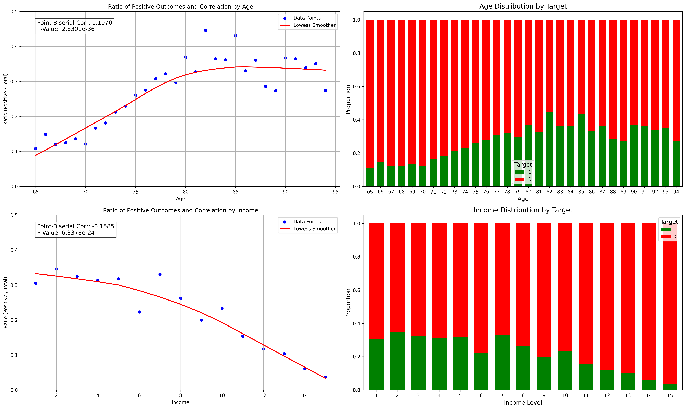
    


Notice that the relationship between age and posative outcomes is not linear, there is a peak around 80 and subsueqently declines. 

It seems that proportion of posative outcomes declines steadily as income level increases.

# How Logistic Regresion models this relationship 


```python
# Plot predicted probabilities and logit for age and income
import matplotlib.pyplot as plt
import numpy as np
import seaborn as sns
import statsmodels.api as sm

# Prepare features and fit model
X = data[['age', 'dist', 'income', 'gender', 'marital_status']]
y = data['target']

# Fit logistic regression model
lr_model = LogisticRegression(random_state=42)
lr_model.fit(X, y)

# Create figure with four subplots (2 rows, 2 columns)
fig, ((ax1, ax2), (ax3, ax4)) = plt.subplots(2, 2, figsize=(10, 12))

# Get mean values for all predictors
mean_values = X.mean()

# Age plots
# Create range of values for age
x_range_age = np.linspace(X['age'].min(), X['age'].max(), 100)

# Create prediction data with all other variables at mean
pred_data_age = np.tile(mean_values, (100, 1))
pred_data_age = pd.DataFrame(pred_data_age, columns=X.columns)
pred_data_age['age'] = x_range_age

# Get predictions for age
y_pred_age = lr_model.predict_proba(pred_data_age)[:, 1]

# Plot predicted probabilities for age
ax1.plot(x_range_age, y_pred_age)
ax1.set_title('Predicted Probability vs Age\n(Other Variables at Mean)')
ax1.set_ylabel('Predicted Probability')
ax1.set_xlabel('Age')
ax1.grid(True, alpha=0.3)
ax1.set_ylim(0, 0.5)

# Age logit curve
# Fit statsmodels logistic regression
X_with_const = sm.add_constant(X)
logit_model = sm.Logit(y, X_with_const)
result = logit_model.fit()

# Calculate logit values for age
feature_values_age = np.arange(X['age'].min(), X['age'].max(), 5)
fixed_predictors = mean_values.copy()
log_odds_age = []

for value in feature_values_age:
    temp_predictors = fixed_predictors.copy()
    temp_predictors['age'] = value
    predictors_with_const = sm.add_constant(temp_predictors.values.reshape(1, -1), has_constant='add')
    logit = np.dot(predictors_with_const, result.params)
    log_odds_age.append(logit[0])

# Create DataFrame for age plotting
plot_df_age = pd.DataFrame({
    'age': feature_values_age,
    'log_odds': log_odds_age
})

# Plot logit curve for age
sns.scatterplot(x='age', y='log_odds', data=plot_df_age, color='blue', s=50, ax=ax2, label='Logit Points')
sns.regplot(x='age', y='log_odds', data=plot_df_age, scatter=False, lowess=True, 
            color='red', line_kws={'lw': 2}, ax=ax2, label='Smoothed Logit Curve')

ax2.set_title('Logit Curve (Log Odds) for Age')
ax2.set_xlabel('Age')
ax2.set_ylabel('Log(P / 1-P)')
ax2.set_ylim(-2, 1)
ax2.axhline(0, color='grey', linestyle='--', label='Log Odds = 0')
ax2.legend()
ax2.grid(True)

# Income plots
# Create range of values for income
x_range_income = np.linspace(X['income'].min(), X['income'].max(), 100)

# Create prediction data with all other variables at mean
pred_data_income = np.tile(mean_values, (100, 1))
pred_data_income = pd.DataFrame(pred_data_income, columns=X.columns)
pred_data_income['income'] = x_range_income

# Get predictions for income
y_pred_income = lr_model.predict_proba(pred_data_income)[:, 1]

# Plot predicted probabilities for income
ax3.plot(x_range_income, y_pred_income)
ax3.set_title('Predicted Probability vs Income\n(Other Variables at Mean)')
ax3.set_ylabel('Predicted Probability')
ax3.set_xlabel('Income')
ax3.grid(True, alpha=0.3)
ax3.set_ylim(0, 0.5)

# Income logit curve
# Calculate logit values for income
feature_values_income = np.arange(X['income'].min(), X['income'].max(), 1)
fixed_predictors = mean_values.copy()
log_odds_income = []

for value in feature_values_income:
    temp_predictors = fixed_predictors.copy()
    temp_predictors['income'] = value
    predictors_with_const = sm.add_constant(temp_predictors.values.reshape(1, -1), has_constant='add')
    logit = np.dot(predictors_with_const, result.params)
    log_odds_income.append(logit[0])

# Create DataFrame for income plotting
plot_df_income = pd.DataFrame({
    'income': feature_values_income,
    'log_odds': log_odds_income
})

# Plot logit curve for income
sns.scatterplot(x='income', y='log_odds', data=plot_df_income, color='blue', s=50, ax=ax4, label='Logit Points')
sns.regplot(x='income', y='log_odds', data=plot_df_income, scatter=False, lowess=True, 
            color='red', line_kws={'lw': 2}, ax=ax4, label='Smoothed Logit Curve')

ax4.set_title('Logit Curve (Log Odds) for Income')
ax4.set_xlabel('Income')
ax4.set_ylabel('Log(P / 1-P)')
ax4.set_ylim(-2, 1)
ax4.axhline(0, color='grey', linestyle='--', label='Log Odds = 0')
ax4.legend()
ax4.grid(True)

plt.tight_layout()
plt.show()
```

    Optimization terminated successfully.
             Current function value: 0.527865
             Iterations 6


    

    


Just as as Linear Regression models response as a linear function of predictor, Logistic Regression models the log(ods) as a linear function of predictor.

Although there is no formal defiintion of linearity nor coorelation regarding a continuous and categorical variable, the plot of the proportion of responses which are posative by the predictor is a fair basis for qualitativly judging the strength of the relationship between the variable and posative outcome. 

Since income and age are our strongest predictors, what we would hope to see is a clear pattern of posative outcomes as age increases and income decreasing. Such a pattern is not visually evident and thus is not a good indicator of strength of association between these variables with respect to posative outcomes within individual observations. Of which Individual observations is what we are producing a probability of posative response for. 


```python
import seaborn as sns
import matplotlib.pyplot as plt
import numpy as np

def plot_scatter_with_separate_correlations(df, continuous_vars, target_var='target', positive_value=1, negative_value=0):
    """
    Generate scatter plots with separate correlation coefficients for positive and negative outcomes.
    Points are slightly offset when they overlap to show intersection.
    
    Parameters:
    - df: DataFrame containing the data
    - continuous_vars: List of continuous variable column names
    - target_var: Name of the binary target column (default='target')
    - positive_value: Value representing positive outcomes (default=1)
    - negative_value: Value representing negative outcomes (default=0)
    """
    # Create figure with subplots
    fig, ax = plt.subplots(1, 1, figsize=(12, 8))
    
    # Split data into positive and negative outcomes
    positive_data = df[df[target_var] == positive_value]
    negative_data = df[df[target_var] == negative_value]
    
    # Calculate correlations for positive and negative outcomes
    pos_corr = positive_data[continuous_vars[0]].corr(positive_data[continuous_vars[1]])
    neg_corr = negative_data[continuous_vars[0]].corr(negative_data[continuous_vars[1]])
    
    # Add small random offset to points that overlap
    offset = 0.2
    pos_x = positive_data[continuous_vars[0]] + np.random.uniform(-offset, offset, len(positive_data))
    pos_y = positive_data[continuous_vars[1]] + np.random.uniform(-offset, offset, len(positive_data))
    neg_x = negative_data[continuous_vars[0]] + np.random.uniform(-offset, offset, len(negative_data))
    neg_y = negative_data[continuous_vars[1]] + np.random.uniform(-offset, offset, len(negative_data))
    
    # Create scatter plot with offset points
    plt.scatter(pos_x, pos_y, color='green', label='Positive Outcomes', alpha=0.6)
    plt.scatter(neg_x, neg_y, color='red', label='Negative Outcomes', alpha=0.6)
    
    # Add correlation annotations
    plt.text(0.05, 0.95, f'Positive Correlation: {pos_corr:.3f}',
             transform=ax.transAxes, color='green', fontsize=10)
    plt.text(0.05, 0.90, f'Negative Correlation: {neg_corr:.3f}',
             transform=ax.transAxes, color='red', fontsize=10)
    
    plt.title(f'Scatter Plot of {continuous_vars[0]} vs {continuous_vars[1]}')
    plt.xlabel(continuous_vars[0])
    plt.ylabel(continuous_vars[1])
    plt.legend()
    plt.grid(True, alpha=0.3)
    plt.show()

# Continuous variables and target variable
continuous_vars = ['age', 'income']
target_var = 'target'

# Call the function with the DataFrame
plot_scatter_with_separate_correlations(data, continuous_vars, target_var, positive_value=1, negative_value=0)
```


    
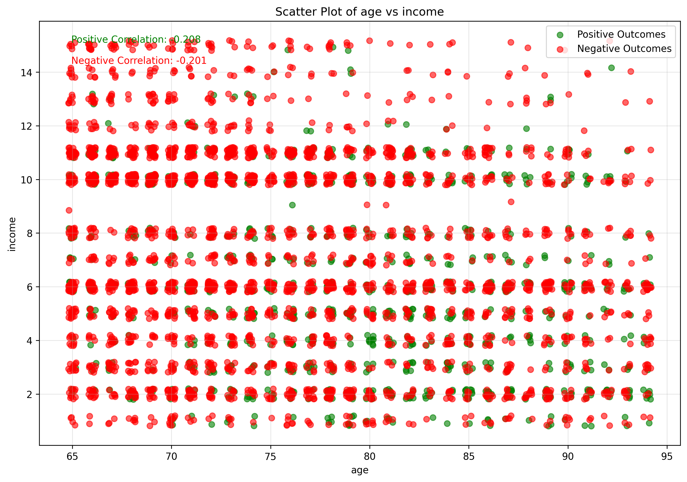
    


```python
import seaborn as sns
import matplotlib.pyplot as plt
import numpy as np
from scipy import stats

def plot_scatter_with_separate_correlations(df, continuous_vars, target_var='target', positive_value=1, negative_value=0):
    """
    Generate scatter plots with separate correlation coefficients for positive and negative outcomes.
    Points are slightly offset when they overlap to show intersection.
    
    Parameters:
    - df: DataFrame containing the data
    - continuous_vars: List of continuous variable column names
    - target_var: Name of the binary target column (default='target')
    - positive_value: Value representing positive outcomes (default=1)
    - negative_value: Value representing negative outcomes (default=0)
    """
    # Create figure with subplots
    fig, (ax1, ax2) = plt.subplots(1, 2, figsize=(24, 8))
    
    # Split data into positive and negative outcomes
    positive_data = df[df[target_var] == positive_value]
    negative_data = df[df[target_var] == negative_value]
    
    # Calculate Pearson correlation coefficients and p-values
    pos_corr, pos_p = stats.pearsonr(positive_data[continuous_vars[0]], positive_data[continuous_vars[1]])
    neg_corr, neg_p = stats.pearsonr(negative_data[continuous_vars[0]], negative_data[continuous_vars[1]])
    
    # Add small random offset to points that overlap
    offset = 0.2
    pos_x = positive_data[continuous_vars[0]] + np.random.uniform(-offset, offset, len(positive_data))
    pos_y = positive_data[continuous_vars[1]] + np.random.uniform(-offset, offset, len(positive_data))
    neg_x = negative_data[continuous_vars[0]] + np.random.uniform(-offset, offset, len(negative_data))
    neg_y = negative_data[continuous_vars[1]] + np.random.uniform(-offset, offset, len(negative_data))
    
    # Create scatter plot with offset points
    ax1.scatter(pos_x, pos_y, color='green', label='Positive Outcomes', alpha=0.6)
    ax2.scatter(neg_x, neg_y, color='red', label='Negative Outcomes', alpha=0.6)
    
    # Add correlation annotations with p-values
    ax1.text(0.05, 0.95, f'Correlation: {pos_corr:.3f}\np-value: {pos_p:.3f}',
             transform=ax1.transAxes, color='green', fontsize=10)
    ax2.text(0.05, 0.95, f'Correlation: {neg_corr:.3f}\np-value: {neg_p:.3f}',
             transform=ax2.transAxes, color='red', fontsize=10)
    
    ax1.set_title(f'Positive Outcomes: {continuous_vars[0]} vs {continuous_vars[1]}')
    ax2.set_title(f'Negative Outcomes: {continuous_vars[0]} vs {continuous_vars[1]}')
    ax1.set_xlabel(continuous_vars[0])
    ax1.set_ylabel(continuous_vars[1])
    ax2.set_xlabel(continuous_vars[0])
    ax2.set_ylabel(continuous_vars[1])
    ax1.legend()
    ax2.legend()
    ax1.grid(True, alpha=0.3)
    ax2.grid(True, alpha=0.3)
    plt.show()

# Continuous variables and target variable
continuous_vars = ['age', 'income']
target_var = 'target'

# Call the function with the DataFrame
plot_scatter_with_separate_correlations(data, continuous_vars, target_var, positive_value=1, negative_value=0)
```


    
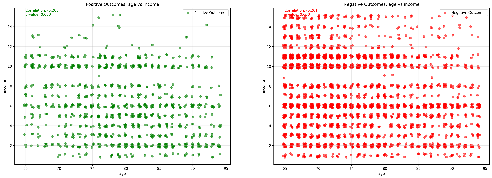
    


The corelation coeficients are both negative simply because the population is decreasing as age increases.

Again, upon seperating posative and negative outcomes into seperate plots and displaying the numeracy outcomes by offset dots, there fails to be a distiguishable pattern between out best predictor variables and outcomes. 

# conclusions from examination of the data set

1. The predictive power of the predictors are weak individually
2. A strong association between our strongest predictor variables and posative outcomes fails to be visually apparent. 
3. The strongest predictor being age does not appear to have a linear association with posative outcomes, despite the model representing the relationship log(ods) of age linearly. 

# Analysis of Model Performance

The way a Logistic Regression model works is by modeling:
log(p(outcome = 1) / (1 - p(outcome = 1))) = x + 

Just as Linear Regression models y = x + , Logistic Regression models the log odds (logit) as a linear function of the predictors.

The Logistic Regression model failed to capture the subtle patterns in our data for several reasons:

1. Non-linear relationships: The relationship between age and positive outcomes is non-linear, with a peak around age 80-85. Logistic Regression assumes a linear relationship in the log odds space.

2. Feature interactions: The model missed important interactions between gender and marital status. For men, being married was highly predictive of a positive response, while marital status had little impact for women.

3. Oversimplified variable relationships: The Logistic Regression model simply predicted highest probabilities for:
   - Maximum age
   - Minimum income 
   - Minimum distance
   - Male gender (1)
   - Married status (1)

In contrast, the Random Forest model identified a more nuanced target demographic:
- Men aged 77-88 who are married
- Women in the same age range (regardless of marital status)
- Income and distance had minimal impact within this demographic

The Random Forest model's superior performance stems from its ability to:
- Handle non-linear relationships
- Capture feature interactions automatically
- Ignore irrelevant variables within specific contexts

This explains why Random Forest achieved 90% of positive responses by targeting only 30% of potential customers, while Logistic Regression required sampling 50% of customers to achieve 70% of positive responses.

# What the trend in the data that predicts response, which Logstic Regression fails to capture


```python
# Get top 10 predictions from logistic regression model
data_sorted_lr = data.copy()
data_sorted_lr['predicted_probs'] = lr_model.predict_proba(X)[:, 1]
data_sorted_lr = data_sorted_lr.sort_values('predicted_probs', ascending=False).head(10)

print("Top feature combinations leading to highest confidence predictions:\n")
print("Top 10 combinations with highest predicted probability:\n")
print(data_sorted_lr[['age', 'income', 'dist', 'gender', 'marital_status', 'predicted_probs']].to_string())

```

    Top feature combinations leading to highest confidence predictions:
    
    Top 10 combinations with highest predicted probability:
    
          age  income  dist  gender  marital_status  predicted_probs
    3917   94       2     1       1               1         0.648037
    2393   94       2     2       1               1         0.645123
    442    94       2     3       1               1         0.642198
    862    90       1     2       1               1         0.627674
    460    92       2     1       1               1         0.626457
    2151   94       3     0       1               1         0.625239
    264    90       1     5       1               1         0.618691
    61     93       2     8       1               1         0.616442
    1935   94       3     3       1               1         0.616234
    31     92       2     7       1               1         0.608387


```python
# Analyze patterns of high-confidence positive predictions
print("\nAnalyzing patterns in strong positive predictions...")

# Get samples where model is very confident of positive outcome (predicted_probs > 0.9)
high_confidence_positives = data_sorted[data_sorted['predicted_probs'] > 0.9].copy()

# Calculate summary statistics for these high-confidence cases
print("\nSummary statistics for cases where model is very confident of positive outcome (prob > 0.9):")
summary_stats = high_confidence_positives[['age', 'dist', 'income', 'gender', 'marital_status']].describe()
display(summary_stats)

# Calculate feature importance based on correlation with predicted probabilities
print("\nCorrelation of features with prediction confidence:")
correlations = data_sorted[['age', 'dist', 'income', 'gender', 'marital_status', 'predicted_probs']].corr()['predicted_probs'].sort_values(ascending=False)
display(correlations)

# Print combinations with highest confidence
print("\nTop feature combinations leading to highest confidence predictions:")
high_conf_combos = high_confidence_positives[['age', 'dist', 'income', 'gender', 'marital_status', 'predicted_probs']]
high_conf_combos = high_conf_combos.sort_values('predicted_probs', ascending=False).head(10)
print("\nTop 30 combinations with highest predicted probability:")
print(high_conf_combos.to_string(index=False))

# Visualize distribution of key features for high confidence predictions vs others
fig, axes = plt.subplots(2, 2, figsize=(15, 12))
fig.suptitle('Feature Distributions: High Confidence Positives vs Others')

# Age distribution
sns.boxplot(x='high_conf', y='age', 
           data=data_sorted.assign(high_conf=data_sorted['predicted_probs'] > 0.9),
           ax=axes[0,0])
axes[0,0].set_title('Age Distribution')

# Distance distribution
sns.boxplot(x='high_conf', y='dist',
           data=data_sorted.assign(high_conf=data_sorted['predicted_probs'] > 0.9),
           ax=axes[0,1])
axes[0,1].set_title('Distance Distribution')

# Income distribution
sns.boxplot(x='high_conf', y='income',
           data=data_sorted.assign(high_conf=data_sorted['predicted_probs'] > 0.9),
           ax=axes[1,0])
axes[1,0].set_title('Income Distribution')

# Categorical features - regular bar plot
cat_data = data_sorted.assign(high_conf=data_sorted['predicted_probs'] > 0.9)
cat_data = cat_data[cat_data['high_conf']]
gender_marital_counts = pd.crosstab(cat_data['gender'], cat_data['marital_status'])
gender_marital_counts.plot(kind='bar', ax=axes[1,1])
axes[1,1].set_title('Gender & Marital Status Distribution\nfor High Confidence Cases')
axes[1,1].set_xlabel('Gender')
axes[1,1].set_ylabel('Count')
axes[1,1].legend(title='Marital Status')

plt.tight_layout()
plt.show()
```

    
    Analyzing patterns in strong positive predictions...
    
    Summary statistics for cases where model is very confident of positive outcome (prob > 0.9):


<div>
<style scoped>
    .dataframe tbody tr th:only-of-type {
        vertical-align: middle;
    }

    .dataframe tbody tr th {
        vertical-align: top;
    }

    .dataframe thead th {
        text-align: right;
    }
</style>
<table border="1" class="dataframe">
  <thead>
    <tr style="text-align: right;">
      <th></th>
      <th>age</th>
      <th>dist</th>
      <th>income</th>
      <th>gender</th>
      <th>marital_status</th>
    </tr>
  </thead>
  <tbody>
    <tr>
      <th>count</th>
      <td>69.000000</td>
      <td>69.000000</td>
      <td>69.000000</td>
      <td>69.000000</td>
      <td>69.000000</td>
    </tr>
    <tr>
      <th>mean</th>
      <td>82.565217</td>
      <td>4.231884</td>
      <td>5.463768</td>
      <td>0.710145</td>
      <td>0.811594</td>
    </tr>
    <tr>
      <th>std</th>
      <td>4.347001</td>
      <td>5.401919</td>
      <td>2.997939</td>
      <td>0.457019</td>
      <td>0.393901</td>
    </tr>
    <tr>
      <th>min</th>
      <td>74.000000</td>
      <td>0.000000</td>
      <td>1.000000</td>
      <td>0.000000</td>
      <td>0.000000</td>
    </tr>
    <tr>
      <th>25%</th>
      <td>79.000000</td>
      <td>0.000000</td>
      <td>3.000000</td>
      <td>0.000000</td>
      <td>1.000000</td>
    </tr>
    <tr>
      <th>50%</th>
      <td>82.000000</td>
      <td>2.000000</td>
      <td>5.000000</td>
      <td>1.000000</td>
      <td>1.000000</td>
    </tr>
    <tr>
      <th>75%</th>
      <td>86.000000</td>
      <td>5.000000</td>
      <td>8.000000</td>
      <td>1.000000</td>
      <td>1.000000</td>
    </tr>
    <tr>
      <th>max</th>
      <td>93.000000</td>
      <td>18.000000</td>
      <td>11.000000</td>
      <td>1.000000</td>
      <td>1.000000</td>
    </tr>
  </tbody>
</table>
</div>


    
    Correlation of features with prediction confidence:


    predicted_probs    1.000000
    age                0.308585
    gender             0.106436
    marital_status     0.066759
    dist              -0.059270
    income            -0.232083
    Name: predicted_probs, dtype: float64


    
    Top feature combinations leading to highest confidence predictions:
    
    Top 30 combinations with highest predicted probability:
     age  dist  income  gender  marital_status  predicted_probs
      80    16       4       1               1             0.99
      80    16       4       1               1             0.99
      79     0       2       0               1             0.98
      77     5      11       1               1             0.98
      85     2      10       1               1             0.98
      85     2      10       1               1             0.98
      87     0       7       1               1             0.98
      77     5      11       1               1             0.98
      79     0       2       0               1             0.98
      77     5      11       1               1             0.98


    

    


This summarizes the top combinations with a probability of positive response greater than 90%, as identified by the Random Forest model.

The pattern is clear. 

The optimal age was 82, this is evident by the plot of proportion of responses that were posative for each age, peaking a little after age 80. 

Distance didn't matter, the 3rd row was the minimum distance while the first 2 rows were at the max distance 

Income did not matter, if you remove the female observations, the min and max is from 4 to 11 which is contains 80% of the distribution of the variable over the entire data set. If you include female observations, even more. 

Gender and matrital status are connected. 

30% of the top 90% predicted prob combinations were women of which marital stats was not signifigant. 

however, 70% of the 90% predicted prob combinations were men of which an insignifigant proportion were unmarried. 

The target demo is precisely married men, aged from 77 to 88. 

## The target demo is precisely married men, aged from 77 to 88. 
