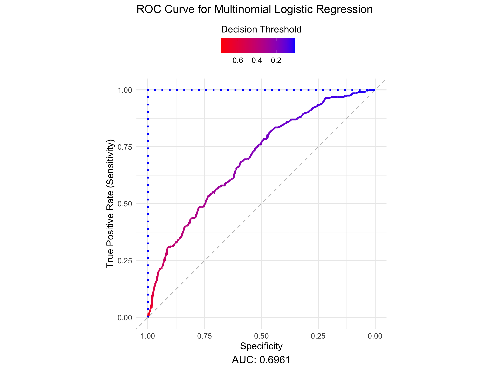
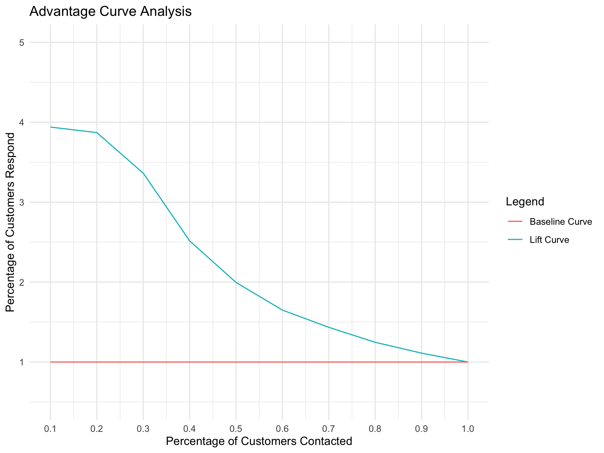

``` r
library(tidyverse)
library(caret)
library(randomForest)
```

Given the following data.

``` r
data <- read.csv(file="data.csv",header=TRUE)
```

<div align="center">


</div>

# Clean data

``` r
data <- data %>%
  mutate(across(c(4,5,6), ~ifelse(is.na(.) | . == "", "unknown", .)))

data$income <- as.integer(as.character(factor(data[, "income"],
                      levels = c("unknown", "Under $10k", "10-19,999", "20-29,999", 
                                 "30-39,999", "40-49,999", "50-59,999", "60-69,999", "70-79,999",
                                 "80-89,999", "90-99,999", "100-149,999", "150 - 174,999",
                                 "175 - 199,999", "200 - 249,999", "250k+"), 
                      labels = c("55000",             # replacing unkown with the median income level 
                                 "5000",         # midpoint of "Under $10k"
                                 "15000",        # midpoint of "10-19,999"
                                 "25000",        # midpoint of "20-29,999"
                                 "35000",        # midpoint of "30-39,999"
                                 "45000",        # midpoint of "40-49,999"
                                 "55000",        # midpoint of "50-59,999"
                                 "65000",        # midpoint of "60-69,999"
                                 "75000",        # midpoint of "70-79,999"
                                 "85000",        # midpoint of "80-89,999"
                                 "95000",        # midpoint of "90-99,999"
                                 "125000",       # midpoint of "100-149,999"
                                 "162500",       # midpoint of "150 - 174,999"
                                 "187500",       # midpoint of "175 - 199,999"
                                 "225000",       # midpoint of "200 - 249,999"
                                 "250000"))))   # custom value for "250k+"


data$gender <- factor(data$gender, levels = c("M","F","unknown"), labels = c("1","0","0")) #replacing unkown with female

data$marital_status <- factor(data$marital_status, levels = c("M","S","unknown"), labels = c("1","0","1")) # replacing unkown with married

data$target <- factor(data$target, levels = c(0,1), labels = c(0,1))

data$dist <- as.integer(data$dist) # make this an integer
```

``` r
data <- data[sample(nrow(data)), ]
```

# Random Forest Model

``` r
library(isotree)

trainIndex <- createDataPartition(data$target, p = 0.8, list = FALSE, times = 1)

train_RF <- data[trainIndex,]
test_RF <- data[-trainIndex,]

rf_model <- randomForest(target ~ ., data = train_RF, importance = TRUE, ntree = 500)

predictions <- predict(rf_model, newdata = test_RF)

conf_matrix_RF <- confusionMatrix(predictions, test_RF$target)
```

``` r
conf_matrix_RF
```

    ## Confusion Matrix and Statistics
    ## 
    ##           Reference
    ## Prediction   0   1
    ##          0 569 165
    ##          1  31  35
    ##                                           
    ##                Accuracy : 0.755           
    ##                  95% CI : (0.7237, 0.7844)
    ##     No Information Rate : 0.75            
    ##     P-Value [Acc > NIR] : 0.3899          
    ##                                           
    ##                   Kappa : 0.1588          
    ##                                           
    ##  Mcnemar's Test P-Value : <2e-16          
    ##                                           
    ##             Sensitivity : 0.9483          
    ##             Specificity : 0.1750          
    ##          Pos Pred Value : 0.7752          
    ##          Neg Pred Value : 0.5303          
    ##              Prevalence : 0.7500          
    ##          Detection Rate : 0.7113          
    ##    Detection Prevalence : 0.9175          
    ##       Balanced Accuracy : 0.5617          
    ##                                           
    ##        'Positive' Class : 0               
    ## 

ROC curve

``` r
model_output <- predict(rf_model, newdata = test_RF, type = "prob")
test_RF$prob_one <- model_output[,2]
```

``` r
library(pROC)
roc_curve <- roc(response = test_RF$target, predictor = test_RF$prob_one)

roc_metrics <- coords(roc_curve, x = "all", ret = c("threshold", "sensitivity", "specificity"))
auc_value <- auc(roc_curve)

roc_data <- data.frame(
  TPR = roc_metrics$sensitivity,
  FPR = roc_metrics$specificity,
  Threshold = roc_metrics$threshold
)

ggplot(roc_data, aes(x = FPR, y = TPR, color = Threshold)) +
  geom_line(size = 1) +
  geom_abline(slope = 1, intercept = 1, linetype = "dashed", color = "gray") +  
  geom_line(
    data = data.frame(FPR = c(1, 1, 0), TPR = c(0, 1, 1)), 
    aes(x = FPR, y = TPR), 
    color = "blue", 
    size = 1, 
    linetype = "dotted"
  ) +
  labs(
    title = "ROC Curve for Multinomial Logistic Regression",
    x = "Specificity",
    y = "True Positive Rate (Sensitivity)",
    caption = paste("AUC:", round(auc_value, 4)),
    color = "Decision Threshold"
  ) +
  scale_color_gradientn(colors = rev(rainbow(100))) +
  coord_fixed() +
  scale_x_reverse() +  
  ylim(0, 1) +
  theme_minimal() +
  theme(plot.caption = element_text(hjust = 0.5, size = 12))
```

<div align="center">



</div>

only 0.6675 AUC

lift curve and lift advantage curve

``` r
model_output <- predict(rf_model, newdata = data, type = "prob")
data$prob_one <- model_output[,2]
```

``` r
lift_data <- data[order(data$prob_one, decreasing = TRUE),]
sum_responses <- sum(as.numeric(as.character(data$target)))

lift_curve <- numeric(0)
baseline_curve <- numeric(0)

for (i in 0:10) {
  
  lift_curve[i + 1] <- sum(lift_data[seq(1, (0.1 * i) * nrow(lift_data)), 7] == "1") / sum_responses * 100
  
  baseline_curve[i + 1] <- sum(data[seq(1, (0.1 * i) * nrow(data)), 7] == "1") / sum_responses * 100
  
}

lift_chart_data <- data.frame(lift = lift_curve,baseline = baseline_curve)

ggplot(lift_chart_data, aes(x = seq(0, 1, 0.1))) + 
  geom_line(aes(y = lift, color = "Lift Curve")) + 
  geom_line(aes(y = baseline, color = "Baseline Curve")) + 
  geom_segment(
    aes(
      x = seq(0, 1, 0.1), 
      xend = 0, 
      y = lift, 
      yend = lift
    ),
    linetype = "dotted", color = "black", size = 0.5
  ) + 
  theme_minimal() + 
  theme(
    panel.grid.major = element_line(size = 0.2), 
    panel.grid.minor = element_line(size = 0.1),
    panel.grid.major.x = element_line(size = 0.4)  # Thicker x-axis major grid lines
  ) + 
  labs(
    title = "Lift Chart Analysis",
    x = "Percentage of Customers Contacted",
    y = "Percentage of Responses Obtained",
    color = "Legend"
  ) + 
  scale_x_continuous(breaks = seq(0, 1, 0.1)) + 
  scale_y_continuous(breaks = seq(0, 100, 5))
```

<div align="center">


</div>

lift chart

``` r
advantage_curve_data <- lift_chart_data %>% 
  mutate(lift = coalesce(lift / baseline, 0)) %>%
    mutate(baseline = coalesce(baseline / baseline, 0)) %>%
      mutate(percent_contacted = seq(0,1,.1)) %>%
        filter(row_number() > 1)
 
advantage_curve_data
```

    ##        lift baseline percent_contacted
    ## 1  4.000000        1               0.1
    ## 2  3.676190        1               0.2
    ## 3  2.945513        1               0.3
    ## 4  2.379052        1               0.4
    ## 5  1.933868        1               0.5
    ## 6  1.660441        1               0.6
    ## 7  1.414286        1               0.7
    ## 8  1.230198        1               0.8
    ## 9  1.106312        1               0.9
    ## 10 1.000000        1               1.0

``` r
ggplot(advantage_curve_data, aes(x = percent_contacted)) + 
  geom_line(aes(y = lift, color = "Lift Curve")) + 
  geom_line(aes(y = baseline, color = "Baseline Curve")) + 
  theme_minimal() + 
  labs(
    title = "Advantage Curve Analysis",
    x = "Percentage of Customers Contacted",
    y = "Percentage of Customers Respond",
    color = "Legend"
  ) + 
  coord_cartesian(ylim = c(0.5, 5)) + 
  scale_x_continuous(breaks = seq(0, 1, by = 0.10))
```

<div align="center">



</div>

Now let’s see what we can do with a Logistic Regression model instead

# Logistic Regression Model

``` r
library(caret)
library(nnet) 


data_LR <- data %>%
  select(-id) %>%
  mutate(
    age = (age - mean(age, na.rm = TRUE)) / sd(age, na.rm = TRUE),
    dist = (dist - mean(dist, na.rm = TRUE)) / sd(dist, na.rm = TRUE),
    income = (income - mean(income, na.rm = TRUE)) / sd(income, na.rm = TRUE),
    gender = as.integer(as.character(gender)),
    marital_status = as.integer(as.character(marital_status)),
    target = as.integer(as.character(target))
  )


set.seed(123)  # For reproducibility
trainIndex <- createDataPartition(data_LR$target, p = 0.8, list = FALSE, times = 1)
train_LR <- data_LR[trainIndex, ]
test_LR <- data_LR[-trainIndex, ]


LR_model <- multinom(
  target ~ .,  
  data = train_LR,
  family = binomial()
)
```

    ## # weights:  8 (7 variable)
    ## initial  value 2218.070978 
    ## iter  10 value 566.587912
    ## iter  20 value 495.233967
    ## final  value 495.045288 
    ## converged

confusion matrix for Logistic Regression Model

``` r
predictions_LR <- predict(LR_model, newdata = test_LR)

conf_matrix_LR <- confusionMatrix(as.factor(predictions_LR), as.factor(test_LR$target))

print(conf_matrix_LR)
```

    ## Confusion Matrix and Statistics
    ## 
    ##           Reference
    ## Prediction   0   1
    ##          0 582  31
    ##          1  18 169
    ##                                           
    ##                Accuracy : 0.9388          
    ##                  95% CI : (0.9198, 0.9543)
    ##     No Information Rate : 0.75            
    ##     P-Value [Acc > NIR] : < 2e-16         
    ##                                           
    ##                   Kappa : 0.833           
    ##                                           
    ##  Mcnemar's Test P-Value : 0.08648         
    ##                                           
    ##             Sensitivity : 0.9700          
    ##             Specificity : 0.8450          
    ##          Pos Pred Value : 0.9494          
    ##          Neg Pred Value : 0.9037          
    ##              Prevalence : 0.7500          
    ##          Detection Rate : 0.7275          
    ##    Detection Prevalence : 0.7662          
    ##       Balanced Accuracy : 0.9075          
    ##                                           
    ##        'Positive' Class : 0               
    ## 

ROC curve for Logistic Regression Model

``` r
model_output <- predict(LR_model, newdata = test_LR, type = "prob")
model_output <- data.frame(model_output)
test_LR$prob_one <- model_output$model_output
```

``` r
roc_curve <- roc(response = test_LR$target, predictor = test_LR$prob_one)

roc_metrics <- coords(roc_curve, x = "all", ret = c("threshold", "sensitivity", "specificity"))
auc_value <- auc(roc_curve)

roc_data <- data.frame(
  TPR = roc_metrics$sensitivity,
  FPR = roc_metrics$specificity,
  Threshold = roc_metrics$threshold
)

ggplot(roc_data, aes(x = FPR, y = TPR, color = Threshold)) +
  geom_line(size = 1) +
  geom_abline(slope = 1, intercept = 1, linetype = "dashed", color = "gray") +  
  geom_line(
    data = data.frame(FPR = c(1, 1, 0), TPR = c(0, 1, 1)), 
    aes(x = FPR, y = TPR), 
    color = "blue", 
    size = 1, 
    linetype = "dotted"
  ) +
  labs(
    title = "ROC Curve for Multinomial Logistic Regression",
    x = "Specificity",
    y = "True Positive Rate (Sensitivity)",
    caption = paste("AUC:", round(auc_value, 4)),
    color = "Decision Threshold"
  ) +
  scale_color_gradientn(colors = rev(rainbow(100))) +
  coord_fixed() +
  scale_x_reverse() +  
  ylim(0, 1) +
  theme_minimal() +
  theme(plot.caption = element_text(hjust = 0.5, size = 12))
```

<div align="center">


</div>

``` r
model_output <- predict(LR_model, newdata = data_LR, type = "prob")
model_output <- data.frame(model_output)
data_LR$prob_one <- model_output$model_output
```

``` r
lift_data_LR <- data_LR[order(data_LR$prob_one, decreasing = TRUE),]
sum_responses <- sum(as.numeric(as.character(data_LR$target)))

lift_curve <- numeric(0)
baseline_curve <- numeric(0)

for (i in 0:10) {
  
  lift_curve[i + 1] <- sum(lift_data_LR[seq(1, (0.1 * i) * nrow(lift_data_LR)), 6] == "1") / sum_responses * 100
  
  baseline_curve[i + 1] <- sum(data_LR[seq(1, (0.1 * i) * nrow(data_LR)), 6] == "1") / sum_responses * 100
  
}

lift_chart_data_LR <- data.frame(lift = lift_curve,baseline = baseline_curve)

ggplot(lift_chart_data_LR, aes(x = seq(0, 1, 0.1))) + 
  geom_line(aes(y = lift, color = "Lift Curve")) + 
  geom_line(aes(y = baseline, color = "Baseline Curve")) + 
  geom_segment(
    aes(
      x = seq(0, 1, 0.1), 
      xend = 0, 
      y = lift, 
      yend = lift
    ),
    linetype = "dotted", color = "black", size = 0.5
  ) + 
  theme_minimal() + 
  theme(
    panel.grid.major = element_line(size = 0.2), 
    panel.grid.minor = element_line(size = 0.1),
    panel.grid.major.x = element_line(size = 0.4)  # Thicker x-axis major grid lines
  ) + 
  labs(
    title = "Lift Chart Analysis",
    x = "Percentage of Customers Contacted",
    y = "Percentage of Responses Obtained",
    color = "Legend"
  ) + 
  scale_x_continuous(breaks = seq(0, 1, 0.1)) + 
  scale_y_continuous(breaks = seq(0, 100, 5))
```

<div align="center">


</div>

``` r
advantage_curve_data_LR <- lift_chart_data_LR %>% 
  mutate(lift = coalesce(lift / baseline, 0)) %>%
    mutate(baseline = coalesce(baseline / baseline, 0)) %>%
      mutate(percent_contacted = seq(0,1,.1)) %>%
        filter(row_number() > 1)
 
advantage_curve_data_LR
```

    ##        lift baseline percent_contacted
    ## 1  4.000000        1               0.1
    ## 2  3.704762        1               0.2
    ## 3  2.955128        1               0.3
    ## 4  2.389027        1               0.4
    ## 5  1.937876        1               0.5
    ## 6  1.667233        1               0.6
    ## 7  1.412857        1               0.7
    ## 8  1.228960        1               0.8
    ## 9  1.106312        1               0.9
    ## 10 1.000000        1               1.0

``` r
ggplot(advantage_curve_data_LR, aes(x = percent_contacted)) + 
  geom_line(aes(y = lift, color = "Lift Curve")) + 
  geom_line(aes(y = baseline, color = "Baseline Curve")) + 
  theme_minimal() + 
  labs(
    title = "Advantage Curve Analysis",
    x = "Percentage of Customers Contacted",
    y = "Percentage of Customers Respond",
    color = "Legend"
  ) + 
  coord_cartesian(ylim = c(0.5, 5)) + 
  scale_x_continuous(breaks = seq(0, 1, by = 0.10))
```

<div align="center">


</div>

# Logistic Regression Model is Better

``` r
optimal_threshold <- roc_metrics$threshold[which.min(abs(roc_metrics$sensitivity - roc_metrics$specificity))]

your_tibble <- roc_metrics[roc_metrics[, 1] == optimal_threshold, ]

library(knitr)
library(kableExtra)

kable(your_tibble, format = "html") %>%
  kable_styling(position = "center") %>%
  save_kable(
    file = "~/Desktop/DS_DA_Projects/Marketing_Prediction/ReadMe_files/figure-gfm/t2.png", 
    zoom = 2
  )

knitr::include_graphics(
  "~/Desktop/DS_DA_Projects/Marketing_Prediction/ReadMe_files/figure-gfm/t2.png"
)
```

<div align="center">


</div>
