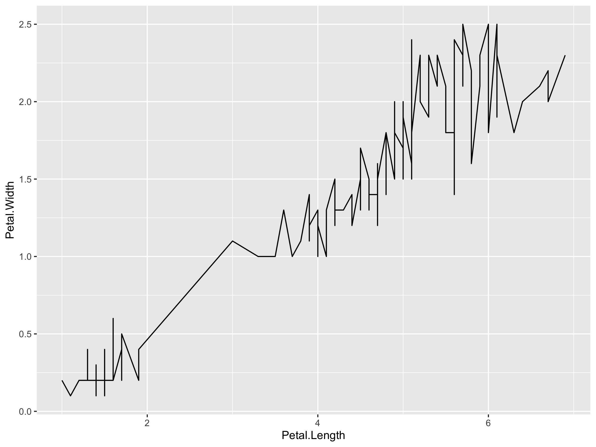
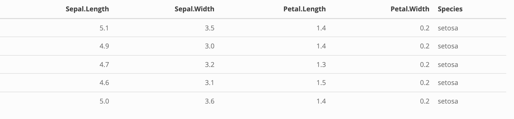

All plots produced will be automatically put into the ReadMe.md as well
as centered, you can just call a ggplot and it will and this will take
care of it

``` r
library(ggplot2)
ggplot(iris,aes(x=Petal.Length,y=Petal.Width)) + geom_line()
```

<div align="center">



</div>

for tables you have to do this

``` r
library(knitr)
library(kableExtra)

your_tibble <- head(iris,5)
kable(your_tibble, format = "html") %>%
  kable_styling(position = "center") %>% 
  save_kable(file = "~/Desktop/DS_DA_Projects/Project_Template/ReadMe_files/figure-gfm/example.png", zoom = 2)
knitr::include_graphics("~/Desktop/DS_DA_Projects/Project_Template/ReadMe_files/figure-gfm/example.png")
```

<div align="center">



</div>
